# Front Workspace

这是一个基于 `pnpm workspace` 的前端学习与源码阅读 monorepo。当前仓库主要用于整理工程化实验、手写实现、源码复刻和配套阅读文档。

## 项目结构

```text
front_basic/
├─ ai_flow_output/       # AI Flow 应用统一管理目录
│  ├─ backend/           # OpenAI 流式接口与服务端实验
│  └─ frontend/          # React 前端示例
├─ docs/                 # VitePress 文档站点
├─ js/                   # JavaScript 零散实验目录
├─ promise/              # 手写 Promise 实现与测试
├─ vue-source/           # Vue 3 源码阅读版 / 手写实现
├─ vue-demo/             # Vue Demo 工程
├─ pinia-demo/           # Pinia 相关实验占位目录
├─ pinia-source/         # Pinia 源码阅读版
├─ vue-router-source/    # Vue Router 官方源码与阅读资料
├─ vite-source/          # Vite 源码复刻版与 playground
├─ rag/                  # RAG 相关记录与实验
├─ react-source/         # React 源码/实验占位目录
├─ package.json          # 根工作区脚本
├─ pnpm-workspace.yaml   # workspace 配置
├─ pnpm-lock.yaml        # 根锁文件
└─ vitest.config.ts      # 根测试配置
```

## Workspace 包

根 `pnpm-workspace.yaml` 当前纳入这些包：

- `ai_flow_output/backend`
- `ai_flow_output/frontend`
- `docs`
- `promise`
- `vue-source`
- `vue-demo`
- `pinia-source`
- `vue-router-source`
- `vite-source`

`vite-source`、`pinia-source`、`vue-router-source` 内部还各自保留自己的子 workspace / package 结构，根 workspace 只负责把它们作为独立学习项目纳入管理。

## 安装依赖

在根目录执行：

```bash
pnpm install
```

这会安装 root 依赖，并把各个 workspace package 一起链接好。

## 根目录命令

### 构建指定包

根目录提供统一的 `build` 命令，通过 `--pkg` 指定包名：

```bash
pnpm build --pkg @front/backend
pnpm build --pkg @front/frontend
pnpm build --pkg @front/docs
pnpm build --pkg @front/promise
pnpm build --pkg @front/vue-source
```

### 构建全部包

```bash
pnpm build:all
```

### 运行测试

运行全部根级测试：

```bash
pnpm test
```

监听模式：

```bash
pnpm test:watch
```

只运行 `promise` 目录下的测试：

```bash
pnpm test:promise
```

## 各子包常用命令

### AI Flow backend

```bash
pnpm --filter @front/backend build
```

### AI Flow frontend

开发：

```bash
pnpm --filter @front/frontend dev
```

构建：

```bash
pnpm --filter @front/frontend build
```

### docs

开发服务器端口固定为 `4000`：

```bash
pnpm --filter @front/docs dev
```

构建：

```bash
pnpm --filter @front/docs build
```

### promise

构建：

```bash
pnpm --filter @front/promise build
```

测试：

```bash
pnpm test:promise
```

### vue-source

```bash
pnpm --filter @front/vue-source build
pnpm --filter @front/vue-source build:types
pnpm --filter @front/vue-source build:pkg --pkg reactivity
```

### vue-demo

```bash
pnpm --filter @front/vue-demo dev
pnpm --filter @front/vue-demo build
```

### pinia-source

```bash
pnpm --filter @front/pinia-source-root build
pnpm --filter @front/pinia-source-root test
```

### vite-source

`vite-source` 是独立的源码复刻 workspace，常用命令建议在该目录内执行：

```bash
pnpm --dir vite-source build
pnpm --dir vite-source dev:basic
pnpm --dir vite-source dev:vue
pnpm --dir vite-source build:basic
pnpm --dir vite-source build:vue
```

## 当前内容重点

- `vue-source/packages/reactivity`
  手写 Vue 3 reactivity 核心实现与源码注释，覆盖 `effect`、`reactive`、`ref`、`computed`、`watch`、调度器、依赖收集与触发链路。
- `vue-source/packages/runtime-core`、`vue-source/packages/runtime-dom`
  Vue runtime 主链路阅读与实现实验，重点包括组件挂载、更新、patch、block tree、fragment、diff、scheduler、DOM patch props。
- `docs/vue/source`
  Vue 源码分析文档，包含 reactivity、runtime-core、runtime-dom 等阅读笔记与流程图。
- `pinia-source/packages/pinia`
  Pinia 核心源码阅读版，覆盖 `createPinia`、`defineStore`、setup store、option store、插件、订阅、action、hydration、storeToRefs 与类型系统。
- `docs/vue/pinia`
  Pinia 阅读路线、源码对照、核心链路拆解和类型专题。
- `vue-router-source/packages/router`
  Vue Router 官方源码与实验目录，重点阅读 matcher、history、navigation、RouterLink / RouterView、typed routes、unplugin 和运行时边界机制。
- `docs/vue/router`
  Vue Router 阅读路线、matcher/tokenizer/ranker、history modes、navigation flow、component API 和 URL normalization 文档。
- `vite-source/packages/vite`
  Vite 源码复刻版，覆盖 CLI、config、插件容器、dev server middleware、transformRequest、ModuleGraph、HMR、optimizer、resolver、CSS、build、SSR 主流程。
- `vite-source/packages/plugin-vue`
  本地复刻版 `@vitejs/plugin-vue`，覆盖 SFC descriptor、script、template、style、helper 和 HMR 更新处理。
- `vite-source/playground`
  basic 与 Vue playground，用于验证复刻版 Vite 的 dev server、HMR、CSS Modules、TS/JSX、Vue SFC、静态资源和 build。
- `docs/js/12_js_engineering`
  Vite 复刻核心流程、阅读路线、官方源码对照表和 plugin-vue 复刻流程文档。
- `promise`
  手写 Promise 实现与测试，用于理解 Promise/A+、then 链式调用、状态流转和异步调度。
- `ai_flow_output/backend`、`ai_flow_output/frontend`
  AI Flow 的服务端和 React 前端示例，统一从根目录旧 `backend` / `frontend` 迁移到 `ai_flow_output` 下管理。

开源项目


## HTTP三次握手

严格来说，三次握手是 **TCP 建立连接** 的过程，不是 HTTP 自己的过程。HTTP 是应用层协议，HTTP/1.1 和 HTTP/2 通常运行在 TCP 之上，所以在浏览器发起 HTTP 请求之前，如果当前没有可复用的 TCP 连接，就需要先完成 TCP 三次握手。

### TCP 三次握手解决什么问题

三次握手的核心目标：

- 确认客户端具备发送能力。
- 确认客户端具备接收能力。
- 确认服务端具备发送能力。
- 确认服务端具备接收能力。
- 同步双方的初始序列号，也就是 `seq`。
- 避免历史失效连接请求导致服务端误建立连接。

### 三次握手流程

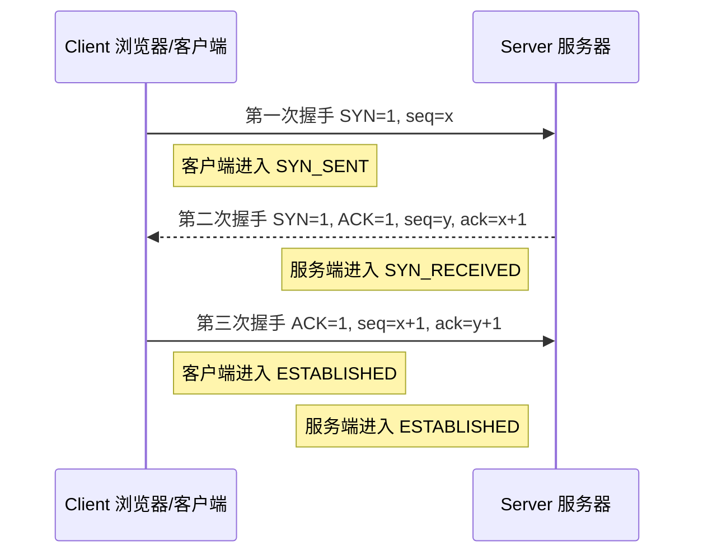

### 每一次握手的含义

第一次握手：客户端向服务端发送 `SYN` 包。

```text
Client -> Server
SYN = 1
seq = x
```

这一步表示客户端想要建立连接，并告诉服务端自己的初始序列号是 `x`。服务端收到后，可以确认客户端的发送能力正常、服务端的接收能力正常。

第二次握手：服务端回复 `SYN + ACK`。

```text
Server -> Client
SYN = 1
ACK = 1
seq = y
ack = x + 1
```

这一步表示服务端同意建立连接，同时告诉客户端自己的初始序列号是 `y`，并确认已经收到了客户端的 `seq=x`。客户端收到后，可以确认服务端的发送能力正常、服务端的接收能力正常、客户端的接收能力正常。

第三次握手：客户端回复 `ACK`。

```text
Client -> Server
ACK = 1
seq = x + 1
ack = y + 1
```

这一步表示客户端确认收到了服务端的 `SYN`。服务端收到后，才能确认客户端的接收能力也正常。至此双方都进入 `ESTABLISHED` 状态，连接建立完成。

### 为什么不是两次握手

两次握手只能让客户端确认服务端正常，但服务端无法确认客户端是否真的收到了自己的响应。

如果只有两次握手，可能出现这种问题：

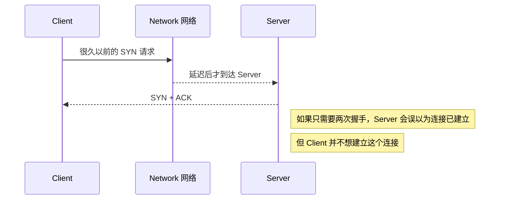

第三次握手的价值在于：服务端必须收到客户端最终的 `ACK`，才真正认为连接成立。这可以过滤掉网络中滞留的历史连接请求。

### HTTP 请求和 TCP 连接的关系

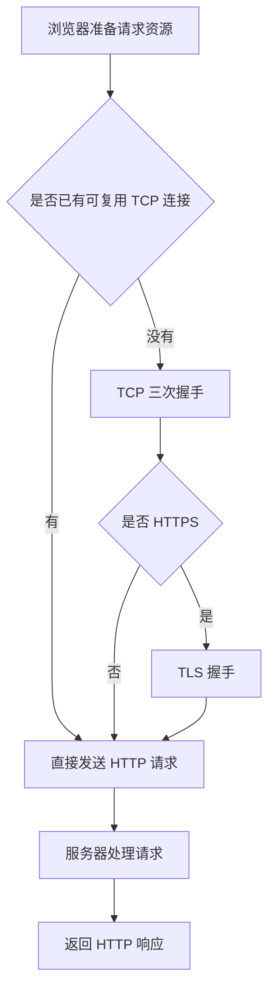

注意：

- HTTP/1.0 默认短连接，请求结束后连接通常关闭。
- HTTP/1.1 默认开启长连接，可以通过 `Connection: keep-alive` 复用 TCP 连接。
- HTTP/2 可以在一个 TCP 连接上多路复用多个请求。
- HTTP/3 基于 QUIC，底层使用 UDP，不再使用 TCP 三次握手。

## HTTP缓存，强缓存和协商缓存

HTTP 缓存的目标是减少重复请求，降低服务器压力，提升页面加载速度。浏览器缓存可以分成两类：**强缓存** 和 **协商缓存**。

### 整体流程

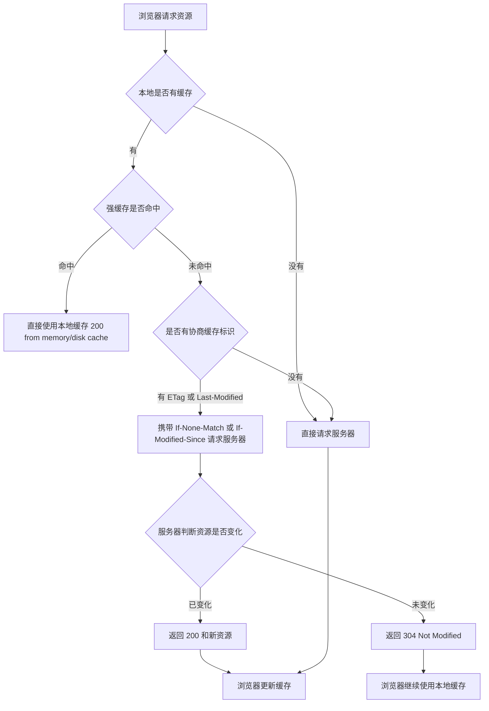

需要注意：强缓存未命中，不代表一定会进入协商缓存。只有本地缓存里存在 `ETag` 或 `Last-Modified` 这类协商缓存标识时，浏览器才会带上 `If-None-Match` 或 `If-Modified-Since` 去请求服务器验证。如果没有这些标识，或者资源本身设置了 `Cache-Control: no-store`，浏览器会直接正常请求服务器并获取完整资源。

### 强缓存

强缓存是指浏览器在缓存有效期内，不需要向服务器发送请求，直接使用本地缓存。

强缓存相关响应头主要有两个：

- `Cache-Control`
- `Expires`

#### Cache-Control

`Cache-Control` 是 HTTP/1.1 的缓存控制字段，优先级高于 `Expires`。

常见写法：

```http
Cache-Control: max-age=31536000
```

表示资源在 `31536000` 秒内有效，也就是一年。浏览器在有效期内再次请求同一个资源，会直接使用本地缓存。

常见指令：

| 指令 | 含义 |
| --- | --- |
| `max-age=秒数` | 缓存多少秒 |
| `no-cache` | 可以缓存，但使用前必须向服务器确认是否过期 |
| `no-store` | 完全不缓存，请求和响应都不存储 |
| `public` | 可以被浏览器和代理服务器缓存 |
| `private` | 只能被浏览器私有缓存，不能被共享代理缓存 |
| `s-maxage=秒数` | 代理服务器缓存时间，优先级高于 `max-age` |
| `must-revalidate` | 过期后必须向服务器验证，不能直接使用过期缓存 |

示例：

```http
Cache-Control: public, max-age=31536000, immutable
```

这类配置常用于带 hash 的静态资源：

```text
app.8f3a1c2.js
style.a71bc90.css
```

因为文件名里带了内容 hash，只要内容变化，文件名就会变化，所以可以设置很长的强缓存时间。

#### Expires

`Expires` 是 HTTP/1.0 的缓存字段，表示资源的过期时间点。

```http
Expires: Wed, 21 Oct 2026 07:28:00 GMT
```

它的问题是依赖客户端本地时间。如果用户电脑时间不准确，缓存判断也可能不准确。因此现代项目优先使用 `Cache-Control`。

### 协商缓存

协商缓存是指浏览器本地有缓存，但不能直接确定还能不能用，于是向服务器发请求确认。如果服务器判断资源没有变化，就返回 `304 Not Modified`，浏览器继续使用本地缓存；如果资源变化了，就返回新的资源。

协商缓存有两组常见字段：

- `Last-Modified` / `If-Modified-Since`
- `ETag` / `If-None-Match`

### Last-Modified / If-Modified-Since

第一次请求时，服务器返回：

```http
Last-Modified: Wed, 21 Oct 2026 07:28:00 GMT
```

浏览器下次请求时带上：

```http
If-Modified-Since: Wed, 21 Oct 2026 07:28:00 GMT
```

服务器会比较资源最后修改时间：

- 如果资源没有变化，返回 `304 Not Modified`。
- 如果资源变化了，返回 `200 OK` 和新资源。

缺点：

- 时间精度通常只能到秒。
- 文件内容没变但修改时间变了，也会被认为资源变化。
- 文件在一秒内多次变化，可能无法准确识别。

### ETag / If-None-Match

`ETag` 是服务器根据资源内容生成的唯一标识，通常可以理解为资源版本号或内容指纹。

第一次请求时，服务器返回：

```http
ETag: "abc123"
```

浏览器下次请求时带上：

```http
If-None-Match: "abc123"
```

服务器比较当前资源的 `ETag`：

- 如果一致，说明资源没有变化，返回 `304 Not Modified`。
- 如果不一致，说明资源变化了，返回 `200 OK` 和新资源。

`ETag` 的优先级通常高于 `Last-Modified`，因为它可以更准确地判断资源内容是否变化。

### 强缓存和协商缓存对比

| 对比 | 强缓存 | 协商缓存 |
| --- | --- | --- |
| 是否发送请求 | 不发送请求 | 会发送请求 |
| 状态码 | 通常显示 200 from memory cache / disk cache | 304 或 200 |
| 速度 | 更快 | 比强缓存慢，但比重新下载资源快 |
| 主要字段 | `Cache-Control`、`Expires` | `ETag`、`Last-Modified` |
| 适合资源 | 带 hash 的静态资源 | HTML、接口数据、不适合长期强缓存的资源 |

### 实际项目里的缓存策略

常见策略：

```text
HTML 文件：Cache-Control: no-cache
带 hash 的 JS/CSS/图片：Cache-Control: public, max-age=31536000, immutable
不希望缓存的接口：Cache-Control: no-store
可缓存但需确认的数据：Cache-Control: no-cache + ETag
```

原因：

- HTML 不应该长期强缓存，否则用户可能拿不到最新入口文件。
- JS/CSS 构建后通常带内容 hash，可以放心长期强缓存。
- 接口数据要根据业务决定缓存策略。
- 用户隐私数据、支付数据、一次性 token 等不应该缓存。

## webSocket

WebSocket 是一种在单个 TCP 连接上进行全双工通信的协议。它适合需要服务端主动推送数据的场景，比如聊天室、在线协作、消息通知、实时行情、实时游戏、日志流等。

### HTTP 和 WebSocket 的区别

| 对比 | HTTP | WebSocket |
| --- | --- | --- |
| 通信模式 | 请求-响应 | 全双工，双方都可以主动发送 |
| 连接特点 | 通常一次请求一次响应，也可复用连接 | 建立后保持长连接 |
| 服务端主动推送 | 不天然支持，通常靠轮询、SSE 等 | 天然支持 |
| 协议前缀 | `http://`、`https://` | `ws://`、`wss://` |
| 适合场景 | 普通页面、接口、资源请求 | 聊天、通知、实时协作、行情 |

### WebSocket 建立连接流程

WebSocket 连接从 HTTP 升级开始。客户端先发送一个 HTTP 请求，请求头里带上 `Upgrade: websocket`，服务端同意后返回 `101 Switching Protocols`，之后双方就使用 WebSocket 协议通信。

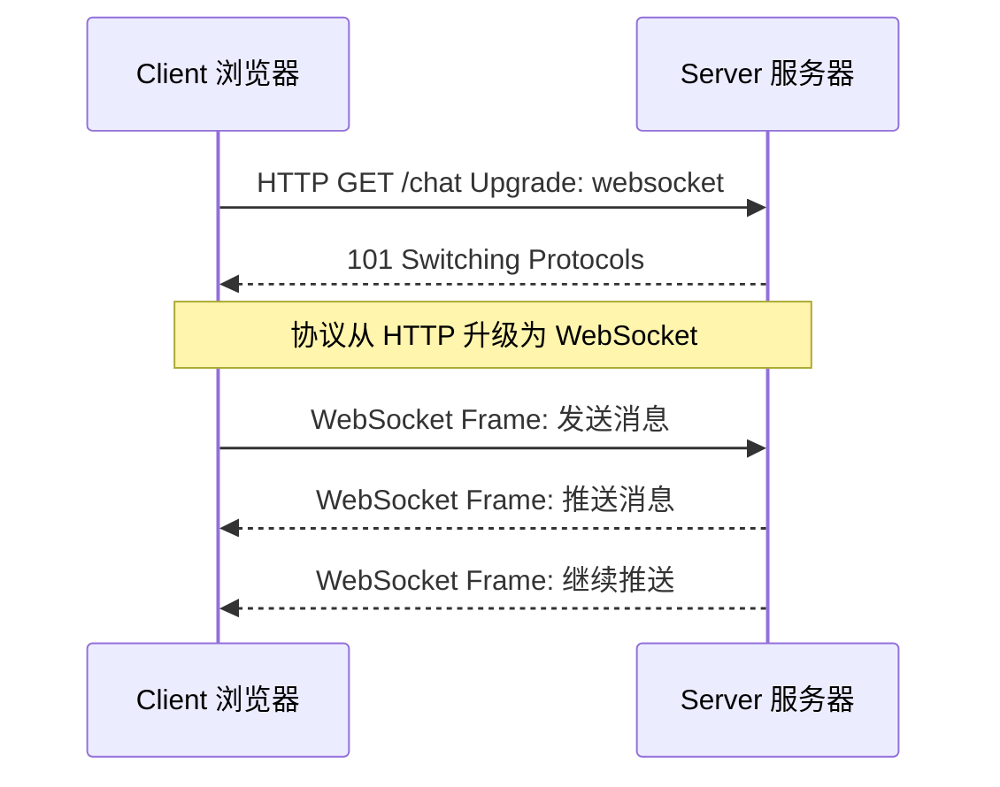

### 握手请求示例

客户端请求：

```http
GET /chat HTTP/1.1
Host: example.com
Upgrade: websocket
Connection: Upgrade
Sec-WebSocket-Key: dGhlIHNhbXBsZSBub25jZQ==
Sec-WebSocket-Version: 13
```

服务端响应：

```http
HTTP/1.1 101 Switching Protocols
Upgrade: websocket
Connection: Upgrade
Sec-WebSocket-Accept: s3pPLMBiTxaQ9kYGzzhZRbK+xOo=
```

关键字段：

- `Upgrade: websocket` 表示希望升级协议。
- `Connection: Upgrade` 表示当前连接要进行协议升级。
- `Sec-WebSocket-Key` 是客户端生成的随机值。
- `Sec-WebSocket-Accept` 是服务端基于 key 计算出来的校验值。
- `101 Switching Protocols` 表示协议切换成功。

### 浏览器端基本用法

```js
const socket = new WebSocket('wss://example.com/chat')

socket.addEventListener('open', () => {
  socket.send(JSON.stringify({
    type: 'join',
    roomId: 'room-1'
  }))
})

socket.addEventListener('message', (event) => {
  const data = JSON.parse(event.data)
  console.log('收到服务端消息:', data)
})

socket.addEventListener('close', () => {
  console.log('连接关闭')
})

socket.addEventListener('error', (error) => {
  console.log('连接错误:', error)
})
```

### WebSocket 的状态

| 状态 | 值 | 含义 |
| --- | --- | --- |
| `CONNECTING` | `0` | 正在连接 |
| `OPEN` | `1` | 连接已建立，可以通信 |
| `CLOSING` | `2` | 连接正在关闭 |
| `CLOSED` | `3` | 连接已经关闭 |

### 心跳和重连

WebSocket 是长连接，实际项目中需要处理网络断开、代理超时、服务端重启等情况。常见做法是加心跳和重连。

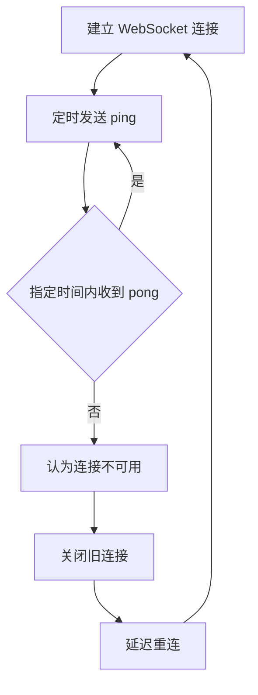

简单重连示例：

```js
function createSocket() {
  let socket
  let timer
  let reconnectTimer

  function connect() {
    socket = new WebSocket('wss://example.com/chat')

    socket.addEventListener('open', () => {
      timer = setInterval(() => {
        if (socket.readyState === WebSocket.OPEN) {
          socket.send(JSON.stringify({ type: 'ping' }))
        }
      }, 30000)
    })

    socket.addEventListener('close', () => {
      clearInterval(timer)
      clearTimeout(reconnectTimer)
      reconnectTimer = setTimeout(connect, 3000)
    })
  }

  connect()

  return {
    send(data) {
      if (socket.readyState === WebSocket.OPEN) {
        socket.send(JSON.stringify(data))
      }
    },
    close() {
      clearInterval(timer)
      clearTimeout(reconnectTimer)
      socket.close()
    }
  }
}
```

### WebSocket 注意点

- 生产环境优先使用 `wss://`，也就是基于 TLS 的 WebSocket。
- WebSocket 不像普通 Ajax 那样走完整的 CORS 流程，浏览器会带上 `Origin`，服务端必须主动校验 `Origin`。
- 长连接会占用服务端连接资源，需要考虑连接数、心跳、限流和鉴权。
- 不适合普通 CRUD 请求，普通接口用 HTTP 更简单。
- 如果只需要服务端单向推送，也可以考虑 SSE。

## 闭包，原型链

### 闭包

闭包是指函数可以记住并访问它创建时所在的词法作用域，即使这个函数在原来的作用域之外执行。

一句话理解：

```text
函数 + 函数创建时能访问的外部变量 = 闭包
```

示例：

```js
function createCounter() {
  let count = 0

  return function increment() {
    count++
    return count
  }
}

const counter = createCounter()

console.log(counter()) // 1
console.log(counter()) // 2
console.log(counter()) // 3
```

`createCounter` 执行完后，按理说它的局部变量 `count` 应该被销毁。但返回的 `increment` 函数仍然引用着 `count`，所以 `count` 不会被回收，这就是闭包。

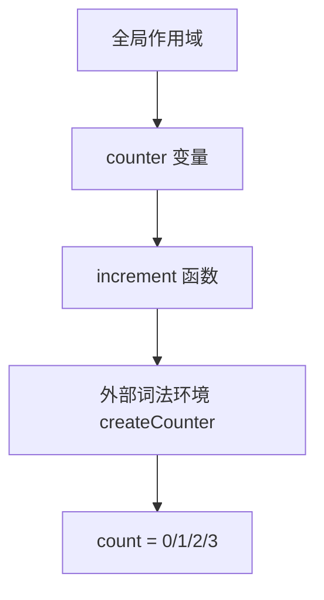

### 闭包常见用途

#### 1. 保存私有变量

```js
function createUser(name) {
  let score = 0

  return {
    getName() {
      return name
    },
    getScore() {
      return score
    },
    addScore(value) {
      score += value
    }
  }
}

const user = createUser('张三')

user.addScore(10)
console.log(user.getScore()) // 10
console.log(user.score) // undefined
```

`score` 只能通过返回的方法访问，外部不能直接修改。

#### 2. 函数柯里化

```js
function add(a) {
  return function (b) {
    return a + b
  }
}

const add10 = add(10)

console.log(add10(5)) // 15
```

#### 3. 防抖和节流

防抖、节流都需要在多次函数调用之间保存 `timer`、`lastTime` 等状态，因此通常会用到闭包。

### 闭包注意点

- 闭包会让被引用的变量继续保存在内存中。
- 如果闭包长期存在，并且引用了很大的对象，可能造成内存占用过高。
- 不再使用时，应解除引用或清理定时器、事件监听。

### 原型链

JavaScript 中每个对象都有一个内部链接，指向它的原型对象。访问对象属性时，如果对象自身没有这个属性，就会沿着原型继续向上查找，直到找到属性或到达 `null`。这个查找路径就是原型链。

### 构造函数、prototype 和 __proto__

```js
function Person(name) {
  this.name = name
}

Person.prototype.sayName = function () {
  return this.name
}

const p = new Person('张三')

console.log(p.name) // 张三--
console.log(p.sayName()) // 张三
```

关系图：

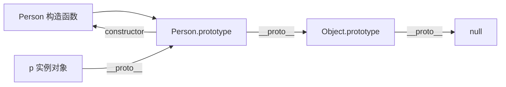

几个关键点：

- `Person.prototype` 是构造函数的原型对象。
- `p.__proto__` 指向 `Person.prototype`。
- `Person.prototype.constructor` 默认指回 `Person`。
- `Object.prototype.__proto__` 是 `null`，原型链到这里结束。

### new 做了什么

执行：

```js
const p = new Person('张三')
```

大致过程：

```js
function myNew(Constructor, ...args) {
  const obj = Object.create(Constructor.prototype)
  const result = Constructor.apply(obj, args)

  return result !== null && (typeof result === 'object' || typeof result === 'function')
    ? result
    : obj
}
```

`new` 的核心步骤：

- 创建一个新对象。
- 把新对象的原型指向构造函数的 `prototype`。
- 让构造函数里的 `this` 指向新对象。
- 如果构造函数返回对象，则返回这个对象；否则返回新创建的对象。

### 属性查找流程

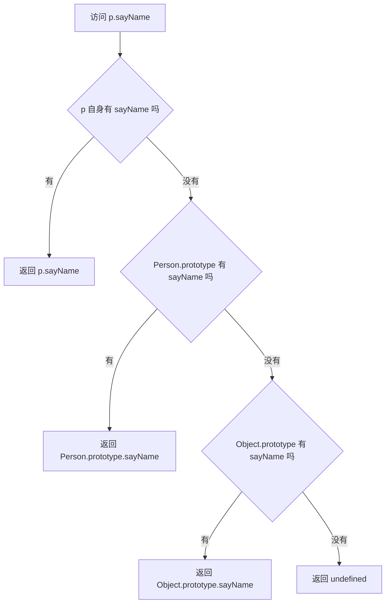

### 闭包和原型链的区别

| 对比 | 闭包 | 原型链 |
| --- | --- | --- |
| 关注点 | 函数如何访问外部变量 | 对象如何查找属性 |
| 核心机制 | 词法作用域 | 原型委托 |
| 常见用途 | 私有变量、缓存状态、函数工厂 | 方法复用、继承、对象属性查找 |
| 典型问题 | 变量长期被引用导致内存占用 | 原型污染、属性覆盖、this 指向混淆 |

## 箭头函数

箭头函数是 ES6 提供的函数简写形式，但它不只是语法更短，更重要的是它没有自己的 `this`、`arguments`、`super` 和 `new.target`。

### 基本写法

```js
const add = (a, b) => {
  return a + b
}

const add2 = (a, b) => a + b

const double = value => value * 2
```

如果直接返回对象字面量，需要用小括号包起来：

```js
const createUser = name => ({
  name,
  role: 'admin'
})
```

### this 指向

普通函数的 `this` 取决于调用方式，箭头函数的 `this` 取决于定义位置。箭头函数不会创建自己的 `this`，而是从外层词法作用域捕获 `this`。

```js
const user = {
  name: '张三',
  normal() {
    console.log(this.name)
  },
  arrow: () => {
    console.log(this.name)
  }
}

user.normal() // 张三
user.arrow() // 通常是 undefined
```

原因：

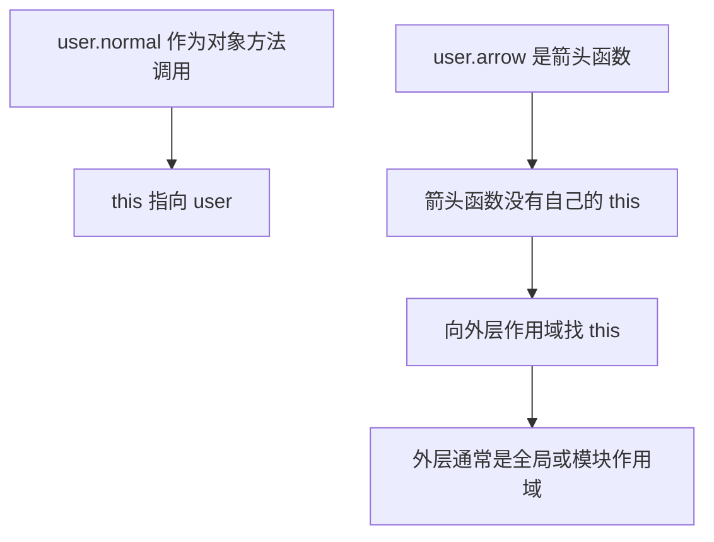

### 箭头函数适合的场景

适合用于回调函数，尤其是希望保留外层 `this` 的时候：

```js
function Timer() {
  this.seconds = 0

  setInterval(() => {
    this.seconds++
    console.log(this.seconds)
  }, 1000)
}

new Timer()
```

如果这里用普通函数：

```js
function Timer() {
  this.seconds = 0

  setInterval(function () {
    this.seconds++
  }, 1000)
}
```

`setInterval` 回调里的 `this` 不再指向 `Timer` 实例，容易出错。

### 箭头函数不适合的场景

#### 1. 不适合作为对象方法

```js
const user = {
  name: '张三',
  sayName: () => {
    console.log(this.name)
  }
}

user.sayName() // undefined
```

对象字面量不会创建自己的作用域，箭头函数里的 `this` 不会指向 `user`。

#### 2. 不适合作为构造函数

```js
const Person = (name) => {
  this.name = name
}

new Person('张三') // TypeError: Person is not a constructor
```

箭头函数没有 `[[Construct]]`，不能被 `new` 调用，也没有 `prototype`。

#### 3. 不适合需要 arguments 的函数

```js
function normal() {
  console.log(arguments)
}

const arrow = () => {
  console.log(arguments)
}
```

箭头函数没有自己的 `arguments`。如果需要接收不定参数，应该使用剩余参数：

```js
const sum = (...args) => {
  return args.reduce((total, item) => total + item, 0)
}
```

### 普通函数和箭头函数对比

| 对比 | 普通函数 | 箭头函数 |
| --- | --- | --- |
| `this` | 调用时决定 | 定义时从外层捕获 |
| `arguments` | 有自己的 `arguments` | 没有自己的 `arguments` |
| `prototype` | 有，通常可以作为构造函数 | 没有 |
| `new` | 可以作为构造函数 | 不可以 |
| 适合场景 | 对象方法、构造函数、需要动态 this | 回调、数组方法、保留外层 this |

## 防抖，节流

防抖和节流都是控制函数执行频率的手段，常用于滚动、输入框搜索、窗口缩放、按钮点击等高频事件。

### 防抖 debounce

防抖的规则是：事件频繁触发时，先不执行函数，等一段时间内没有再次触发，才执行最后一次。

一句话理解：

```text
一直触发就一直等待，停下来以后再执行。
```

适合场景：

- 搜索框输入完成后再请求接口。
- 窗口大小调整结束后再重新计算布局。
- 表单输入停止后再校验。
- 防止用户连续点击提交按钮。

流程图：

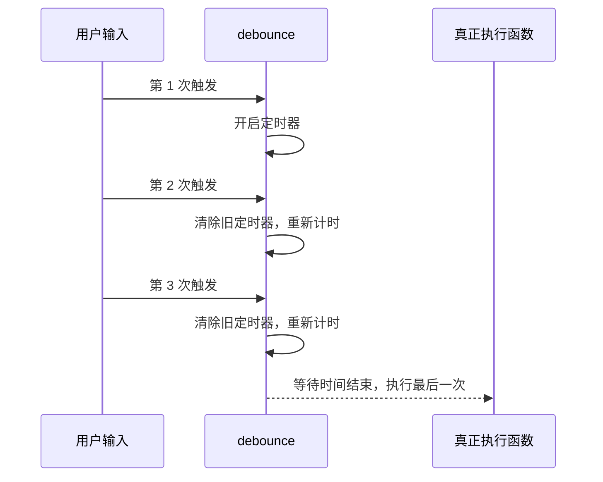

实现：

```js
function debounce(fn, delay = 300) {
  let timer = null

  return function (...args) {
    clearTimeout(timer)

    timer = setTimeout(() => {
      fn.apply(this, args)
    }, delay)
  }
}
```

使用：

```js
const input = document.querySelector('input')

input.addEventListener('input', debounce(function (event) {
  console.log('搜索:', event.target.value)
}, 500))
```

支持立即执行的防抖：

```js
function debounce(fn, delay = 300, immediate = false) {
  let timer = null

  return function (...args) {
    const shouldCallNow = immediate && !timer

    clearTimeout(timer)

    timer = setTimeout(() => {
      timer = null

      if (!immediate) {
        fn.apply(this, args)
      }
    }, delay)

    if (shouldCallNow) {
      fn.apply(this, args)
    }
  }
}
```

### 节流 throttle

节流的规则是：事件频繁触发时，按照固定时间间隔执行函数。比如每 `300ms` 最多执行一次。

一句话理解：

```text
一直触发也没关系，但固定时间内最多执行一次。
```

适合场景：

- 页面滚动时计算滚动位置。
- 拖拽时更新元素位置。
- 鼠标移动时更新坐标。
- 高频点击时限制触发频率。

流程图：

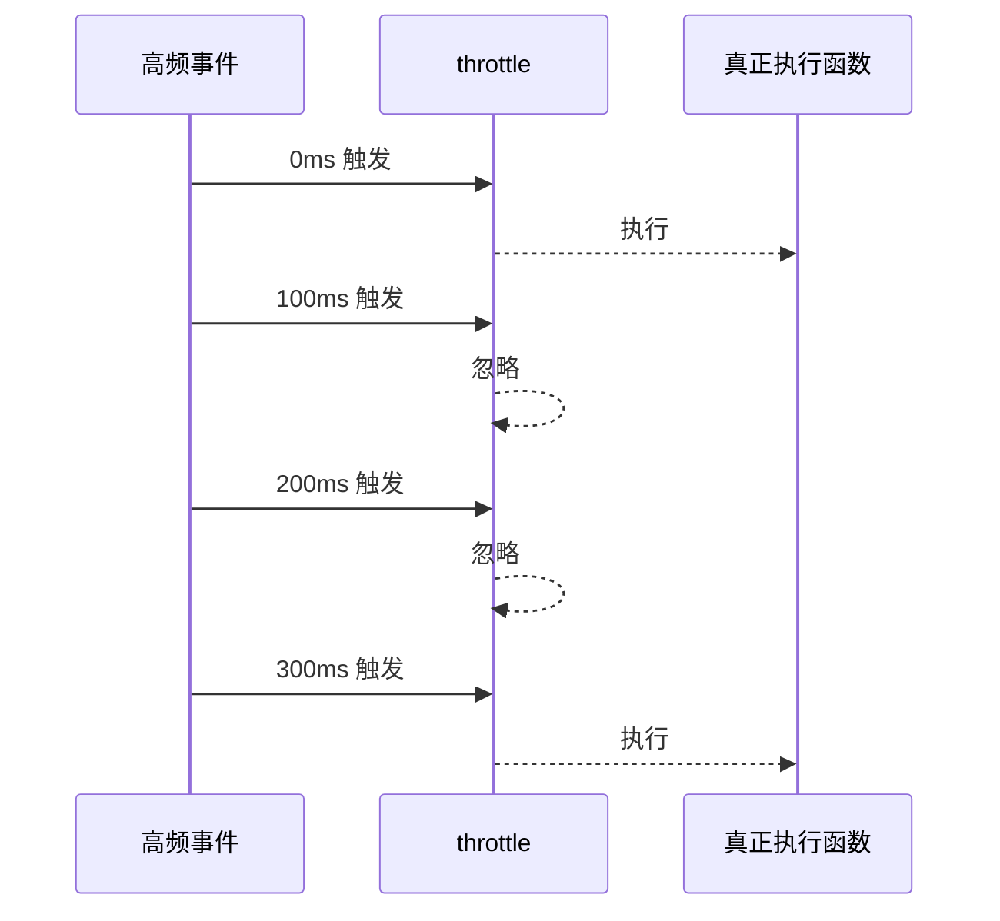

时间戳版本：

```js
function throttle(fn, delay = 300) {
  let lastTime = 0

  return function (...args) {
    const now = Date.now()

    if (now - lastTime >= delay) {
      lastTime = now
      fn.apply(this, args)
    }
  }
}
```

定时器版本：

```js
function throttle(fn, delay = 300) {
  let timer = null

  return function (...args) {
    if (timer) return

    timer = setTimeout(() => {
      timer = null
      fn.apply(this, args)
    }, delay)
  }
}
```

时间戳 + 定时器版本可以同时保证第一次和最后一次都尽量执行：

```js
function throttle(fn, delay = 300) {
  let lastTime = 0
  let timer = null

  return function (...args) {
    const now = Date.now()
    const remaining = delay - (now - lastTime)

    clearTimeout(timer)

    if (remaining <= 0) {
      lastTime = now
      fn.apply(this, args)
    } else {
      timer = setTimeout(() => {
        lastTime = Date.now()
        fn.apply(this, args)
      }, remaining)
    }
  }
}
```

### 防抖和节流对比

| 对比 | 防抖 debounce | 节流 throttle |
| --- | --- | --- |
| 核心规则 | 停止触发一段时间后执行 | 固定间隔最多执行一次 |
| 关注点 | 只要最后一次 | 控制执行频率 |
| 常见场景 | 搜索输入、表单校验、按钮提交 | 滚动、拖拽、鼠标移动、窗口 resize |
| 高频触发期间 | 通常不执行 | 会按间隔执行 |
| 实现关键 | `clearTimeout` 后重新计时 | 时间戳或定时器控制间隔 |

### 选择建议

```text
只关心最后结果，用防抖。
需要持续响应但降低频率，用节流。
```

例如：

- 输入框联想搜索：防抖。
- 页面滚动显示当前位置：节流。
- 拖拽元素更新位置：节流。
- 提交按钮防重复点击：防抖或直接禁用按钮。

## Vue watch 与 watchEffect

在 Vue 3 里，`watch` 和 `watchEffect` 都用于监听响应式数据变化，并在变化后执行副作用逻辑。副作用通常指请求接口、打印日志、同步本地缓存、手动操作 DOM，或者根据一个状态变化去更新另一个状态。

### watch

`watch` 是明确指定监听来源的 API。它适合在你知道要监听哪个数据，并且需要拿到新值、旧值，或者需要精确控制执行时机时使用。

```js
import { ref, watch } from 'vue'

const count = ref(0)

watch(count, (newValue, oldValue) => {
  console.log('新值:', newValue)
  console.log('旧值:', oldValue)
})
```

默认情况下，`watch` 是懒执行的。也就是说，初始化时不会立刻执行回调，只有被监听的数据发生变化后才会执行。

如果要监听响应式对象里的某个属性，通常写成 getter 函数：

```js
import { reactive, watch } from 'vue'

const user = reactive({
  name: '张三',
  age: 18
})

watch(
  () => user.age,
  (newAge, oldAge) => {
    console.log(newAge, oldAge)
  }
)
```

如果想让 `watch` 初始化时先执行一次，可以加 `immediate: true`：

```js
watch(
  count,
  (newValue, oldValue) => {
    console.log(newValue, oldValue)
  },
  {
    immediate: true
  }
)
```

监听多个数据时，可以传数组：

```js
const firstName = ref('张')
const lastName = ref('三')

watch([firstName, lastName], ([newFirst, newLast], [oldFirst, oldLast]) => {
  console.log(newFirst, newLast)
  console.log(oldFirst, oldLast)
})
```

### watchEffect

`watchEffect` 会自动收集函数中用到的响应式依赖。你不需要手动指定监听谁，只要回调里读取了某个响应式数据，Vue 就会把它收集为依赖。

```js
import { ref, watchEffect } from 'vue'

const count = ref(0)
const name = ref('张三')

watchEffect(() => {
  console.log(count.value)
  console.log(name.value)
})
```

上面这段代码里，`watchEffect` 读取了 `count.value` 和 `name.value`，所以只要这两个值任意一个发生变化，回调就会重新执行。

和 `watch` 不同，`watchEffect` 默认会立即执行一次。它更适合“用到什么响应式数据，就自动跟踪什么”的场景。

### 核心区别

| 对比 | watch | watchEffect |
| --- | --- | --- |
| 监听来源 | 需要明确指定 | 自动收集依赖 |
| 初始化是否执行 | 默认不执行 | 默认立即执行 |
| 是否方便拿旧值 | 方便 | 不方便 |
| 控制精度 | 更高 | 更自动 |
| 适合场景 | 精确监听某个数据变化 | 根据函数中用到的数据自动重新执行 |

### 使用建议

如果你需要明确监听某一个或几个数据，并且关心新值、旧值，优先使用 `watch`。

```js
watch(keyword, async (newKeyword) => {
  if (!newKeyword) return

  const res = await fetch(`/api/search?q=${newKeyword}`)
  const data = await res.json()

  console.log(data)
})
```

如果你只是希望函数先执行一次，并且函数中用到的响应式数据变化后自动重新执行，可以使用 `watchEffect`。

```js
watchEffect(async () => {
  if (!keyword.value) return

  const res = await fetch(`/api/search?q=${keyword.value}`)
  const data = await res.json()

  console.log(data)
})
```

简单记忆：

```js
// 明确监听谁，用 watch
watch(source, callback)

// 用到谁就自动监听谁，用 watchEffect
watchEffect(callback)
```

## Vue KeepAlive 组件的生命周期

Vue 里的 `<KeepAlive>` 用来缓存组件实例。被缓存的组件切走时不会销毁，切回来时也不会重新创建。

核心生命周期：

```text
首次进入：created/setup -> mounted -> activated
切走：deactivated
再次进入：activated
缓存被移除或父级卸载：deactivated -> unmounted
```

### 普通组件生命周期

不使用 `<KeepAlive>` 时：

```text
进入页面：created/setup -> mounted
离开页面：unmounted
再次进入：created/setup -> mounted
```

组件会被销毁，再回来会重新创建。

### 使用 KeepAlive 后

```vue
<KeepAlive>
  <UserPage v-if="showUser" />
</KeepAlive>
```

生命周期变成：

```text
第一次显示 UserPage：
setup / created
mounted
activated

切换隐藏 UserPage：
deactivated

再次显示 UserPage：
activated

最终缓存被销毁：
deactivated
unmounted
```

### Options API 写法

```vue
<script>
export default {
  mounted() {
    console.log('mounted：首次挂载')
  },

  activated() {
    console.log('activated：组件被激活')
  },

  deactivated() {
    console.log('deactivated：组件被缓存失活')
  },

  unmounted() {
    console.log('unmounted：组件真正销毁')
  }
}
</script>
```

### Composition API 写法

```vue
<script setup>
import { onMounted, onActivated, onDeactivated, onUnmounted } from 'vue'

onMounted(() => {
  console.log('mounted：首次挂载')
})

onActivated(() => {
  console.log('activated：进入缓存组件')
})

onDeactivated(() => {
  console.log('deactivated：离开缓存组件')
})

onUnmounted(() => {
  console.log('unmounted：真正销毁')
})
</script>
```

### 常见使用场景

比如列表页进入详情页，再返回列表页时，希望保留：

- 滚动位置
- 搜索条件
- 分页状态
- 表单内容
- 组件内部状态

就可以用 `<KeepAlive>`。

```vue
<RouterView v-slot="{ Component }">
  <KeepAlive>
    <component :is="Component" />
  </KeepAlive>
</RouterView>
```

### activated 和 mounted 的区别

`mounted` 只在第一次挂载时执行一次。

`activated` 每次从缓存中显示出来都会执行。

所以：

- 只需要初始化一次：放 `mounted`
- 每次进入页面都要刷新：放 `activated`
- 离开页面暂停定时器/监听：放 `deactivated`
- 真正销毁清理资源：放 `unmounted`

例如：

```js
onActivated(() => {
  startTimer()
})

onDeactivated(() => {
  stopTimer()
})
```

### 注意

如果组件被 `<KeepAlive>` 缓存了，切走时不会触发 `unmounted`，而是触发 `deactivated`。

只有缓存被清掉时，才会触发 `unmounted`。比如：

```vue
<KeepAlive :max="3">
  <component :is="currentComponent" />
</KeepAlive>
```

当缓存数量超过 `max`，旧组件可能会被移除，这时才会真正销毁。


## 完整的导航解析流程
导航被触发。
在失活的组件里调用 beforeRouteLeave 守卫。
调用全局的 beforeEach 守卫。
在重用的组件里调用 beforeRouteUpdate 守卫(2.2+)。
在路由配置里调用 beforeEnter。
解析异步路由组件。
在被激活的组件里调用 beforeRouteEnter。
调用全局的 beforeResolve 守卫(2.5+)。
导航被确认。
调用全局的 afterEach 钩子。
触发 DOM 更新。
调用 beforeRouteEnter 守卫中传给 next 的回调函数，创建好的组件实例会作为回调函数的参数传入。

## Vue 3 Diff 算法

Vue 3 的 diff 算法，本质是比较新旧两棵虚拟 DOM 树，尽量复用已有 DOM，减少真实 DOM 的创建、删除和移动。

但 Vue 3 的 diff 不是单纯运行时暴力比较，它有两个核心特点：

```text
1. 编译时优化：PatchFlag、Block Tree、静态提升
2. 运行时 diff：patch、patchElement、patchChildren、patchKeyedChildren
```

### 一、Diff 的入口：patch

Vue 3 更新组件时，会生成新的 VNode，然后和旧的 VNode 比较。

核心入口可以理解成：

```js
patch(n1, n2, container)
```

其中：

```text
n1：旧 VNode
n2：新 VNode
container：真实 DOM 容器
```

Vue 会先判断新旧节点是否是同一个类型：

```js
n1.type === n2.type && n1.key === n2.key
```

如果 `type` 或 `key` 不一样，说明不能复用：

```text
卸载旧节点
挂载新节点
```

如果一样，说明可以复用旧 DOM：

```text
复用 DOM
更新属性
更新子节点
```

### 二、普通元素 diff

例如：

```html
<div class="old">hello</div>
```

变成：

```html
<div class="new">hello vue</div>
```

Vue 会做三件事：

```text
1. 复用原来的 div DOM
2. 更新 props，比如 class、style、事件
3. 更新 children，比如文本或子节点数组
```

大致流程：

```text
patchElement
  -> patchProps
  -> patchChildren
```

Vue 3 如果发现这个节点有 `PatchFlag`，会走更快的路径。

比如模板：

```vue
<div :class="cls">{{ msg }}</div>
```

编译后 Vue 知道：

```text
class 是动态的
文本是动态的
```

所以更新时不需要完整比较所有属性，只更新被标记的动态部分。

### 三、children diff

子节点有三种主要形态：

```text
1. 文本
2. 数组
3. 空
```

Vue 会根据新旧 children 的类型走不同逻辑。

例如：

```text
旧 children 是文本，新 children 是文本：
直接更新 textContent

旧 children 是数组，新 children 是文本：
卸载旧数组节点，设置文本

旧 children 是文本，新 children 是数组：
清空文本，挂载新数组

旧 children 是数组，新 children 是数组：
进入核心列表 diff
```

真正复杂的是：

```text
数组 children 对数组 children 的 diff
```

也就是常说的列表 diff。

### 四、Vue 3 的 keyed diff

对于带 `key` 的列表，Vue 3 使用的是：

```text
头部同步
尾部同步
新增处理
删除处理
中间乱序处理
最长递增子序列减少移动
```

核心函数可以理解为：

```js
patchKeyedChildren(oldChildren, newChildren)
```

假设：

```text
旧: A B C D E
新: A C B D E
```

#### 第一步：从头部开始比较

```text
旧: A B C D E
新: A C B D E
    ↑
```

`A` 和 `A` 相同，直接复用并 patch。

然后指针后移，遇到：

```text
旧: B
新: C
```

不同，头部同步停止。

#### 第二步：从尾部开始比较

从尾部往前看：

```text
旧: A B C D E
新: A C B D E
          ↑ ↑
```

`E` 相同，复用。
`D` 相同，复用。

继续往前：

```text
旧: C
新: B
```

不同，尾部同步停止。

此时剩下中间部分：

```text
旧: B C
新: C B
```

#### 第三步：如果新节点多，直接挂载

例如：

```text
旧: A B
新: A B C D
```

头部同步完之后，旧列表已经结束，新列表还有 `C D`，直接挂载：

```text
挂载 C
挂载 D
```

#### 第四步：如果旧节点多，直接卸载

例如：

```text
旧: A B C D
新: A B
```

头部同步完之后，新列表已经结束，旧列表还有 `C D`，直接卸载：

```text
卸载 C
卸载 D
```

#### 第五步：处理中间乱序节点

复杂情况：

```text
旧: A B C D E
新: A C B D E
```

头尾同步后，中间剩下：

```text
旧: B C
新: C B
```

Vue 会先为新节点建立 key 映射：

```js
{
  C: 新索引,
  B: 新索引
}
```

然后遍历旧节点：

```text
旧 B 在新列表中存在，可以复用
旧 C 在新列表中存在，可以复用
如果旧节点在新列表中不存在，就卸载
```

同时 Vue 会生成一个映射数组：

```text
newIndexToOldIndexMap
```

它用来记录：

```text
新列表中的节点，对应旧列表中的哪个位置
```

这个数组后面会用于判断哪些节点需要移动。

### 五、最长递增子序列 LIS

Vue 3 的 keyed diff 里有一个重要优化：最长递增子序列。

它的作用是：

```text
在可复用节点中，找出已经保持相对顺序的节点，让它们不动，只移动必要节点。
```

例如：

```text
旧: A B C D E
新: A C D B E
```

中间的变化是：

```text
旧: B C D
新: C D B
```

`C D` 在新列表里仍然保持原来的相对顺序，所以可以不动。
只需要把 `B` 移动到 `D` 后面。

如果不用 LIS，可能会移动多个节点。
用了 LIS，可以减少真实 DOM 的移动次数。

所以 Vue 3 列表 diff 的目标不是“完全不移动”，而是：

```text
尽量复用 DOM
尽量少移动 DOM
```

### 六、Vue 3 和 Vue 2 双端 diff 的区别

Vue 2 的列表 diff 是经典双端比较，会反复比较：

```text
oldStart vs newStart
oldEnd   vs newEnd
oldStart vs newEnd
oldEnd   vs newStart
```

也就是：

```text
旧头 vs 新头
旧尾 vs 新尾
旧头 vs 新尾
旧尾 vs 新头
```

Vue 3 仍然有头尾比较思想，但它不再持续做四种交叉比较。

Vue 3 的策略是：

```text
1. 先同步头部相同节点
2. 再同步尾部相同节点
3. 剩下的中间乱序部分，用 key 映射和 LIS 处理
```

所以可以简单理解为：

```text
Vue 2：双端比较为主
Vue 3：头尾同步 + key 映射 + 最长递增子序列
```

### 七、PatchFlag 优化

Vue 3 很重要的提升来自编译阶段。

比如：

```vue
<div>
  <h1>标题</h1>
  <p>{{ msg }}</p>
</div>
```

`h1` 是静态节点，`p` 里有动态文本。

Vue 3 编译时会标记：

```text
h1 不会变
p 的文本会变
```

更新时就不用整棵树都比较，只需要更新动态文本。

常见 PatchFlag 包括：

```text
TEXT：动态文本
CLASS：动态 class
STYLE：动态 style
PROPS：动态 props
FULL_PROPS：需要完整比较 props
NEED_PATCH：需要 patch
STABLE_FRAGMENT：稳定 Fragment
KEYED_FRAGMENT：带 key 的 Fragment
UNKEYED_FRAGMENT：不带 key 的 Fragment
```

有了 PatchFlag，Vue 3 就能做到：

```text
编译时知道哪里会变
运行时只更新会变的地方
```

### 八、Block Tree 优化

Vue 3 还有一个重要概念：`Block Tree`。

它会把动态节点收集起来。

例如：

```vue
<div>
  <h1>静态标题</h1>
  <p>{{ name }}</p>
  <span>{{ age }}</span>
</div>
```

其中：

```text
h1 是静态节点
p 是动态节点
span 是动态节点
```

Vue 3 会把动态节点收集到当前 block 中。

更新时不用遍历所有子节点：

```text
不用比较 h1
只比较 p 和 span
```

这比传统虚拟 DOM diff 更快。

### 九、静态提升

静态提升是指：

```text
静态 VNode 被提升到 render 函数外部，只创建一次。
```

例如：

```vue
<div>
  <h1>hello</h1>
  <p>{{ msg }}</p>
</div>
```

`h1` 永远不会变，Vue 会把它提升出去。后续组件更新时，不会重复创建这个 VNode，也不会重复 diff 它。

### 十、整体流程总结

Vue 3 diff 可以总结成：

```text
1. 组件状态变化，触发重新 render
2. 生成新的 VNode
3. patch 比较旧 VNode 和新 VNode
4. 如果 type 或 key 不同，卸载旧节点，挂载新节点
5. 如果相同，复用 DOM
6. 更新 props
7. 更新 children
8. children 是数组时，进入列表 diff
9. 列表 diff 先头部同步，再尾部同步
10. 处理新增或删除
11. 中间乱序部分使用 key 映射复用节点
12. 使用最长递增子序列减少 DOM 移动
13. 结合 PatchFlag、Block Tree、静态提升跳过大量无效比较
```

一句话总结：

```text
Vue 3 diff 先判断新旧 VNode 是否可复用；
可复用就更新属性和子节点；
列表更新时先做头尾同步，再处理中间乱序部分；
通过 key 映射找到可复用节点；
通过最长递增子序列减少 DOM 移动；
再配合 PatchFlag、Block Tree、静态提升，让运行时只比较真正可能变化的节点。
```

## Vue 如何跨页面通信

Vue 中的“跨页面通信”通常指不同路由页面、不同组件树之间共享数据或传递事件。选择方案时要先判断两个问题：

```text
1. 数据只是跳转时传一次，还是多个页面长期共享？
2. 页面刷新后，这份数据是否还需要保留？
```

常见方案包括：

```text
1. 路由参数 query / params
2. 路由 meta
3. Pinia / Vuex 全局状态
4. localStorage / sessionStorage 本地存储
5. mitt 事件总线
6. provide / inject
7. props / emit / 父组件中转
```

### 一、路由参数

路由参数适合页面跳转时传递轻量信息，比如 `id`、`tab`、搜索条件、来源页面等。

#### query 传参

页面 A：

```js
router.push({
  path: '/detail',
  query: {
    id: 100,
    tab: 'comment'
  }
})
```

页面 B：

```js
import { useRoute } from 'vue-router'

const route = useRoute()

console.log(route.query.id)
console.log(route.query.tab)
```

`query` 参数会显示在 URL 上：

```text
/detail?id=100&tab=comment
```

它的特点是：

```text
优点：刷新页面后参数还在，适合可分享链接
缺点：不适合传复杂对象和敏感信息
```

#### params 传参

路由配置：

```js
{
  path: '/detail/:id',
  name: 'detail',
  component: Detail
}
```

页面 A：

```js
router.push({
  name: 'detail',
  params: {
    id: 100
  }
})
```

页面 B：

```js
import { useRoute } from 'vue-router'

const route = useRoute()

console.log(route.params.id)
```

`params` 更适合语义化路径：

```text
/detail/100
```

### 二、路由 meta

`meta` 是 Vue Router 路由记录上的元信息，适合放和页面配置相关的数据，比如：

```text
页面标题
是否需要登录
权限标识
是否缓存页面
布局类型
菜单高亮标识
页面过渡动画
```

路由配置：

```js
const routes = [
  {
    path: '/user',
    component: UserPage,
    meta: {
      title: '用户中心',
      requiresAuth: true,
      keepAlive: true,
      activeMenu: '/user'
    }
  }
]
```

页面内读取：

```js
import { useRoute } from 'vue-router'

const route = useRoute()

console.log(route.meta.title)
console.log(route.meta.requiresAuth)
```

在导航守卫中使用：

```js
router.beforeEach((to) => {
  if (to.meta.requiresAuth && !isLogin()) {
    return '/login'
  }
})
```

设置页面标题：

```js
router.afterEach((to) => {
  document.title = to.meta.title || '默认标题'
})
```

`meta` 和 `query / params` 的区别：

```text
query / params：
适合页面跳转时传递动态数据，比如 id、tab、keyword。

meta：
适合写在路由配置里的页面元信息，比如权限、标题、缓存、布局。
```

注意：

```text
meta 不是用来传复杂业务数据的。
如果每次跳转的数据都不一样，优先用 query / params 或 Pinia。
```

### 三、Pinia 全局状态

Pinia 适合多个页面共享状态，比如：

```text
用户信息
登录状态
权限信息
购物车
全局配置
列表筛选条件
跨页面缓存数据
```

定义 store：

```js
import { defineStore } from 'pinia'

export const useUserStore = defineStore('user', {
  state: () => ({
    userInfo: null,
    token: ''
  }),
  actions: {
    setUserInfo(userInfo) {
      this.userInfo = userInfo
    },
    setToken(token) {
      this.token = token
    }
  }
})
```

页面 A 写入：

```js
import { useUserStore } from '@/stores/user'

const userStore = useUserStore()

userStore.setUserInfo({
  name: 'Tom',
  role: 'admin'
})
```

页面 B 读取：

```js
import { useUserStore } from '@/stores/user'

const userStore = useUserStore()

console.log(userStore.userInfo)
```

Pinia 的特点：

```text
优点：适合管理共享状态，数据是响应式的
缺点：默认刷新页面会丢失，需要配合持久化方案
```

### 四、本地存储

如果数据刷新页面后还要保留，可以使用浏览器存储。

#### localStorage

```js
localStorage.setItem('token', token)
```

读取：

```js
const token = localStorage.getItem('token')
```

删除：

```js
localStorage.removeItem('token')
```

存复杂对象时需要序列化：

```js
localStorage.setItem('userInfo', JSON.stringify(userInfo))
```

读取时反序列化：

```js
const userInfo = JSON.parse(localStorage.getItem('userInfo') || '{}')
```

#### sessionStorage

```js
sessionStorage.setItem('draft', JSON.stringify(formData))
```

`sessionStorage` 在当前标签页会话内有效，关闭标签页后数据会清除。

本地存储的特点：

```text
localStorage：长期保留，除非手动删除
sessionStorage：当前标签页会话保留
```

注意：

```text
不要把高敏感信息直接明文放在 localStorage 中。
```

### 五、Pinia + 本地存储组合

实际项目里经常把 Pinia 和本地存储组合使用：

```text
Pinia 负责响应式共享状态
localStorage 负责刷新后的持久化
```

例如登录后：

```js
userStore.setToken(token)
localStorage.setItem('token', token)
```

页面初始化时：

```js
const token = localStorage.getItem('token')

if (token) {
  userStore.setToken(token)
}
```

这样既能跨页面共享，也能刷新后恢复。

### 六、mitt 事件总线

`mitt` 适合跨页面或跨组件发送临时通知，比如：

```text
详情页保存成功后，通知列表页刷新
弹窗操作完成后，通知其他组件更新
某个模块状态变化后，通知另一个模块处理
```

安装：

```bash
pnpm add mitt
```

创建事件总线：

```js
import mitt from 'mitt'

export const bus = mitt()
```

页面 A 发送事件：

```js
import { bus } from '@/utils/bus'

bus.emit('refresh-list')
```

页面 B 监听事件：

```js
import { onMounted, onUnmounted } from 'vue'
import { bus } from '@/utils/bus'

function refreshList() {
  console.log('刷新列表')
}

onMounted(() => {
  bus.on('refresh-list', refreshList)
})

onUnmounted(() => {
  bus.off('refresh-list', refreshList)
})
```

`mitt` 的特点：

```text
优点：适合事件通知，使用简单
缺点：不适合管理长期状态，事件多了以后不容易追踪
```

### 七、provide / inject

`provide / inject` 适合祖先组件向后代组件传递数据。

父级或祖先组件：

```js
import { provide, ref } from 'vue'

const theme = ref('dark')

provide('theme', theme)
```

后代组件：

```js
import { inject } from 'vue'

const theme = inject('theme')
```

它适合组件树内部共享，比如：

```text
表单上下文
主题配置
局部模块配置
父级组件暴露的方法
```

但它不太适合作为真正的跨路由页面通信方案。

### 八、父子组件和兄弟组件通信

如果所谓“页面通信”其实是组件通信，可以按组件关系选择：

```text
父传子：props
子传父：emit
兄弟组件：共同父组件中转
跨层级组件：provide / inject
无明显关系组件：Pinia 或 mitt
```

父传子：

```vue
<UserCard :user="userInfo" />
```

子传父：

```vue
<UserCard @change="handleChange" />
```

子组件：

```js
const emit = defineEmits(['change'])

emit('change', userInfo)
```

### 九、常见选型

```text
跳转详情页传 id：
使用 route query / params

页面标题、权限、是否缓存：
使用 route meta

多个页面共享用户信息：
使用 Pinia

刷新后仍然保留 token：
使用 localStorage + Pinia

详情页操作成功后通知列表页刷新：
使用 mitt 或 Pinia 状态标记

组件树内部共享配置：
使用 provide / inject

父子组件通信：
使用 props / emit
```

更推荐的实际组合是：

```text
URL 放页面身份和可分享状态，比如 id、tab、page
route meta 放页面配置，比如 title、requiresAuth、keepAlive
Pinia 放多个页面共享的业务状态
localStorage 放刷新后必须恢复的数据
mitt 只做临时事件通知
```

一句话总结：

```text
Vue 跨页面通信没有固定唯一方案：
轻量跳转参数用路由；
页面配置元信息用 meta；
共享业务状态用 Pinia；
刷新持久化用 localStorage；
临时通知用 mitt；
组件树内部传递用 provide / inject。
```

## WebRTC 建立连接流程

WebRTC 建立连接可以分成四个核心阶段：

```text
1. 媒体协商：交换 SDP Offer / Answer
2. 网络协商：交换 ICE Candidate，做 NAT 穿透
3. 安全协商：DTLS 握手，生成加密密钥
4. 数据传输：SRTP 传音视频，SCTP 传 DataChannel
```

注意：

```text
信令服务器不传输音视频数据。
信令服务器只负责转发 SDP 和 ICE Candidate。
真正的音视频数据会在 WebRTC 连接建立后由端到端链路传输。
```

### 一、整体流程图

```text
A 端                                   B 端
 |                                      |
 | 创建 RTCPeerConnection              |
 | getUserMedia / addTrack             |
 |                                      |
 | createOffer                         |
 | setLocalDescription(offer)          |
 |                                      |
 | ---- 通过信令服务器发送 offer ----> |
 |                                      |
 |                         setRemoteDescription(offer)
 |                         createAnswer
 |                         setLocalDescription(answer)
 |                                      |
 | <---- 通过信令服务器返回 answer ---- |
 |                                      |
 | setRemoteDescription(answer)        |
 |                                      |
 | <------ 交换 ICE Candidate -------> |
 |                                      |
 |        ICE 连通性检查 / NAT 穿透     |
 |                                      |
 |              DTLS 握手              |
 |                                      |
 |      SRTP 音视频 / SCTP 数据传输     |
```

### 二、Mermaid 时序图

```mermaid
sequenceDiagram
  participant A as A端
  participant S as 信令服务器
  participant B as B端

  A->>A: 创建 RTCPeerConnection
  A->>A: getUserMedia / addTrack
  A->>A: createOffer
  A->>A: setLocalDescription(offer)

  A->>S: 发送 SDP Offer
  S->>B: 转发 SDP Offer

  B->>B: setRemoteDescription(offer)
  B->>B: createAnswer
  B->>B: setLocalDescription(answer)

  B->>S: 发送 SDP Answer
  S->>A: 转发 SDP Answer

  A->>A: setRemoteDescription(answer)

  A->>S: 发送 ICE Candidate
  S->>B: 转发 ICE Candidate
  B->>S: 发送 ICE Candidate
  S->>A: 转发 ICE Candidate

  A<->>B: ICE 连通性检查
  A<->>B: DTLS 握手
  A<->>B: SRTP 音视频 / SCTP DataChannel
```

### 三、创建 RTCPeerConnection

双方都需要创建 `RTCPeerConnection`。

```js
const pc = new RTCPeerConnection({
  iceServers: [
    {
      urls: 'stun:stun.l.google.com:19302'
    },
    {
      urls: 'turn:turn.example.com',
      username: 'user',
      credential: 'pass'
    }
  ]
})
```

其中：

```text
STUN：帮助客户端发现自己的公网映射地址
TURN：当 P2P 直连失败时，作为中继服务器转发数据
```

### 四、采集媒体并添加轨道

如果是音视频通话，需要先采集摄像头和麦克风。

```js
const stream = await navigator.mediaDevices.getUserMedia({
  audio: true,
  video: true
})

stream.getTracks().forEach((track) => {
  pc.addTrack(track, stream)
})
```

如果只是做数据通信，也可以创建 `DataChannel`：

```js
const channel = pc.createDataChannel('chat')
```

### 五、SDP Offer / Answer 媒体协商

Offer 方创建 offer：

```js
const offer = await pc.createOffer()

await pc.setLocalDescription(offer)

// 通过信令服务器发送 offer 给对端
```

Answer 方收到 offer 后：

```js
await pc.setRemoteDescription(offer)

const answer = await pc.createAnswer()

await pc.setLocalDescription(answer)

// 通过信令服务器把 answer 发回 Offer 方
```

Offer 方收到 answer 后：

```js
await pc.setRemoteDescription(answer)
```

SDP 主要用于媒体协商，里面会描述：

```text
音频和视频编码
媒体方向 sendrecv / sendonly / recvonly / inactive
RTP 参数
RTCP 参数
DTLS 指纹
ICE ufrag / pwd
DataChannel 信息
```

所以更准确的说法是：

```text
通过信令通道交换 SDP，完成媒体协商。
```

### 六、ICE Candidate 网络协商

SDP 交换完成后，双方还需要交换 ICE Candidate，用来找到可以连通的网络路径。

本端收集 candidate：

```js
pc.onicecandidate = (event) => {
  if (event.candidate) {
    // 通过信令服务器发送给对端
    signaling.send({
      type: 'candidate',
      candidate: event.candidate
    })
  }
}
```

收到对端 candidate：

```js
await pc.addIceCandidate(candidate)
```

常见 ICE Candidate 类型：

```text
host：本机局域网地址
srflx：通过 STUN 获取到的公网映射地址
relay：TURN 中继地址
```

ICE 选择网络路径的优先级通常是：

```text
局域网直连 > STUN 打洞 > TURN 中继
```

如果双方在同一个局域网，可能直接使用 `host` 地址通信。

如果双方在不同 NAT 后面，可能通过 STUN 做 NAT 穿透。

如果 NAT 穿透失败，就会走 TURN 中继。

### 七、ICE 连通性检查

双方拿到彼此的 candidate 后，会尝试不同候选地址组合，检查哪条路径可以连通。

例如：

```text
A 的 host  <-> B 的 host
A 的 srflx <-> B 的 srflx
A 的 relay <-> B 的 relay
```

最终 ICE 会选出一条可用路径。

这一步解决的是：

```text
两端在复杂网络环境下，到底通过哪条网络路径通信。
```

### 八、DTLS 握手和加密传输

ICE 找到可用网络路径后，双方会进行 DTLS 握手。

DTLS 的作用是：

```text
身份校验
协商加密参数
生成 SRTP 使用的密钥
```

WebRTC 的媒体数据不是明文传输，而是通过 SRTP 加密传输：

```text
RTP -> SRTP
RTCP -> SRTCP
```

DataChannel 的传输链路是：

```text
SCTP over DTLS over UDP
```

### 九、最终传输

连接建立后：

```text
音视频数据：SRTP / SRTCP
DataChannel：SCTP over DTLS
```

也就是说：

```text
SDP 负责媒体协商
ICE 负责网络路径协商
DTLS 负责安全加密
SRTP 负责音视频传输
SCTP 负责 DataChannel 数据传输
```

### 十、完整流程总结

```text
1. 双方创建 RTCPeerConnection
2. 添加本地音视频轨道或创建 DataChannel
3. Offer 方 createOffer
4. Offer 方 setLocalDescription
5. 通过信令服务器发送 SDP Offer
6. Answer 方 setRemoteDescription
7. Answer 方 createAnswer
8. Answer 方 setLocalDescription
9. 通过信令服务器返回 SDP Answer
10. Offer 方 setRemoteDescription
11. 双方通过信令服务器交换 ICE Candidate
12. ICE 做连通性检查，选择可用网络路径
13. DTLS 握手，协商加密密钥
14. 使用 SRTP 传输音视频，使用 SCTP 传输 DataChannel
```

一句话总结：

```text
WebRTC 建连流程就是：
通过信令服务器交换 SDP 完成媒体协商；
交换 ICE Candidate 完成网络路径协商；
ICE 连通后进行 DTLS 加密握手；
最后用 SRTP 传音视频，用 SCTP 传 DataChannel 数据。
```

## Vue 3 reactive 和 ref 的区别

`reactive` 和 `ref` 都是 Vue 3 中创建响应式数据的 API，但它们的使用场景和访问方式不同。

### 一、reactive 只能处理对象

`reactive` 用来把对象变成响应式对象。

```js
import { reactive } from 'vue'

const state = reactive({
  name: 'Tom',
  age: 18
})

state.name = 'Jerry'
state.age++
```

它适合管理多个相关字段，比如表单数据：

```js
const form = reactive({
  username: '',
  password: '',
  remember: false
})
```

注意，`reactive` 不适合直接处理基本类型：

```js
const count = reactive(0)
```

因为 `reactive` 的底层是通过 `Proxy` 代理对象，基本类型不是对象，不能被 `Proxy` 正常代理。

### 二、ref 可以处理基本类型，也可以处理对象

`ref` 常用于基本类型：

```js
import { ref } from 'vue'

const count = ref(0)

count.value++
```

`ref` 也可以包装对象：

```js
const user = ref({
  name: 'Tom',
  age: 18
})

user.value.name = 'Jerry'
```

在 JavaScript 中访问 `ref`，需要通过 `.value`：

```js
console.log(count.value)
```

但在模板中，`ref` 会自动解包：

```vue
<template>
  <div>{{ count }}</div>
</template>
```

模板里不需要写：

```vue
{{ count.value }}
```

### 三、解构后的响应式区别

`reactive` 直接解构会丢失响应式。

```js
import { reactive } from 'vue'

const state = reactive({
  name: 'Tom',
  age: 18
})

const { name } = state

state.name = 'Jerry'

console.log(name)
```

这里的 `name` 只是一个普通变量，不会随着 `state.name` 更新。

如果要解构 `reactive`，应该配合 `toRefs`：

```js
import { reactive, toRefs } from 'vue'

const state = reactive({
  name: 'Tom',
  age: 18
})

const { name, age } = toRefs(state)

name.value = 'Jerry'
```

`toRefs` 会把对象中的每个属性都转成 `ref`，这样解构后仍然保持响应式。

### 四、reactive 的局限性

`reactive()` API 有一些局限性，面试里也经常会问。

#### 1. 有限的值类型

`reactive` 只能用于对象类型：

```text
Object
Array
Map
Set
```

它不能直接持有原始类型：

```text
string
number
boolean
null
undefined
symbol
bigint
```

例如：

```js
const count = reactive(0)
const name = reactive('Tom')
const visible = reactive(false)
```

这些都不是合适的用法。

如果是基本类型，应该使用 `ref`：

```js
const count = ref(0)
const name = ref('Tom')
const visible = ref(false)
```

#### 2. 不能替换整个对象

Vue 的响应式跟踪依赖属性访问，必须保持对同一个响应式对象引用的访问。

如果直接替换整个对象，原来的响应式连接会丢失：

```js
let state = reactive({
  count: 0
})

state = reactive({
  count: 1
})
```

上面这种写法中，之前依赖的 `state.count` 和第一个响应式对象已经断开了关系。

更推荐的做法是保持原对象引用，只修改它的属性：

```js
const state = reactive({
  count: 0
})

state.count = 1
```

如果确实需要整体替换对象，可以用 `ref` 包一层：

```js
const state = ref({
  count: 0
})

state.value = {
  count: 1
}
```

#### 3. 对解构和传参不友好

当把 `reactive` 对象中的原始类型属性解构成本地变量时，会丢失响应式连接：

```js
const state = reactive({
  count: 0
})

let { count } = state

count++

console.log(state.count)
```

这里修改的是本地变量 `count`，不是 `state.count`。

把属性传给普通函数时也类似：

```js
function updateCount(count) {
  count++
}

updateCount(state.count)
```

这里传进去的是 `state.count` 当前的值，不是响应式引用。

如果需要保留响应式连接，可以传整个对象：

```js
function updateState(state) {
  state.count++
}

updateState(state)
```

或者使用 `toRef` / `toRefs`：

```js
import { reactive, toRef } from 'vue'

const state = reactive({
  count: 0
})

const count = toRef(state, 'count')

count.value++
```

### 五、使用习惯

一般可以这样选择：

```text
基本类型：优先用 ref
单个状态：优先用 ref
对象、表单、多个关联字段：可以用 reactive
需要解构返回：用 ref，或者 reactive + toRefs
```

例如：

```js
const count = ref(0)
const visible = ref(false)
const keyword = ref('')

const form = reactive({
  username: '',
  password: ''
})
```

在组合函数中，如果要返回多个响应式字段，常见写法是：

```js
import { reactive, toRefs } from 'vue'

export function useUser() {
  const state = reactive({
    userInfo: null,
    loading: false
  })

  return {
    ...toRefs(state)
  }
}
```

也可以直接使用多个 `ref`：

```js
import { ref } from 'vue'

export function useUser() {
  const userInfo = ref(null)
  const loading = ref(false)

  return {
    userInfo,
    loading
  }
}
```

### 六、本质区别

`reactive` 的本质是：

```text
通过 Proxy 代理整个对象。
```

`ref` 的本质是：

```text
把值包装成一个带 value 属性的响应式对象。
```

可以简单理解为：

```js
const count = ref(0)

// 类似于
const count = {
  value: 0
}
```

当然 Vue 内部还会对 `.value` 做依赖收集和触发更新。

### 七、对比总结

```text
reactive：
适合对象
返回 Proxy 代理对象
访问属性不需要 .value
不能直接代理基本类型
不能随意替换整个响应式对象
直接解构会丢失响应式，需要 toRefs

ref：
适合基本类型，也可以包装对象
返回 Ref 对象
JavaScript 中访问需要 .value
模板中自动解包
解构场景更直接
```

一句话总结：

```text
ref 更适合单个值，reactive 更适合一组有关联的对象状态。
```

## Vue 3 ref / reactive 相比 Vue 2 defineProperty 的优化

Vue 3 的 `ref / reactive` 相比 Vue 2 的 `Object.defineProperty` 响应式，核心优化是：

```text
从“劫持对象已有属性”变成了“代理整个对象”。
```

### 一、Vue 2 defineProperty 的问题

Vue 2 的响应式大致是通过 `Object.defineProperty` 劫持对象属性：

```js
Object.defineProperty(obj, 'count', {
  get() {
    // 依赖收集
  },
  set(newValue) {
    // 触发更新
  }
})
```

它的限制比较明显：

```text
1. 只能劫持对象已有属性
2. 新增属性无法自动响应
3. 删除属性无法自动响应
4. 数组索引和 length 监听不完整
5. 数组方法需要额外重写
6. 深层对象需要递归遍历，初始化成本高
7. Map、Set 等集合类型支持不好
```

例如 Vue 2 中：

```js
this.user.age = 18
```

如果 `age` 一开始不存在，Vue 2 监听不到，需要使用：

```js
this.$set(this.user, 'age', 18)
```

数组也有类似问题：

```js
this.list[0] = 'new'
this.list.length = 0
```

这些在 Vue 2 中不能被完整监听。

### 二、Vue 3 reactive 的优化

Vue 3 的 `reactive` 基于 `Proxy` 实现：

```js
const state = reactive({
  count: 0,
  user: {
    name: 'Tom'
  },
  list: []
})
```

底层思路可以简化理解为：

```js
const proxy = new Proxy(obj, {
  get(target, key) {
    // 依赖收集
    return Reflect.get(target, key)
  },
  set(target, key, value) {
    // 触发更新
    return Reflect.set(target, key, value)
  },
  deleteProperty(target, key) {
    // 监听删除
    return Reflect.deleteProperty(target, key)
  }
})
```

因为 `Proxy` 代理的是整个对象，所以 Vue 3 可以更自然地监听：

```text
新增属性
删除属性
数组索引修改
数组 length 修改
Map / Set 集合类型操作
```

例如：

```js
state.user.age = 18
delete state.user.name
state.list[0] = 'new'
state.list.length = 0
```

这些操作在 Vue 3 中都可以被响应式系统追踪。

### 三、Vue 3 ref 的作用

`Proxy` 只能代理对象，不能直接代理基本类型：

```text
number
string
boolean
null
undefined
symbol
bigint
```

所以 Vue 3 使用 `ref` 来包装基本类型：

```js
const count = ref(0)

count.value++
```

可以简单理解成：

```js
const count = {
  value: 0
}
```

Vue 会对 `.value` 的读取和修改做依赖收集与触发更新。

所以：

```text
reactive：解决对象响应式
ref：解决基本类型响应式，也可以包装对象
```

### 四、性能上的优化

Vue 2 初始化响应式数据时，需要递归遍历对象属性：

```text
一开始就把每个属性都转换成 getter / setter。
```

如果对象层级很深、字段很多，初始化成本会比较高。

Vue 3 基于 `Proxy`，对深层对象可以做到懒代理：

```text
访问到深层对象时，才继续把深层对象转成响应式。
```

所以在大对象、深层对象场景下，Vue 3 的响应式系统更灵活。

### 五、能力对比

```text
Vue 2 Object.defineProperty：
只能监听已有属性
新增属性需要 Vue.set / this.$set
删除属性需要 Vue.delete / this.$delete
数组索引和 length 监听不完整
数组方法需要额外重写
Map、Set 支持不好
初始化需要递归遍历

Vue 3 Proxy + ref / reactive：
可以监听新增属性
可以监听删除属性
数组索引和 length 可以监听
支持 Map、Set
深层对象懒代理
ref 可以处理基本类型
组合式 API 中使用更灵活
```

一句话总结：

```text
Vue 2 是对对象已有属性逐个 defineProperty；
Vue 3 是用 Proxy 代理整个对象，用 ref 包装基本类型。
所以 Vue 3 能监听新增、删除、数组、集合类型，初始化成本也更低，响应式能力更完整。
```

## Vue 3 和 Vue 2 的区别

Vue 3 相比 Vue 2，核心变化不只是新增了 Composition API，还包括响应式系统、编译优化、运行时能力、TypeScript 支持和生态工具链的整体升级。

### 一、响应式原理不同

Vue 2 使用 `Object.defineProperty` 实现响应式。

```js
Object.defineProperty(obj, 'name', {
  get() {
    // 依赖收集
  },
  set(value) {
    // 触发更新
  }
})
```

Vue 3 使用 `Proxy + Reflect` 实现响应式。

```js
const proxy = new Proxy(obj, {
  get(target, key) {
    return Reflect.get(target, key)
  },
  set(target, key, value) {
    return Reflect.set(target, key, value)
  }
})
```

主要区别：

```text
Vue 2：
只能劫持已有属性
新增、删除属性需要 Vue.set / Vue.delete
数组索引和 length 监听不完整
初始化时需要递归遍历对象

Vue 3：
代理整个对象
可以监听新增和删除属性
可以更好地监听数组
支持 Map、Set 等集合类型
深层对象可以懒代理
```

### 二、API 风格不同

Vue 2 主要使用 Options API：

```js
export default {
  data() {
    return {
      count: 0
    }
  },
  methods: {
    add() {
      this.count++
    }
  }
}
```

Vue 3 支持 Options API，也新增了 Composition API：

```vue
<script setup>
import { ref } from 'vue'

const count = ref(0)

function add() {
  count.value++
}
</script>
```

Composition API 的优势：

```text
更适合复杂逻辑复用
相关逻辑可以写在一起
比 mixins 更清晰，来源更明确
TypeScript 类型推导更好
```

### 三、生命周期名称有变化

Vue 2：

```text
beforeCreate
created
beforeMount
mounted
beforeUpdate
updated
beforeDestroy
destroyed
```

Vue 3 Options API：

```text
beforeCreate
created
beforeMount
mounted
beforeUpdate
updated
beforeUnmount
unmounted
```

主要变化：

```text
beforeDestroy -> beforeUnmount
destroyed -> unmounted
```

Vue 3 Composition API：

```js
import {
  onMounted,
  onUpdated,
  onBeforeUnmount,
  onUnmounted
} from 'vue'
```

`setup` 的执行时机早于 `beforeCreate` 和 `created`，所以在 Composition API 中通常用 `setup` 顶层逻辑代替 `created`。

### 四、根节点限制不同

Vue 2 组件模板必须只有一个根节点：

```vue
<template>
  <div>
    <header />
    <main />
  </div>
</template>
```

Vue 3 支持 Fragment，组件可以有多个根节点：

```vue
<template>
  <header />
  <main />
  <footer />
</template>
```

这减少了很多没有实际语义的包裹元素。

### 五、diff 和编译优化不同

Vue 2 的 diff 更偏运行时比较，列表 diff 使用经典双端比较。

Vue 3 在编译阶段就会做更多优化：

```text
PatchFlag：标记动态节点
Block Tree：收集动态子节点
hoistStatic：静态提升
cacheHandlers：事件缓存
v-memo：手动跳过部分更新
```

Vue 3 的列表 diff 策略：

```text
头部同步
尾部同步
处理中间乱序部分
key 映射复用节点
最长递增子序列减少 DOM 移动
```

所以 Vue 3 的优化重点是：

```text
编译时标记哪里会变，运行时只更新真正可能变化的内容。
```

### 六、内置能力不同

Vue 3 新增或强化了一些内置能力。

#### Fragment

支持多个根节点。

#### Teleport

可以把组件内容渲染到当前组件 DOM 层级之外。

常用于：

```text
弹窗
抽屉
Tooltip
全局 Loading
```

示例：

```vue
<Teleport to="body">
  <div class="modal">弹窗</div>
</Teleport>
```

#### Suspense

用于处理异步组件或 `async setup` 的等待状态。

```vue
<Suspense>
  <template #default>
    <AsyncComponent />
  </template>

  <template #fallback>
    <div>loading...</div>
  </template>
</Suspense>
```

### 七、TypeScript 支持不同

Vue 2 对 TypeScript 支持相对有限，尤其是 Options API 中 `this` 的类型推导比较复杂。

Vue 3 从源码层面使用 TypeScript 重写，对 TS 更友好：

```text
Composition API 类型推导更自然
defineProps / defineEmits 类型支持更好
响应式 API 类型更完整
大型项目维护体验更好
```

例如：

```vue
<script setup lang="ts">
const props = defineProps<{
  title: string
  count: number
}>()
</script>
```

### 八、全局 API 不同

Vue 2 使用全局构造函数：

```js
import Vue from 'vue'
import App from './App.vue'

Vue.use(plugin)

new Vue({
  render: (h) => h(App)
}).$mount('#app')
```

Vue 3 使用 `createApp`：

```js
import { createApp } from 'vue'
import App from './App.vue'

const app = createApp(App)

app.use(plugin)
app.mount('#app')
```

Vue 3 的 `createApp` 可以创建多个应用实例，不同应用之间的插件、全局组件、配置不会互相污染。

### 九、v-model 用法不同

Vue 2 自定义组件 `v-model` 默认对应：

```text
value
input
```

Vue 3 自定义组件 `v-model` 默认对应：

```text
modelValue
update:modelValue
```

Vue 3 示例：

```vue
<MyInput v-model="name" />
```

等价于：

```vue
<MyInput
  :modelValue="name"
  @update:modelValue="name = $event"
/>
```

Vue 3 还支持多个 `v-model`：

```vue
<UserForm
  v-model:name="name"
  v-model:age="age"
/>
```

### 十、生态推荐不同

Vue 2 常见组合：

```text
Vue 2
Vue Router 3
Vuex 3 / Vuex 4
Webpack
```

Vue 3 常见组合：

```text
Vue 3
Vue Router 4
Pinia
Vite
```

Pinia 相比 Vuex：

```text
没有 mutation
写法更轻量
TypeScript 支持更好
组合式 API 使用更自然
```

### 十一、Tree-shaking 和包体积优化

Vue 3 的源码模块化程度更高，对 Tree-shaking 更友好。

如果某些 API 没有被使用，构建工具可以更容易地移除未使用代码。

例如：

```js
import { ref, computed } from 'vue'
```

这种按需导入方式比 Vue 2 的全局对象模式更利于现代构建优化。

### 十二、兼容性不同

Vue 2 支持较老的浏览器环境。

Vue 3 依赖 `Proxy`，而 `Proxy` 无法被完整 polyfill，所以 Vue 3 不支持 IE11。

### 十三、对比总结

```text
响应式：
Vue 2 使用 Object.defineProperty
Vue 3 使用 Proxy + Reflect

API：
Vue 2 主要是 Options API
Vue 3 支持 Options API + Composition API

生命周期：
Vue 2 是 beforeDestroy / destroyed
Vue 3 是 beforeUnmount / unmounted

模板：
Vue 2 必须单根节点
Vue 3 支持 Fragment 多根节点

diff：
Vue 2 以运行时双端 diff 为主
Vue 3 有 PatchFlag、Block Tree、静态提升、LIS 等优化

内置组件：
Vue 3 新增 Teleport、Suspense、Fragment

TypeScript：
Vue 3 支持更好

全局 API：
Vue 2 使用 new Vue()
Vue 3 使用 createApp()

状态管理：
Vue 2 常用 Vuex
Vue 3 更推荐 Pinia

构建工具：
Vue 2 常见 Webpack
Vue 3 常见 Vite

兼容性：
Vue 2 支持 IE
Vue 3 不支持 IE11
```

一句话总结：

```text
Vue 3 在 Vue 2 的基础上升级了响应式系统、编译优化、组件能力、TypeScript 支持和工程化体验；
核心变化是 Proxy 响应式、Composition API、更强的编译优化，以及更适合大型项目的类型和逻辑复用能力。
```

## Vue 3 v-model 和组件 v-model

Vue 3 的 `v-model` 可以分成两类：

```text
1. 原生表单元素上的 v-model
2. 自定义组件上的 v-model
```

### 一、原生表单元素上的 v-model

原生表单元素上的 `v-model` 用于双向绑定表单值。

```vue
<template>
  <input v-model="name" />
  <p>{{ name }}</p>
</template>

<script setup>
import { ref } from 'vue'

const name = ref('')
</script>
```

它本质上可以理解为：

```vue
<input
  :value="name"
  @input="name = $event.target.value"
/>
```

不同表单元素对应的绑定属性和事件不完全一样：

```text
input / textarea：
value + input

checkbox：
checked + change

radio：
checked + change

select：
value + change
```

### 二、v-model 修饰符

Vue 3 仍然支持常见的 `v-model` 修饰符。

```vue
<input v-model.lazy="name" />
<input v-model.number="age" />
<input v-model.trim="keyword" />
```

含义：

```text
.lazy：
从 input 事件改为 change 事件后再同步数据

.number：
自动把输入值转换成 number

.trim：
自动去除输入内容首尾空格
```

### 三、组件上的默认 v-model

Vue 3 中，组件上的 `v-model` 默认等价于：

```vue
<MyInput
  :modelValue="name"
  @update:modelValue="name = $event"
/>
```

也就是说：

```text
父组件通过 modelValue 向子组件传值
子组件通过 update:modelValue 通知父组件更新
```

父组件：

```vue
<template>
  <MyInput v-model="name" />
</template>

<script setup>
import { ref } from 'vue'
import MyInput from './MyInput.vue'

const name = ref('')
</script>
```

子组件 `MyInput.vue`：

```vue
<template>
  <input
    :value="modelValue"
    @input="emit('update:modelValue', $event.target.value)"
  />
</template>

<script setup>
defineProps({
  modelValue: String
})

const emit = defineEmits(['update:modelValue'])
</script>
```

### 四、组件上自定义 v-model 参数

Vue 3 支持给 `v-model` 指定参数。

父组件：

```vue
<UserForm v-model:title="title" />
```

等价于：

```vue
<UserForm
  :title="title"
  @update:title="title = $event"
/>
```

子组件：

```vue
<template>
  <input
    :value="title"
    @input="emit('update:title', $event.target.value)"
  />
</template>

<script setup>
defineProps({
  title: String
})

const emit = defineEmits(['update:title'])
</script>
```

### 五、一个组件支持多个 v-model

Vue 3 支持一个组件上使用多个 `v-model`。

父组件：

```vue
<UserForm
  v-model:name="name"
  v-model:age="age"
/>
```

等价于：

```vue
<UserForm
  :name="name"
  @update:name="name = $event"
  :age="age"
  @update:age="age = $event"
/>
```

子组件：

```vue
<template>
  <input
    :value="name"
    @input="emit('update:name', $event.target.value)"
  />

  <input
    :value="age"
    @input="emit('update:age', Number($event.target.value))"
  />
</template>

<script setup>
defineProps({
  name: String,
  age: Number
})

const emit = defineEmits(['update:name', 'update:age'])
</script>
```

### 六、Vue 2 和 Vue 3 组件 v-model 区别

Vue 2 自定义组件 `v-model` 默认对应：

```text
prop：value
event：input
```

等价于：

```vue
<MyInput
  :value="name"
  @input="name = $event"
/>
```

Vue 3 自定义组件 `v-model` 默认对应：

```text
prop：modelValue
event：update:modelValue
```

等价于：

```vue
<MyInput
  :modelValue="name"
  @update:modelValue="name = $event"
/>
```

Vue 3 的优势：

```text
命名更明确
支持多个 v-model
不再依赖 Vue 2 的 model 选项
和 update:xxx 事件模式统一
```

### 七、defineModel

Vue 3.4+ 可以使用 `defineModel()` 简化组件 `v-model` 写法。

子组件：

```vue
<script setup>
const model = defineModel()
</script>

<template>
  <input v-model="model" />
</template>
```

它等价于手写：

```js
defineProps(['modelValue'])
defineEmits(['update:modelValue'])
```

自定义参数：

```vue
<script setup>
const title = defineModel('title')
</script>

<template>
  <input v-model="title" />
</template>
```

父组件：

```vue
<MyInput v-model:title="title" />
```

### 八、总结

```text
原生元素 v-model：
根据元素类型绑定 value / checked，并监听 input / change。

组件 v-model：
默认是 modelValue + update:modelValue。

自定义组件参数：
v-model:title 等价于 :title + @update:title。

多个 v-model：
Vue 3 原生支持。

Vue 3.4+：
可以用 defineModel 简化子组件写法。
```

## JS / Vue 3 面试补充知识点

前面已经整理了响应式、diff、生命周期、路由、跨页面通信、`v-model` 等内容。这里补充一些同样高频、但容易被单独追问的 JS / Vue 3 面试点。

### 一、JS 事件循环 Event Loop

JavaScript 是单线程执行的，但浏览器会通过事件循环协调同步任务、微任务和宏任务。

执行顺序可以简化为：

```text
1. 执行同步代码
2. 清空微任务队列
3. 执行一个宏任务
4. 再次清空微任务队列
5. 循环执行
```

常见宏任务：

```text
setTimeout
setInterval
setImmediate
I/O
UI 渲染
```

常见微任务：

```text
Promise.then / catch / finally
queueMicrotask
MutationObserver
```

示例：

```js
console.log('start')

setTimeout(() => {
  console.log('timeout')
})

Promise.resolve().then(() => {
  console.log('promise')
})

console.log('end')
```

输出：

```text
start
end
promise
timeout
```

原因：

```text
同步代码先执行；
Promise.then 进入微任务队列；
setTimeout 进入宏任务队列；
本轮同步代码结束后，先清空微任务，再执行宏任务。
```

### 二、Promise 和 async / await

`Promise` 是异步状态管理方案，有三种状态：

```text
pending：等待中
fulfilled：成功
rejected：失败
```

状态变化只能发生一次：

```text
pending -> fulfilled
pending -> rejected
```

`then` 会返回一个新的 Promise，所以可以链式调用：

```js
fetchUser()
  .then((user) => fetchOrder(user.id))
  .then((order) => {
    console.log(order)
  })
  .catch((error) => {
    console.log(error)
  })
```

`async / await` 是 Promise 的语法糖：

```js
async function loadData() {
  try {
    const user = await fetchUser()
    const order = await fetchOrder(user.id)

    console.log(order)
  } catch (error) {
    console.log(error)
  }
}
```

注意：

```text
async 函数一定返回 Promise。
await 后面的代码会在 Promise resolved 后继续执行。
await 后续代码可以理解为进入微任务队列。
```

### 三、computed、watch、watchEffect 的区别

`computed`、`watch`、`watchEffect` 都和响应式依赖有关，但用途不同。

```text
computed：
根据已有状态计算新值，有缓存，适合派生状态。

watch：
明确监听一个或多个数据源，数据变化后执行副作用。

watchEffect：
自动收集回调里用到的响应式依赖，默认立即执行。
```

`computed` 示例：

```js
import { computed, ref } from 'vue'

const firstName = ref('张')
const lastName = ref('三')

const fullName = computed(() => {
  return firstName.value + lastName.value
})
```

`computed` 的特点：

```text
依赖不变时不会重新计算
多次读取会使用缓存结果
不适合直接写异步请求或复杂副作用
```

选型建议：

```text
需要一个计算后的值：computed
需要监听变化后请求接口：watch
依赖很多且不想手动列出来：watchEffect
```

### 四、nextTick 和 DOM 更新时机

Vue 修改响应式数据后，不会立刻同步更新 DOM，而是把更新任务放入队列中批量执行。

所以这段代码拿到的 DOM 可能还是旧的：

```js
count.value++

console.log(document.querySelector('#count').textContent)
```

如果要等 DOM 更新完成，可以使用 `nextTick`：

```js
import { nextTick, ref } from 'vue'

const count = ref(0)

async function add() {
  count.value++

  await nextTick()

  console.log(document.querySelector('#count').textContent)
}
```

核心原因：

```text
Vue 会把多次状态变更合并成一次 DOM 更新，避免频繁渲染。
nextTick 可以在本轮 DOM 更新完成后执行逻辑。
```

### 五、Vue 更新调度机制

Vue 3 内部有调度器机制，用来控制组件更新的执行时机。

例如：

```js
count.value++
count.value++
count.value++
```

虽然状态改了三次，但组件通常只会更新一次。

原因是：

```text
1. 响应式数据变化后触发 effect
2. 组件更新任务进入 scheduler 队列
3. 队列会对相同任务去重
4. 当前同步代码执行完后，在微任务中统一刷新队列
```

关键词：

```text
effect
scheduler
queueJob
任务去重
批量更新
Promise 微任务
nextTick
```

面试回答可以这样说：

```text
Vue 不会每次数据变化都立刻更新 DOM，而是把更新任务放进调度队列。
同一个组件的多次更新会被去重，最后在微任务中统一执行，从而减少 DOM 更新次数。
```

### 六、模板 ref 和 defineExpose

在 Vue 3 中，可以通过模板 `ref` 获取 DOM 或组件实例。

获取 DOM：

```vue
<template>
  <input ref="inputRef" />
</template>

<script setup>
import { onMounted, ref } from 'vue'

const inputRef = ref(null)

onMounted(() => {
  inputRef.value.focus()
})
</script>
```

获取子组件实例时，如果子组件使用 `<script setup>`，默认不会暴露内部变量和方法。

子组件：

```vue
<script setup>
function validate() {
  return true
}

defineExpose({
  validate
})
</script>
```

父组件：

```vue
<template>
  <UserForm ref="formRef" />
</template>

<script setup>
import { ref } from 'vue'

const formRef = ref(null)

function submit() {
  formRef.value.validate()
}
</script>
```

使用建议：

```text
普通数据流优先用 props / emit。
只有需要调用子组件命令式方法时，才使用组件 ref + defineExpose。
```

### 七、插槽 slot

插槽用于让父组件把模板内容传给子组件。

默认插槽：

```vue
<!-- 父组件 -->
<Card>
  <p>内容区域</p>
</Card>
```

```vue
<!-- 子组件 Card.vue -->
<template>
  <div class="card">
    <slot />
  </div>
</template>
```

具名插槽：

```vue
<Card>
  <template #header>
    <h3>标题</h3>
  </template>

  <p>内容</p>

  <template #footer>
    <button>确定</button>
  </template>
</Card>
```

子组件：

```vue
<template>
  <div class="card">
    <header>
      <slot name="header" />
    </header>

    <main>
      <slot />
    </main>

    <footer>
      <slot name="footer" />
    </footer>
  </div>
</template>
```

作用域插槽：

```vue
<!-- 子组件 -->
<slot :user="user" />
```

```vue
<!-- 父组件 -->
<UserList v-slot="{ user }">
  <span>{{ user.name }}</span>
</UserList>
```

核心理解：

```text
props 是父组件给子组件传数据；
slot 是父组件给子组件传模板；
作用域插槽是子组件把数据回传给父组件的插槽模板使用。
```

### 八、Teleport

`Teleport` 可以把组件模板渲染到当前组件层级之外的 DOM 节点。

常见场景：

```text
弹窗
抽屉
Tooltip
Dropdown
全局 Loading
```

示例：

```vue
<template>
  <Teleport to="body">
    <div class="modal">
      弹窗内容
    </div>
  </Teleport>
</template>
```

为什么需要 `Teleport`：

```text
弹窗虽然在某个组件里触发，但视觉层级通常应该挂在 body 下。
这样可以避免父级 overflow、z-index、transform 等样式影响弹窗展示。
```

### 九、Suspense

`Suspense` 用来处理异步组件或 `async setup` 的加载状态。

```vue
<Suspense>
  <template #default>
    <AsyncUser />
  </template>

  <template #fallback>
    <div>Loading...</div>
  </template>
</Suspense>
```

异步组件：

```js
import { defineAsyncComponent } from 'vue'

const AsyncUser = defineAsyncComponent(() => import('./User.vue'))
```

适合场景：

```text
异步组件加载
页面骨架屏
async setup 初始化数据
```

### 十、shallowRef、shallowReactive、readonly

Vue 3 除了 `ref` 和 `reactive`，还有一些浅层响应式和只读 API。

#### shallowRef

`shallowRef` 只追踪 `.value` 本身的变化，不深度追踪对象内部属性。

```js
import { shallowRef } from 'vue'

const state = shallowRef({
  count: 0
})

state.value.count++

// 不会因为内部 count 修改而触发更新

state.value = {
  count: 1
}

// 会触发更新
```

适合：

```text
大型对象
第三方库实例
不希望 Vue 深度代理的数据
```

#### shallowReactive

`shallowReactive` 只代理对象第一层属性。

```js
import { shallowReactive } from 'vue'

const state = shallowReactive({
  user: {
    name: 'Tom'
  }
})

state.user.name = 'Jerry'

// 深层属性不是响应式
```

#### readonly

`readonly` 创建只读代理，适合防止外部直接修改状态。

```js
import { readonly, reactive } from 'vue'

const state = reactive({
  count: 0
})

const readOnlyState = readonly(state)
```

### 十一、v-if 和 v-show 的区别

`v-if` 是条件渲染。

```vue
<div v-if="visible">内容</div>
```

当条件为 `false` 时，节点不会渲染到 DOM 中。

`v-show` 是显示隐藏。

```vue
<div v-show="visible">内容</div>
```

节点始终存在，只是通过 `display: none` 控制显示。

区别：

```text
v-if：
切换成本高
初始渲染成本低
适合条件很少变化的场景

v-show：
切换成本低
初始渲染成本高
适合频繁显示隐藏的场景
```

### 十二、key 的作用

`key` 用来帮助 Vue 在 diff 时识别节点身份。

```vue
<li
  v-for="item in list"
  :key="item.id"
>
  {{ item.name }}
</li>
```

作用：

```text
更准确地复用节点
减少错误复用
提升列表 diff 的稳定性
触发组件重新创建
```

不推荐使用数组索引作为 `key` 的场景：

```text
列表会排序
列表会插入
列表会删除
列表项内部有表单状态
```

因为索引会随着列表变化而变化，可能导致组件状态或 DOM 状态复用错误。

### 十三、Vue 性能优化常见点

高频优化方向：

```text
合理使用 key
区分 v-if 和 v-show
使用 computed 缓存派生状态
路由懒加载
组件异步加载
KeepAlive 缓存页面
v-once 渲染一次静态内容
v-memo 跳过部分更新
避免深层 watch 大对象
避免在模板中写复杂表达式
大列表使用虚拟滚动
第三方大型对象使用 shallowRef
按需引入组件和工具函数
```

一句话总结：

```text
JS 面试重点看事件循环、Promise、闭包、原型链、this；
Vue 3 面试重点看响应式、diff、组件通信、调度更新、Composition API、v-model、插槽、KeepAlive、Teleport、Suspense 和性能优化。
```

## JS / Vue 3 进阶面试补充

这一节继续补充一些面试中经常追问、但容易被忽略的知识点。

### 一、Vue 插槽原理

插槽的本质是：

```text
父组件把一段模板内容传给子组件，子组件决定这段内容渲染在哪里。
```

从实现角度看，插槽内容会被编译成渲染函数。

普通插槽：

```vue
<Card>
  <p>这是父组件传入的内容</p>
</Card>
```

子组件：

```vue
<template>
  <div class="card">
    <slot />
  </div>
</template>
```

可以理解成父组件传给子组件：

```js
{
  default: () => [
    h('p', '这是父组件传入的内容')
  ]
}
```

子组件在 `<slot />` 的位置调用 `slots.default()`，得到 VNode 并渲染。

具名插槽：

```js
{
  header: () => [h('h3', '标题')],
  default: () => [h('p', '内容')],
  footer: () => [h('button', '确定')]
}
```

作用域插槽：

```vue
<!-- 子组件 -->
<slot :user="user" />
```

```vue
<!-- 父组件 -->
<UserCard v-slot="{ user }">
  <p>{{ user.name }}</p>
</UserCard>
```

原理上类似：

```js
slots.default({
  user
})
```

面试重点：

```text
插槽内容的作用域属于父组件。
子组件只决定插槽渲染位置。
作用域插槽是子组件调用插槽函数时，把数据作为参数传给父组件模板使用。
```

### 二、组合函数和 mixin 的区别

Vue 2 常用 `mixin` 复用逻辑，但它有明显问题：

```text
数据来源不清晰
命名容易冲突
多个 mixin 合并后逻辑分散
TypeScript 类型推导不友好
```

Vue 3 更推荐使用组合函数：

```js
import { ref } from 'vue'

export function useCounter() {
  const count = ref(0)

  function add() {
    count.value++
  }

  return {
    count,
    add
  }
}
```

组件中使用：

```vue
<script setup>
import { useCounter } from './useCounter'

const { count, add } = useCounter()
</script>
```

组合函数的优势：

```text
逻辑来源清晰
返回值显式
不会自动污染组件实例
更适合 TypeScript
可以自由组合多个功能
```

### 三、自定义指令

自定义指令适合直接操作 DOM 的场景。

例如自动聚焦：

```js
const vFocus = {
  mounted(el) {
    el.focus()
  }
}
```

使用：

```vue
<input v-focus />
```

全局注册：

```js
app.directive('focus', {
  mounted(el) {
    el.focus()
  }
})
```

常见钩子：

```text
created
beforeMount
mounted
beforeUpdate
updated
beforeUnmount
unmounted
```

适合场景：

```text
自动聚焦
权限控制
点击外部关闭
懒加载图片
输入框格式化
```

注意：

```text
能用组件表达的逻辑优先用组件；
只有需要直接操作底层 DOM 时，再考虑自定义指令。
```

### 四、异步组件

异步组件可以把组件代码拆分成独立文件，等需要时再加载。

```js
import { defineAsyncComponent } from 'vue'

const AsyncUser = defineAsyncComponent(() => import('./User.vue'))
```

完整配置：

```js
const AsyncUser = defineAsyncComponent({
  loader: () => import('./User.vue'),
  loadingComponent: Loading,
  errorComponent: ErrorView,
  delay: 200,
  timeout: 3000
})
```

适合场景：

```text
路由页面懒加载
大型弹窗
低频使用组件
后台管理系统模块拆分
```

和路由懒加载配合：

```js
{
  path: '/user',
  component: () => import('@/views/User.vue')
}
```

### 五、Pinia 解构和 storeToRefs

Pinia 的 store 本身是响应式对象。

直接解构 state 可能会丢失响应式：

```js
const userStore = useUserStore()

const { userInfo } = userStore
```

推荐使用 `storeToRefs`：

```js
import { storeToRefs } from 'pinia'

const userStore = useUserStore()

const { userInfo, token } = storeToRefs(userStore)
```

action 可以直接解构：

```js
const { login, logout } = userStore
```

原因：

```text
state / getter 需要保持响应式引用，所以用 storeToRefs。
action 本身是函数，可以直接解构。
```

### 六、Vue Router hash 和 history 模式

Hash 模式：

```text
URL 示例：/#/user
依赖 location.hash
刷新不会请求真实后端路径
部署简单
URL 不够美观
```

History 模式：

```text
URL 示例：/user
依赖 HTML5 History API
URL 更美观
刷新时会请求后端 /user
需要服务端配置 fallback 到 index.html
```

Vue Router 配置：

```js
import {
  createRouter,
  createWebHashHistory,
  createWebHistory
} from 'vue-router'

const router = createRouter({
  history: createWebHistory(),
  routes
})
```

面试回答：

```text
hash 模式通过 # 后面的路径做前端路由，服务端感知不到 # 后面的内容；
history 模式使用浏览器 History API，路径更自然，但需要服务端兜底配置，否则刷新深层路由会 404。
```

### 七、ES Module 和 CommonJS 区别

CommonJS 常用于 Node.js：

```js
const fs = require('fs')

module.exports = {
  name: 'Tom'
}
```

ES Module：

```js
import { ref } from 'vue'

export const name = 'Tom'
```

核心区别：

```text
CommonJS：
运行时加载
导出的是值的拷贝
同步加载
主要用于 Node.js

ES Module：
编译时静态分析
导出的是实时绑定
支持 Tree-shaking
浏览器和现代构建工具原生支持
```

为什么 ESM 更利于 Tree-shaking：

```text
因为 import / export 是静态结构，构建工具在编译阶段就能分析哪些代码没有被使用。
```

### 八、深拷贝和浅拷贝

浅拷贝只复制第一层。

```js
const obj = {
  name: 'Tom',
  info: {
    age: 18
  }
}

const copy = { ...obj }

copy.info.age = 20

console.log(obj.info.age)
```

`info` 是引用类型，所以浅拷贝后仍然共享同一个内部对象。

常见浅拷贝：

```text
Object.assign
展开运算符 ...
Array.prototype.slice
Array.prototype.concat
```

深拷贝会递归复制内部对象。

简单场景可以用：

```js
const copy = structuredClone(obj)
```

`JSON.parse(JSON.stringify(obj))` 的问题：

```text
不能处理函数
不能处理 undefined
不能处理 Symbol
不能处理循环引用
Date 会变成字符串
Map / Set 会丢失
```

### 九、this 指向

`this` 的值取决于函数调用方式。

```text
普通函数直接调用：this 指向 undefined，非严格模式下指向 window
对象方法调用：this 指向调用对象
构造函数调用：this 指向新创建的实例
call / apply / bind：显式指定 this
箭头函数：没有自己的 this，使用外层作用域的 this
```

示例：

```js
const user = {
  name: 'Tom',
  say() {
    console.log(this.name)
  }
}

user.say()
```

箭头函数不适合作为对象方法：

```js
const user = {
  name: 'Tom',
  say: () => {
    console.log(this.name)
  }
}
```

因为箭头函数没有自己的 `this`。

### 十、前端安全：XSS 和 CSRF

#### XSS

XSS 是跨站脚本攻击，攻击者把恶意脚本注入页面执行。

常见防护：

```text
不要直接渲染不可信 HTML
谨慎使用 v-html
对用户输入做转义和过滤
设置 CSP
Cookie 设置 HttpOnly
```

Vue 默认会对模板插值做转义：

```vue
{{ userInput }}
```

但 `v-html` 会直接渲染 HTML：

```vue
<div v-html="html"></div>
```

所以 `v-html` 必须谨慎使用。

#### CSRF

CSRF 是跨站请求伪造，攻击者诱导用户在已登录状态下发起非预期请求。

常见防护：

```text
CSRF Token
SameSite Cookie
校验 Origin / Referer
重要操作增加二次确认
```

一句话总结：

```text
XSS 重点防脚本注入；
CSRF 重点防用户身份被借用发起伪造请求。
```

## ES6+ 高频面试补充

根据 `/Volumes/S8/笔记/EcmaScript.md` 中的内容，下面补充一些 README 里还没有系统展开、但面试中比较高频的 ECMAScript 知识点。

### 一、let、const、var 的区别

```text
var：
函数作用域
存在变量提升
可以重复声明
全局 var 会挂到 window 上

let：
块级作用域
存在暂时性死区
不能重复声明
全局 let 不会挂到 window 上

const：
块级作用域
存在暂时性死区
声明时必须初始化
不能重新赋值
```

示例：

```js
console.log(a)
var a = 1
```

等价于：

```js
var a
console.log(a)
a = 1
```

输出是：

```text
undefined
```

但 `let / const` 在声明前访问会报错：

```js
console.log(count)

let count = 1
```

原因是 `let / const` 有暂时性死区。

`const` 注意点：

```js
const user = {
  name: 'Tom'
}

user.name = 'Jerry'
```

这不会报错，因为 `const` 限制的是变量绑定不能重新赋值，不是对象内部属性不能修改。

### 二、暂时性死区 TDZ

暂时性死区是指：

```text
在代码块内，从作用域开始到 let / const 声明语句执行之前，这个变量都不能被访问。
```

示例：

```js
{
  console.log(name)

  let name = 'Tom'
}
```

这会报错。

注意：

```text
let / const 不是没有提升。
它们会在词法环境创建阶段被记录，但在初始化之前不能访问。
```

### 三、Symbol

`Symbol` 是 ES6 新增的原始类型，用来创建唯一值。

```js
const s1 = Symbol('id')
const s2 = Symbol('id')

console.log(s1 === s2)
```

输出：

```text
false
```

常见用途：

```text
创建对象的唯一属性名
避免属性名冲突
定义内置协议，比如 Symbol.iterator
```

示例：

```js
const id = Symbol('id')

const user = {
  name: 'Tom',
  [id]: 100
}
```

获取对象上的 Symbol 属性：

```js
Object.getOwnPropertySymbols(user)
```

`Symbol.for()` 会从全局 Symbol 注册表中查找：

```js
const s1 = Symbol.for('foo')
const s2 = Symbol.for('foo')

console.log(s1 === s2)
```

输出：

```text
true
```

获取全局 Symbol 的 key：

```js
Symbol.keyFor(s1)
```

### 四、Map 和 Object 的区别

`Object` 的 key 主要是字符串或 Symbol。

`Map` 的 key 可以是任意类型：

```js
const map = new Map()

const objKey = {}

map.set(objKey, 'value')
map.set(1, 'number key')
map.set(true, 'boolean key')
```

主要区别：

```text
Object：
key 通常是 string / symbol
没有直接的 size
原型链上可能有默认属性
更适合描述普通对象结构

Map：
key 可以是任意类型
有 size
按插入顺序遍历
更适合频繁增删键值对
```

常用方法：

```js
map.set('name', 'Tom')
map.get('name')
map.has('name')
map.delete('name')
map.clear()
map.size
```

### 五、Set

`Set` 是值的集合，成员不能重复。

```js
const set = new Set([1, 2, 2, 3])

console.log(set)
```

数组去重：

```js
const list = [1, 1, 2, 3, 3]

const uniqueList = [...new Set(list)]
```

常用方法：

```js
set.add(1)
set.has(1)
set.delete(1)
set.clear()
set.size
```

`Map` 和 `Set` 的区别：

```text
Map 是键值对集合
Set 是唯一值集合
```

### 六、WeakMap 和 WeakSet

`WeakMap` 的 key 只能是对象，并且是弱引用。

```js
const weakMap = new WeakMap()

let obj = {}

weakMap.set(obj, 'data')
```

特点：

```text
key 只能是对象
key 是弱引用
不可遍历
没有 size
没有 clear
只有 get / set / has / delete
```

为什么不可遍历：

```text
因为 WeakMap 的 key 是否存在取决于垃圾回收状态，数量是不稳定的。
```

常见用途：

```text
保存对象私有数据
缓存对象关联信息
避免内存泄漏
Vue 3 响应式依赖关系存储
```

Vue 3 响应式依赖结构可以简化理解为：

```text
WeakMap(target -> Map(key -> Set(effect)))
```

`WeakSet` 类似，但它只保存对象值：

```js
const weakSet = new WeakSet()

const obj = {}

weakSet.add(obj)
```

### 七、Iterator 迭代器

迭代器是一种统一的遍历协议。

一个对象只要实现了 `Symbol.iterator` 方法，就可以被 `for...of` 遍历。

```js
const obj = {
  list: ['a', 'b', 'c'],
  [Symbol.iterator]() {
    let index = 0

    return {
      next: () => {
        if (index < this.list.length) {
          return {
            value: this.list[index++],
            done: false
          }
        }

        return {
          value: undefined,
          done: true
        }
      }
    }
  }
}

for (const item of obj) {
  console.log(item)
}
```

原生可迭代对象：

```text
Array
String
Map
Set
arguments
NodeList
```

### 八、Generator 生成器

Generator 是一种可以暂停和恢复执行的函数。

```js
function* gen() {
  yield 1
  yield 2
  yield 3
}

const iterator = gen()

console.log(iterator.next())
console.log(iterator.next())
```

输出类似：

```text
{ value: 1, done: false }
{ value: 2, done: false }
```

特点：

```text
function* 声明生成器函数
yield 暂停执行
next() 恢复执行
返回值符合 Iterator 协议
```

`async / await` 可以理解为 Generator + Promise 的语法糖。

### 九、Promise 组合方法

#### Promise.all

全部成功才成功，一个失败就失败。

```js
Promise.all([p1, p2, p3])
```

适合：

```text
多个请求都成功后再继续。
```

#### Promise.allSettled

等所有 Promise 都有结果，不管成功还是失败。

```js
Promise.allSettled([p1, p2, p3])
```

返回结果包含：

```text
fulfilled
rejected
```

适合：

```text
批量请求，需要知道每一个请求的最终结果。
```

#### Promise.race

谁先 settled，就采用谁的结果。

```js
Promise.race([p1, p2, p3])
```

适合：

```text
请求超时控制。
```

示例：

```js
Promise.race([
  fetch('/api/user'),
  new Promise((_, reject) => {
    setTimeout(() => reject(new Error('timeout')), 3000)
  })
])
```

#### Promise.any

只要有一个成功就成功，全部失败才失败。

```js
Promise.any([p1, p2, p3])
```

适合：

```text
多个备用源，只需要最快成功的一个。
```

对比：

```text
Promise.all：全成功才成功，一个失败就失败
Promise.allSettled：全部完成后一定成功返回结果列表
Promise.race：谁最快完成就用谁，不管成功失败
Promise.any：谁最快成功就用谁，全部失败才失败
```

### 十、Object 常用新增方法

#### Object.assign

浅拷贝对象属性：

```js
const target = {}
const source = { name: 'Tom' }

Object.assign(target, source)
```

#### Object.is

类似 `===`，但处理了一些特殊情况：

```js
Object.is(NaN, NaN)
Object.is(+0, -0)
```

结果：

```text
true
false
```

而：

```js
NaN === NaN
+0 === -0
```

结果：

```text
false
true
```

#### Object.values / Object.entries

```js
const user = {
  name: 'Tom',
  age: 18
}

Object.values(user)
Object.entries(user)
```

#### Object.fromEntries

把键值对数组转回对象：

```js
const entries = [
  ['name', 'Tom'],
  ['age', 18]
]

const user = Object.fromEntries(entries)
```

常和 `URLSearchParams` 搭配：

```js
const params = new URLSearchParams('name=Tom&age=18')

const query = Object.fromEntries(params)
```

#### Object.hasOwn

判断对象自身是否有某个属性：

```js
Object.hasOwn(user, 'name')
```

相比 `obj.hasOwnProperty()`，它可以避免对象自身覆盖同名方法的问题。

### 十一、Array 常用新增方法

#### Array.from

把类数组或可迭代对象转成数组：

```js
Array.from('abc')
Array.from(new Set([1, 2, 3]))
```

#### Array.of

把参数组成数组：

```js
Array.of(3)
```

区别：

```js
Array(3)
Array.of(3)
```

结果：

```text
Array(3) 创建长度为 3 的空数组
Array.of(3) 创建 [3]
```

#### find / findIndex

```js
const list = [
  { id: 1, name: 'Tom' },
  { id: 2, name: 'Jerry' }
]

list.find((item) => item.id === 2)
list.findIndex((item) => item.id === 2)
```

#### includes

```js
[1, 2, NaN].includes(NaN)
```

`includes` 可以判断 `NaN`，而 `indexOf` 不行。

#### flat / flatMap

```js
const arr = [1, [2, [3]]]

arr.flat(2)
```

`flatMap` 等价于先 `map` 再 `flat(1)`：

```js
const list = ['hello world', 'vue react']

list.flatMap((item) => item.split(' '))
```

### 十二、可选链和空值合并

#### 可选链

```js
const city = user?.address?.city
```

如果中间某一层是 `null` 或 `undefined`，不会报错，而是返回 `undefined`。

#### 空值合并

```js
const count = value ?? 0
```

只有当 `value` 是 `null` 或 `undefined` 时，才会使用右侧默认值。

和 `||` 的区别：

```js
0 || 100
0 ?? 100

'' || 'default'
'' ?? 'default'
```

结果：

```text
0 || 100 -> 100
0 ?? 100 -> 0

'' || 'default' -> 'default'
'' ?? 'default' -> ''
```

所以：

```text
|| 会把 0、''、false、NaN 都当成假值。
?? 只处理 null 和 undefined。
```

### 十三、BigInt

`BigInt` 用来表示超过 `Number.MAX_SAFE_INTEGER` 的整数。

```js
const big = 999999999999999999n
```

也可以：

```js
const big = BigInt('999999999999999999')
```

注意：

```js
1n + 1
```

这会报错，因为 `BigInt` 不能和普通 `Number` 直接混算。

需要显式转换：

```js
1n + BigInt(1)
```

### 十四、动态 import

静态导入：

```js
import User from './User.js'
```

动态导入：

```js
const module = await import('./User.js')
```

特点：

```text
返回 Promise
可以按需加载
可以用于代码分割
常用于路由懒加载
```

Vue Router 中：

```js
{
  path: '/user',
  component: () => import('@/views/User.vue')
}
```

### 十五、逻辑赋值运算符

```js
a ||= b
a &&= b
a ??= b
```

含义：

```text
a ||= b：
当 a 为假值时，赋值为 b。

a &&= b：
当 a 为真值时，赋值为 b。

a ??= b：
当 a 为 null 或 undefined 时，赋值为 b。
```

示例：

```js
options.timeout ??= 3000
```

表示只有当 `options.timeout` 是 `null` 或 `undefined` 时，才设置默认值。

### 十六、class 私有属性和静态块

#### 私有属性

```js
class Person {
  #name = 'Tom'

  getName() {
    return this.#name
  }
}
```

`#name` 只能在类内部访问，外部访问会报错。

#### 静态块

```js
class Config {
  static env

  static {
    this.env = 'prod'
  }
}
```

静态块适合写类初始化逻辑。

### 十七、数字分隔符

数字分隔符让大数字更易读。

```js
const count = 1_000_000
const price = 999_999_999
```

它不影响实际数值：

```js
1_000_000 === 1000000
```

结果是：

```text
true
```

### 十八、字符串常用新方法

```js
'hello world'.includes('world')
'hello world'.startsWith('hello')
'hello world'.endsWith('world')
'a'.repeat(3)
'1'.padStart(3, '0')
'1'.padEnd(3, '0')
'  hello  '.trimStart()
'  hello  '.trimEnd()
'aabb'.replaceAll('a', 'c')
```

常见结果：

```text
'a'.repeat(3) -> 'aaa'
'1'.padStart(3, '0') -> '001'
'1'.padEnd(3, '0') -> '100'
'aabb'.replaceAll('a', 'c') -> 'ccbb'
```

### 十九、面试优先级总结

如果按面试优先级记忆，建议重点掌握：

```text
1. let / const / var、作用域、暂时性死区
2. Promise 状态、链式调用、组合方法
3. async / await 和事件循环
4. Map / Set / WeakMap / WeakSet
5. Symbol 和 Symbol.iterator
6. Iterator / Generator
7. 可选链 ?. 和空值合并 ??
8. ESM 和 CommonJS 区别
9. Object / Array 高频方法
10. BigInt、动态 import、class 私有属性
```

## JavaScript 基础与浏览器 API 面试补充

根据 `/Volumes/S8/笔记/wkjs.md`，这里继续补充一些 README 里还没有集中展开、但面试中经常会问的 JS 基础和浏览器 API 知识。

### 一、JavaScript 数据类型

JavaScript 数据类型分为原始类型和引用类型。

原始类型：

```text
number
string
boolean
null
undefined
symbol
bigint
```

引用类型：

```text
object
array
function
date
regexp
map
set
```

注意：

```js
typeof null
```

结果是：

```text
object
```

这是 JavaScript 早期遗留问题，`null` 本身仍然是原始类型。

常见类型判断：

```js
typeof 123
typeof 'abc'
typeof true
typeof undefined
typeof Symbol()
typeof 1n
typeof function () {}
```

数组判断推荐：

```js
Array.isArray([])
```

对象精确判断可以用：

```js
Object.prototype.toString.call(value)
```

例如：

```js
Object.prototype.toString.call([])
Object.prototype.toString.call(new Date())
Object.prototype.toString.call(null)
```

### 二、类型转换

转换成字符串：

```js
String(123)
String(null)
String(undefined)
```

也可以：

```js
(123).toString()
```

但注意：

```js
null.toString()
undefined.toString()
```

会报错。

转换成数字：

```js
Number('123')
parseInt('123px')
parseFloat('12.5px')
```

区别：

```text
Number 会尝试把整体转换成数字
parseInt / parseFloat 会从字符串开头解析，遇到不能解析的字符停止
```

示例：

```js
Number('123px')
parseInt('123px')
```

结果：

```text
NaN
123
```

转换成布尔值时，下面这些值是 `false`：

```text
false
0
NaN
''
null
undefined
```

其他大多数值都是 `true`，包括：

```js
Boolean([])
Boolean({})
Boolean('0')
```

### 三、== 和 === 的区别

`===` 是严格相等，不会做隐式类型转换。

```js
1 === '1'
```

结果：

```text
false
```

`==` 会做隐式类型转换。

```js
1 == '1'
```

结果：

```text
true
```

面试建议：

```text
业务代码优先使用 ===，避免隐式类型转换带来的不确定性。
```

几个特殊点：

```js
null == undefined
null === undefined
NaN === NaN
Object.is(NaN, NaN)
```

结果：

```text
true
false
false
true
```

### 四、arguments 和 rest 参数

`arguments` 是函数内部的类数组对象。

```js
function sum() {
  console.log(arguments)
}

sum(1, 2, 3)
```

特点：

```text
它像数组，可以通过索引访问
但它不是真数组，不能直接使用数组方法
箭头函数没有自己的 arguments
```

如果要把 `arguments` 转成数组：

```js
Array.from(arguments)
[...arguments]
```

ES6 更推荐使用 rest 参数：

```js
function sum(...args) {
  return args.reduce((total, item) => total + item, 0)
}
```

`args` 是真正的数组，可以直接使用数组方法。

### 五、call、apply、bind

三者都可以改变函数执行时的 `this`。

```js
function say(age) {
  console.log(this.name, age)
}

const user = {
  name: 'Tom'
}
```

`call`：

```js
say.call(user, 18)
```

`apply`：

```js
say.apply(user, [18])
```

`bind`：

```js
const fn = say.bind(user, 18)

fn()
```

区别：

```text
call：立即调用，参数逐个传
apply：立即调用，参数用数组传
bind：不立即调用，返回一个绑定 this 的新函数
```

注意：

```text
箭头函数没有自己的 this，call / apply / bind 不能改变箭头函数的 this。
```

### 六、new 做了什么

使用 `new` 调用构造函数时，会发生这些事情：

```text
1. 创建一个新对象
2. 把新对象的原型指向构造函数的 prototype
3. 构造函数内部的 this 指向这个新对象
4. 执行构造函数代码
5. 如果构造函数返回对象，则返回这个对象；否则返回新创建的对象
```

示例：

```js
function Person(name) {
  this.name = name
}

const p = new Person('Tom')
```

简化手写：

```js
function myNew(Constructor, ...args) {
  const obj = Object.create(Constructor.prototype)
  const result = Constructor.apply(obj, args)

  return result !== null && typeof result === 'object' ? result : obj
}
```

### 七、instanceof 原理

`instanceof` 用来判断构造函数的 `prototype` 是否出现在实例对象的原型链上。

```js
const arr = []

console.log(arr instanceof Array)
console.log(arr instanceof Object)
```

结果：

```text
true
true
```

简化手写：

```js
function myInstanceof(obj, Constructor) {
  let proto = Object.getPrototypeOf(obj)
  const prototype = Constructor.prototype

  while (proto) {
    if (proto === prototype) {
      return true
    }

    proto = Object.getPrototypeOf(proto)
  }

  return false
}
```

### 八、for...in 和 for...of

`for...in` 遍历 key，适合遍历对象。

```js
const user = {
  name: 'Tom',
  age: 18
}

for (const key in user) {
  console.log(key, user[key])
}
```

`for...of` 遍历 value，适合遍历可迭代对象。

```js
const list = ['a', 'b', 'c']

for (const item of list) {
  console.log(item)
}
```

区别：

```text
for...in：
遍历对象可枚举属性 key
会遍历原型链上的可枚举属性
不推荐遍历数组

for...of：
遍历可迭代对象的 value
依赖 Symbol.iterator
可以遍历 Array、String、Map、Set、NodeList
```

### 九、数组常用方法分类

不会改变原数组的方法：

```text
slice
concat
map
filter
reduce
find
findIndex
includes
join
some
every
```

会改变原数组的方法：

```text
push
pop
shift
unshift
splice
reverse
sort
fill
copyWithin
```

`map`：

```js
const result = list.map((item) => item * 2)
```

`filter`：

```js
const result = list.filter((item) => item > 10)
```

`reduce`：

```js
const total = list.reduce((sum, item) => sum + item, 0)
```

`some`：

```js
list.some((item) => item > 10)
```

`every`：

```js
list.every((item) => item > 10)
```

### 十、数组 sort 注意点

`sort` 会改变原数组。

默认情况下，`sort` 会把元素转成字符串，再按 Unicode 编码排序。

```js
const list = [10, 2, 1]

list.sort()
```

结果可能是：

```text
[1, 10, 2]
```

数字排序应该传比较函数：

```js
list.sort((a, b) => a - b)
```

降序：

```js
list.sort((a, b) => b - a)
```

### 十一、常见排序算法复杂度

```text
冒泡排序：
时间复杂度 O(n^2)
空间复杂度 O(1)
稳定

选择排序：
时间复杂度 O(n^2)
空间复杂度 O(1)
不稳定

插入排序：
时间复杂度 O(n^2)
空间复杂度 O(1)
稳定

归并排序：
时间复杂度 O(n log n)
空间复杂度 O(n)
稳定

快速排序：
平均时间复杂度 O(n log n)
最坏时间复杂度 O(n^2)
空间复杂度 O(log n)
不稳定

堆排序：
时间复杂度 O(n log n)
空间复杂度 O(1)
不稳定

计数排序：
时间复杂度 O(n + k)
空间复杂度 O(k)
稳定
适合整数且范围不大的数据
```

前端面试中更常考的是：

```text
冒泡排序
选择排序
插入排序
快速排序
归并排序
```

### 十二、DOM 事件流

DOM 事件流分三个阶段：

```text
1. 捕获阶段
2. 目标阶段
3. 冒泡阶段
```

添加事件：

```js
element.addEventListener('click', handler, false)
```

第三个参数：

```text
false：冒泡阶段触发，默认值
true：捕获阶段触发
```

阻止冒泡：

```js
event.stopPropagation()
```

阻止默认行为：

```js
event.preventDefault()
```

### 十三、事件委托

事件委托是把子元素的事件统一绑定到父元素上，通过事件冒泡和 `event.target` 判断具体点击了哪个子元素。

```js
const list = document.querySelector('#list')

list.addEventListener('click', (event) => {
  if (event.target.tagName === 'LI') {
    console.log(event.target.textContent)
  }
})
```

优点：

```text
减少事件绑定数量
对子元素动态新增和删除更友好
适合列表、表格等大量重复节点
```

### 十四、XMLHttpRequest 和 Fetch

`XMLHttpRequest` 是传统 Ajax API。

```js
const xhr = new XMLHttpRequest()

xhr.open('GET', '/api/user')

xhr.onload = () => {
  console.log(xhr.responseText)
}

xhr.send()
```

`fetch` 是更现代的请求 API，返回 Promise。

```js
const res = await fetch('/api/user')
const data = await res.json()
```

区别：

```text
XMLHttpRequest：
API 较老
基于回调
可以直接监听上传进度
兼容性更老

fetch：
基于 Promise
写法更简洁
默认只在网络错误时 reject
HTTP 4xx / 5xx 不会自动 reject
上传进度支持不如 XHR 直接
```

所以：

```js
const res = await fetch('/api/user')

if (!res.ok) {
  throw new Error('request failed')
}
```

### 十五、localStorage 和 sessionStorage

`localStorage`：

```text
长期保存
除非手动删除，否则不会过期
同源页面之间共享
```

`sessionStorage`：

```text
当前标签页会话有效
关闭标签页后清除
不同标签页通常不共享
```

使用：

```js
localStorage.setItem('token', token)
localStorage.getItem('token')
localStorage.removeItem('token')
localStorage.clear()
```

注意：

```text
只能存字符串
复杂对象需要 JSON.stringify
读取后需要 JSON.parse
不要存高敏感信息
```

### 十六、setTimeout 和 setInterval

`setTimeout` 延迟执行一次：

```js
const timer = setTimeout(() => {
  console.log('run')
}, 1000)

clearTimeout(timer)
```

`setInterval` 间隔执行：

```js
const timer = setInterval(() => {
  console.log('run')
}, 1000)

clearInterval(timer)
```

注意：

```text
定时器时间不是绝对准确的。
如果主线程被阻塞，回调会延后执行。
```

递归 `setTimeout` 有时比 `setInterval` 更可控：

```js
function loop() {
  setTimeout(() => {
    console.log('run')
    loop()
  }, 1000)
}
```

### 十七、IntersectionObserver

`IntersectionObserver` 可以观察元素是否进入视口。

常见用途：

```text
图片懒加载
列表曝光埋点
无限滚动
动画触发
```

示例：

```js
const observer = new IntersectionObserver((entries) => {
  entries.forEach((entry) => {
    if (entry.isIntersecting) {
      console.log('元素进入视口')
    }
  })
})

observer.observe(document.querySelector('#target'))
```

### 十八、MutationObserver

`MutationObserver` 可以观察 DOM 变化。

常见用途：

```text
监听子节点变化
监听属性变化
监听文本变化
第三方 DOM 变化监控
```

示例：

```js
const observer = new MutationObserver((mutations) => {
  console.log(mutations)
})

observer.observe(document.querySelector('#app'), {
  childList: true,
  attributes: true,
  subtree: true
})
```

停止观察：

```js
observer.disconnect()
```

### 十九、JSON 序列化

对象转字符串：

```js
const str = JSON.stringify({
  name: 'Tom',
  age: 18
})
```

字符串转对象：

```js
const obj = JSON.parse(str)
```

注意：

```text
JSON.stringify 会忽略 undefined、function、symbol
Date 会被转成字符串
Map、Set 不能直接正确序列化
循环引用会报错
```

所以 `JSON.parse(JSON.stringify(obj))` 只适合简单对象深拷贝。

### 二十、面试优先级总结

从 `wkjs.md` 这类基础笔记里，面试更值得优先掌握的是：

```text
1. 数据类型、typeof、类型转换
2. == 和 ===
3. call / apply / bind
4. arguments 和 rest 参数
5. new 和 instanceof 原理
6. for...in 和 for...of
7. 数组常用方法是否改变原数组
8. sort 数字排序注意点
9. 基础排序算法复杂度
10. DOM 事件流、事件委托
11. XHR 和 fetch 区别
12. localStorage 和 sessionStorage
13. setTimeout / setInterval 和事件循环
14. IntersectionObserver / MutationObserver
15. JSON 序列化限制
```

## docs/js 专题面试补充

根据 `docs/js` 目录中的文档，README 里还可以补充一些偏专题、偏工程化的 JS 面试点。

### 一、属性描述符

JavaScript 对象属性不只是一个简单的 key-value，还可以有属性描述符。

数据属性：

```text
value：属性值
writable：是否可写
enumerable：是否可枚举
configurable：是否可配置
```

访问器属性：

```text
get：读取属性时调用
set：设置属性时调用
enumerable：是否可枚举
configurable：是否可配置
```

示例：

```js
const user = {}

Object.defineProperty(user, 'name', {
  value: 'Tom',
  writable: false,
  enumerable: true,
  configurable: false
})
```

常问点：

```text
writable: false 不能修改属性值
enumerable: false 不会出现在 Object.keys / for...in 中
configurable: false 不能删除，也不能重新配置描述符
```

获取属性描述符：

```js
Object.getOwnPropertyDescriptor(user, 'name')
```

批量定义：

```js
Object.defineProperties(user, {
  age: {
    value: 18,
    enumerable: true
  }
})
```

### 二、Object.preventExtensions、seal、freeze

这三个 API 都用于限制对象修改能力。

```text
Object.preventExtensions：
禁止新增属性，但已有属性仍可修改、删除。

Object.seal：
禁止新增属性，禁止删除属性，已有属性仍可修改。

Object.freeze：
禁止新增属性，禁止删除属性，禁止修改已有属性。
```

示例：

```js
const obj = {
  name: 'Tom'
}

Object.freeze(obj)

obj.name = 'Jerry'
obj.age = 18
```

注意：

```text
Object.freeze 是浅冻结。
如果对象内部还有对象，内部对象的属性仍然可以被修改。
```

```js
const state = Object.freeze({
  user: {
    name: 'Tom'
  }
})

state.user.name = 'Jerry'
```

如果需要深冻结，需要递归处理。

### 三、Reflect 和 Proxy

`Reflect` 提供了一组操作对象的标准方法。

常见方法：

```js
Reflect.get(obj, 'name')
Reflect.set(obj, 'name', 'Tom')
Reflect.has(obj, 'name')
Reflect.deleteProperty(obj, 'name')
Reflect.ownKeys(obj)
Reflect.apply(fn, thisArg, args)
Reflect.construct(Constructor, args)
```

`Proxy` 用于代理对象操作。

```js
const proxy = new Proxy(obj, {
  get(target, key, receiver) {
    return Reflect.get(target, key, receiver)
  },
  set(target, key, value, receiver) {
    return Reflect.set(target, key, value, receiver)
  }
})
```

常见拦截：

```text
get：读取属性
set：设置属性
has：in 操作符
deleteProperty：delete 操作
ownKeys：Object.keys / Reflect.ownKeys
apply：函数调用
construct：new 调用
```

Vue 3 响应式核心就是基于 `Proxy`：

```text
get 中 track 收集依赖
set 中 trigger 触发更新
```

### 四、公认 Symbol

公认 Symbol 用于定制对象的内置行为。

```text
Symbol.iterator：
定义对象如何被 for...of 遍历。

Symbol.toStringTag：
定制 Object.prototype.toString 的结果。

Symbol.toPrimitive：
定制对象转原始值的规则。

Symbol.hasInstance：
定制 instanceof 行为。

Symbol.species：
定制派生对象的构造器。
```

示例：

```js
const obj = {
  [Symbol.toPrimitive](hint) {
    if (hint === 'number') {
      return 1
    }

    return 'obj'
  }
}
```

### 五、模板标签函数

模板字符串可以配合标签函数使用。

```js
function tag(strings, ...values) {
  console.log(strings)
  console.log(values)
}

const name = 'Tom'

tag`hello ${name}`
```

常见用途：

```text
国际化
SQL 模板处理
HTML 转义
CSS-in-JS
日志格式化
```

### 六、错误处理

同步错误可以用 `try...catch` 捕获。

```js
try {
  JSON.parse('{')
} catch (error) {
  console.log(error.message)
}
```

Promise 错误：

```js
fetchData()
  .then(handleData)
  .catch(handleError)
```

`async / await` 错误：

```js
async function loadData() {
  try {
    const data = await fetchData()
  } catch (error) {
    console.log(error)
  }
}
```

全局错误：

```js
window.addEventListener('error', (event) => {
  console.log(event.message)
})

window.addEventListener('unhandledrejection', (event) => {
  console.log(event.reason)
})
```

Vue 中可以使用：

```js
app.config.errorHandler = (error, instance, info) => {
  console.log(error, info)
}
```

### 七、内存管理和垃圾回收

JavaScript 内存生命周期：

```text
1. 分配内存
2. 使用内存
3. 释放内存
```

常见垃圾回收策略：

```text
引用计数：
对象被引用次数为 0 时回收，但无法解决循环引用。

标记清除：
从根对象出发标记可达对象，无法访问的对象会被回收。

分代回收：
根据对象存活时间分为新生代和老生代，分别采用不同策略。
```

常见内存泄漏：

```text
意外的全局变量
定时器未清理
事件监听未移除
闭包长期持有大对象
DOM 引用残留
Map 缓存无限增长
WebSocket / 订阅未关闭
未完成的异步任务
```

Vue 组件中要注意：

```js
onUnmounted(() => {
  clearInterval(timer)
  window.removeEventListener('resize', handleResize)
  socket.close()
})
```

### 八、Web Worker

Web Worker 可以把耗时 JS 任务放到后台线程执行，避免阻塞主线程。

适合：

```text
大数据计算
大文件 hash
图片处理
复杂排序
音视频处理
```

主线程：

```js
const worker = new Worker('/worker.js')

worker.postMessage({
  type: 'start',
  payload: data
})

worker.onmessage = (event) => {
  console.log(event.data)
}
```

Worker：

```js
self.onmessage = (event) => {
  const result = heavyTask(event.data)

  self.postMessage(result)
}
```

注意：

```text
Worker 不能直接操作 DOM。
postMessage 默认使用结构化克隆。
大数据传输可以使用 Transferable Objects 减少拷贝成本。
```

### 九、Service Worker

Service Worker 是运行在浏览器后台的脚本，常用于 PWA 和离线缓存。

能力：

```text
拦截网络请求
缓存资源
离线访问
消息推送
后台同步
```

特点：

```text
需要 HTTPS 或 localhost
生命周期独立于页面
不能直接操作 DOM
可以配合 Cache API
```

### 十、Wasm

WebAssembly 适合把 C / C++ / Rust 等语言编译到浏览器中运行。

特点：

```text
二进制格式
接近原生性能
运行在沙箱中
适合计算密集型任务
可以和 JS 互相调用
```

适合场景：

```text
图像处理
音视频编解码
游戏引擎
加密计算
大型算法库
```

不适合：

```text
普通 DOM 操作
简单业务逻辑
频繁 JS / Wasm 小粒度互调
```

### 十一、浏览器加载和渲染

浏览器大致流程：

```text
解析 HTML -> 构建 DOM
解析 CSS -> 构建 CSSOM
DOM + CSSOM -> Render Tree
Layout 布局
Paint 绘制
Composite 合成
```

`script`、`defer`、`async` 区别：

```text
普通 script：
阻塞 HTML 解析，下载并执行完成后继续解析。

defer：
不阻塞 HTML 解析，等 DOM 解析完成后按顺序执行。

async：
不阻塞 HTML 解析，下载完成后立即执行，执行顺序不保证。
```

页面事件：

```text
DOMContentLoaded：
DOM 解析完成后触发，不等待图片等资源加载完成。

load：
页面所有资源加载完成后触发。
```

### 十二、requestAnimationFrame 和 requestIdleCallback

`requestAnimationFrame` 会在浏览器下一次绘制前执行。

适合：

```text
动画
滚动同步
视觉更新
```

```js
requestAnimationFrame(() => {
  element.style.transform = 'translateX(100px)'
})
```

`requestIdleCallback` 会在浏览器空闲时执行。

适合：

```text
低优先级任务
日志上报
预加载
非关键计算
```

注意：

```text
requestIdleCallback 不适合做强时效任务。
```

### 十三、浏览器缓存补充

除了 HTTP 强缓存和协商缓存，还常见这些缓存：

```text
Memory Cache：
浏览器内存缓存，速度快，生命周期短。

Disk Cache：
磁盘缓存，容量更大，生命周期更长。

Cache API：
常和 Service Worker 配合做离线缓存。

IndexedDB：
浏览器端 NoSQL 数据库，适合大量结构化数据。
```

`localStorage`、`sessionStorage`、`Cookie` 对比：

```text
localStorage：
容量较大，长期保存，不随请求自动发送。

sessionStorage：
当前标签页会话保存，关闭标签页后清除。

Cookie：
容量较小，会随请求自动发送，可设置 HttpOnly、Secure、SameSite。
```

### 十四、Vite 核心流程

Vite 开发环境核心思路：

```text
利用浏览器原生 ESM，按需编译当前请求的模块。
```

开发服务器请求流程：

```text
浏览器请求模块
Vite dev server 拦截请求
解析模块路径
执行插件 transform
返回转换后的 ESM
浏览器继续请求依赖模块
```

重要概念：

```text
依赖预构建：
使用 esbuild 把 CommonJS / 多模块依赖预构建成 ESM，提升开发启动和请求性能。

ModuleGraph：
记录模块之间的依赖关系，用于 HMR 精准更新。

插件容器：
模拟 Rollup 插件钩子，统一执行 resolveId、load、transform 等逻辑。
```

Vite 和 Webpack 开发模式区别：

```text
Webpack：
先整体打包，再启动开发服务器。

Vite：
先启动服务器，按浏览器请求即时编译模块。
```

### 十五、Webpack 核心流程

Webpack 本质是模块打包器。

核心概念：

```text
Entry：入口
Output：输出
Module：模块
Loader：模块转换器
Plugin：扩展构建流程
Chunk：代码块
Bundle：最终产物
```

打包流程：

```text
读取配置
从 entry 开始构建依赖图
解析模块路径
使用 loader 转换模块
生成 chunk
执行 plugin 钩子
输出 bundle
```

Loader 和 Plugin 区别：

```text
Loader：
负责把某类文件转换成 Webpack 能处理的模块。
比如 css-loader、babel-loader、vue-loader。

Plugin：
参与 Webpack 构建生命周期，可以做资源注入、压缩、环境变量、产物分析等。
```

Tree Shaking 条件：

```text
使用 ES Module
生产模式构建
代码没有副作用或正确配置 sideEffects
```

HMR 原理简化：

```text
文件变化
重新编译变化模块
通过 WebSocket 通知浏览器
浏览器拉取更新模块
运行时替换模块
```

## CSS 高频面试补充

根据 `/Volumes/S8/笔记/css.md`，这里整理 CSS 高频面试点。

### 一、CSS 引入方式

常见方式：

```text
行内样式：style 属性
内部样式：style 标签
外部样式：link 引入 css 文件
@import：在 CSS 中引入其他 CSS
```

`link` 和 `@import` 区别：

```text
link 是 HTML 标签，页面解析时并行加载。
@import 是 CSS 规则，需要等 CSS 文件加载后再加载引入文件。
link 兼容性和性能通常更好。
```

### 二、选择器和优先级

常见选择器：

```text
元素选择器
类选择器
ID 选择器
属性选择器
后代选择器
子代选择器
相邻兄弟选择器
通用兄弟选择器
伪类
伪元素
```

优先级从高到低：

```text
!important
行内样式
ID 选择器
类选择器 / 属性选择器 / 伪类
元素选择器 / 伪元素
通配选择器
继承样式
```

权重可以粗略理解为：

```text
行内样式：1000
ID：100
类 / 属性 / 伪类：10
元素 / 伪元素：1
```

### 三、display、visibility、opacity 隐藏区别

```text
display: none：
元素不渲染，不占位，不能触发事件。

visibility: hidden：
元素不可见，但仍占位，不能触发事件。

opacity: 0：
元素透明，仍占位，通常仍可触发事件。
```

### 四、position 定位

```text
static：
默认定位，正常文档流。

relative：
相对自身原位置偏移，不脱离文档流。

absolute：
相对最近的非 static 定位祖先元素定位，脱离文档流。

fixed：
相对视口定位，脱离文档流。

sticky：
在 relative 和 fixed 之间切换，常用于吸顶。
```

### 五、浮动和清除浮动

浮动特点：

```text
元素脱离普通文档流
向左或向右排列
文字会环绕浮动元素
可能导致父元素高度塌陷
```

清除浮动方式：

```text
额外标签法
父元素 overflow: hidden
after 伪元素清除
双伪元素清除
```

常见 clearfix：

```css
.clearfix::after {
  content: "";
  display: block;
  clear: both;
}
```

### 六、BFC

BFC 是块级格式化上下文，是一个独立的布局区域。

触发 BFC 的常见方式：

```text
根元素 html
float 不为 none
position 为 absolute / fixed
display 为 inline-block / table-cell / flex / grid
overflow 不为 visible
```

BFC 特性：

```text
内部元素不会影响外部布局
可以包含浮动元素
可以阻止外边距合并
可以阻止元素被浮动元素覆盖
```

常见应用：

```text
清除浮动
解决 margin 重叠
两栏布局中避免文字环绕浮动元素
```

### 七、Flex 布局

Flex 是一维布局，适合处理一行或一列上的排列。

容器属性：

```text
display: flex
flex-direction：主轴方向
flex-wrap：是否换行
justify-content：主轴对齐
align-items：交叉轴对齐
align-content：多行交叉轴对齐
```

项目属性：

```text
order：排序
flex-grow：放大比例
flex-shrink：缩小比例
flex-basis：基础尺寸
flex：grow shrink basis 简写
align-self：单个项目交叉轴对齐
```

常见居中：

```css
.box {
  display: flex;
  justify-content: center;
  align-items: center;
}
```

### 八、Grid 布局

Grid 是二维布局，可以同时处理行和列。

容器属性：

```text
grid-template-columns
grid-template-rows
gap
grid-auto-flow
justify-items
align-items
justify-content
align-content
```

常见写法：

```css
.grid {
  display: grid;
  grid-template-columns: repeat(3, 1fr);
  gap: 16px;
}
```

响应式写法：

```css
.grid {
  display: grid;
  grid-template-columns: repeat(auto-fill, minmax(200px, 1fr));
  gap: 16px;
}
```

Flex 和 Grid 区别：

```text
Flex：一维布局，适合一行或一列。
Grid：二维布局，适合行列同时控制的整体页面布局。
```

### 九、文本省略

单行省略：

```css
.ellipsis {
  overflow: hidden;
  white-space: nowrap;
  text-overflow: ellipsis;
}
```

多行省略：

```css
.ellipsis-2 {
  display: -webkit-box;
  -webkit-line-clamp: 2;
  -webkit-box-orient: vertical;
  overflow: hidden;
}
```

### 十、CSS 三角形

利用边框可以实现三角形：

```css
.triangle {
  width: 0;
  height: 0;
  border-left: 10px solid transparent;
  border-right: 10px solid transparent;
  border-bottom: 10px solid red;
}
```

### 十一、transform 和 animation

`transform` 不会影响文档流，常用于位移、旋转、缩放。

```css
.box {
  transform: translateX(100px) rotate(30deg) scale(1.2);
  transform-origin: center;
}
```

`animation`：

```css
@keyframes move {
  from {
    transform: translateX(0);
  }

  to {
    transform: translateX(100px);
  }
}

.box {
  animation: move 1s linear infinite;
}
```

性能建议：

```text
动画优先使用 transform 和 opacity。
尽量避免频繁动画修改 width、height、top、left。
```

### 十二、移动端视口

移动端常见视口：

```text
布局视口 layout viewport
视觉视口 visual viewport
理想视口 ideal viewport
```

常用 meta：

```html
<meta
  name="viewport"
  content="width=device-width, initial-scale=1.0"
/>
```

概念：

```text
物理像素：
设备真实像素点。

CSS 像素：
前端布局使用的逻辑像素。

设备像素比 DPR：
物理像素 / CSS 像素。
```

二倍图：

```text
在 DPR=2 的屏幕上，用 2 倍尺寸图片压缩显示，可以让图片更清晰。
```

### 十三、响应式布局方案

常见方案：

```text
流式布局：宽度使用百分比
媒体查询：根据屏幕宽度应用不同样式
rem 布局：以根元素 font-size 为基准
vw / vh：以视口宽高为基准
Flex / Grid：现代自适应布局
```

媒体查询：

```css
@media (max-width: 768px) {
  .container {
    padding: 12px;
  }
}
```

### 十四、Less 常见能力

Less 是 CSS 预处理器，常见能力：

```text
变量
嵌套
混合
运算
函数
父选择器 &
```

变量：

```less
@primary-color: #1677ff;

.button {
  color: @primary-color;
}
```

嵌套：

```less
.card {
  .title {
    font-weight: 600;
  }

  &:hover {
    border-color: @primary-color;
  }
}
```

混合：

```less
.center() {
  display: flex;
  justify-content: center;
  align-items: center;
}

.box {
  .center();
}
```

### 十五、CSS 面试优先级总结

```text
1. 选择器优先级
2. display / visibility / opacity 隐藏区别
3. position 定位
4. 浮动和清除浮动
5. BFC 触发条件和应用
6. Flex 容器属性和项目属性
7. Grid 和 Flex 区别
8. 单行、多行文本省略
9. transform / animation 性能
10. 移动端 viewport、DPR、二倍图
11. 响应式布局方案
12. Less 变量、嵌套、混合
```

## docs/js 目录知识总整理

`docs/js` 目录覆盖的是一条完整的 JavaScript 学习路线：基础语法、对象数组函数、原型和作用域、异步、模块化、网络、缓存、事件循环、浏览器能力、工程化和常见手写题。这里按面试复习顺序做一次总整理。

### 一、基础语法和操作符

高频点：

```text
原始类型和引用类型
typeof、instanceof、Object.prototype.toString
NaN 判断
null 和 undefined 区别
逻辑或、逻辑与、空值合并
可选链
位操作符
delete
eval 和 with
严格模式
```

`delete` 删除的是对象属性，不适合删除数组元素：

```js
const list = [1, 2, 3]

delete list[1]

console.log(list.length)
```

`length` 仍然是 `3`。数组删除更推荐：

```js
list.splice(1, 1)
```

`eval` 和 `with` 都不推荐使用：

```text
它们会让作用域难以静态分析，影响性能和安全。
严格模式下 with 直接禁止使用。
```

### 二、对象、数组、函数

对象重点：

```text
对象创建
属性访问
属性描述符
可枚举性
对象浅拷贝和深拷贝
JSON 序列化
原型链
Object.create
Object.freeze / seal / preventExtensions
```

属性判断：

```js
'name' in user
Object.hasOwn(user, 'name')
```

区别：

```text
in 会查找自身和原型链。
Object.hasOwn 只判断自身属性。
```

数组重点：

```text
会改变原数组：push、pop、shift、unshift、splice、reverse、sort、fill、copyWithin
不改变原数组：slice、concat、map、filter、reduce、find、some、every、includes、flat、flatMap
现代不可变方法：toReversed、toSorted、toSpliced、with
```

函数重点：

```text
函数声明和函数表达式
函数提升
箭头函数
默认参数
剩余参数
arguments
this 绑定
闭包
高阶函数
纯函数
递归
IIFE
柯里化
防抖和节流
```

### 三、类、原型和作用域

类相关：

```text
class 本质仍然是函数
constructor
实例属性
原型方法
静态属性和静态方法
getter / setter
私有字段 #
extends
super
方法重写
new.target
instanceof
```

`super` 注意点：

```text
子类 constructor 中使用 this 前，必须先调用 super()。
```

作用域相关：

```text
执行上下文
调用栈
词法作用域
作用域链
变量提升
暂时性死区
this 默认绑定、隐式绑定、显式绑定、new 绑定
箭头函数 this
闭包和内存
```

### 四、模块化

需要掌握：

```text
ES Module
CommonJS
具名导出
默认导出
动态 import
模块只执行一次
导入的是实时绑定
循环依赖
Tree Shaking
副作用模块
import.meta
top-level await
```

模块只执行一次：

```text
同一个模块被多处 import，只会初始化执行一次，后续复用模块缓存。
```

ESM 导入是实时绑定，不是普通值拷贝。

### 五、异步和事件循环

需要掌握：

```text
回调函数
错误优先回调
Promise
then / catch / finally
Promise.all / allSettled / race / any
async / await
串行和并行
异步迭代器
async generator
script async / defer
宏任务和微任务
requestAnimationFrame
requestIdleCallback
Node.js event loop
```

串行：

```js
for (const task of tasks) {
  await task()
}
```

并行：

```js
await Promise.all(tasks.map((task) => task()))
```

选择：

```text
任务互相依赖：串行
任务互不依赖：并行
需要限制并发：并发控制器
```

### 六、网络请求和实时通信

需要掌握：

```text
HTTP 基础
GET / POST / PUT / PATCH / DELETE
状态码
fetch
XMLHttpRequest
axios
CORS
Cookie 与凭证
文件上传
文件下载
流式响应
SSE
WebSocket
WebRTC
WebTransport
sendBeacon
```

`fetch` 取消请求：

```js
const controller = new AbortController()

fetch('/api/user', {
  signal: controller.signal
})

controller.abort()
```

CORS 预检请求常见触发条件：

```text
使用 PUT / PATCH / DELETE 等方法
自定义请求头
Content-Type 不是简单类型
```

`FormData` 上传文件时不要手动设置 `Content-Type`，因为浏览器会自动带上 `boundary`。

### 七、SSE、流式响应和埋点

SSE 是服务端向浏览器单向推送数据：

```js
const eventSource = new EventSource('/stream')

eventSource.onmessage = (event) => {
  console.log(event.data)
}
```

特点：

```text
基于 HTTP
服务端到客户端单向推送
浏览器自动重连
适合消息流、日志流、AI 流式输出
```

Fetch 读取流：

```js
const response = await fetch('/stream')
const reader = response.body.getReader()
const decoder = new TextDecoder()

while (true) {
  const { done, value } = await reader.read()

  if (done) break

  console.log(decoder.decode(value))
}
```

页面离开时上报数据，推荐：

```js
navigator.sendBeacon('/track', JSON.stringify(data))
```

### 八、常用内建工具

`docs/js/08_js_library` 中值得重点掌握：

```text
Set / Map / WeakMap / WeakSet
TypedArray
ArrayBuffer
DataView
RegExp
Date
performance.now
URL
URLSearchParams
定时器
requestAnimationFrame
queueMicrotask
```

URL 处理：

```js
const url = new URL('https://example.com?a=1&b=2')

url.searchParams.get('a')
url.searchParams.set('c', '3')
```

高精度时间：

```js
const start = performance.now()

run()

const end = performance.now()
```

相比 `Date.now()`，`performance.now()` 更适合性能测量。

### 九、浏览器专项能力

```text
Canvas：
适合图表、画板、图片处理、游戏、复杂可视化。

3D / WebGL / Three.js：
适合三维展示、可视化、游戏、模型预览。

Wasm：
适合计算密集型逻辑，比如图像处理、音视频编解码、算法库。

Worker：
适合把耗时 JS 计算放到后台线程，避免阻塞主线程。
```

Worker 注意点：

```text
不能直接操作 DOM。
postMessage 默认是结构化克隆。
大数据传输可以使用 Transferable Objects。
```

### 十、缓存和存储

需要掌握：

```text
HTTP 强缓存
HTTP 协商缓存
Memory Cache
Disk Cache
localStorage
sessionStorage
Cookie
Cache API
IndexedDB
Service Worker 离线缓存
LRU 缓存
业务缓存策略
```

`localStorage`、`sessionStorage`、`Cookie` 对比：

```text
localStorage：
容量较大，长期保存，不随请求自动发送。

sessionStorage：
当前标签页会话保存，关闭标签页后清除。

Cookie：
容量较小，会随请求自动发送，可设置 HttpOnly、Secure、SameSite。
```

### 十一、工程化

Vite 开发环境核心思路：

```text
利用浏览器原生 ESM，按需编译当前请求的模块。
```

Vite 关键点：

```text
依赖预构建
ModuleGraph
HMR
插件容器
transformRequest
SSR 模块加载
CSS Modules
PostCSS
Build 流程
```

Webpack 核心概念：

```text
Entry
Output
Module
Loader
Plugin
Chunk
Bundle
Runtime
Compiler
Compilation
Tree Shaking
HMR
Source Map
Module Federation
```

Loader 和 Plugin 区别：

```text
Loader 负责把某类文件转换成 Webpack 能处理的模块。
Plugin 参与 Webpack 构建生命周期，扩展构建能力。
```

### 十二、错误处理、内存和调试

错误处理：

```text
try...catch
Promise.catch
async / await + try...catch
window.onerror
unhandledrejection
Vue app.config.errorHandler
```

常见内存泄漏：

```text
意外的全局变量
定时器未清理
事件监听未移除
闭包长期持有大对象
DOM 引用残留
Map 缓存无限增长
WebSocket / 订阅未关闭
未完成的异步任务
```

调试排查：

```text
debugger
条件断点
Network 面板
Performance 面板
Memory 面板
Source Map
console.trace
异常断点
构建产物分析
```

页面慢排查顺序：

```text
先看 Network：资源是否慢、体积是否大。
再看 Performance：主线程是否有长任务。
再看 Coverage：是否加载大量未使用代码。
再看 Memory：是否存在内存持续增长。
```

### 十三、手写题清单

`docs/js/26_js_handwriting_ds` 中高频手写题：

```text
防抖 debounce
节流 throttle
深拷贝 deepClone
柯里化 curry
发布订阅 EventBus
LRU 缓存
并发控制
new
instanceof
call / apply / bind
Promise 并发调度器
栈 Stack
队列 Queue
链表 LinkedList
哈希表 HashTable
异步队列 AsyncQueue
限流器 RateLimiter
```

面试优先级最高：

```text
debounce
throttle
deepClone
EventBus
LRU
并发控制
new
instanceof
call / apply / bind
Promise.all
Promise 调度器
```

### 十四、docs/js 复习路线

推荐顺序：

```text
1. 01 类型、操作符、作用域基础
2. 03 对象、04 数组、05 函数
3. 23 原型链、24 this / 作用域 / 闭包
4. 09 Iterator / Generator
5. 10 Promise / async / await
6. 15 Event Loop
7. 13 网络、14 缓存
8. 20 Worker、21 Wasm
9. 11 Proxy / Reflect 元编程
10. 12 Webpack / Vite 工程化
11. 26 高频手写题
12. 27 内存 GC、28 错误处理、29 调试
```

## 重要手写与场景题实现

这一节直接补充面试里最常见、最适合手写的 JS 题目。

### 一、防抖 debounce

防抖的核心是：

```text
事件频繁触发时，只在最后一次触发后等待一段时间再执行。
```

适合：

```text
搜索框输入联想
窗口 resize
表单提交防重复点击
```

实现：

```js
function debounce(fn, delay = 300) {
  let timer = null

  return function (...args) {
    clearTimeout(timer)

    timer = setTimeout(() => {
      fn.apply(this, args)
    }, delay)
  }
}
```

立即执行版本：

```js
function debounce(fn, delay = 300, immediate = false) {
  let timer = null

  return function (...args) {
    const shouldCallNow = immediate && !timer

    clearTimeout(timer)

    timer = setTimeout(() => {
      timer = null

      if (!immediate) {
        fn.apply(this, args)
      }
    }, delay)

    if (shouldCallNow) {
      fn.apply(this, args)
    }
  }
}
```

### 二、节流 throttle

节流的核心是：

```text
事件频繁触发时，固定时间间隔内最多执行一次。
```

适合：

```text
滚动监听
拖拽
按钮连续点击
鼠标移动
```

时间戳实现：

```js
function throttle(fn, delay = 300) {
  let lastTime = 0

  return function (...args) {
    const now = Date.now()

    if (now - lastTime >= delay) {
      lastTime = now
      fn.apply(this, args)
    }
  }
}
```

定时器实现：

```js
function throttle(fn, delay = 300) {
  let timer = null

  return function (...args) {
    if (timer) return

    timer = setTimeout(() => {
      timer = null
      fn.apply(this, args)
    }, delay)
  }
}
```

### 三、深拷贝 deepClone

基础版：

```js
function deepClone(value) {
  if (value === null || typeof value !== 'object') {
    return value
  }

  if (Array.isArray(value)) {
    return value.map((item) => deepClone(item))
  }

  const result = {}

  for (const key in value) {
    if (Object.hasOwn(value, key)) {
      result[key] = deepClone(value[key])
    }
  }

  return result
}
```

支持循环引用、`Date`、`RegExp`、`Map`、`Set`：

```js
function deepClone(value, cache = new WeakMap()) {
  if (value === null || typeof value !== 'object') {
    return value
  }

  if (cache.has(value)) {
    return cache.get(value)
  }

  if (value instanceof Date) {
    return new Date(value)
  }

  if (value instanceof RegExp) {
    return new RegExp(value.source, value.flags)
  }

  if (value instanceof Map) {
    const result = new Map()
    cache.set(value, result)

    value.forEach((mapValue, mapKey) => {
      result.set(deepClone(mapKey, cache), deepClone(mapValue, cache))
    })

    return result
  }

  if (value instanceof Set) {
    const result = new Set()
    cache.set(value, result)

    value.forEach((item) => {
      result.add(deepClone(item, cache))
    })

    return result
  }

  const result = Array.isArray(value) ? [] : {}
  cache.set(value, result)

  Reflect.ownKeys(value).forEach((key) => {
    result[key] = deepClone(value[key], cache)
  })

  return result
}
```

### 四、EventBus 发布订阅

```js
class EventBus {
  constructor() {
    this.events = new Map()
  }

  on(type, handler) {
    if (!this.events.has(type)) {
      this.events.set(type, new Set())
    }

    this.events.get(type).add(handler)
  }

  off(type, handler) {
    const handlers = this.events.get(type)

    if (!handlers) return

    handlers.delete(handler)

    if (handlers.size === 0) {
      this.events.delete(type)
    }
  }

  emit(type, ...args) {
    const handlers = this.events.get(type)

    if (!handlers) return

    handlers.forEach((handler) => {
      handler(...args)
    })
  }

  once(type, handler) {
    const onceHandler = (...args) => {
      handler(...args)
      this.off(type, onceHandler)
    }

    this.on(type, onceHandler)
  }
}
```

使用：

```js
const bus = new EventBus()

function handler(data) {
  console.log(data)
}

bus.on('message', handler)
bus.emit('message', 'hello')
bus.off('message', handler)
```

### 五、LRU 缓存

LRU 是最近最少使用缓存淘汰策略。

```text
最近使用过的数据放到最新位置；
容量满时，删除最久未使用的数据。
```

用 `Map` 实现：

```js
class LRUCache {
  constructor(capacity) {
    this.capacity = capacity
    this.cache = new Map()
  }

  get(key) {
    if (!this.cache.has(key)) {
      return -1
    }

    const value = this.cache.get(key)

    this.cache.delete(key)
    this.cache.set(key, value)

    return value
  }

  put(key, value) {
    if (this.cache.has(key)) {
      this.cache.delete(key)
    }

    this.cache.set(key, value)

    if (this.cache.size > this.capacity) {
      const oldestKey = this.cache.keys().next().value

      this.cache.delete(oldestKey)
    }
  }
}
```

### 六、并发控制

场景：

```text
有很多异步任务，但同一时间最多只能执行 limit 个。
```

实现：

```js
function limitRequest(tasks, limit) {
  const results = []
  let index = 0
  let activeCount = 0

  return new Promise((resolve, reject) => {
    function next() {
      if (index === tasks.length && activeCount === 0) {
        resolve(results)
        return
      }

      while (activeCount < limit && index < tasks.length) {
        const currentIndex = index++
        const task = tasks[currentIndex]

        activeCount++

        Promise.resolve()
          .then(task)
          .then((result) => {
            results[currentIndex] = result
          })
          .catch(reject)
          .finally(() => {
            activeCount--
            next()
          })
      }
    }

    next()
  })
}
```

使用：

```js
const tasks = urls.map((url) => {
  return () => fetch(url)
})

limitRequest(tasks, 3).then((results) => {
  console.log(results)
})
```

### 七、手写 new

```js
function myNew(Constructor, ...args) {
  const obj = Object.create(Constructor.prototype)
  const result = Constructor.apply(obj, args)

  const isObject = result !== null && typeof result === 'object'
  const isFunction = typeof result === 'function'

  return isObject || isFunction ? result : obj
}
```

`new` 做了什么：

```text
1. 创建新对象
2. 新对象原型指向构造函数 prototype
3. 构造函数 this 指向新对象
4. 执行构造函数
5. 如果构造函数返回对象，则返回该对象；否则返回新对象
```

### 八、手写 instanceof

```js
function myInstanceof(obj, Constructor) {
  if (obj === null || typeof obj !== 'object') {
    return false
  }

  let proto = Object.getPrototypeOf(obj)
  const prototype = Constructor.prototype

  while (proto) {
    if (proto === prototype) {
      return true
    }

    proto = Object.getPrototypeOf(proto)
  }

  return false
}
```

核心：

```text
判断构造函数的 prototype 是否出现在实例对象的原型链上。
```

### 九、手写 call、apply、bind

#### call

```js
Function.prototype.myCall = function (context, ...args) {
  context = context == null ? globalThis : Object(context)

  const key = Symbol('fn')

  context[key] = this

  const result = context[key](...args)

  delete context[key]

  return result
}
```

#### apply

```js
Function.prototype.myApply = function (context, args = []) {
  context = context == null ? globalThis : Object(context)

  const key = Symbol('fn')

  context[key] = this

  const result = context[key](...args)

  delete context[key]

  return result
}
```

#### bind

```js
Function.prototype.myBind = function (context, ...bindArgs) {
  const fn = this

  function boundFn(...args) {
    const isNew = this instanceof boundFn
    const thisArg = isNew ? this : context

    return fn.apply(thisArg, [...bindArgs, ...args])
  }

  boundFn.prototype = Object.create(fn.prototype)

  return boundFn
}
```

### 十、手写 Promise.all

```js
function promiseAll(promises) {
  return new Promise((resolve, reject) => {
    const results = []
    let finishedCount = 0

    if (promises.length === 0) {
      resolve([])
      return
    }

    promises.forEach((promise, index) => {
      Promise.resolve(promise)
        .then((value) => {
          results[index] = value
          finishedCount++

          if (finishedCount === promises.length) {
            resolve(results)
          }
        })
        .catch(reject)
    })
  })
}
```

特点：

```text
全部成功才成功。
结果顺序和输入顺序一致。
任意一个失败，整体失败。
```

### 十一、手写 Promise.race

```js
function promiseRace(promises) {
  return new Promise((resolve, reject) => {
    promises.forEach((promise) => {
      Promise.resolve(promise).then(resolve, reject)
    })
  })
}
```

特点：

```text
谁先完成就采用谁的结果，不管成功还是失败。
```

### 十二、手写 Promise.allSettled

```js
function promiseAllSettled(promises) {
  return new Promise((resolve) => {
    const results = []
    let finishedCount = 0

    if (promises.length === 0) {
      resolve([])
      return
    }

    promises.forEach((promise, index) => {
      Promise.resolve(promise)
        .then((value) => {
          results[index] = {
            status: 'fulfilled',
            value
          }
        })
        .catch((reason) => {
          results[index] = {
            status: 'rejected',
            reason
          }
        })
        .finally(() => {
          finishedCount++

          if (finishedCount === promises.length) {
            resolve(results)
          }
        })
    })
  })
}
```

特点：

```text
等所有 Promise 都完成。
不会因为某一个失败而直接失败。
返回每一项的状态和值。
```

### 十三、手写 Promise.any

```js
function promiseAny(promises) {
  return new Promise((resolve, reject) => {
    const errors = []
    let rejectedCount = 0

    if (promises.length === 0) {
      reject(new AggregateError([], 'All promises were rejected'))
      return
    }

    promises.forEach((promise, index) => {
      Promise.resolve(promise)
        .then(resolve)
        .catch((error) => {
          errors[index] = error
          rejectedCount++

          if (rejectedCount === promises.length) {
            reject(new AggregateError(errors, 'All promises were rejected'))
          }
        })
    })
  })
}
```

特点：

```text
只要有一个成功就成功。
全部失败才失败。
```

### 十四、数组扁平化

递归实现：

```js
function flatten(arr) {
  const result = []

  arr.forEach((item) => {
    if (Array.isArray(item)) {
      result.push(...flatten(item))
    } else {
      result.push(item)
    }
  })

  return result
}
```

带深度：

```js
function flatten(arr, depth = 1) {
  if (depth === 0) {
    return arr.slice()
  }

  return arr.reduce((result, item) => {
    if (Array.isArray(item)) {
      result.push(...flatten(item, depth - 1))
    } else {
      result.push(item)
    }

    return result
  }, [])
}
```

### 十五、数组去重

简单版：

```js
function unique(arr) {
  return [...new Set(arr)]
}
```

对象数组按 id 去重：

```js
function uniqueById(arr) {
  const map = new Map()

  arr.forEach((item) => {
    map.set(item.id, item)
  })

  return [...map.values()]
}
```

### 十六、手写 once

```js
function once(fn) {
  let called = false
  let result

  return function (...args) {
    if (!called) {
      called = true
      result = fn.apply(this, args)
    }

    return result
  }
}
```

适合：

```text
初始化逻辑
只允许提交一次
埋点只上报一次
```

### 十七、手写 memoize

```js
function memoize(fn) {
  const cache = new Map()

  return function (...args) {
    const key = JSON.stringify(args)

    if (cache.has(key)) {
      return cache.get(key)
    }

    const result = fn.apply(this, args)

    cache.set(key, result)

    return result
  }
}
```

适合：

```text
缓存纯函数计算结果。
```

注意：

```text
JSON.stringify 作为 cache key 有局限：
无法很好处理函数、Symbol、循环引用、对象 key 顺序差异。
```

### 十八、手写 compose

从右到左组合函数：

```js
function compose(...fns) {
  return function (value) {
    return fns.reduceRight((result, fn) => {
      return fn(result)
    }, value)
  }
}
```

示例：

```js
const add1 = (x) => x + 1
const double = (x) => x * 2

const fn = compose(double, add1)

fn(1)
```

执行顺序：

```text
先 add1，再 double。
```

### 十九、手写 sleep

```js
function sleep(delay) {
  return new Promise((resolve) => {
    setTimeout(resolve, delay)
  })
}
```

使用：

```js
async function run() {
  console.log('start')

  await sleep(1000)

  console.log('end')
}
```

### 二十、实现请求超时

```js
function fetchWithTimeout(url, options = {}, timeout = 3000) {
  const controller = new AbortController()

  const timer = setTimeout(() => {
    controller.abort()
  }, timeout)

  return fetch(url, {
    ...options,
    signal: controller.signal
  }).finally(() => {
    clearTimeout(timer)
  })
}
```

### 二十一、实现重试

```js
async function retry(fn, times = 3) {
  let lastError

  for (let i = 0; i < times; i++) {
    try {
      return await fn()
    } catch (error) {
      lastError = error
    }
  }

  throw lastError
}
```

使用：

```js
retry(() => fetch('/api/user'), 3)
```

### 二十二、手写发布订阅和观察者区别

发布订阅：

```text
发布者和订阅者不直接依赖，通过事件中心通信。
```

观察者：

```text
被观察者直接维护观察者列表，状态变化时通知观察者。
```

区别：

```text
发布订阅多了一个事件中心，解耦更强。
观察者是目标对象直接通知观察者。
```

### 二十三、面试手写优先级

优先背熟：

```text
1. debounce
2. throttle
3. deepClone
4. EventBus
5. LRU
6. 并发控制
7. myNew
8. myInstanceof
9. call / apply / bind
10. Promise.all / race / allSettled / any
11. flatten
12. unique
13. once
14. memoize
15. fetch timeout / retry
```

## Vue 中的修饰符

Vue 中的修饰符可以理解为：

```text
给指令增加额外行为的语法糖。
```

常见修饰符可以分为：

```text
1. 事件修饰符
2. 按键修饰符
3. 系统按键修饰符
4. 鼠标按键修饰符
5. v-model 修饰符
6. v-bind 修饰符
7. 组件 v-model 自定义修饰符
```

### 一、事件修饰符

#### .stop

阻止事件冒泡。

```vue
<button @click.stop="handleClick">点击</button>
```

等价于：

```js
event.stopPropagation()
```

#### .prevent

阻止默认行为。

```vue
<form @submit.prevent="submit">
  <button>提交</button>
</form>
```

等价于：

```js
event.preventDefault()
```

#### .capture

使用事件捕获模式。

```vue
<div @click.capture="handleClick">
  <button>按钮</button>
</div>
```

事件会在捕获阶段触发。

#### .self

只有事件源是当前元素本身时才触发。

```vue
<div @click.self="close">
  <div class="modal">内容</div>
</div>
```

点击 `.modal` 不会触发 `close`，只有点击外层 `div` 自身才触发。

#### .once

事件只触发一次。

```vue
<button @click.once="submit">提交</button>
```

#### .passive

告诉浏览器这个事件监听器不会调用 `preventDefault()`，常用于滚动性能优化。

```vue
<div @scroll.passive="handleScroll"></div>
```

注意：

```vue
<div @scroll.passive.prevent="handleScroll"></div>
```

这种组合不推荐，因为 `.passive` 表示不会阻止默认行为，而 `.prevent` 表示阻止默认行为，两者语义冲突。

### 二、按键修饰符

按键修饰符常用于键盘事件。

```vue
<input @keyup.enter="submit" />
```

常见按键：

```text
.enter
.tab
.delete
.esc
.space
.up
.down
.left
.right
```

示例：

```vue
<input @keyup.esc="clear" />
<input @keydown.enter="submit" />
```

也可以使用具体按键名：

```vue
<input @keyup.page-down="handlePageDown" />
```

### 三、系统按键修饰符

系统按键：

```text
.ctrl
.alt
.shift
.meta
```

示例：

```vue
<input @keyup.ctrl.enter="submit" />
```

表示按下 `Ctrl + Enter` 时触发。

`.meta` 在不同系统中含义不同：

```text
Mac：Command
Windows：Windows 键
```

#### .exact

`.exact` 用于精确匹配系统修饰键。

```vue
<button @click.ctrl="handleClick">按钮</button>
```

只要按了 `ctrl` 就会触发，即使同时按了 `shift` 也会触发。

如果写成：

```vue
<button @click.ctrl.exact="handleClick">按钮</button>
```

就表示只按 `ctrl` 时才触发，不能同时按其他系统修饰键。

### 四、鼠标按键修饰符

```text
.left
.right
.middle
```

示例：

```vue
<div @click.right="openMenu">右键菜单</div>
```

常用于自定义右键菜单。

### 五、v-model 修饰符

#### .lazy

默认情况下，`v-model` 监听 `input` 事件。

`.lazy` 会改成监听 `change` 事件。

```vue
<input v-model.lazy="name" />
```

#### .number

自动把输入值转成数字。

```vue
<input v-model.number="age" />
```

#### .trim

自动去除首尾空格。

```vue
<input v-model.trim="keyword" />
```

可以组合使用：

```vue
<input v-model.trim.lazy="keyword" />
```

### 六、v-bind 修饰符

#### .prop

作为 DOM property 绑定，而不是 attribute。

```vue
<div :text-content.prop="content"></div>
```

#### .camel

把 kebab-case 转成 camelCase。

```vue
<svg :view-box.camel="viewBox"></svg>
```

#### .attr

Vue 3.2+ 支持 `.attr`，用于强制作为 attribute 绑定。

```vue
<div :some-prop.attr="value"></div>
```

### 七、组件 v-model 自定义修饰符

Vue 3 中，组件可以接收自定义 `v-model` 修饰符。

父组件：

```vue
<MyInput v-model.capitalize="name" />
```

子组件：

```vue
<script setup>
const props = defineProps({
  modelValue: String,
  modelModifiers: {
    default: () => ({})
  }
})

const emit = defineEmits(['update:modelValue'])

function updateValue(value) {
  if (props.modelModifiers.capitalize) {
    value = value.charAt(0).toUpperCase() + value.slice(1)
  }

  emit('update:modelValue', value)
}
</script>
```

对于带参数的 `v-model`：

```vue
<MyInput v-model:title.capitalize="title" />
```

子组件接收的是：

```text
titleModifiers
```

### 八、总结

```text
事件修饰符：
.stop .prevent .capture .self .once .passive

按键修饰符：
.enter .tab .delete .esc .space .up .down .left .right

系统按键：
.ctrl .alt .shift .meta .exact

鼠标按键：
.left .right .middle

v-model：
.lazy .number .trim

v-bind：
.prop .camel .attr

组件 v-model：
支持自定义修饰符，比如 .capitalize
```

## Vue / 前端框架高频面试补充

### 一、Vue SSR 和 hydration

SSR 是服务端渲染，服务端先把 Vue 组件渲染成 HTML 字符串返回给浏览器。

浏览器拿到 HTML 后可以先展示页面，然后再加载客户端 JS，让静态 HTML 变成可交互应用，这个过程叫 hydration。

```text
服务端：
Vue 组件 -> renderToString -> HTML

客户端：
已有 HTML + 客户端 JS -> hydrate -> 绑定事件和响应式能力
```

SSR 优点：

```text
首屏可见更快
SEO 更友好
弱网下更早看到内容
```

SSR 缺点：

```text
服务端压力更大
部署链路更复杂
需要处理客户端和服务端环境差异
三方库如果依赖 window / document，可能需要特殊处理
```

hydration mismatch 是什么：

```text
服务端生成的 HTML 和客户端首次渲染出来的 VNode 不一致。
```

常见原因：

```text
服务端和客户端使用了不同数据
模板中直接使用 Date.now() / Math.random()
客户端根据 window 宽度渲染不同结构
服务端无法访问 localStorage / navigator
异步数据没有在服务端和客户端保持一致
```

解决思路：

```text
首屏数据在服务端获取并注入客户端
避免在模板中直接使用随机值和当前时间
依赖浏览器环境的逻辑放到 onMounted
保证服务端和客户端首次渲染结构一致
```

### 二、Vue 权限体系

前端权限常见分为：

```text
登录权限
路由权限
菜单权限
按钮权限
接口权限
```

路由权限：

```js
router.beforeEach((to) => {
  if (to.meta.requiresAuth && !isLogin()) {
    return '/login'
  }

  if (to.meta.permission && !hasPermission(to.meta.permission)) {
    return '/403'
  }
})
```

动态路由：

```text
1. 登录后获取用户权限
2. 根据权限过滤路由表
3. 使用 router.addRoute 动态添加路由
4. 根据过滤后的路由生成菜单
```

按钮权限：

```vue
<button v-if="hasPermission('user:create')">
  新增用户
</button>
```

也可以封装自定义指令：

```js
app.directive('permission', {
  mounted(el, binding) {
    if (!hasPermission(binding.value)) {
      el.remove()
    }
  }
})
```

注意：

```text
前端权限只能控制用户体验，不能替代后端权限校验。
真正的数据安全必须由后端接口鉴权保证。
```

### 三、Vue 大列表优化和虚拟滚动

大列表问题：

```text
一次性渲染几千几万条 DOM，会导致首次渲染慢、滚动卡顿、内存占用高。
```

虚拟滚动核心思想：

```text
只渲染视口附近的数据，其他数据用空白高度撑开滚动条。
```

固定高度虚拟列表：

```text
startIndex = Math.floor(scrollTop / itemHeight)
visibleCount = Math.ceil(containerHeight / itemHeight)
endIndex = startIndex + visibleCount + buffer
offsetY = startIndex * itemHeight
```

结构：

```text
外层滚动容器：固定高度，overflow: auto
占位层：总高度 = total * itemHeight
真实列表：只渲染可视区域，用 transform translateY 偏移
```

动态高度虚拟列表难点：

```text
每一项高度不固定，不能直接用 scrollTop / itemHeight 算索引。
```

常见方案：

```text
预估高度
渲染后测量真实高度
维护每一项的位置缓存
使用二分查找根据 scrollTop 找 startIndex
滚动过程中持续修正偏移
```

### 四、Vue 项目性能专项

组件层面：

```text
合理拆分组件，避免一个状态变化导致大范围重渲染
静态内容用 v-once
局部跳过更新用 v-memo
大对象使用 shallowRef / shallowReactive
避免深层 watch 大对象
列表使用稳定 key
```

加载层面：

```text
路由懒加载
异步组件
第三方库按需引入
图表、编辑器、地图等重组件延迟加载
首屏只加载必要资源
```

缓存层面：

```text
KeepAlive 缓存页面实例
接口缓存
静态资源 hash + 强缓存
Service Worker 离线缓存
```

首屏优化组合：

```text
减少首屏 JS 体积
路由懒加载
关键 CSS 内联
图片懒加载和压缩
接口并行请求
SSR / SSG
CDN 加速
减少第三方脚本阻塞
```

### 五、Vue 测试

常见测试类型：

```text
单元测试：测试函数、hooks、store
组件测试：测试组件渲染、props、emit、交互
E2E 测试：模拟真实用户流程
```

常见工具：

```text
Vitest：单元测试
Vue Test Utils：Vue 组件测试
Testing Library：偏用户行为的组件测试
Cypress / Playwright：E2E 测试
```

组件测试关注：

```text
props 是否正确渲染
用户点击后是否 emit
条件渲染是否正确
异步加载状态是否正确
store / router 是否正确交互
```

## 浏览器和性能高频面试补充

### 一、重排、重绘、合成

重排 layout / reflow：

```text
元素几何信息变化，需要重新计算布局。
```

常见触发：

```text
width / height
margin / padding
display
position
top / left
字体大小
读取 offsetWidth / getBoundingClientRect 后又修改样式
```

重绘 paint：

```text
布局没变，但视觉样式变了，需要重新绘制。
```

常见触发：

```text
color
background
box-shadow
visibility
```

合成 composite：

```text
浏览器把不同图层合成为最终画面。
```

性能建议：

```text
动画优先使用 transform 和 opacity
避免频繁修改 top / left / width / height
批量读写 DOM，避免强制同步布局
复杂动画区域可以使用 will-change，但不要滥用
```

### 二、Core Web Vitals

Core Web Vitals 当前核心指标：

```text
LCP：Largest Contentful Paint，最大内容绘制，衡量加载性能
INP：Interaction to Next Paint，交互到下一次绘制，衡量交互响应
CLS：Cumulative Layout Shift，累计布局偏移，衡量视觉稳定性
```

推荐阈值：

```text
LCP <= 2.5s
INP <= 200ms
CLS <= 0.1
```

通常使用第 75 百分位统计：

```text
看 75% 用户访问是否达到推荐阈值，而不是只看平均值。
```

优化 LCP：

```text
优化服务端响应时间
减少阻塞渲染资源
首屏图片预加载
压缩和延迟非关键 JS
使用 CDN
```

优化 INP：

```text
减少长任务
拆分复杂 JS
避免一次交互触发大量同步计算
使用 Web Worker 处理重计算
降低组件重渲染范围
```

优化 CLS：

```text
图片和视频提前声明宽高
广告位预留空间
避免在已有内容上方插入动态内容
字体加载使用合理 fallback
```

### 三、白屏检测和首屏统计

常见指标：

```text
FP：First Paint，首次绘制
FCP：First Contentful Paint，首次内容绘制
LCP：最大内容绘制
TTFB：首字节时间
自定义首屏时间：业务核心内容渲染完成时间
```

Performance API：

```js
const entries = performance.getEntriesByType('paint')

console.log(entries)
```

自定义首屏：

```js
performance.mark('app-rendered')

const navigation = performance.getEntriesByType('navigation')[0]

const firstScreenTime = performance.now() - navigation.startTime
```

白屏检测思路：

```text
采样屏幕关键点
使用 document.elementFromPoint 判断是否还是 html/body/root
结合错误日志、资源加载失败、接口失败一起分析
```

### 四、Long Task 和 PerformanceObserver

Long Task 指主线程上超过 50ms 的任务。

```js
const observer = new PerformanceObserver((list) => {
  list.getEntries().forEach((entry) => {
    console.log(entry.duration)
  })
})

observer.observe({
  entryTypes: ['longtask']
})
```

常见优化：

```text
拆分长任务
使用 requestIdleCallback
使用 Web Worker
减少大 JSON 同步解析
虚拟列表减少 DOM 数量
```

### 五、图片优化

常见方案：

```text
使用 WebP / AVIF
根据 DPR 提供多倍图
响应式图片 srcset / sizes
图片懒加载 loading="lazy"
首屏关键图 preload
压缩图片体积
使用 CDN 图片裁剪
设置 width / height 避免 CLS
```

响应式图片：

```html

```

## 网络和安全高频面试补充

### 一、输入 URL 到页面展示全过程

完整流程：

```text
1. 浏览器解析 URL
2. 查找浏览器缓存
3. DNS 解析域名得到 IP
4. 建立 TCP 连接
5. 如果是 HTTPS，进行 TLS 握手
6. 发送 HTTP 请求
7. 服务端处理请求并返回响应
8. 浏览器接收 HTML
9. 解析 HTML 构建 DOM
10. 解析 CSS 构建 CSSOM
11. DOM + CSSOM 构建 Render Tree
12. Layout 布局
13. Paint 绘制
14. Composite 合成
15. 执行 JS，可能触发后续更新
```

可能穿插：

```text
重定向
强缓存 / 协商缓存
CDN 命中
HTTP/2 多路复用
Service Worker 拦截
预加载资源
```

### 二、DNS 和 CDN

DNS 解析：

```text
浏览器缓存
操作系统缓存
hosts
本地 DNS
根域名服务器
顶级域名服务器
权威 DNS
```

CDN 作用：

```text
就近访问
降低源站压力
缓存静态资源
提升访问速度和稳定性
```

CDN 回源：

```text
CDN 节点没有命中缓存时，请求源站获取资源，再缓存到节点。
```

### 三、HTTP/1.1、HTTP/2、HTTP/3 区别

HTTP/1.1：

```text
基于 TCP
支持 keep-alive
同一连接请求通常按顺序处理
存在队头阻塞
头部没有压缩
```

HTTP/2：

```text
基于 TCP
二进制分帧
多路复用
HPACK 头部压缩
服务端推送
TCP 层丢包仍可能导致整体阻塞
```

HTTP/3：

```text
基于 QUIC
QUIC 基于 UDP
默认集成 TLS 1.3
连接建立更快
更好解决 TCP 队头阻塞
支持连接迁移
```

对比：

```text
HTTP/1.1：多个请求容易排队
HTTP/2：一个 TCP 连接上多路复用
HTTP/3：用 QUIC 替代 TCP，降低丢包影响和建连延迟
```

### 四、HTTPS / TLS 握手

HTTPS = HTTP + TLS。

TLS 主要解决：

```text
加密传输
身份认证
数据完整性
```

TLS 1.2 简化流程：

```text
1. ClientHello：客户端发送支持的 TLS 版本、随机数、加密套件
2. ServerHello：服务端选择加密套件，返回证书和随机数
3. 客户端校验证书
4. 双方协商会话密钥
5. 后续使用对称加密传输 HTTP 数据
```

为什么不用非对称加密传所有数据：

```text
非对称加密性能开销大。
实际只用它来协商密钥，真正的数据传输使用对称加密。
```

### 五、登录鉴权

Cookie + Session：

```text
服务端保存 session
浏览器保存 sessionId cookie
请求自动携带 cookie
服务端根据 sessionId 查用户状态
```

优点：

```text
服务端可控，容易让登录失效。
```

缺点：

```text
服务端需要存储 session，分布式场景需要共享 session。
```

JWT：

```text
服务端登录后签发 token
客户端保存 token
请求时通过 Authorization 发送
服务端校验签名和过期时间
```

JWT 结构：

```text
Header.Payload.Signature
```

优点：

```text
服务端无状态，适合分布式。
```

缺点：

```text
签发后不容易主动失效，通常需要黑名单或短 token + refresh token。
```

### 六、Token 刷新和无感刷新

常见方案：

```text
access_token：短期有效，用于接口访问
refresh_token：长期有效，用于换取新的 access_token
```

流程：

```text
1. 请求接口发现 access_token 过期
2. 暂停后续请求或放入队列
3. 使用 refresh_token 请求新 token
4. 更新本地 token
5. 重放之前失败的请求
6. refresh_token 也失效则跳转登录
```

注意：

```text
并发多个请求同时 401 时，只应该发起一次刷新 token 请求。
其他请求等待刷新结果。
```

### 七、SSO 单点登录

SSO 目标：

```text
多个系统只登录一次。
```

常见流程：

```text
1. 访问业务系统 A
2. A 发现未登录，跳转认证中心
3. 用户在认证中心登录
4. 认证中心生成登录态并回跳 A
5. A 根据 ticket / code 换取用户信息
6. 再访问系统 B 时，B 跳转认证中心，认证中心发现已登录，直接回跳
```

### 八、安全补充

CSP：

```text
通过 Content-Security-Policy 限制脚本、样式、图片等资源来源，降低 XSS 风险。
```

示例：

```http
Content-Security-Policy: default-src 'self'; script-src 'self'
```

点击劫持：

```text
攻击者把目标页面放到 iframe 中诱导点击。
```

防护：

```http
X-Frame-Options: DENY
Content-Security-Policy: frame-ancestors 'none'
```

接口防重放：

```text
timestamp
nonce
签名
服务端校验时间窗口和 nonce 是否使用过
```

## 工程化高频面试补充

### 一、Monorepo

Monorepo 是把多个项目或 package 放在同一个仓库中管理。

优点：

```text
代码共享方便
统一依赖版本
统一构建和测试
跨包修改可以一次提交
更适合组件库、工具库、多应用项目
```

缺点：

```text
仓库体积可能变大
权限控制更复杂
构建任务需要更好的缓存和增量机制
```

pnpm workspace：

```yaml
packages:
  - "packages/*"
  - "apps/*"
```

workspace protocol：

```json
{
  "dependencies": {
    "@repo/utils": "workspace:*"
  }
}
```

### 二、CI/CD

CI 是持续集成，CD 是持续交付或持续部署。

典型流水线：

```text
拉取代码
安装依赖
代码检查
类型检查
单元测试
构建
产物上传
部署
通知
```

常见质量门禁：

```text
lint 必须通过
test 必须通过
build 必须通过
覆盖率不能下降
主分支禁止直接提交
```

### 三、Docker / Nginx 部署前端

常见流程：

```text
Node 镜像中构建前端产物
Nginx 镜像中托管 dist 静态资源
配置 history 路由 fallback
配置 gzip / brotli
配置缓存头
```

Nginx history fallback：

```nginx
location / {
  try_files $uri $uri/ /index.html;
}
```

静态资源缓存：

```nginx
location /assets/ {
  expires 1y;
  add_header Cache-Control "public, immutable";
}
```

### 四、环境变量和多环境配置

常见环境：

```text
development
test
staging
production
```

Vite 环境变量：

```text
.env
.env.development
.env.production
```

注意：

```text
Vite 暴露给客户端的变量通常需要 VITE_ 前缀。
不要把真正的密钥放进前端环境变量，因为最终会被打包到客户端。
```

### 五、Source Map 安全和线上定位

Source Map 用于把压缩后的线上代码映射回源码。

优点：

```text
方便定位线上错误
配合监控平台还原源码堆栈
```

风险：

```text
公开 source map 可能暴露源码。
```

常见方案：

```text
构建时生成 source map
上传到 Sentry 等监控平台
线上不公开 .map 文件
错误上报时用 release 版本关联 source map
```

### 六、微前端

微前端适合多个团队维护多个子应用，并集成到一个主应用中。

常见方案：

```text
qiankun
single-spa
Module Federation
iframe
Web Components
```

核心问题：

```text
应用加载
路由同步
样式隔离
JS 沙箱
应用通信
公共依赖共享
权限和菜单集成
```

qiankun：

```text
基于 single-spa
提供 JS 沙箱、样式隔离、HTML entry 等能力
适合传统多子应用集成
```

Module Federation：

```text
Webpack 5 提供的运行时模块共享能力
适合多个应用共享组件、模块和依赖
```

通信方式：

```text
props 下发
全局状态
事件总线
URL 参数
浏览器存储
自定义发布订阅
```

## TypeScript 高频面试补充

### 一、interface 和 type 区别

`interface`：

```ts
interface User {
  name: string
  age: number
}
```

`type`：

```ts
type User = {
  name: string
  age: number
}
```

区别：

```text
interface 可以重复声明并自动合并。
type 不能重复声明。
interface 更适合描述对象结构。
type 更适合联合类型、交叉类型、工具类型。
```

示例：

```ts
type ID = string | number

type Admin = User & {
  role: string
}
```

### 二、泛型

泛型用于让类型像参数一样传入。

```ts
function identity<T>(value: T): T {
  return value
}

identity<string>('hello')
identity<number>(123)
```

泛型约束：

```ts
function getLength<T extends { length: number }>(value: T) {
  return value.length
}
```

### 三、keyof、typeof、infer

`keyof` 获取对象类型的 key：

```ts
type User = {
  name: string
  age: number
}

type UserKey = keyof User
```

`typeof` 获取变量的类型：

```ts
const user = {
  name: 'Tom',
  age: 18
}

type User = typeof user
```

`infer` 用于条件类型中推断类型：

```ts
type MyReturnType<T> = T extends (...args: any[]) => infer R ? R : never
```

### 四、常见工具类型

```ts
type PartialUser = Partial<User>
type RequiredUser = Required<User>
type ReadonlyUser = Readonly<User>
type PickUser = Pick<User, 'name'>
type OmitUser = Omit<User, 'age'>
type UserMap = Record<string, User>
type FnReturn = ReturnType<() => string>
type FnParams = Parameters<(name: string, age: number) => void>
```

含义：

```text
Partial：全部变可选
Required：全部变必选
Readonly：全部只读
Pick：挑选部分属性
Omit：排除部分属性
Record：构造 key-value 对象类型
ReturnType：获取函数返回值类型
Parameters：获取函数参数元组类型
```

### 五、类型收窄和类型守卫

```ts
function print(value: string | number) {
  if (typeof value === 'string') {
    console.log(value.toUpperCase())
  } else {
    console.log(value.toFixed(2))
  }
}
```

自定义类型守卫：

```ts
type Fish = {
  swim: () => void
}

type Bird = {
  fly: () => void
}

function isFish(value: Fish | Bird): value is Fish {
  return 'swim' in value
}
```

### 六、Vue 3 中的 TypeScript

`defineProps`：

```vue
<script setup lang="ts">
const props = defineProps<{
  title: string
  count?: number
}>()
</script>
```

`defineEmits`：

```vue
<script setup lang="ts">
const emit = defineEmits<{
  change: [value: string]
  submit: [id: number, name: string]
}>()
</script>
```

`ref`：

```ts
const count = ref<number>(0)
```

模板 ref：

```ts
const inputRef = ref<HTMLInputElement | null>(null)
```

## 设计和架构高频面试补充

### 一、常见设计模式

发布订阅：

```text
通过事件中心解耦发布者和订阅者。
```

观察者：

```text
目标对象维护观察者列表，状态变化后直接通知观察者。
```

策略模式：

```text
把不同算法封装成不同策略，运行时选择策略。
```

```js
const strategies = {
  vip: (price) => price * 0.8,
  normal: (price) => price
}

function calcPrice(type, price) {
  return strategies[type](price)
}
```

工厂模式：

```text
封装对象创建过程。
```

单例模式：

```text
保证一个类只有一个实例，比如全局 store、弹窗管理器。
```

装饰器模式：

```text
不修改原对象的情况下增强能力，比如日志、权限、埋点。
```

### 二、前端分层

常见分层：

```text
请求层：封装 fetch / axios、拦截器、错误处理
API 层：按业务模块组织接口
状态层：Pinia / Redux / Zustand 等状态管理
业务组件：承载业务逻辑和页面结构
基础组件：Button、Modal、Table、Form 等可复用组件
工具层：日期、格式化、校验、缓存
```

好处：

```text
职责清晰
方便测试
方便复用
降低耦合
便于维护和重构
```

### 三、错误边界和降级策略

前端错误类型：

```text
JS 运行时错误
Promise 未处理错误
资源加载失败
接口错误
组件渲染错误
白屏错误
```

降级策略：

```text
接口失败显示重试
非核心模块失败不影响主流程
组件错误显示 fallback UI
资源加载失败使用默认图
白屏时上报错误并提示刷新
```

Vue 中：

```js
app.config.errorHandler = (error, instance, info) => {
  console.log(error, info)
}
```

### 四、可维护性原则

```text
单一职责：一个模块只做一类事情
组合优先：优先组合小能力，而不是复杂继承
低耦合：模块之间尽量少知道彼此细节
高内聚：相关逻辑放在一起
显式依赖：不要依赖隐式全局状态
稳定接口：组件 props / emits 设计清晰
```

组件设计建议：

```text
基础组件只关心通用 UI
业务组件封装业务规则
页面组件负责组合和数据流
复杂逻辑抽成 hooks / composables
避免一个组件同时处理请求、状态、布局、弹窗、表格所有逻辑
```

## 项目型高频面试方案

这一节补充真实项目里经常被问到的方案题，比单纯 API 更接近面试追问。

### 一、Axios 请求封装方案

项目里通常不会直接到处写 `axios.get/post`，而是统一封装请求层。

目标：

```text
统一 baseURL
统一 timeout
统一请求头
统一携带 token
统一错误处理
统一 loading
统一取消重复请求
统一 token 过期刷新
```

基础封装：

```js
import axios from 'axios'

const service = axios.create({
  baseURL: import.meta.env.VITE_API_BASE_URL,
  timeout: 10000
})

service.interceptors.request.use((config) => {
  const token = localStorage.getItem('access_token')

  if (token) {
    config.headers.Authorization = `Bearer ${token}`
  }

  return config
})

service.interceptors.response.use(
  (response) => {
    return response.data
  },
  (error) => {
    return Promise.reject(error)
  }
)

export default service
```

统一错误处理：

```js
service.interceptors.response.use(
  (response) => response.data,
  (error) => {
    const status = error.response?.status

    if (status === 401) {
      // 跳登录或刷新 token
    } else if (status === 403) {
      // 无权限
    } else if (status >= 500) {
      // 服务端错误
    }

    return Promise.reject(error)
  }
)
```

取消重复请求：

```js
const pendingMap = new Map()

function getRequestKey(config) {
  return [
    config.method,
    config.url,
    JSON.stringify(config.params),
    JSON.stringify(config.data)
  ].join('&')
}

service.interceptors.request.use((config) => {
  const key = getRequestKey(config)

  if (pendingMap.has(key)) {
    pendingMap.get(key).abort()
    pendingMap.delete(key)
  }

  const controller = new AbortController()

  config.signal = controller.signal
  pendingMap.set(key, controller)

  return config
})

service.interceptors.response.use(
  (response) => {
    const key = getRequestKey(response.config)

    pendingMap.delete(key)

    return response.data
  },
  (error) => {
    if (error.config) {
      const key = getRequestKey(error.config)

      pendingMap.delete(key)
    }

    return Promise.reject(error)
  }
)
```

token 无感刷新核心：

```text
1. access_token 过期后接口返回 401
2. 判断当前是否正在刷新 token
3. 如果没有，发起 refresh_token 请求
4. 如果正在刷新，把失败请求加入队列
5. 刷新成功后更新 token，并重放队列请求
6. 刷新失败则清理登录态并跳转登录页
```

面试回答：

```text
我会把请求封装成 service 层，统一做 token 注入、错误处理、重复请求取消和刷新 token。
业务代码只调用 API 方法，不直接关心 axios 拦截器细节。
```

### 二、权限系统完整方案

权限系统通常分为：

```text
登录权限
路由权限
菜单权限
按钮权限
接口权限
```

登录后流程：

```text
1. 用户登录，拿到 token
2. 请求用户信息和权限码
3. 根据权限过滤动态路由
4. router.addRoute 添加可访问路由
5. 根据路由生成菜单
6. 按钮通过权限码控制显示
7. 后端接口继续做真正权限校验
```

路由配置：

```js
const asyncRoutes = [
  {
    path: '/system/user',
    component: () => import('@/views/system/user.vue'),
    meta: {
      title: '用户管理',
      permission: 'system:user:list'
    }
  }
]
```

过滤路由：

```js
function filterRoutes(routes, permissions) {
  return routes
    .filter((route) => {
      const permission = route.meta?.permission

      if (!permission) {
        return true
      }

      return permissions.includes(permission)
    })
    .map((route) => {
      if (route.children) {
        route.children = filterRoutes(route.children, permissions)
      }

      return route
    })
}
```

按钮权限：

```vue
<button v-if="hasPermission('system:user:create')">
  新增用户
</button>
```

封装指令：

```js
app.directive('permission', {
  mounted(el, binding) {
    const permission = binding.value

    if (!hasPermission(permission)) {
      el.remove()
    }
  }
})
```

使用：

```vue
<button v-permission="'system:user:delete'">
  删除
</button>
```

注意：

```text
前端权限只负责页面展示和交互控制。
真正的数据安全必须由后端接口鉴权保证。
```

面试回答：

```text
我们项目权限是后端返回权限码，前端根据权限码过滤动态路由生成菜单，按钮级权限通过指令或函数控制。
同时接口层仍然后端校验，前端权限不能作为安全边界。
```

### 三、首屏优化实战方案

首屏慢通常从四条线排查：

```text
网络加载
资源体积
渲染阻塞
接口耗时
```

指标：

```text
TTFB：首字节时间
FCP：首次内容绘制
LCP：最大内容绘制
CLS：布局偏移
INP：交互响应
```

加载优化：

```text
开启 gzip / brotli
静态资源走 CDN
合理使用强缓存
路由懒加载
组件懒加载
第三方库按需引入
拆分首屏非必要代码
```

渲染优化：

```text
关键 CSS 内联
非关键 CSS 延迟加载
减少首屏同步 JS
避免长任务阻塞主线程
骨架屏
SSR / SSG
```

图片优化：

```text
压缩图片
使用 WebP / AVIF
懒加载非首屏图片
首屏关键图 preload
设置 width / height 避免 CLS
```

接口优化：

```text
接口合并
接口并行
缓存字典数据
首屏核心接口优先
非核心数据延迟加载
服务端缓存
```

构建优化：

```text
bundle 分析
移除无用依赖
按需引入组件库
Tree Shaking
代码分包
预加载关键 chunk
```

面试回答：

```text
首屏优化我会先用 Lighthouse、Performance 和 Network 定位瓶颈。
如果是资源慢，优先 CDN、缓存、压缩和分包；
如果是渲染慢，减少首屏 JS、拆长任务、做骨架屏或 SSR；
如果是接口慢，做并行、缓存、接口聚合和非核心数据延迟加载。
```

### 四、前端错误监控和埋点方案

前端监控通常分为：

```text
错误监控
性能监控
行为埋点
接口监控
白屏监控
```

JS 运行时错误：

```js
window.addEventListener('error', (event) => {
  report({
    type: 'js-error',
    message: event.message,
    filename: event.filename,
    lineno: event.lineno,
    colno: event.colno,
    stack: event.error?.stack
  })
})
```

Promise 未处理错误：

```js
window.addEventListener('unhandledrejection', (event) => {
  report({
    type: 'promise-error',
    reason: String(event.reason)
  })
})
```

资源加载错误：

```js
window.addEventListener(
  'error',
  (event) => {
    const target = event.target

    if (target && target !== window) {
      report({
        type: 'resource-error',
        tagName: target.tagName,
        url: target.src || target.href
      })
    }
  },
  true
)
```

Vue 错误：

```js
app.config.errorHandler = (error, instance, info) => {
  report({
    type: 'vue-error',
    message: error.message,
    stack: error.stack,
    info
  })
}
```

接口监控：

```text
请求 URL
请求方法
状态码
耗时
错误信息
traceId
```

上报方式：

```js
navigator.sendBeacon('/monitor', JSON.stringify(data))
```

白屏检测：

```text
采样页面中心和关键点
使用 document.elementFromPoint 判断是否还是 html/body/root
结合 JS 错误、资源错误、接口错误判断原因
```

Source Map：

```text
线上构建生成 source map
上传到监控平台
线上不公开 .map 文件
错误栈通过 release 版本还原源码位置
```

面试回答：

```text
我会通过 error、unhandledrejection、资源 error、Vue errorHandler 捕获错误；
通过 Performance API 采集性能；
通过 sendBeacon 上报；
线上错误用 source map 还原源码堆栈，并关联用户、页面、版本和接口 traceId。
```

### 五、大文件上传方案

大文件上传常见能力：

```text
文件切片
计算 hash
秒传
断点续传
并发上传
失败重试
上传进度
合并切片
```

核心流程：

```text
1. 用户选择文件
2. 前端按固定大小切片
3. 计算文件 hash
4. 请求后端检查是否已上传
5. 如果已存在，直接秒传成功
6. 如果部分切片已上传，只上传缺失切片
7. 并发上传切片
8. 所有切片上传完成后，请求后端合并
```

文件切片：

```js
function createChunks(file, chunkSize = 5 * 1024 * 1024) {
  const chunks = []
  let start = 0

  while (start < file.size) {
    chunks.push(file.slice(start, start + chunkSize))
    start += chunkSize
  }

  return chunks
}
```

上传切片：

```js
function uploadChunk(chunk, index, fileHash) {
  const formData = new FormData()

  formData.append('chunk', chunk)
  formData.append('index', index)
  formData.append('fileHash', fileHash)

  return fetch('/upload/chunk', {
    method: 'POST',
    body: formData
  })
}
```

并发上传：

```js
async function uploadChunks(chunks, fileHash, limit = 3) {
  const tasks = chunks.map((chunk, index) => {
    return () => uploadChunk(chunk, index, fileHash)
  })

  return limitRequest(tasks, limit)
}
```

合并：

```js
function mergeChunks(fileHash, filename) {
  return fetch('/upload/merge', {
    method: 'POST',
    headers: {
      'Content-Type': 'application/json'
    },
    body: JSON.stringify({
      fileHash,
      filename
    })
  })
}
```

断点续传：

```text
后端保存已上传切片列表。
前端上传前先查询已上传切片，只上传缺失部分。
```

秒传：

```text
前端计算文件 hash。
后端如果发现该 hash 文件已存在，直接返回上传成功。
```

性能注意：

```text
大文件 hash 计算可以放到 Web Worker
切片并发数要限制
失败切片单独重试
上传进度按已完成切片和当前切片进度计算
```

面试回答：

```text
大文件上传我会做切片上传。前端先切片并计算 hash，后端根据 hash 判断秒传或返回已上传切片列表。
前端只上传缺失切片，并限制并发数；全部完成后通知后端合并。
hash 计算比较耗时，可以放到 Web Worker，失败切片可以单独重试。
```

### 六、全局 WebSocket 封装方案

项目里不建议每个页面自己 `new WebSocket()`，更推荐封装成全局单例服务，统一处理连接、断开、心跳、重连、消息分发和取消订阅。

封装目标：

```text
连接管理
心跳检测
自动重连
消息订阅
消息发送
页面销毁取消订阅
登录 token
手动关闭
```

基础实现：

```js
class WebSocketService {
  constructor() {
    this.ws = null
    this.url = ''
    this.token = ''
    this.isManualClose = false

    this.heartbeatTimer = null
    this.reconnectTimer = null

    this.heartbeatInterval = 30000
    this.reconnectInterval = 3000
    this.maxReconnectCount = 5
    this.reconnectCount = 0

    this.listeners = new Map()
  }

  connect(url, token) {
    this.url = url
    this.token = token
    this.isManualClose = false

    if (this.ws && this.ws.readyState === WebSocket.OPEN) {
      return
    }

    const wsUrl = token ? `${url}?token=${token}` : url

    this.ws = new WebSocket(wsUrl)

    this.ws.onopen = () => {
      this.reconnectCount = 0
      this.startHeartbeat()
    }

    this.ws.onmessage = (event) => {
      this.handleMessage(event.data)
    }

    this.ws.onerror = (error) => {
      console.log('WebSocket error', error)
    }

    this.ws.onclose = () => {
      this.stopHeartbeat()

      if (!this.isManualClose) {
        this.reconnect()
      }
    }
  }

  handleMessage(data) {
    let message = data

    try {
      message = JSON.parse(data)
    } catch (error) {
      console.log('message is not json')
    }

    if (message.type === 'pong') {
      return
    }

    const handlers = this.listeners.get(message.type)

    if (handlers) {
      handlers.forEach((handler) => {
        handler(message.data, message)
      })
    }

    const allHandlers = this.listeners.get('*')

    if (allHandlers) {
      allHandlers.forEach((handler) => {
        handler(message)
      })
    }
  }

  send(type, data = {}) {
    const message = JSON.stringify({
      type,
      data
    })

    if (this.ws && this.ws.readyState === WebSocket.OPEN) {
      this.ws.send(message)
      return true
    }

    console.warn('WebSocket is not connected')
    return false
  }

  on(type, handler) {
    if (!this.listeners.has(type)) {
      this.listeners.set(type, new Set())
    }

    this.listeners.get(type).add(handler)
  }

  off(type, handler) {
    const handlers = this.listeners.get(type)

    if (!handlers) return

    handlers.delete(handler)

    if (handlers.size === 0) {
      this.listeners.delete(type)
    }
  }

  startHeartbeat() {
    this.stopHeartbeat()

    this.heartbeatTimer = setInterval(() => {
      this.send('ping')
    }, this.heartbeatInterval)
  }

  stopHeartbeat() {
    if (this.heartbeatTimer) {
      clearInterval(this.heartbeatTimer)
      this.heartbeatTimer = null
    }
  }

  reconnect() {
    if (this.reconnectCount >= this.maxReconnectCount) {
      console.warn('WebSocket reconnect max count reached')
      return
    }

    if (this.reconnectTimer) {
      return
    }

    this.reconnectTimer = setTimeout(() => {
      this.reconnectTimer = null
      this.reconnectCount++
      this.connect(this.url, this.token)
    }, this.reconnectInterval)
  }

  close() {
    this.isManualClose = true
    this.stopHeartbeat()

    if (this.reconnectTimer) {
      clearTimeout(this.reconnectTimer)
      this.reconnectTimer = null
    }

    if (this.ws) {
      this.ws.close()
      this.ws = null
    }

    this.listeners.clear()
  }
}

export const websocketService = new WebSocketService()
```

登录后连接：

```js
import { websocketService } from '@/utils/websocket'

const token = localStorage.getItem('token')

websocketService.connect('wss://example.com/ws', token)
```

退出登录时关闭：

```js
websocketService.close()
```

页面中订阅消息：

```vue
<script setup>
import { onMounted, onUnmounted } from 'vue'
import { websocketService } from '@/utils/websocket'

function handleNotice(data) {
  console.log('收到通知', data)
}

onMounted(() => {
  websocketService.on('notice', handleNotice)
})

onUnmounted(() => {
  websocketService.off('notice', handleNotice)
})
</script>
```

发送消息：

```js
websocketService.send('chat', {
  content: 'hello'
})
```

通用订阅所有消息：

```js
websocketService.on('*', (message) => {
  console.log('收到所有消息', message)
})
```

生产项目可以增强：

```text
断线期间消息队列
指数退避重连
页面可见性变化时重连
网络 offline / online 监听
服务端消息 ack 确认
消息去重
多 tab 只保留一个连接
Pinia 保存连接状态
```

面试回答：

```text
我会把 WebSocket 封装成全局单例服务，统一处理连接、断开、心跳、重连、消息分发和取消订阅。
业务页面只订阅自己关心的消息类型，并在组件卸载时 off 掉，避免内存泄漏。
登录后建立连接，退出登录时手动关闭连接。
生产项目还会加指数退避重连、离线检测、消息队列、ack 确认和多 tab 连接控制。
```

### 七、多 Tab 通信方案

同一个系统可能被用户打开多个标签页，多 Tab 通信常用于：

```text
登录态同步
退出登录同步
主题切换同步
多 Tab 消息通知
多 Tab 只保留一个 WebSocket
数据缓存同步
```

常见方案：

```text
BroadcastChannel
storage 事件
SharedWorker
Service Worker
IndexedDB 轮询或监听
```

#### BroadcastChannel

`BroadcastChannel` 是浏览器提供的同源 Tab 通信 API。

发送：

```js
const channel = new BroadcastChannel('app')

channel.postMessage({
  type: 'logout'
})
```

接收：

```js
const channel = new BroadcastChannel('app')

channel.onmessage = (event) => {
  if (event.data.type === 'logout') {
    logout()
  }
}
```

特点：

```text
同源页面之间广播消息
API 简单
适合登录态、主题、通知同步
兼容性需要确认
```

#### storage 事件

一个 Tab 修改 `localStorage`，其他同源 Tab 会收到 `storage` 事件。

```js
window.addEventListener('storage', (event) => {
  if (event.key === 'logout') {
    logout()
  }
})
```

发送：

```js
localStorage.setItem('logout', String(Date.now()))
```

注意：

```text
storage 事件不会在当前触发 setItem 的页面触发，只会通知其他同源页面。
```

适合：

```text
兼容性要求较高的登录态同步和简单消息通知。
```

#### SharedWorker

`SharedWorker` 可以被多个同源 Tab 共享。

适合：

```text
多个 Tab 共用一个长连接
多个页面共享后台计算
统一管理 WebSocket
```

页面：

```js
const worker = new SharedWorker('/shared-worker.js')

worker.port.start()

worker.port.postMessage({
  type: 'connect'
})

worker.port.onmessage = (event) => {
  console.log(event.data)
}
```

SharedWorker：

```js
const ports = []

self.onconnect = (event) => {
  const port = event.ports[0]

  ports.push(port)

  port.onmessage = (event) => {
    ports.forEach((item) => {
      item.postMessage(event.data)
    })
  }
}
```

多 Tab 只保留一个 WebSocket 的思路：

```text
SharedWorker 中创建唯一 WebSocket。
所有 Tab 通过 port 和 SharedWorker 通信。
SharedWorker 收到 WebSocket 消息后广播给所有 Tab。
某个 Tab 发送消息时，先发给 SharedWorker，再由 SharedWorker 通过 WebSocket 发送给服务端。
```

#### 多 Tab 通信选型

```text
简单广播：
BroadcastChannel

兼容性优先：
localStorage + storage

多个 Tab 共用一个 WebSocket：
SharedWorker

离线缓存和请求代理：
Service Worker
```

面试回答：

```text
多 Tab 通信我会优先用 BroadcastChannel，简单直接。
如果要兼容更多浏览器，可以用 localStorage 的 storage 事件。
如果要多个 Tab 共用一个 WebSocket，使用 SharedWorker 统一维护连接，再把消息分发给各个 Tab。
```

### 八、前端监控 SDK 设计

前端监控 SDK 的目标是：

```text
自动采集错误、性能、行为和接口数据，并稳定上报到监控平台。
```

监控内容：

```text
JS 错误
Promise 未处理错误
资源加载错误
接口错误和耗时
页面性能指标
白屏检测
用户行为
路由跳转
自定义埋点
```

SDK 基本结构：

```text
init：初始化配置
captureError：上报错误
track：自定义埋点
report：统一上报
plugin：插件机制
queue：上报队列
```

初始化：

```js
monitor.init({
  appId: 'front-app',
  userId: '10001',
  reportUrl: '/monitor',
  release: '1.0.0'
})
```

采集 JS 错误：

```js
window.addEventListener('error', (event) => {
  monitor.captureError({
    type: 'js-error',
    message: event.message,
    filename: event.filename,
    lineno: event.lineno,
    colno: event.colno,
    stack: event.error?.stack
  })
})
```

采集 Promise 错误：

```js
window.addEventListener('unhandledrejection', (event) => {
  monitor.captureError({
    type: 'promise-error',
    reason: String(event.reason)
  })
})
```

采集资源错误：

```js
window.addEventListener(
  'error',
  (event) => {
    const target = event.target

    if (target && target !== window) {
      monitor.captureError({
        type: 'resource-error',
        tagName: target.tagName,
        url: target.src || target.href
      })
    }
  },
  true
)
```

采集接口：

```text
可以包装 fetch / XMLHttpRequest，
记录请求 URL、method、status、duration、traceId、错误信息。
```

性能指标：

```js
const observer = new PerformanceObserver((list) => {
  list.getEntries().forEach((entry) => {
    monitor.track('performance', entry)
  })
})

observer.observe({
  type: 'largest-contentful-paint',
  buffered: true
})
```

上报策略：

```text
优先使用 sendBeacon
失败时降级 fetch keepalive
队列缓存
批量上报
采样率控制
页面卸载前 flush
```

上报：

```js
function report(data) {
  const body = JSON.stringify(data)

  if (navigator.sendBeacon) {
    navigator.sendBeacon('/monitor', body)
    return
  }

  fetch('/monitor', {
    method: 'POST',
    body,
    keepalive: true
  })
}
```

关键字段：

```text
appId
userId
sessionId
traceId
release
url
userAgent
timestamp
error stack
route
network type
```

Source Map：

```text
构建时生成 source map。
上传到监控平台。
线上不公开 .map 文件。
根据 release 版本还原错误堆栈。
```

面试回答：

```text
前端监控 SDK 我会设计成插件化结构，默认采集 JS 错误、Promise 错误、资源错误、接口耗时、性能指标和用户行为。
上报层做队列、批量、采样和 sendBeacon，保证页面卸载时也尽量上报成功。
线上错误通过 release + source map 还原源码位置。
```

### 九、前端灰度发布和版本检测

灰度发布是指：

```text
新版本不一次性放给所有用户，而是按比例、用户、地区、租户等规则逐步放量。
```

常见灰度维度：

```text
用户 ID
租户 ID
地区
设备类型
浏览器类型
用户角色
随机百分比
白名单
```

灰度流程：

```text
1. 构建新版本
2. 部署到灰度环境或同环境不同资源路径
3. 网关 / Nginx / 服务端根据规则分流
4. 灰度用户访问新版本
5. 监控错误率、接口耗时、核心转化
6. 无异常逐步扩大比例
7. 有异常快速回滚
```

前端资源版本：

```text
index.html 不强缓存
静态资源带 hash 并强缓存
每次发版生成 version.json
客户端定时检测版本变化
```

`version.json`：

```json
{
  "version": "1.0.1",
  "buildTime": "2026-06-23 10:00:00"
}
```

版本检测：

```js
let currentVersion = ''

async function checkVersion() {
  const res = await fetch('/version.json', {
    cache: 'no-store'
  })

  const data = await res.json()

  if (!currentVersion) {
    currentVersion = data.version
    return
  }

  if (currentVersion !== data.version) {
    showUpdateDialog()
  }
}

setInterval(checkVersion, 60 * 1000)
```

更新提示：

```text
检测到新版本，是否刷新页面？
```

用户确认后：

```js
location.reload()
```

为什么需要版本检测：

```text
SPA 用户可能长时间不刷新页面。
发版后旧页面继续运行，可能请求新接口或加载旧 chunk，导致异常。
```

chunk 加载失败处理：

```js
window.addEventListener('error', (event) => {
  const target = event.target

  if (target?.tagName === 'SCRIPT') {
    showUpdateDialog()
  }
}, true)
```

回滚方案：

```text
保留上一版本静态资源
Nginx 或发布平台切回旧 version
后端接口兼容至少一个旧版本
监控异常后自动或手动回滚
```

灰度发布注意点：

```text
前端和后端接口要兼容
灰度用户要稳定命中同一版本
静态资源路径要带 hash
index.html 不要长期强缓存
监控要能按版本聚合错误
需要快速回滚能力
```

面试回答：

```text
前端灰度我会按用户、租户或比例做分流，新版本先放给少量用户。
前端资源使用 hash，index.html 不强缓存，并提供 version.json 做版本检测。
用户长时间停留页面时，如果检测到版本变化，就提示刷新。
同时监控按 release 聚合错误，异常时可以快速回滚到旧版本。
```
