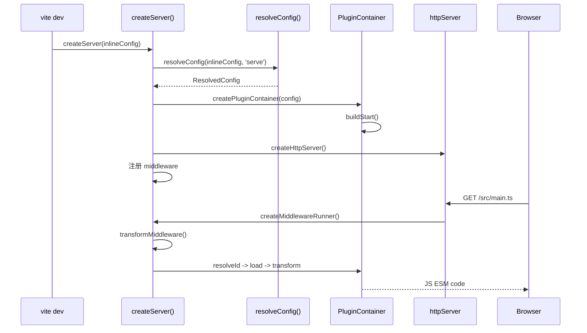
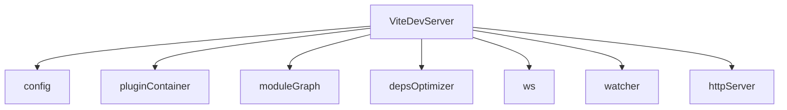
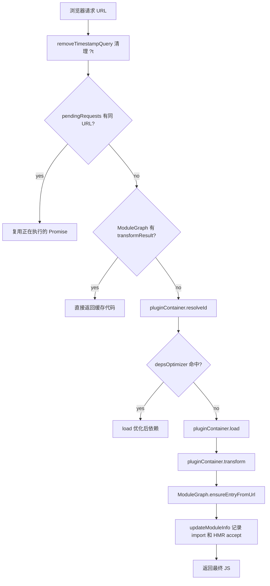

# Dev Server 主流程

这篇讲 `createServer()` 到浏览器拿到模块代码的完整过程。

## 先看大图



## 1. createServer 负责组装对象

入口在 `vite-source/packages/vite/src/node/server/index.ts`。

`_createServer()` 主要创建四个核心对象：

- `config`：最终配置，包含 root、base、plugins、server、build 等。
- `pluginContainer`：插件调用器，统一执行 `resolveId/load/transform`。
- `moduleGraph`：模块图，记录 URL、文件 id、依赖关系、HMR 边界和转换缓存。
- `depsOptimizer`：依赖预优化缓存，减少 node_modules 的重复转换。

可以把 dev server 理解成一个共享上下文：



## 2. middleware 决定请求交给谁处理

`createMiddlewareRunner()` 模拟 connect/koa 的中间件模型。

核心顺序在 `server/index.ts`：

```text
hostCheck
cors
time
base
proxy
transform
public
static
htmlFallback
indexHtml
notFound
```

最关键的是：

- `transformMiddleware`：处理 JS/CSS/JSON/Vue 子请求、`/@vite/client`、资源 `?import`。
- `indexHtmlMiddleware`：处理 `/` 和 `.html`，读取 HTML 后执行 `transformIndexHtml`。
- `static/public`：兜底返回静态文件。

## 3. transformRequest 是 dev 模式热路径

源码在 `vite-source/packages/vite/src/node/server/transformRequest.ts`。

浏览器请求 `/src/main.ts?t=123` 时，流程是：



小白可以先记住一句话：

> `transformRequest = 缓存去重 + 解析模块 + 读取源码 + 插件转换 + 写模块图`

## 4. 为什么 Vite dev 快

传统 bundler dev 常见思路是先从入口递归打包整棵依赖图，再把 bundle 给浏览器。

Vite dev 的思路是：

- 浏览器原生支持 ESM，所以源码模块可以一个个请求。
- Vite 只转换当前被请求的模块。
- 依赖关系在请求过程中逐步进入 `ModuleGraph`。
- 第三方依赖通过 `depsOptimizer` 预处理，避免每次都转 node_modules。
- 变更时只失效相关模块的缓存。

这就是“启动快”和“热更新快”的核心来源。
