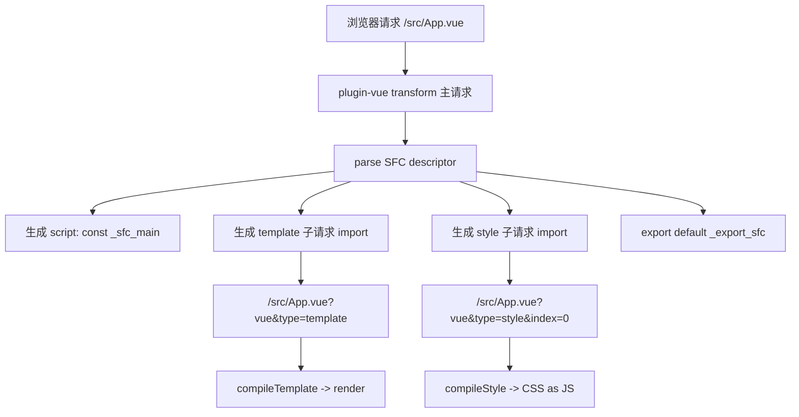
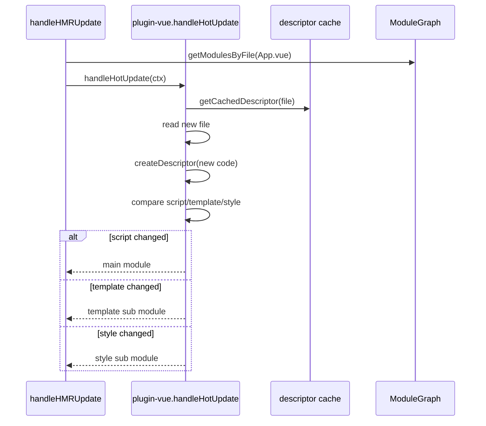
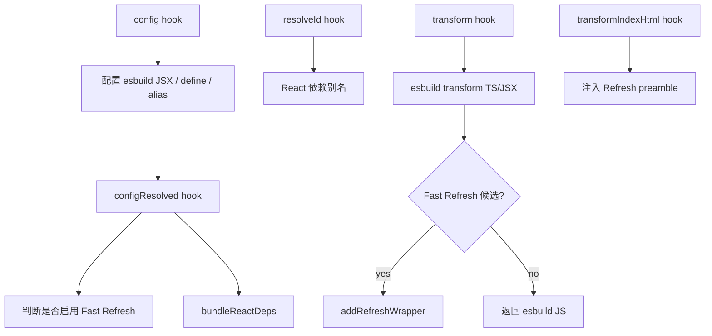
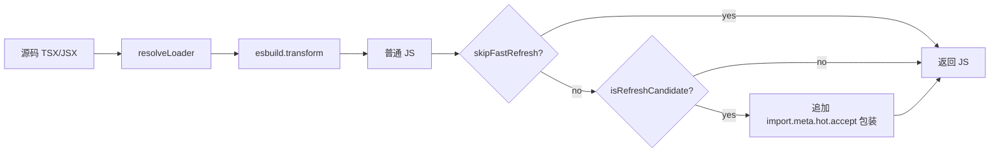

# Vue / React 插件实现

这篇看 `plugin-vue` 和 `plugin-react` 如何利用 Vite hook 接入框架能力。

## Vue 插件总图



## Vue 主请求如何变成 ESM

源码在 `vite-source/packages/plugin-vue/src/main.ts`。

一个 `.vue` 文件：

```vue
<script>
export default { name: 'App' }
</script>

<template>
  <div>Hello</div>
</template>

<style scoped>
div { color: red; }
</style>
```

会被拆成类似：

```js
const _sfc_main = { name: 'App' }
import { render as _sfc_render } from "/src/App.vue?vue&type=template&id=xxx&scoped=true";
import "/src/App.vue?vue&type=style&index=0&id=xxx&scoped=true";
if (import.meta.hot) import.meta.hot.accept(() => import.meta.hot.invalidate());
import _export_sfc from "\0plugin-vue:export-helper";
export default _export_sfc(_sfc_main, [
  ["render", _sfc_render],
  ["__scopeId", "data-v-xxx"],
  ["__file", "src/App.vue"]
]);
```

为什么要拆？

- template 可以单独编译成 render。
- style 可以单独走 CSS 插件和 HMR。
- scoped 样式需要把 `data-v-xxx` 同时交给 template 和组件对象。
- 文件变化时，Vue 插件可以只更新变了的 block。

## Vue HMR 方法调用图



## React 插件总图



## React transform 做了什么

源码在 `vite-source/packages/plugin-react/src/transform.ts`。

每个 `.jsx/.tsx` 请求会经过：



## React Fast Refresh 包装

源码在 `vite-source/packages/plugin-react/src/refresh-utils.ts`。

包装代码的核心逻辑是：

1. import React Refresh runtime。
2. 读取当前模块 exports。
3. 注册当前模块导出的 React 组件。
4. 调用 `import.meta.hot.accept(callback)` 让模块 self-accept。
5. 新模块加载后比较新旧 exports 是否仍是安全刷新边界。
6. 如果安全，运行 React Refresh 更新；如果不安全，调用 `invalidate()` 整页刷新。

## Vue 和 React 插件的共同点

- 都用 `config` 补运行时需要的默认配置。
- 都用 `configResolved` 读取最终配置。
- 都用 `resolveId/load` 处理虚拟模块。
- 都用 `transform` 把框架源码变成浏览器能执行的 JS。
- 都依赖 `import.meta.hot.accept` 形成 HMR 边界。

## Vue 和 React 插件的不同点

- Vue 的 `.vue` 是一个文件包含多个 block，所以要拆成主模块和子模块。
- React 的 `.tsx/.jsx` 本身就是 JS 模块，主要是 JSX/TS 编译和 Fast Refresh 包装。
- Vue 的 HMR 更关注 template/script/style 哪个 block 变了。
- React 的 HMR 更关注导出的组件边界是否仍然安全。
