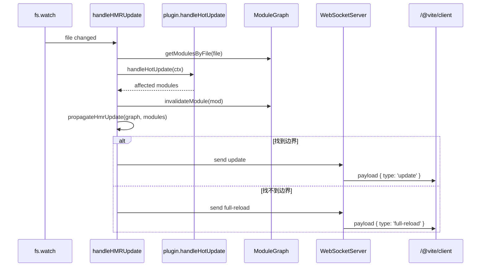
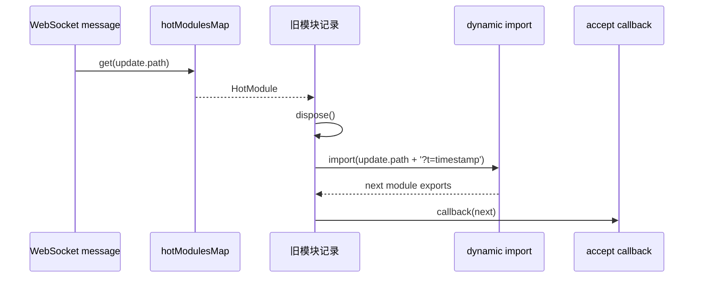

# HMR 原理与回调细节

这篇解释服务端 HMR 如何传播，以及浏览器端 `import.meta.hot.accept/dispose/invalidate` 怎么工作。

## HMR 的核心数据

`ModuleGraph` 记录这些信息：

- `url`：浏览器请求路径，例如 `/src/App.vue`。
- `id`：插件解析后的内部 id，通常是绝对文件路径。
- `importedModules`：当前模块 import 了谁。
- `importers`：谁 import 了当前模块。
- `acceptedHmrDeps`：当前模块 accept 了哪些依赖。
- `isSelfAccepting`：当前模块是否 `import.meta.hot.accept()` 自接受。
- `transformResult`：转换缓存。

## 服务端传播图

文件变化后，Vite 从变更模块沿着 `importers` 反向查找。

```mermaid
flowchart BT
  C[Changed: Button.vue] --> B[Importer: App.vue]
  B --> A[Importer: main.ts]
  B -. import.meta.hot.accept('./Button.vue') .-> Boundary[HMR 边界 App.vue]
```

如果找到边界：

- 服务端发送 `type: 'update'`。
- 浏览器重新 import 新模块。
- 执行边界模块注册过的 accept 回调。

如果找不到边界：

- 服务端发送 `type: 'full-reload'`。
- 浏览器整页刷新。

## 服务端方法调用图



## 浏览器端 import.meta.hot

复刻版浏览器端在 `vite-source/packages/vite/src/client/client.ts`。

`import-analysis` 会给模块头部注入：

```js
import { createHotContext as __vite_create_hot_context__ } from "/@vite/client";
import.meta.hot = import.meta.hot || __vite_create_hot_context__("/src/App.vue");
```

然后业务代码就能写：

```js
if (import.meta.hot) {
  import.meta.hot.accept((nextModule) => {
    console.log(nextModule)
  })
}
```

## accept 的三种写法

### accept()

```js
import.meta.hot.accept()
```

意思是：我这个模块自己能处理自己的更新。

服务端看到它会把这个模块标记成 `isSelfAccepting = true`。

### accept(callback)

```js
import.meta.hot.accept((nextModule) => {
  // nextModule 是重新 import 后的新模块 exports
})
```

意思也是 self-accept，只是浏览器端拿到新模块后会执行回调。

### accept(dep, callback)

```js
import.meta.hot.accept('./dep.js', (nextDep) => {
  // 当前模块接受 dep.js 的更新
})
```

意思是：如果 `./dep.js` 更新，不要继续向上传播到入口，我这个 importer 可以处理它。

## dispose

```js
import.meta.hot.dispose(() => {
  timer.stop()
})
```

更新前执行，适合清理：

- 定时器
- 事件监听
- WebSocket 连接
- 手动创建的 DOM

复刻版在收到 `update` 后会先执行 `mod.dispose?.()`，再动态 import 新模块。

## invalidate

```js
import.meta.hot.invalidate()
```

意思是：这个模块虽然注册了 HMR，但当前变化无法安全热替换，请整页刷新。

React Fast Refresh 就会在导出形状不再安全时调用它。

## 浏览器端更新调用图



关键点是 `?t=timestamp`。它会绕开浏览器缓存，让 dev server 重新执行 `transformRequest`。
