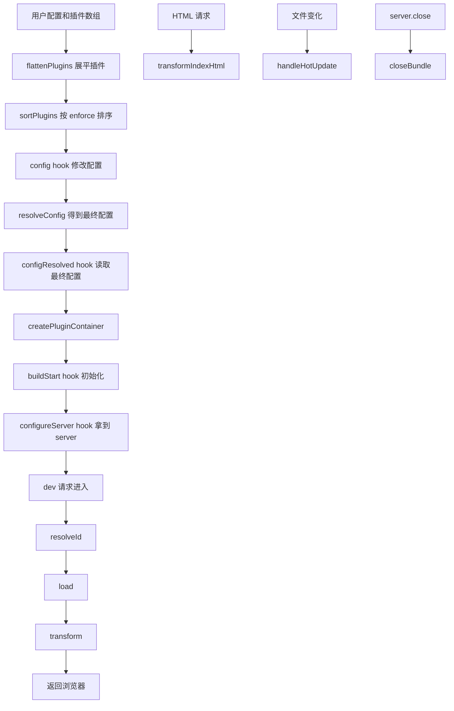
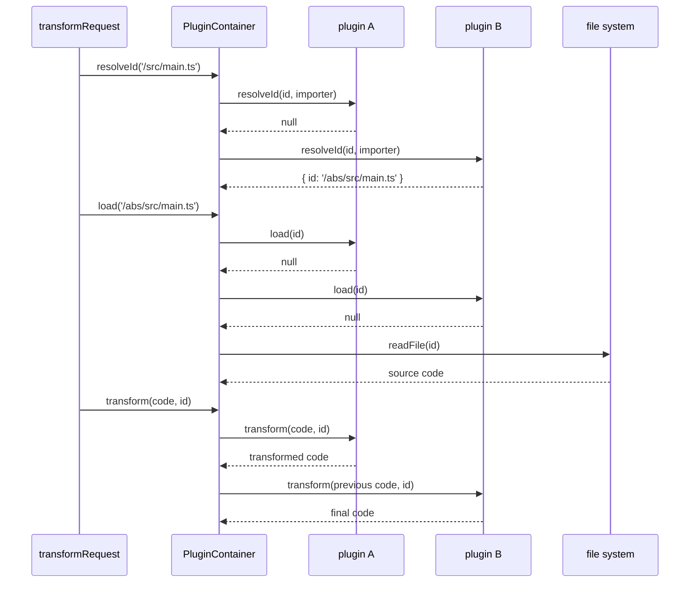

# 插件 hook 调用机制

这篇解释 Vite 常用回调钩子，也就是插件里的 hook：`config`、`configResolved`、`configureServer`、`buildStart`、`resolveId`、`load`、`transform`、`transformIndexHtml`、`handleHotUpdate`、`closeBundle`。

## hook 总览



## hook 执行顺序

### 1. config

时机：用户配置刚加载后，最终配置生成前。

作用：

- 插件可以追加默认配置。
- 可以补 `define`、`resolve.alias`、`optimizeDeps`。
- Vue/React 插件都在这里补运行时需要的配置。

源码对照：

- `vite-source/packages/plugin-vue/src/index.ts`
- `vite-source/packages/plugin-react/src/index.ts`

### 2. configResolved

时机：最终配置已经确定。

作用：

- 读取最终 `root/base/isProduction/server/build/css`。
- 缓存派生状态。
- 不建议再修改配置。

例子：

- Vue 插件把 `config.root` 写入 `options.root`。
- React 插件根据 `config.command/config.server.hmr` 决定是否跳过 Fast Refresh。

### 3. configureServer

时机：dev server 对象创建后，中间件正式处理请求前。

作用：

- 插件可以拿到 `server`。
- 可以注册自定义中间件、监听 WebSocket、保存 server 引用。

复刻版在 `server/index.ts` 中遍历 `config.plugins` 调用它。

### 4. buildStart

时机：`createPluginContainer()` 创建后立即执行。

作用：

- 插件初始化缓存。
- 读取外部状态。
- 对齐 Rollup 插件生命周期。

源码在 `vite-source/packages/vite/src/node/server/pluginContainer.ts`。

## resolveId / load / transform 三件套

这是模块请求最常见的三段式。



注意两个规则：

- `resolveId` 和 `load` 是短路模型：某个插件返回结果后，后续插件通常不再处理这一阶段。
- `transform` 是串行模型：每个插件拿上一个插件的输出继续转换。

## transformIndexHtml

HTML 不是普通 JS 模块，所以 Vite 给它单独的 hook。

复刻版 `htmlPlugin` 做了两件事：

- dev 时注入 `<script type="module" src="/@vite/client"></script>`。
- 在 body 前加一段转换标记。

这个 hook 是 HMR 能进入浏览器的入口，因为 `/@vite/client` 会建立 WebSocket。

## handleHotUpdate

文件变化后，Vite 会先从 `ModuleGraph` 找到相关模块，再让插件有机会筛选。

```mermaid
flowchart TD
  A[fs.watch 文件变化] --> B[getModulesByFile]
  B --> C[调用每个插件 handleHotUpdate]
  C --> D{插件返回 ModuleNode[]?}
  D -- yes --> E[用插件筛选后的模块]
  D -- no --> F[使用默认模块列表]
  E --> G[invalidateModule]
  F --> G
  G --> H[propagateHmrUpdate]
```

Vue SFC 就依赖这个 hook 区分 script/template/style 变化。

## hook 的 this 上下文

`PluginContainer.createContext()` 会给插件 hook 提供简化版 Rollup context：

- `this.resolve(id, importer)`：在插件内部继续走完整解析链。
- `this.addWatchFile(id)`：让外部文件也进入监听。
- `this.emitFile(file)`：记录构建产物。
- `this.getFileName(referenceId)`：取 emitFile 生成的文件名。
- `this.getModuleInfo(id)`：读取模块元信息。
- `this.warn/error()`：带插件名输出警告或报错。

这就是为什么插件 hook 不能随便写成箭头函数：箭头函数没有自己的 `this`。
