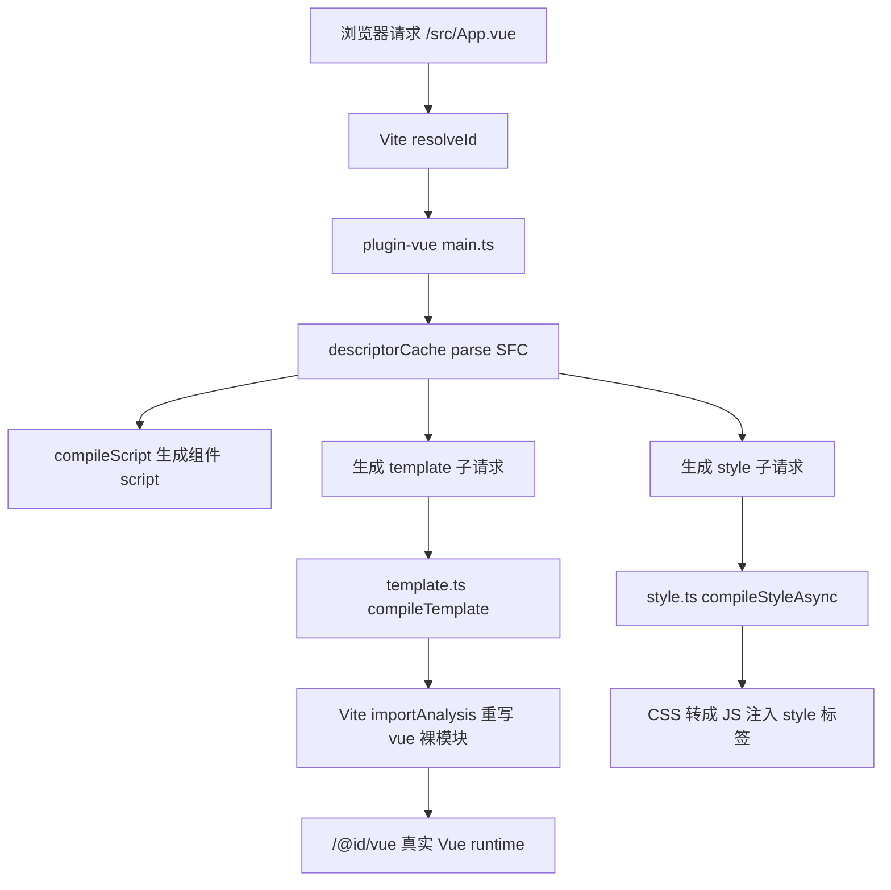

# @vitejs/plugin-vue 复刻流程

本地复刻插件位于：

```txt
vite-source/packages/plugin-vue
├─ src/index.ts
├─ src/helper.ts
├─ src/main.ts
├─ src/script.ts
├─ src/handleHotUpdate.ts
├─ src/template.ts
├─ src/style.ts
└─ src/utils
   ├─ descriptorCache.ts
   ├─ hash.ts
   ├─ path.ts
   └─ query.ts
```

它参考 `/Users/nwyzx/Desktop/project/source/vite-plugin-vue/packages/plugin-vue/src`
的官方源码拆分方式，但只实现当前阅读版 Vite 需要的核心链路。

## 核心链路



## index.ts

`index.ts` 是插件入口，对齐官方插件的职责：

- `config`：注入 Vue runtime 需要的 `define` 常量，例如 `__VUE_OPTIONS_API__`。
- `configResolved`：缓存最终 `root`、`isProduction`、`sourceMap`。
- `resolveId`：让 `.vue?vue&type=template` 这类虚拟子请求被插件接管。
- `load`：根据 query 返回 template/style/script block 内容。
- `transform`：把主 `.vue` 请求分发给 `main.ts`，把子请求分发给 `template.ts` 或 `style.ts`。
- `<template src>` / `<style src>`：读取相对外链文件，并通过 `addWatchFile`
  加入监听。
- custom block：主模块会生成 `type=custom` 子请求，默认导出 custom block
  文本，后续可继续交给用户插件消费。

## main.ts

`main.ts` 把一个 SFC 主请求转换为标准 ESM：

```txt
<script setup> / <script>
-> const _sfc_main = ...
-> import { render } from "/src/App.vue?vue&type=template"
-> import "/src/App.vue?vue&type=style&index=0"
-> import "/src/App.vue?vue&type=custom&index=0"
-> export default _export_sfc(_sfc_main, [["render", render], ...])
```

这一步只拼装组件对象，不直接编译 template/style。template 和 style 会作为
后续浏览器请求继续进入 Vite 的模块转换管线。

## helper.ts

`helper.ts` 对齐官方插件的 `\0plugin-vue:export-helper` 虚拟模块。它把
`render`、`__scopeId`、`__file` 等属性统一挂到组件对象上：

```js
export default (sfc, props) => {
  const target = sfc.__vccOpts || sfc
  for (const [key, val] of props) target[key] = val
  return target
}
```

这样主模块不需要到处写 `_sfc_main.render = ...`，也能更接近官方生成代码。

## script.ts

`script.ts` 对齐官方插件里“脚本块解析独立成模块”的设计。它负责调用
`vue/compiler-sfc` 的 `compileScript`，并缓存结果：

- 普通 `<script>` 和 `<script setup>` 会合并成一个组件脚本。
- `lang="ts"` 保留给 Vite 的 `esbuildPlugin` 继续去类型。
- `genDefaultAs: "_sfc_main"` 让主模块可以稳定拼接 template/style。
- HMR 时可以只失效 script cache，而不用重建所有描述符。

## handleHotUpdate.ts

`handleHotUpdate.ts` 负责比较变更前后的 SFC descriptor：

- script 变更：失效主 `.vue` 模块和 script 缓存。
- template 变更：失效 template 子模块。
- style 变更：失效对应 style 子模块。
- 结构变化较大时回退到主模块刷新。

当前阅读版仍然是“模块级刷新/失效”思路，还没有完整接入官方
`__VUE_HMR_RUNTIME__.rerender/reload` 的精确运行时热替换，但文件边界和缓存失效
已经更接近官方源码。

## template.ts

`template.ts` 调用真实 `vue/compiler-sfc` 的 `compileTemplate`。

输出代码会导出 `render` 函数，并且通常包含：

```js
import { openBlock, createElementBlock } from "vue"
```

所以 Vite 的 `importAnalysisPlugin` 必须继续处理 `.vue?vue&type=template`
子请求，把裸模块 `vue` 改写为 `/@id/vue?...`。

## style.ts

`style.ts` 调用 `compileStyleAsync`。

如果 `<style scoped>` 存在，compiler-sfc 会把选择器转换成：

```css
.card[data-v-xxxxxx] { ... }
```

阅读版随后把 CSS 包装成 JS 模块，在浏览器端创建或更新 `<style>` 标签。

## /@id 和真实 Vue runtime

Vue playground 使用真实运行时：

```ts
import { createApp } from 'vue'
```

Vite 的 import analysis 会把它改写成：

```txt
/@id/vue?importer=/absolute/path/to/src/main.ts
```

这里的 `importer` 很关键。`vue` 自身会继续导入 `@vue/runtime-dom`、
`@vue/runtime-core`、`@vue/shared` 等嵌套依赖。复刻版 resolver 用 importer
恢复 Node 包解析上下文，才能正确找到 pnpm 虚拟 store 中的真实文件。

## Playground

示例工程在：

```txt
vite-source/playground/vue
```

启动：

```bash
pnpm --dir vite-source dev:vue
```

当前示例包含：

- `src/main.ts`：真实 TS 入口，类型语法由 `plugins/esbuild.ts` 转换。
- `src/App.vue`：`<script setup>`、`<template>`、`<style scoped>`。
- 真实 `vue` runtime。
- 本地 workspace 版本 `@vitejs/plugin-vue`。
