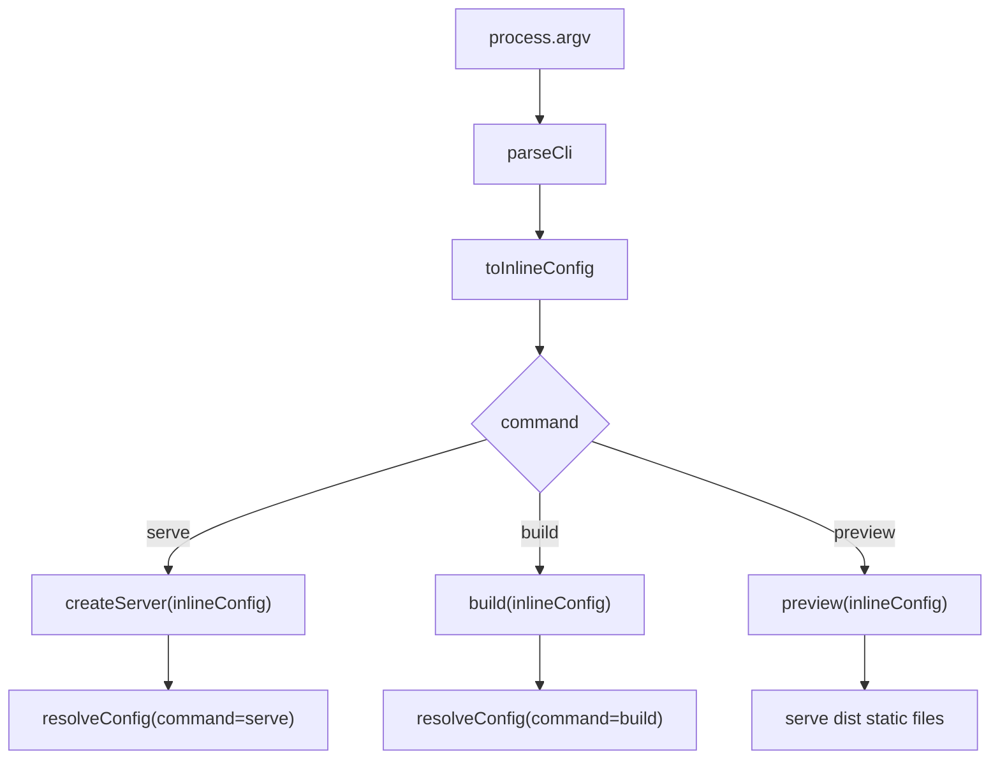
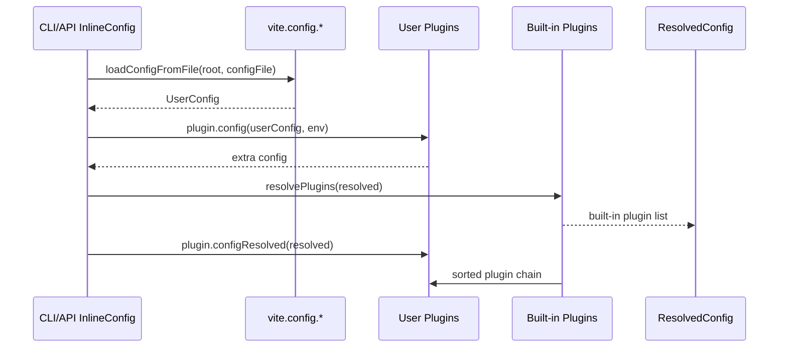
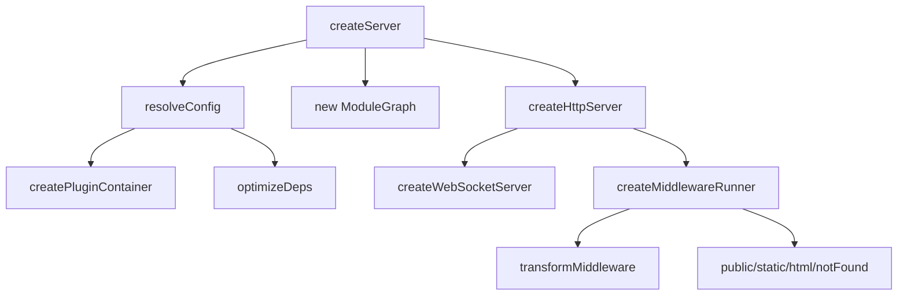
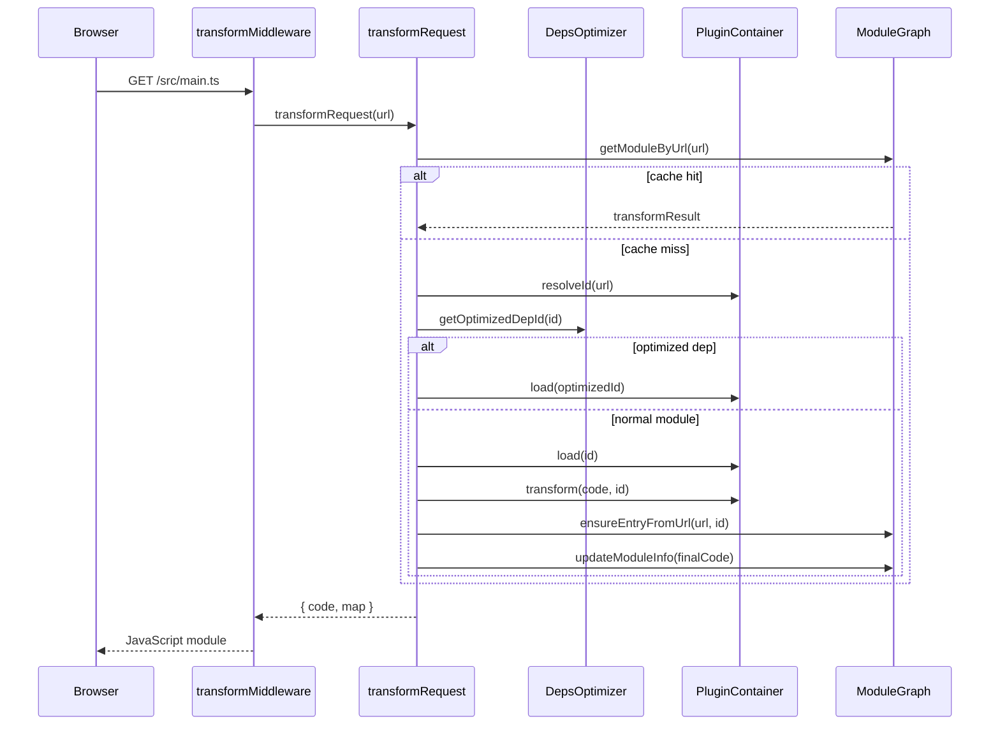
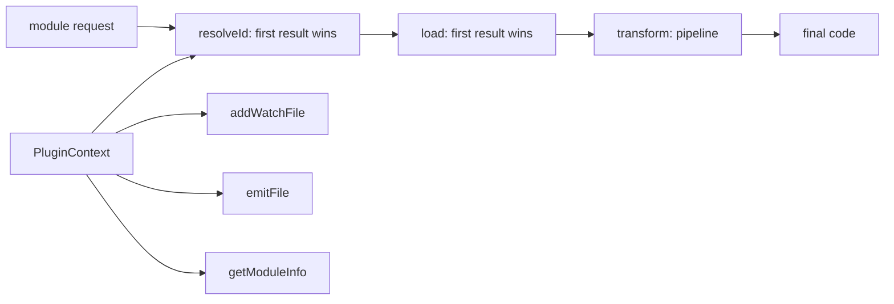
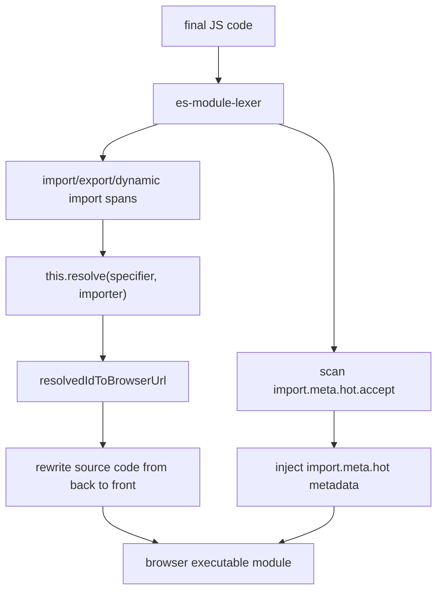
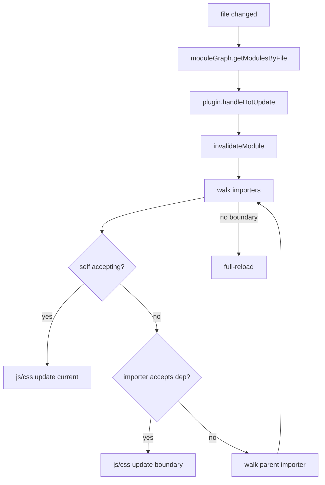
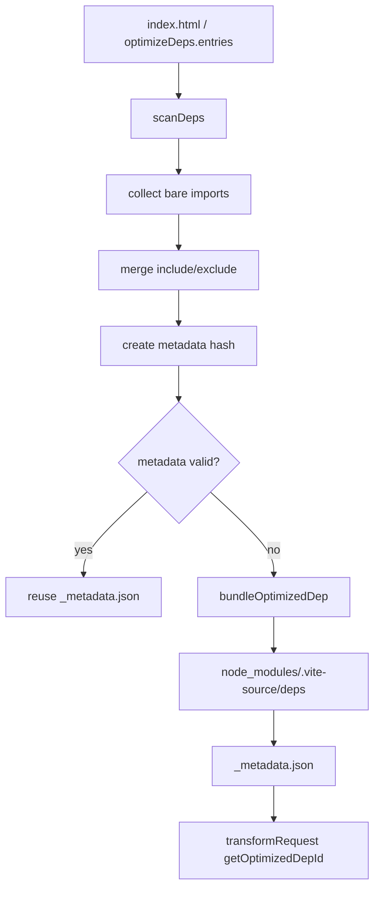
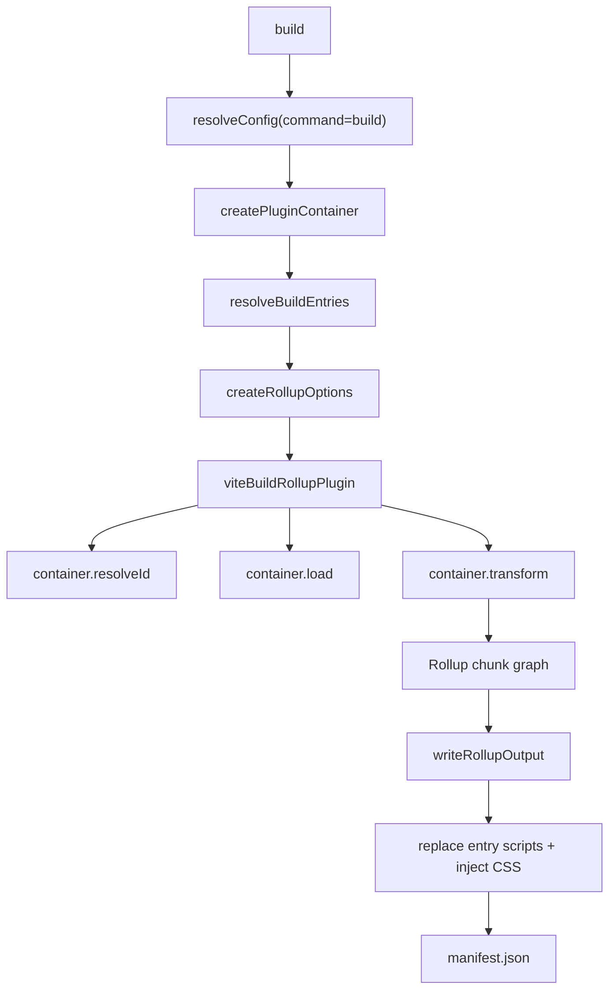

# Vite Source 核心流程深度图解

这篇文档对应源码目录：

```txt
vite-source/packages/vite/src
```

它和源码注释配套阅读：源码注释解释“这一行为什么存在”，本文用流程图解释
“这些文件之间如何协作”。

## 1. 总入口：CLI 到公共 API

相关文件：

- `vite-source/packages/vite/src/node/cli.ts`
- `vite-source/packages/vite/src/node/config.ts`
- `vite-source/packages/vite/src/node/server/index.ts`
- `vite-source/packages/vite/src/node/build.ts`
- `vite-source/packages/vite/src/node/preview.ts`



CLI 层只做参数转换，不直接处理插件、模块、HMR 或构建。这样命令行和 JS API
可以共享同一套 `resolveConfig`、`createServer`、`build` 实现。

## 2. 配置生命周期

相关文件：

- `vite-source/packages/vite/src/node/config.ts`
- `vite-source/packages/vite/src/node/plugin.ts`
- `vite-source/packages/vite/src/node/plugins/index.ts`



关键点：

- `InlineConfig` 来自 CLI 或 JS API。
- `UserConfig` 来自 `vite.config.*`。
- `plugin.config` 可以继续返回配置，参与合并。
- `ResolvedConfig` 是后续 server/build/optimizer/plugin container 共享的只读上下文。
- `resolvePlugins` 把 Vite 内置能力拆成一串插件，而不是塞进一个巨型函数。

## 3. Dev Server 组装

相关文件：

- `vite-source/packages/vite/src/node/server/index.ts`
- `vite-source/packages/vite/src/node/server/pluginContainer.ts`
- `vite-source/packages/vite/src/node/server/moduleGraph.ts`
- `vite-source/packages/vite/src/node/optimizer/index.ts`



`ViteDevServer` 是这些对象的聚合：

- `config`：全局解析后的配置。
- `pluginContainer`：调用插件钩子的统一入口。
- `moduleGraph`：记录 URL、id、依赖关系、HMR 边界和转换缓存。
- `depsOptimizer`：裸模块预构建查询表。
- `ws`：向浏览器推送 HMR/full reload 消息。
- `watcher`：文件变化事件模型。

## 4. 单个请求转换

相关文件：

- `vite-source/packages/vite/src/node/server/middlewares/transform.ts`
- `vite-source/packages/vite/src/node/server/transformRequest.ts`
- `vite-source/packages/vite/src/node/server/pluginContainer.ts`
- `vite-source/packages/vite/src/node/server/moduleGraph.ts`



`transformRequest` 的核心顺序是：

1. 用 `pendingRequests` 合并并发请求。
2. 查 `ModuleGraph` 上的 `transformResult` 缓存。
3. 执行 `pluginContainer.resolveId`。
4. 如果是优化依赖，直接加载优化缓存。
5. 执行 `load` 和串行 `transform`。
6. 把最终代码写回 `ModuleGraph`，并解析 import/HMR 信息。

## 5. 插件容器钩子模型

相关文件：

- `vite-source/packages/vite/src/node/server/pluginContainer.ts`
- `vite-source/packages/vite/src/node/plugin.ts`



钩子规则：

- `resolveId` 是短路钩子：第一个返回结果的插件决定 id。
- `load` 是短路钩子：第一个返回源码的插件决定模块内容。
- `transform` 是流水线：每个插件拿上一个插件的输出继续处理。
- `transformIndexHtml` 是 HTML 专用管线。
- `ssrTransform` 是 SSR 专用管线。

## 6. import-analysis：specifier 到浏览器 URL

相关文件：

- `vite-source/packages/vite/src/node/plugins/importAnalysis.ts`
- `vite-source/packages/vite/src/node/plugins/resolve.ts`
- `vite-source/packages/vite/src/node/server/moduleGraph.ts`



它承担四个职责：

- 找出当前模块导入了哪些依赖。
- 调用 resolver，把别名、裸模块、package exports、资源文件统一解析。
- 把 resolved id 改写成浏览器能请求的 URL。
- 注入 `import.meta.hot` 元信息，让 `ModuleGraph` 能记录 HMR 边界。

## 7. ModuleGraph 和 HMR

相关文件：

- `vite-source/packages/vite/src/node/server/moduleGraph.ts`
- `vite-source/packages/vite/src/node/server/hmr.ts`
- `vite-source/packages/vite/src/client/client.ts`



`ModuleNode` 里最关键的关系：

- `importedModules`：当前模块依赖谁。
- `importers`：谁依赖当前模块。
- `acceptedHmrDeps`：当前模块显式接受哪些依赖更新。
- `isSelfAccepting`：当前模块能否自己处理自己的更新。
- `transformResult`：当前模块的转换缓存。

文件变化后，HMR 从变更模块沿 `importers` 向上找 accept 边界。找得到就局部更新；
找不到就发送 `full-reload`。

## 8. 依赖预构建

相关文件：

- `vite-source/packages/vite/src/node/optimizer/index.ts`
- `vite-source/packages/vite/src/node/optimizer/scan.ts`
- `vite-source/packages/vite/src/node/optimizer/resolve.ts`
- `vite-source/packages/vite/src/node/plugins/optimizedDeps.ts`



optimizer 解决两个 dev 问题：

- 浏览器不能直接理解很多 CJS/UMD 依赖。
- 大型依赖包内部模块很多，按请求逐个转换会拖慢启动和刷新。

阅读版用代理模块模拟预构建产物，但保留扫描、hash、metadata、缓存查询这条主线。

## 9. Build：Vite 插件到 Rollup

相关文件：

- `vite-source/packages/vite/src/node/build.ts`
- `vite-source/packages/vite/src/node/plugins/importAnalysisBuild.ts`
- `vite-source/packages/vite/src/node/plugins/manifest.ts`
- `vite-source/packages/vite/src/node/plugins/reporter.ts`



dev 和 build 的分界：

- dev：浏览器请求哪个模块，Vite 就转换哪个模块。
- build：Rollup 从入口开始创建完整模块图，负责 tree-shaking、拆包和输出。

`viteBuildRollupPlugin` 是桥：

- Rollup 调 `resolveId`，adapter 转给 `pluginContainer.resolveId`。
- Rollup 调 `load`，adapter 转给 `pluginContainer.load`。
- Rollup 调 `transform`，adapter 转给 `pluginContainer.transform`。
- 插件 `emitFile` 先暂存在容器里，adapter 再 flush 给 Rollup。

## 10. 建议阅读顺序

1. `node/cli.ts`：确认 serve/build/preview 如何分发。
2. `node/config.ts`：看 `resolveConfig` 如何形成 `ResolvedConfig`。
3. `node/plugins/index.ts`：看内置插件链顺序。
4. `node/server/index.ts`：看 dev server 如何组装。
5. `node/server/transformRequest.ts`：看一个请求如何走插件管线。
6. `node/plugins/importAnalysis.ts`：看 import 如何被改写。
7. `node/server/moduleGraph.ts`：看依赖和 HMR 信息如何入图。
8. `node/server/hmr.ts`：看文件变化如何传播。
9. `node/optimizer/index.ts` 和 `node/optimizer/scan.ts`：看依赖预构建。
10. `node/build.ts`：看 build 如何把 Vite 插件容器接给 Rollup。
