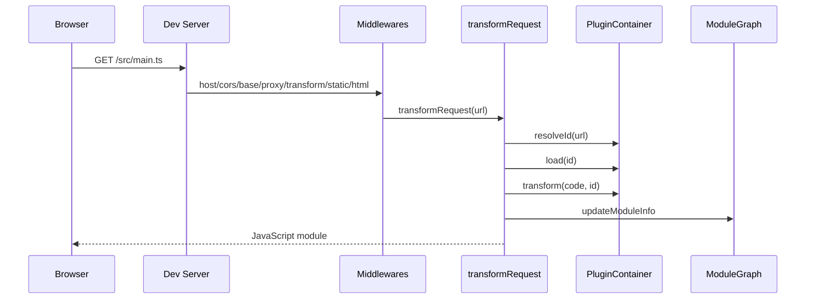
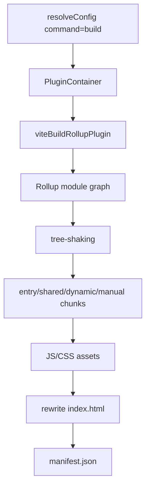
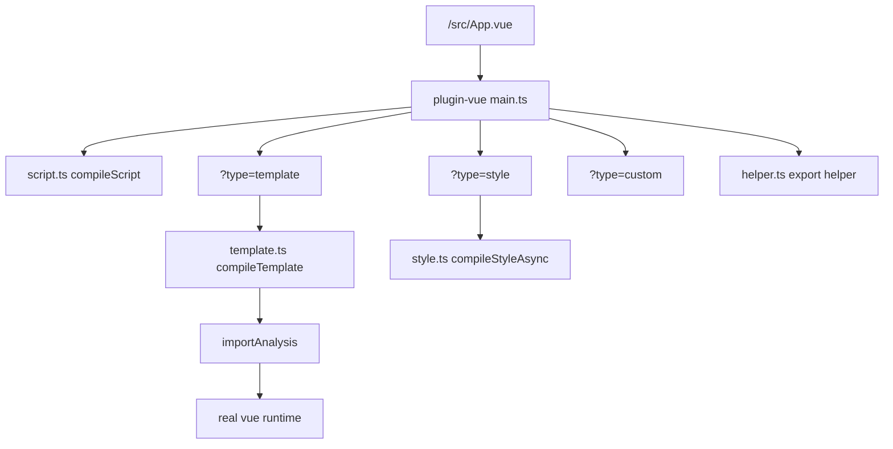
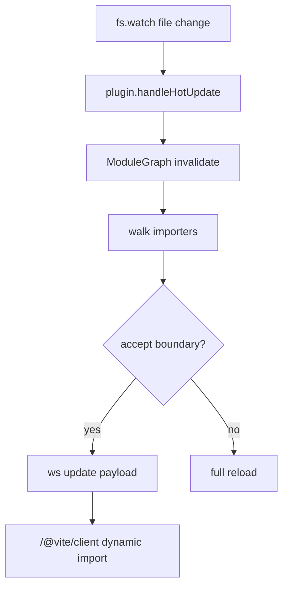
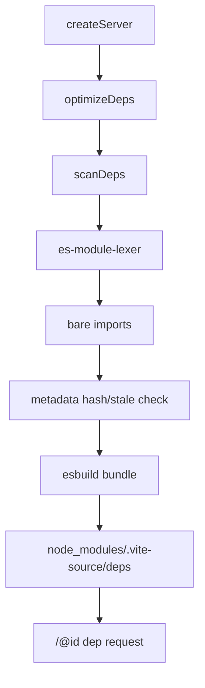

# Vite Source 阅读路线

这篇文档按“执行链路”阅读 `vite-source`，目标是先理解 Vite 为什么这样组织，
再回到官方源码看更完整的边界处理。

## 1. Dev 请求链路

建议阅读顺序：

1. `src/node/cli.ts`：命令如何进入 `createServer`。
2. `src/node/config.ts`：如何生成 `ResolvedConfig`。
3. `src/node/plugins/index.ts`：内置插件链顺序。
4. `src/node/server/index.ts`：server 如何组装 middleware。
5. `src/node/server/middlewares/transform.ts`：哪些请求进入转换管线。
6. `src/node/server/transformRequest.ts`：resolve/load/transform/cache 主流程。
7. `src/node/server/pluginContainer.ts`：Rollup 风格插件钩子如何被调用。
8. `src/node/server/moduleGraph.ts`：模块 URL、id、依赖和 HMR 信息如何记录。

## 2. Build 链路

建议阅读顺序：

1. `src/node/build.ts`：Vite 插件容器如何适配到 Rollup。
2. `viteBuildRollupPlugin`：`resolveId/load/transform` 如何桥接。
3. `createRollupOutputOptions`：入口、chunk、manualChunks、sourcemap 等输出配置。
4. `extractCssFromJs`：build 阶段 CSS 如何从 JS 注入模型抽取成 CSS asset。
5. `plugins/manifest.ts`：Rollup chunk 如何映射成 Vite manifest。

## 3. Vue SFC 链路

建议阅读顺序：

1. `packages/plugin-vue/src/index.ts`：插件入口、子请求分发。
2. `descriptorCache.ts`：SFC parse 结果如何缓存。
3. `main.ts`：主 `.vue` 模块如何拼装 script/template/style/custom。
4. `script.ts`：`<script setup>` 和普通 `<script>` 如何合并。
5. `template.ts`：模板如何编译成 render 函数。
6. `style.ts`：scoped CSS 如何编译。
7. `helper.ts`：render、scopeId、file 等属性如何挂到组件对象。

## 4. HMR 链路

建议阅读顺序：

1. `server/index.ts`：watchRoot 如何触发 `handleHMRUpdate`。
2. `server/hmr.ts`：如何向上寻找 accept 边界。
3. `server/moduleGraph.ts`：`acceptedHmrDeps` 和 `isSelfAccepting` 从哪里来。
4. `plugins/importAnalysis.ts`：`import.meta.hot.accept` 如何被分析。
5. `plugins/clientInjections.ts`：浏览器端如何执行 dispose、prune、custom event、动态 import。
6. `packages/plugin-vue/src/handleHotUpdate.ts`：Vue SFC 如何区分 script/template/style 变化。

## 5. Optimizer 链路

建议阅读顺序：

1. `optimizer/index.ts`：metadata 生命周期、stale 判断、缓存写入。
2. `optimizer/scan.ts`：HTML/JS/TS 入口如何扫描裸模块。
3. `optimizer/resolve.ts`：优化产物路径如何生成。
4. `optimizer/rolldownDepPlugin.ts`：如何用 esbuild 生成 ESM 预构建文件。
5. `plugins/optimizedDeps.ts`：dev 请求如何读取优化后的依赖。

## 阅读方式

每条链路先读 `vite-source`，再打开官方源码同名文件对比。遇到官方复杂分支时，
先问两个问题：

- 这个分支是核心执行流，还是兼容性/边界处理？
- 如果删掉它，普通 dev/build/Vue playground 是否还成立？

这样可以把“Vite 的设计骨架”和“生产级工程细节”分开看。
