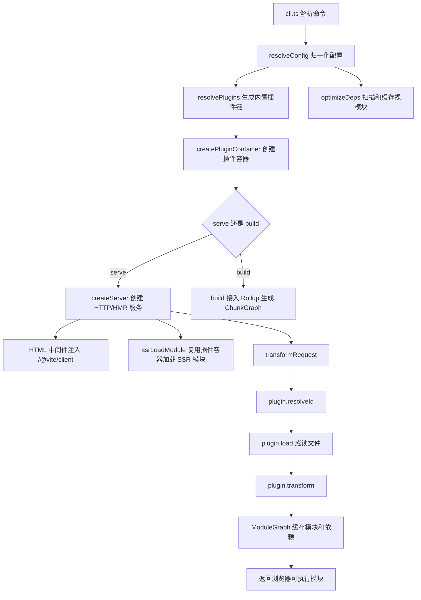
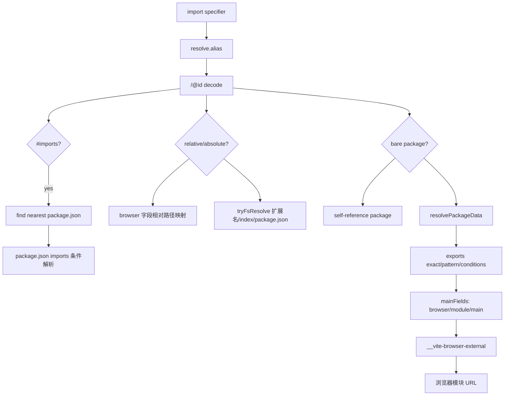
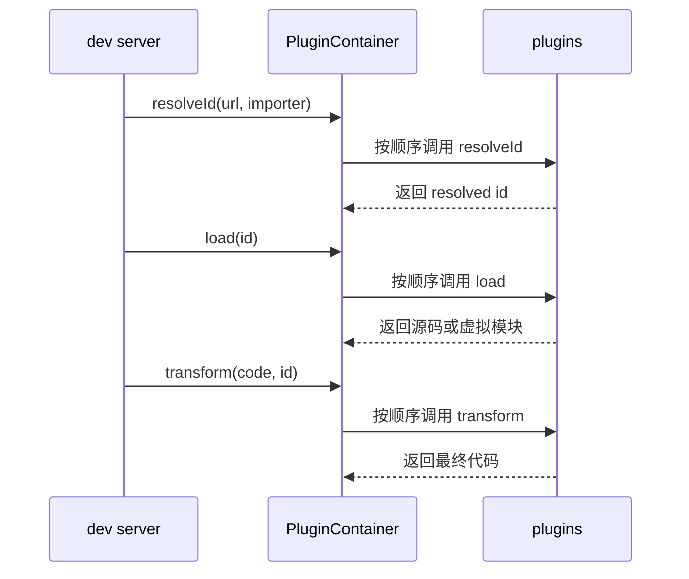
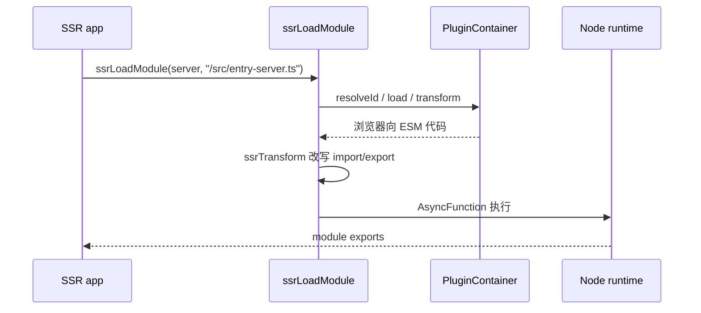

# Vite 源码复刻核心流程

本项目在 `/vite-source` 下放了一个源码阅读版 Vite。它参考官方仓库
`/Users/nwyzx/Desktop/project/source/vite/packages/vite/src` 的组织方式，
使用 monorepo 结构：

```txt
vite-source
├─ pnpm-workspace.yaml
└─ packages
   └─ vite
      ├─ package.json
      └─ src
         ├─ client
         └─ node
```

这个版本不是完整生产级 Vite，而是按 1:1 的核心执行顺序复刻主要模块，
并在关键方法、参数和分支上加了详细注释，方便你顺着源码理解运行逻辑。

配套图解文档：

- [Vite Source 核心流程深度图解](./vite-source-core-flow-deep-dive.md)

## 总览



## 入口：CLI 到 API

源码入口在 `vite-source/packages/vite/src/node/cli.ts`。

CLI 做三件事：

- 把 `vite-source [root]`、`vite-source build`、`vite-source preview` 解析成命令。
- 把 `--port`、`--host`、`--mode`、`--config` 等参数转换成 `InlineConfig`。
- 根据命令调用 `createServer`、`build` 或 `preview`。

真正的逻辑不放在 CLI 中，这是官方 Vite 的重要设计：命令行和 JS API 共用
`resolveConfig`、插件容器、dev server、build 流程。

## 配置解析：resolveConfig

源码在 `vite-source/packages/vite/src/node/config.ts`。

`resolveConfig(inlineConfig, command, defaultMode)` 是所有入口的共同前置步骤：

- `inlineConfig`：来自 CLI 或 JS API 的配置。
- `command`：`serve` 或 `build`，决定默认 mode 和后续插件行为。
- `defaultMode`：dev 默认 `development`，build 默认 `production`。

流程顺序：

1. 确定 `mode` 和 `root`。
2. 查找并加载 `vite.config.*`。
3. 合并配置文件和 CLI/API 传入的 inline config。
4. 展平并排序用户插件。
5. 执行插件 `config` 钩子，让插件继续补配置。
6. 生成 `ResolvedConfig`，补齐 `server`、`build`、`preview` 默认值。
7. 生成内置插件链并执行 `configResolved`。

## 插件链

源码在 `vite-source/packages/vite/src/node/plugins/index.ts`。

阅读版保留了这几个关键插件：

- `resolvePlugin`：把浏览器 URL、相对路径、裸模块解析成内部 id。
- `htmlPlugin`：转换 HTML，并注入 `/@vite/client`。
- `jsonPlugin`：把 JSON 转成 `export default ...`。
- `cssPlugin`：把 CSS 转成会插入 `<style>` 的 JS 模块，并支持 `.module.css`。
- `assetPlugin`：把图片、字体等资源转成 URL 字符串导出。
- `clientInjectionsPlugin`：提供 `/@vite/client` 和 `/@vite/env` 虚拟模块。
- `assetImportMetaUrlPlugin`：把 `new URL('./asset.png', import.meta.url)` 改写成 dev server 资源 URL。
- `dynamicImportVarsPlugin`：把模板字符串动态 import 转成 glob 映射加运行时 helper。
- `importGlobPlugin`：把 `import.meta.glob()` 展开成静态对象或 eager import。
- `esbuildPlugin`：把 TS/TSX/JSX 转成浏览器可执行 JS。
- `importAnalysisPlugin`：分析并重写 import 路径，注入 `import.meta.hot`。

插件顺序按 `enforce: 'pre' | undefined | 'post'` 排列。这个顺序很关键：
解析类插件要先运行，最终 import 分析要在多数转换之后运行。

## Resolver 完整化

源码在 `vite-source/packages/vite/src/node/plugins/resolve.ts` 和
`vite-source/packages/vite/src/node/packages.ts`。

这一版 resolver 已经不只是“裸模块拼 node_modules 路径”，而是补上了官方
Vite 日常最容易踩到的 package 解析细节：



关键点：

- `exports`：支持入口、deep import、条件对象、数组 target、`null/false`
  屏蔽、`"./feature/*"` pattern。
- `imports`：支持包内部 `#internal` 这类 subpath imports，并且 `#` 不再被误判为 URL hash。
- `conditions`：解析时合并用户配置、当前 `development/production`、
  `import/require` 和 `default`。
- `browser` 字段：支持入口替换、包内相对 import 替换，以及 `false` 映射到
  `__vite-browser-external` 空模块。
- `dedupe` 和 self-reference：`resolve.dedupe` 会强制从 root 查包；包内导入
  自己的包名时优先走当前 package 的 `exports`。
- Node builtins：`fs`、`node:path` 这类浏览器不可用模块会映射成
  `__vite-browser-external`。
- optional peer dependency：缺失的可选 peer 会生成特殊模块，只有真正执行到
  该 import 时才抛错。

`importAnalysisPlugin` 也做了配套调整：它现在使用 `es-module-lexer` 获取
import/export/dynamic import 的精确 span；改写每个 import 前先调用
`this.resolve(specifier, importer)`，再把 resolved id 转成浏览器 URL。这样包内
相对 import 也能命中 `browser` 字段，而不是简单字符串拼接成
`/node_modules/pkg/file.js`。

Vue playground 里有一个本地 fixture：

```txt
playground/vue/node_modules/vite-source-resolve-demo
```

它覆盖：

- `exports["."].browser`：入口选中 `browser-entry.js`。
- `imports["#internal"]`：包内 `#internal` 解析到 `internal.js`。
- `browser["./node-only.js"]`：相对 import 替换到 `browser-only.js`。
- `browser["./ignore-me.js"] = false`：生成 `/@id/__vite-browser-external`。
- `exports["./feature/*"]`：包自引用 `vite-source-resolve-demo/feature/a`
  解析到 `features/a.js`。

## Vite 日常语法插件

源码在：

- `vite-source/packages/vite/src/node/plugins/importMetaGlob.ts`
- `vite-source/packages/vite/src/node/plugins/dynamicImportVars.ts`
- `vite-source/packages/vite/src/node/plugins/assetImportMetaUrl.ts`

这三个插件都发生在最终 `importAnalysisPlugin` 之前，因为它们会生成新的
`import` 或 `import()`，需要继续交给 import analysis 重写成浏览器可请求 URL。

### import.meta.glob

```js
const modules = import.meta.glob('./features/*.js')
```

阅读版会扫描匹配文件并生成：

```js
const modules = {
  './features/a.js': () => import('/src/features/a.js'),
  './features/b.js': () => import('/src/features/b.js'),
}
```

`{ eager: true, import: 'name' }` 会生成静态 import：

```js
import { name as __vite_glob_0_0 } from '/src/features/a.js'
```

### 动态 import 变量

```js
import(`./features/${key}.js`)
```

阅读版会先转换成：

```js
__vite_dynamic_import_helper__(
  import.meta.glob('./features/*.js'),
  `./features/${key}.js`,
  3,
)
```

然后 `importMetaGlobPlugin` 再把 glob 展开成文件映射。官方插件还会处理更复杂
的查询参数、worker/raw/url、bare import 解析和 build 阶段 Rolldown 插件。

### import.meta.url 资源

```js
new URL('./img.png', import.meta.url)
```

阅读版会转换成：

```js
new URL('/src/img.png', import.meta.url)
```

直接图片请求仍由 `static.ts` 返回 `image/png`；JS 中 `import img from './img.png'`
则由 `assetPlugin` 返回 `export default "/src/img.png"`。

## esbuild 转换

源码在 `vite-source/packages/vite/src/node/plugins/esbuild.ts`。

这个插件对应官方 `plugins/esbuild.ts` 的 dev transform 职责。它运行在 post
阶段，并排在最终 `importAnalysisPlugin` 之前：

```txt
Vue / 用户插件输出
-> esbuildPlugin 去掉 TS 类型、编译 JSX
-> importAnalysisPlugin 重写 import 路径
```

这样 `main.ts` 可以写真实 TypeScript 类型语法：

```ts
type MountTarget = string | Element
const target: MountTarget = '#app'
```

浏览器拿到的是：

```js
const target = '#app'
```

`.tsx` 会被 esbuild 转成普通 JS：

```tsx
export function createLabel(props: LabelProps) {
  return <span>{props.text}</span>
}
```

输出为：

```js
export function createLabel(props) {
  return React.createElement('span', null, props.text)
}
```

Vue SFC 的 `<script setup lang="ts">` 也会走这一步，所以 `ref<number>(0)`
会在最终响应中变成 `ref(0)`。

当前阅读版没有完整实现官方的 tsconfig 查找、source map 合并、错误 code frame、
build target/minify、decorators 细节，但已经覆盖 dev server 最关键的 TS/JSX
转换链路。

## 插件容器

源码在 `vite-source/packages/vite/src/node/server/pluginContainer.ts`。

插件容器把 Rollup 风格钩子组织成可复用流水线：



`PluginContext` 提供了：

- `resolve`：插件内部继续走同一套 Vite resolve。
- `addWatchFile`：让外链文件参与 dev watch。
- `emitFile` / `getFileName`：build 阶段插件可以声明 asset/chunk。
- `getModuleInfo`：插件可以读取当前模块的最小元信息。
- `warn` / `error`：用 Vite logger 输出插件错误。

这样插件不直接依赖 server 细节，只通过上下文与容器交互。阅读版没有实现
Rollup context 的全部属性，但已经能说明第三方插件为什么可以在钩子里继续
解析模块、发出资源、读取模块信息。

## Dev Server 请求流程

源码在 `vite-source/packages/vite/src/node/server/index.ts` 和
`server/transformRequest.ts`。

当前复刻版已经把 dev server 从单个 `if/else` 请求处理函数拆成了官方式
middleware 栈：

```txt
hostCheckMiddleware
-> corsMiddleware
-> timeMiddleware
-> baseMiddleware
-> proxyMiddleware
-> transformMiddleware
-> servePublicMiddleware
-> serveStaticMiddleware
-> htmlFallbackMiddleware
-> indexHtmlMiddleware
-> notFoundMiddleware
-> errorMiddleware
```

新增的中间件职责：

- `hostCheck.ts`：拦截未允许的 Host，保留开发服务器的基础安全边界。
- `cors.ts`：开发环境默认写入 CORS header。
- `proxy.ts`：按 `server.proxy` 把 API 请求转发到 HTTP/HTTPS target。
- `public.ts`：服务项目根目录下的 `public` 静态资源。
- `static.ts` / `send.ts`：静态文件带 ETag 和 cache header。

早期版本的中间件栈是：

```txt
timeMiddleware
-> baseMiddleware
-> transformMiddleware
-> serveStaticMiddleware
-> htmlFallbackMiddleware
-> indexHtmlMiddleware
-> notFoundMiddleware
-> errorMiddleware
```

这个拆分对应官方 `server/middlewares/*` 的职责边界：

- `transform.ts`：处理 JS/CSS/JSON/Vue、`/@id/`、`?import` 资源代理。
- `static.ts`：处理图片等无需插件转换的真实文件。
- `htmlFallback.ts`：把无扩展名路由回退到 `/index.html`。
- `indexHtml.ts`：读取 HTML 并执行 `transformIndexHtml`。
- `notFound.ts` / `error.ts`：统一兜底 404 和异常响应。

浏览器访问 `/` 时：

1. server 读取 `index.html`。
2. `transformIndexHtml` 调用 HTML 插件。
3. HTML 中注入 `/@vite/client`。
4. 浏览器继续请求入口 JS、CSS、JSON 等模块。
5. 每个模块请求进入 `transformRequest`。

`transformRequest` 的核心顺序：

```txt
清理 ?t= 时间戳
-> 复用 pendingRequests，避免同一模块并发重复转换
-> 查 ModuleGraph 缓存
-> pluginContainer.resolveId
-> pluginContainer.load
-> pluginContainer.transform
-> 写入 ModuleGraph
-> 返回 JS 给浏览器
```

这就是 Vite dev 模式快的核心：开发阶段不先整体打包，而是按浏览器真实请求逐个转换模块。

## 依赖预构建

源码在 `vite-source/packages/vite/src/node/optimizer/index.ts`。

官方 Vite 的依赖预构建主要解决两个问题：

- CommonJS 或复杂依赖需要先转换成浏览器可直接 import 的 ESM。
- 大型依赖内部模块很多，预构建后浏览器只需要请求少量稳定文件。

阅读版现在已经接入真实 `esbuild.build` 预构建，而不只是代理模块。
执行阶段：

1. `createServer` 时调用 `optimizeDeps(config)`。
2. `scanDeps` 从 HTML module script 入口出发，递归扫描源码里的裸模块。
3. 合并 `optimizeDeps.include` 和 `optimizeDeps.exclude`。
4. 在 `node_modules/.vite-source/deps` 下写 ESM bundle 和 `_metadata.json`。
5. `transformRequest` 遇到裸模块时，先查 `depsOptimizer.getOptimizedDepId(id)`。

metadata 不会被永久信任。阅读版会把 mode、include/exclude、扫描到的 deps、
`package.json` 和 `pnpm-lock.yaml` 摘要一起算成 hash。下次启动如果 hash 不同，
会打印 stale 提示并重新预构建：

```txt
[optimizer] stale deps metadata, rebuilding: .../_metadata.json
```

预构建文件会保留阅读用注释：

```js
// Bundled by vite-source optimizer using esbuild.
// dep=vue
// entry=/.../vue.runtime.esm-bundler.js
// needsInterop=false
```

这能体现官方源码的核心数据流：

```txt
source entry -> scan bare imports -> optimized metadata -> browser request -> cached dep file
```

## ModuleGraph 与 HMR

源码在 `vite-source/packages/vite/src/node/server/moduleGraph.ts` 和 `ws.ts`。

`ModuleGraph` 维护两类映射：

- `url -> ModuleNode`：浏览器请求路径到模块节点。
- `id -> ModuleNode`：文件系统路径或虚拟模块 id 到模块节点。

每个 `ModuleNode` 记录：

- `importers`：谁导入了我。
- `importedModules`：我导入了谁。
- `transformResult`：转换缓存。
- `lastInvalidationTimestamp`：失效时间。

文件变化后，dev server 会：

1. 找到对应模块。
2. 清空模块转换缓存。
3. 通过 WebSocket 发送 `update` 或 `full-reload`。
4. 浏览器端 `/@vite/client` 接收消息后动态 import 新模块或刷新页面。

当前 HMR client 还补了这些官方常见运行时能力：

- `import.meta.hot.data`
- `dispose(callback)` 接收持久化 data
- `prune(callback)`
- `on/off/send` custom event
- 服务端 update payload 去重

basic playground 里有一个依赖级 accept 示例：

```js
import { hmrMessage } from './hmr-message.js'

if (import.meta.hot) {
  import.meta.hot.accept('./hmr-message.js', (mod) => {
    render(mod?.hmrMessage ?? hmrMessage)
  })
}
```

`importAnalysisPlugin` 会把 `./hmr-message.js` 记录到 `acceptedHmrDeps`，
`server/hmr.ts` 在该文件变化时就能停在这个边界，而不是整页刷新。

## SSR 模块加载

源码在 `vite-source/packages/vite/src/node/ssr`。

SSR 的关键不是重新实现一套加载器，而是复用 dev server 的插件系统：



`ssrTransform` 会把静态 import 改写成 `await __vite_ssr_import__(id)`，
把 export 改写成对 `__vite_ssr_exports__` 的赋值。官方实现还会处理
source map、CJS 互操作、module runner、import.meta 等更多细节。

## CSS Modules

源码在 `vite-source/packages/vite/src/node/plugins/css.ts`。

当前 CSS 插件已经从“字符串替换演示”深化为更接近官方的 dev CSS 管线：

```txt
load .css/.scss/.sass/.less
-> Sass/Less 真实预处理
-> rebase CSS url(...)
-> PostCSS 插件处理
-> CSS Modules 作用域化
-> 生成 JS 模块注入 <style>
```

### Sass / Less

`.scss` 和 `.sass` 使用真实 `sass.compileStringAsync`，`.less` 使用真实
`less.render`。`css.preprocessorOptions` 的 `additionalData` 会在源码前注入，
并且会把当前文件目录加入 load path，支持相对 `@import`。

示例：

```scss
$accent: #0f766e;

.scss-box {
  border-color: $accent;
  background-image: url('./img.png');
}
```

会先编译为普通 CSS，再进入后续 URL 和 PostCSS 管线。

### URL rebasing

CSS 中的相对资源路径以 CSS 文件所在目录为基准：

```css
background-image: url('./img.png');
```

dev server 注入 `<style>` 后，浏览器不再知道原始 CSS 文件位置，所以服务端会
把它改写成根路径 URL：

```css
background-image: url('/src/img.png');
```

`data:`、外链 URL、根路径 URL、hash URL 会跳过 rebasing。

### PostCSS

`css.postcss` 可以直接传配置对象，也可以通过项目根目录的
`postcss.config.js/mjs/cjs` 自动加载。阅读版使用真实 `postcss.process` 跑插件：

```js
export default {
  plugins: [
    {
      postcssPlugin: 'demo',
      Once(root) {
        root.append(':root { --postcss-demo: "processed"; }')
      },
    },
  ],
}
```

官方还会处理 `postcss-load-config` 的更多格式、CSS `@import`、source map 合并、
Lightning CSS、构建阶段 CSS code splitting 等；阅读版目前重点覆盖 dev 阶段
的可观察主链路。

普通 CSS 的 dev 产物是一个 JS 模块，它把 CSS 注入 `<style>`。`.module.css`
额外做三件事：

- 扫描 `.className`。
- 生成作用域化类名，例如 `button_ab12c`。
- 导出 tokens 映射，例如 `export default { button: "button_ab12c" }`。

因此这段源码可以帮助你理解 CSS Modules 的本质：CSS 内容会被改写，JS 拿到的是
“原始类名到最终类名”的映射。

## Build 流程

源码在 `vite-source/packages/vite/src/node/build.ts`。

官方 Vite build 会委托 Rollup/Rolldown 生成完整 chunk graph。阅读版现在已经
接入真实 Rollup JS API：Vite 插件容器负责 `resolve/load/transform`，Rollup
负责模块图、tree-shaking、dynamic import chunk 和 `manualChunks`。

`build.ts` 中仍保留这几个阅读用数据结构，方便把 Rollup 输出映射回 Vite 概念：

- `BuildModule`：一个模块的 id、代码、静态依赖和动态依赖。
- `BuildChunk`：一个最终输出文件，包含若干模块。
- `ChunkGraph`：入口、模块集合和 chunk 集合。

当前 build 流程：

- build 也先调用 `resolveConfig`。
- build 也创建 `PluginContainer`。
- `viteBuildRollupPlugin` 把 Rollup hook 适配到 Vite 插件容器。
- Rollup 从 HTML 或 `build.rollupOptions.input` 入口生成真实 chunk graph。
- Rollup 执行 tree-shaking，并根据 dynamic import / shared module / manualChunks 拆 chunk。
- build 会抽取普通 CSS 和 Vue SFC scoped CSS 到 `assets/*.css`。
- build 支持 `build.minify` 和 `build.sourcemap` 的基础接入。
- build 会写出 `assets/*.js` 和 `manifest.json`。
- build 会把 HTML 中的入口 `<script type="module">` 替换成 hashed entry chunk。
- dev 的输出目标是 HTTP 响应，build 的输出目标是 `dist` 文件。

Vue playground 的 `vite.config.mjs` 里配置了：

```js
build: {
  rollupOptions: {
    output: {
      manualChunks(id) {
        if (id.includes('/node_modules/') && id.includes('/vue/')) {
          return 'vue-vendor'
        }
      },
    },
  },
}
```

所以 `pnpm --dir vite-source build:vue` 会输出入口 chunk 和
`assets/vue-vendor.*.js`。basic playground 里有动态 import，因此会输出
`assets/async.*.js`，manifest 的 `dynamicImports` 会记录这条边。

这能帮助你区分 Vite 的两种模式：dev 是按请求转换，build 是面向产物生成。

## 阅读建议

建议按这个顺序读源码：

1. `src/node/cli.ts`
2. `src/node/config.ts`
3. `src/node/packages.ts`
4. `src/node/nodeResolve.ts`
5. `src/node/plugins/index.ts`
6. `src/node/plugins/resolve.ts`
7. `src/node/server/index.ts`
8. `src/node/server/transformRequest.ts`
9. `src/node/server/pluginContainer.ts`
10. `src/node/server/moduleGraph.ts`
11. `src/node/server/hmr.ts`
12. `src/node/optimizer/index.ts`
13. `src/node/optimizer/scan.ts`
14. `src/node/optimizer/resolve.ts`
15. `src/node/optimizer/rolldownDepPlugin.ts`
16. `src/node/plugins/optimizedDeps.ts`
17. `src/node/plugins/importAnalysis.ts`
18. `src/node/plugins/importAnalysisBuild.ts`
19. `src/node/plugins/css.ts`
20. `src/node/plugins/manifest.ts`
21. `src/node/plugins/reporter.ts`
22. `src/node/ssr/ssrModuleLoader.ts`
23. `src/node/build.ts`

读完这条链路后，再回到官方 Vite 源码看更复杂的细节，例如依赖预构建、
CSS Modules、SSR、完整 HMR 边界传播、Rollup/Rolldown build 插件。

## 官方文件映射

当前复刻版优先保证目录和文件名与官方 `packages/vite/src/node` 对齐。已经对齐的核心文件包括：

- `packages.ts`：package.json 查找、读取、缓存。
- `nodeResolve.ts`：给 SSR/module runner 这类非插件场景提供 Vite resolve。
- `plugins/resolve.ts`：alias、文件路径、node_modules、exports/imports、conditions、browser 字段、dedupe 解析。
- `optimizer/index.ts`、`optimizer/scan.ts`、`optimizer/resolve.ts`、`optimizer/rolldownDepPlugin.ts`：依赖扫描、缓存路径、预构建产物生成。
- `plugins/optimizedDeps.ts`：优化依赖缓存文件加载。
- `plugins/importAnalysis.ts`、`plugins/importAnalysisBuild.ts`：dev/build 两套 import analysis 入口。
- `server/hmr.ts`：HMR accept 边界传播。
- `plugins/css.ts`：普通 CSS 与 CSS Modules 转换。
- `plugins/manifest.ts`、`plugins/reporter.ts`：build manifest 和构建输出报告。
- `ssr/*`：SSR transform 和模块加载。
