# React Hooks 实现原理小白图解

对应源码：

- `react-source/packages/react/src/ReactHooks.ts`
- `react-source/packages/react-reconciler/src/ReactFiberHooks.ts`

先记住一句话：

> Hooks 不是按名字保存的，而是按调用顺序挂在当前函数组件 Fiber 的链表上。

## 1. public Hook 为什么只是转发

你写：

```ts
const [count, setCount] = useState(0)
```

`react` 包里的 `useState` 实际只做两步：

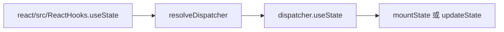

原因：

- `react` 包不知道当前组件是首次渲染还是更新。
- `react-reconciler` 在执行函数组件前，会设置 `ReactSharedInternals.H`。
- mount 时 `H = HooksDispatcherOnMount`。
- update 时 `H = HooksDispatcherOnUpdate`。

## 2. renderWithHooks 做了什么

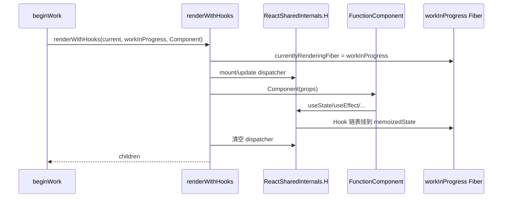

`renderWithHooks` 是 Hooks 能运行的关键环境。

## 3. Hook 链表长什么样

一个组件：

```tsx
function Counter() {
  const [count, setCount] = useState(0)
  const ref = useRef(null)
  useEffect(() => {}, [count])
  return <button>{count}</button>
}
```

Fiber 上的 Hook 链表：

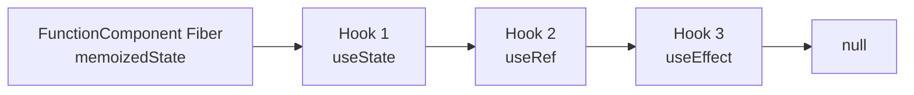

每个 Hook 节点大致有：

```ts
{
  memoizedState,
  baseState,
  baseQueue,
  queue,
  next
}
```

不同 Hook 用这些字段保存不同内容：

| Hook | memoizedState 保存什么 |
| --- | --- |
| `useState` | 当前 state |
| `useReducer` | 当前 state |
| `useRef` | `{ current }` 对象 |
| `useMemo` | `[value, deps]` |
| `useCallback` | `[callback, deps]` |
| `useEffect` | effect 节点 |

## 4. 为什么 Hooks 不能写在 if 里

React 更新时不是按变量名找 Hook，而是按顺序找。

```tsx
function Demo({ ok }) {
  const a = useState(1)
  if (ok) {
    const b = useState(2)
  }
  const c = useState(3)
}
```

如果第一次 `ok = true`，链表是：

```txt
a -> b -> c
```

第二次 `ok = false`，调用顺序变成：

```txt
a -> c
```

React 会把第二个 Hook 当成旧的 `b`，状态就错位了。

所以规则是：

- Hook 必须在函数组件顶层调用。
- 每次 render 调用数量和顺序必须一致。

## 5. useState 的 mount 流程

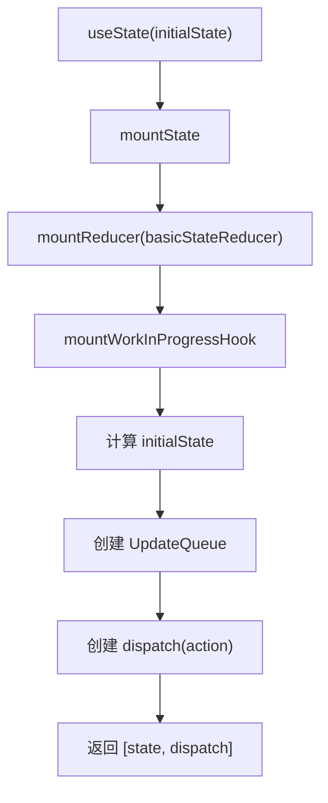

关键源码点：

- `mountWorkInProgressHook` 创建 Hook 节点。
- `hook.memoizedState` 保存当前 state。
- `queue.pending` 保存后续更新。
- `dispatch` 闭包记住当前 Fiber 和 queue。

## 6. setState 不会立刻改 state

调用：

```ts
setCount(count + 1)
```

实际流程：

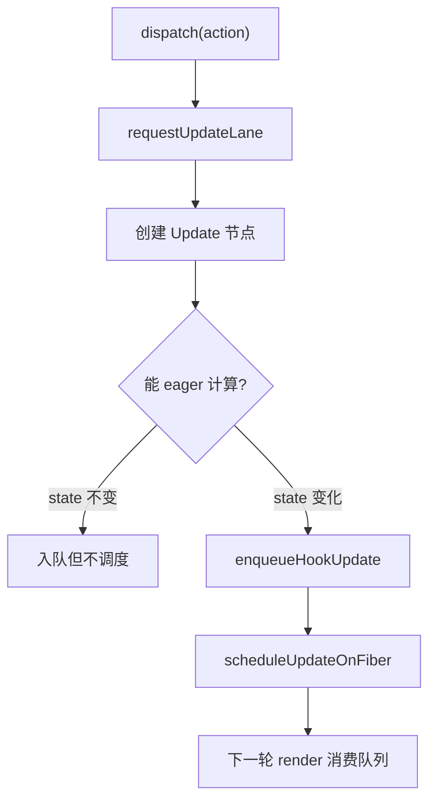

小白版解释：

- `setState` 只是把 action 放进队列。
- 真正的新 state 在下一次 render 的 `updateReducer` 中计算。
- 如果 eager 计算发现 state 没变，可以跳过调度。

## 7. 更新队列为什么是环形链表

`queue.pending` 指向最后一个 update。

第一次 setState：

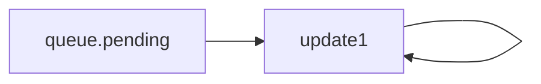

第二次 setState：

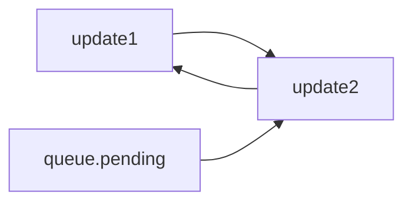

优点：

- O(1) 插入新 update。
- 从 `pending.next` 可以找到第一个 update。
- 多次 setState 可以按顺序重放。

## 8. useReducer 和 useState 的关系

`useState` 等价于内置 reducer：

```ts
function basicStateReducer(state, action) {
  return typeof action === "function" ? action(state) : action
}
```

所以：

```ts
setCount(1)
setCount((prev) => prev + 1)
```

都会被当成 action，交给 reducer 算出新 state。

## 9. useMemo 的实现

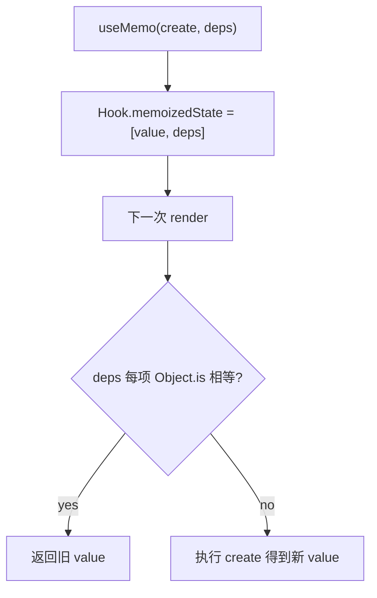

注意：

- `useMemo` 不是语义保证，只是性能缓存。
- deps 不传或变化，都会重新计算。
- deps 相等时，`create` 不执行。

## 10. useCallback 的实现

`useCallback(fn, deps)` 本质就是：

```ts
useMemo(() => fn, deps)
```

缓存的是函数引用。

常见用途：

- 传给子组件，避免子组件因为函数引用变化而重渲染。
- 作为 `useEffect` 依赖时保持稳定引用。

## 11. useRef 的实现

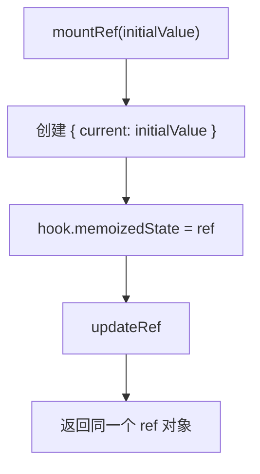

特点：

- `ref.current` 改变不会触发 render。
- ref 对象跨 render 保持同一个引用。
- 适合保存 DOM、定时器 id、上一次值等。

## 12. useEffect 的实现

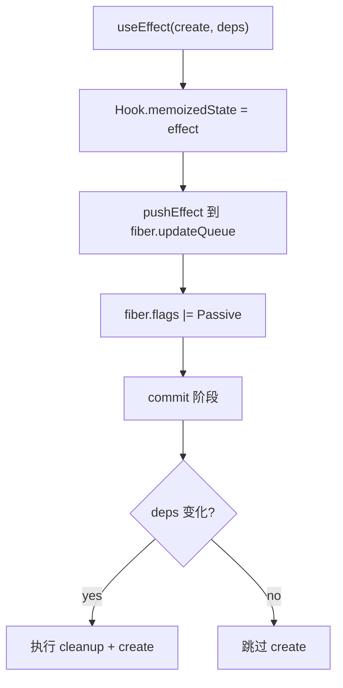

effect 节点保存：

```ts
{
  tag,
  create,
  destroy,
  deps,
  next
}
```

关键点：

- `create` 不在 render 阶段执行。
- render 阶段只登记 effect。
- commit 阶段才执行 effect。
- deps 不变时不带 `HasEffect`，commit 时不会重新执行。

## 13. useLayoutEffect 和 useInsertionEffect

复刻版实现：

- `useLayoutEffect` 走 `Layout` effect tag。
- `useInsertionEffect` 走 `Insertion` effect tag。
- 没有对应 dispatcher 时降级为普通 effect。

概念区别：

| Hook | 什么时候用 |
| --- | --- |
| `useEffect` | 浏览器绘制后做副作用，如请求、订阅 |
| `useLayoutEffect` | DOM 更新后、绘制前读取布局或同步改布局 |
| `useInsertionEffect` | CSS-in-JS 插入样式，早于 layout effect |

## 14. useImperativeHandle

它基于 layout effect 实现：

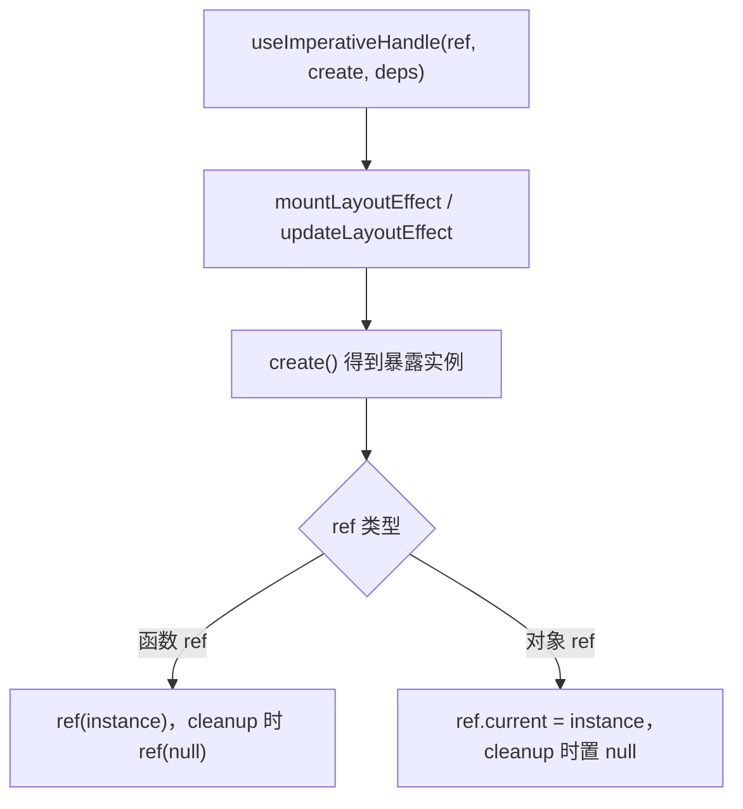

用途：

- 配合 `forwardRef`。
- 不把内部 DOM 全暴露给父组件，只暴露少量方法。

## 15. useTransition 和 useDeferredValue

复刻版保留了 API 结构：

- `useTransition` 返回 `[false, start]`，`start(callback)` 同步执行。
- `useDeferredValue` 返回 `initialValue ?? value`，更新时返回最新 value。

完整 React 中：

- transition 会分配低优先级 lane。
- deferred value 会让某些更新延后，保证输入等高优先级交互更流畅。

## 16. useId

复刻版：

```ts
const id = `:r${localIdCounter++}:`
```

完整 React 中更复杂，因为它要保证：

- 服务端渲染和客户端 hydration id 一致。
- 同一棵树不同位置 id 稳定。
- Suspense/并发渲染下也不会冲突。

## 17. useSyncExternalStore

用途：

- 订阅 React 外部的数据源。
- 例如 Redux store、自定义 event emitter、浏览器状态。

完整思路：

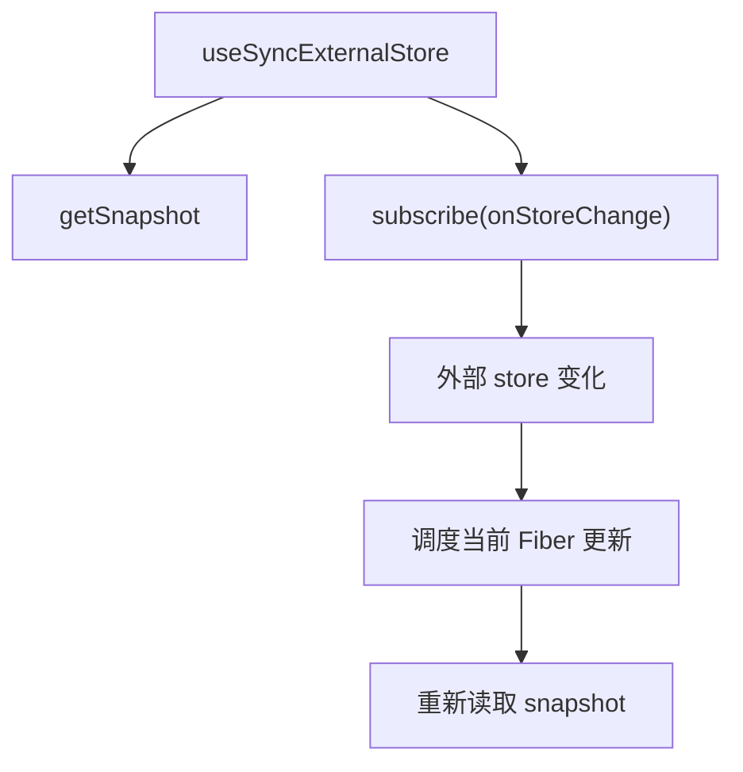

复刻版实现了简化兜底：订阅后立即取消，只读取一次 snapshot；dispatcher 存在时交给 reconciler 实现。

## 18. Hooks 调用图

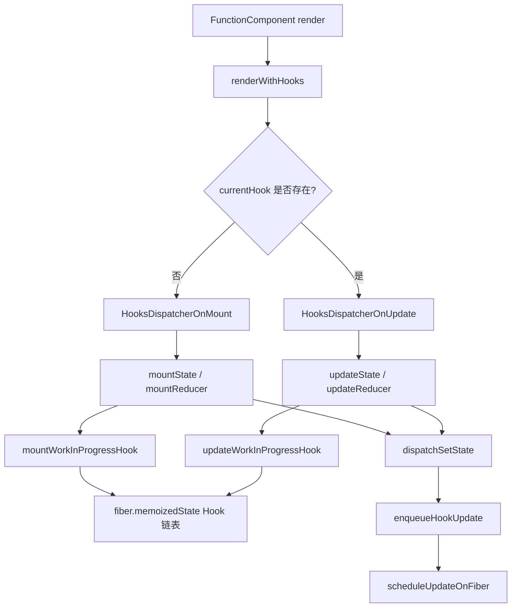

## 19. 初学者检查清单

读源码时按这几个问题检查自己是否理解：

1. `react/src/ReactHooks.ts` 为什么不直接实现 `useState`？
2. `renderWithHooks` 什么时候切换 mount/update dispatcher？
3. Hook 为什么用链表，而不是按变量名存 Map？
4. `setState` 为什么不立刻修改 `hook.memoizedState`？
5. `queue.pending` 为什么是环形链表？
6. `useMemo` 和 `useCallback` 的 deps 是怎么比较的？
7. `useEffect` 为什么要等 commit 阶段执行？
