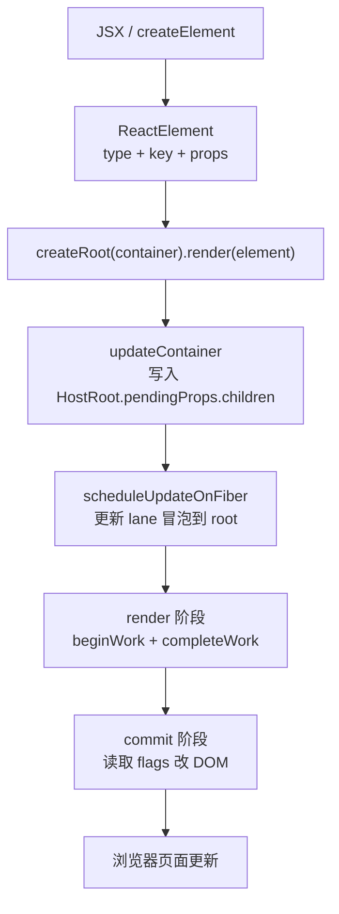
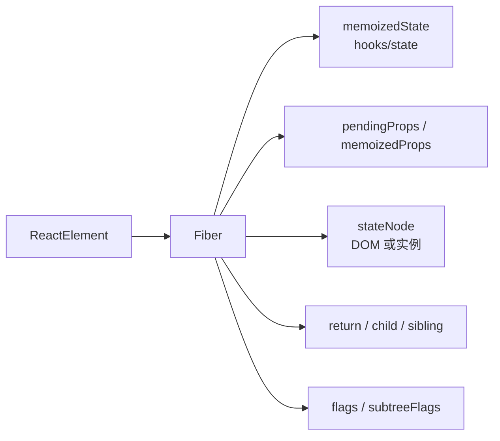
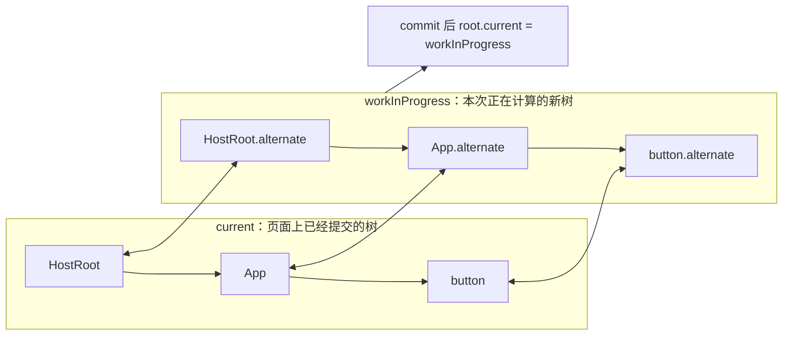
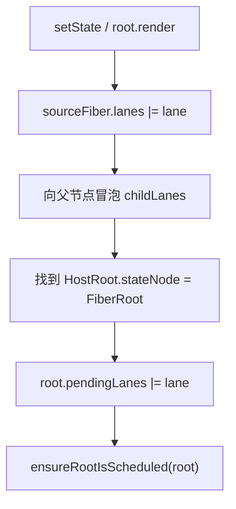
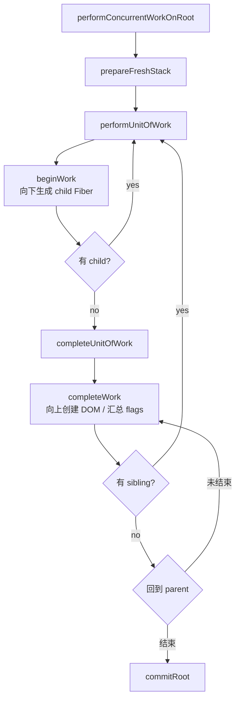
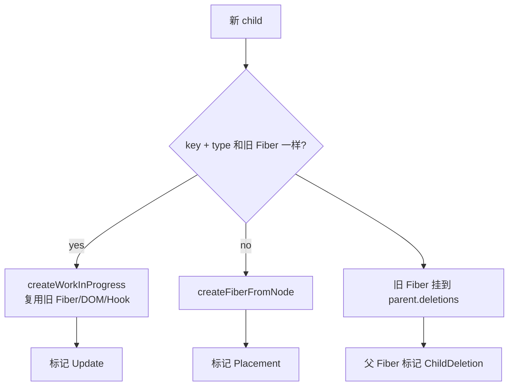
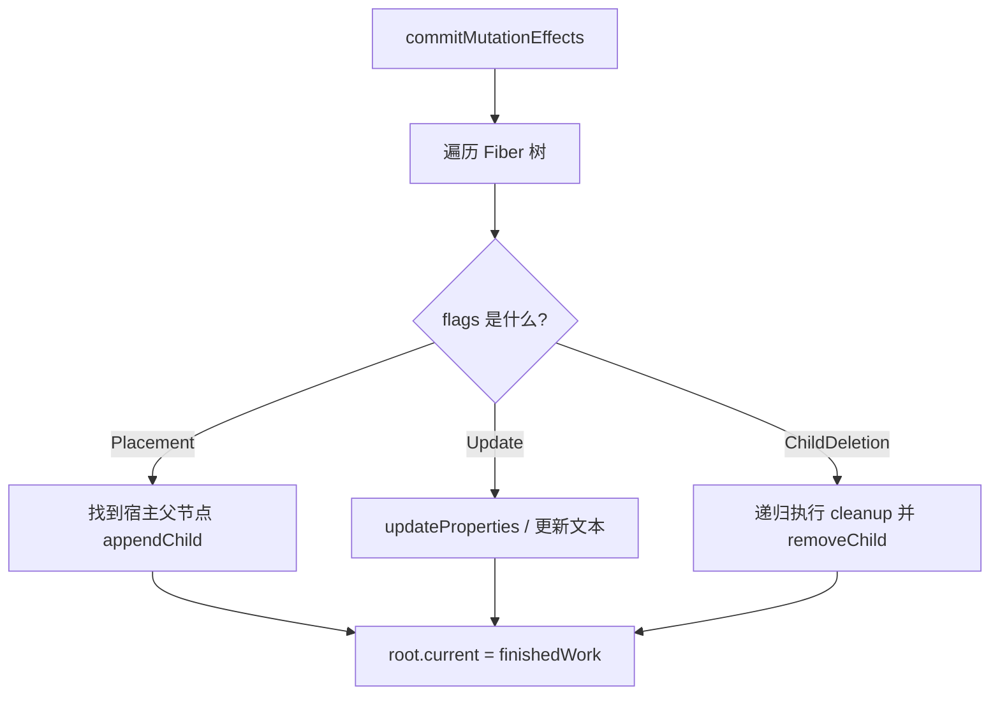
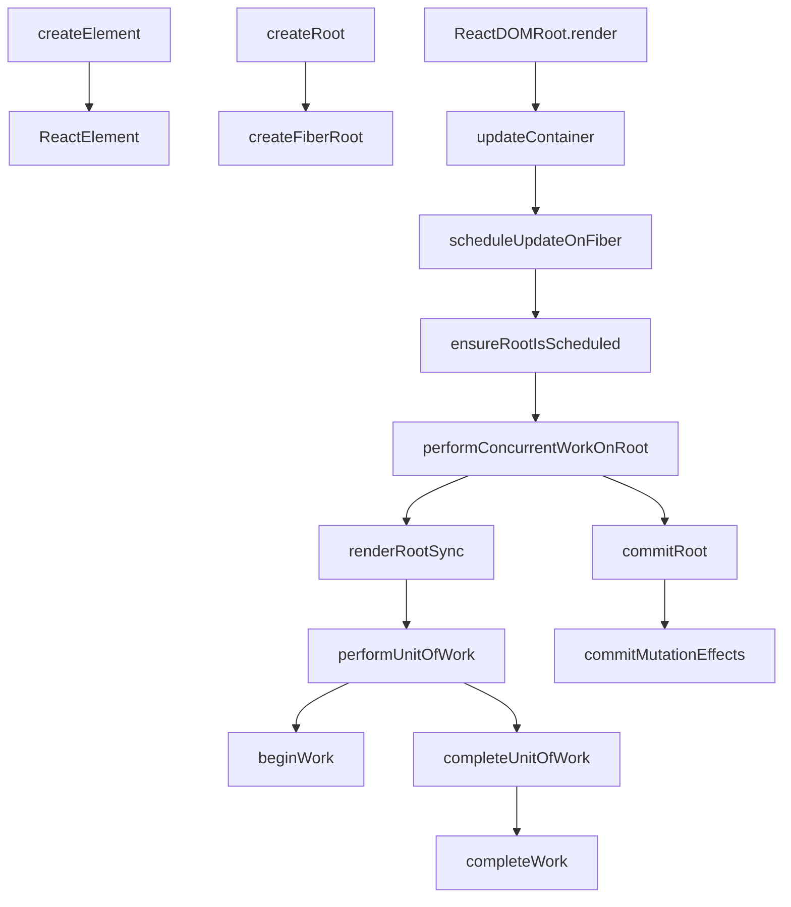

# React 渲染原理小白图解

对应源码目录：

```txt
react-source/packages
```

这篇文档按“一个按钮是怎么出现在页面上”的顺序读 React 复刻版源码。先记住一句话：

> React 不是直接把 JSX 变成 DOM，而是先变成 ReactElement，再变成 Fiber 树，最后在 commit 阶段统一改 DOM。

## 1. 总流程图



入口源码：

- `react-source/packages/react/src/jsx/ReactJSXElement.ts`
- `react-source/packages/react-dom/src/client/ReactDOMRoot.ts`
- `react-source/packages/react-reconciler/src/ReactFiberWorkLoop.ts`

## 2. JSX 先变成普通对象

示例：

```tsx
<button className="primary">Click</button>
```

会变成类似：

```ts
createElement("button", { className: "primary" }, "Click")
```

复刻版的核心对象长这样：

```ts
{
  $$typeof: REACT_ELEMENT_TYPE,
  type: "button",
  key: null,
  props: {
    className: "primary",
    children: "Click"
  }
}
```

关键点：

- `ReactElement` 不是 DOM。
- `type` 决定后续 Fiber 类型。
- `key` 只给调和使用，不进入 `props`。
- `props.children` 保存子节点。

## 3. createRoot 做了什么

```ts
const root = createRoot(document.getElementById("app")!)
root.render(<App />)
```

调用图：

```mermaid
sequenceDiagram
  participant User as 用户代码
  participant DOMRoot as ReactDOMRoot
  participant Root as FiberRoot
  participant Loop as WorkLoop

  User->>DOMRoot: createRoot(container)
  DOMRoot->>Root: createFiberRoot(container)
  DOMRoot->>DOMRoot: markContainerAsRoot
  DOMRoot->>DOMRoot: listenToAllSupportedEvents
  User->>DOMRoot: root.render(element)
  DOMRoot->>Loop: updateContainer(element, fiberRoot)
```

`ReactDOMRoot` 是给用户用的外壳，真正的运行时根是 `FiberRoot`。

## 4. Fiber 是什么

可以把 Fiber 理解成 React 内部的“工作单元”。

ReactElement 只描述“想要什么”，Fiber 还记录“现在做到哪了、旧节点是什么、要不要插入/更新/删除”。



Fiber 的树形关系不是数组，而是三根指针：

- `child`：第一个子节点。
- `sibling`：下一个兄弟节点。
- `return`：父节点。

## 5. 双缓存：current 和 workInProgress



为什么要双缓存：

- 旧树不能在 render 阶段被直接改坏，因为 render 可能失败或被丢弃。
- 新树算完后一次性 commit，页面状态才切换。
- 下次更新可以复用旧对象、DOM、Hook 队列。

## 6. 更新如何调度到 root

当你调用 `setState` 或 `root.render`：



小白版解释：

- `lane` 是更新优先级标签。
- 当前节点记录“我有更新”。
- 父节点记录“我的子树有更新”。
- 根节点记录“整个应用有待处理工作”。

## 7. render 阶段：只计算，不改页面

render 阶段由 `ReactFiberWorkLoop.ts` 驱动。



`beginWork` 做什么：

- `HostRoot`：读取根 element。
- `FunctionComponent`：执行函数组件，处理 Hooks。
- `HostComponent`：处理 DOM 标签的 children。
- `Fragment`、`Context`、`Suspense` 等：按各自规则生成 child Fiber。

`completeWork` 做什么：

- 首次渲染 DOM 标签时创建真实 DOM。
- 把子 DOM 挂到父 DOM。
- 汇总子树 `flags` 和 `childLanes`。
- 保存 `memoizedProps`，给下次 diff 用。

## 8. 调和：为什么 key 很重要

`ReactChildFiber.ts` 负责 children diff。



小白版规则：

- 同一层对比。
- `key` 和 `type` 都一样，才复用。
- 不一样就创建新 Fiber，旧 Fiber 进入删除列表。
- DOM 不在这里改，只打 `flags`。

## 9. commit 阶段：真正改 DOM

`ReactFiberCommitWork.ts` 负责把 flags 转成 DOM 操作。



为什么不在 render 阶段直接改 DOM：

- render 阶段可能被中断或失败。
- commit 阶段必须短、同步、不可中断。
- 统一 commit 可以保证页面一次性从旧状态切到新状态。

## 10. 方法调用图



## 11. 建议阅读顺序

1. `packages/react/src/jsx/ReactJSXElement.ts`
2. `packages/react-dom/src/client/ReactDOMRoot.ts`
3. `packages/react-reconciler/src/ReactFiber.ts`
4. `packages/react-reconciler/src/ReactFiberRoot.ts`
5. `packages/react-reconciler/src/ReactFiberWorkLoop.ts`
6. `packages/react-reconciler/src/ReactFiberBeginWork.ts`
7. `packages/react-reconciler/src/ReactChildFiber.ts`
8. `packages/react-reconciler/src/ReactFiberCompleteWork.ts`
9. `packages/react-reconciler/src/ReactFiberCommitWork.ts`
