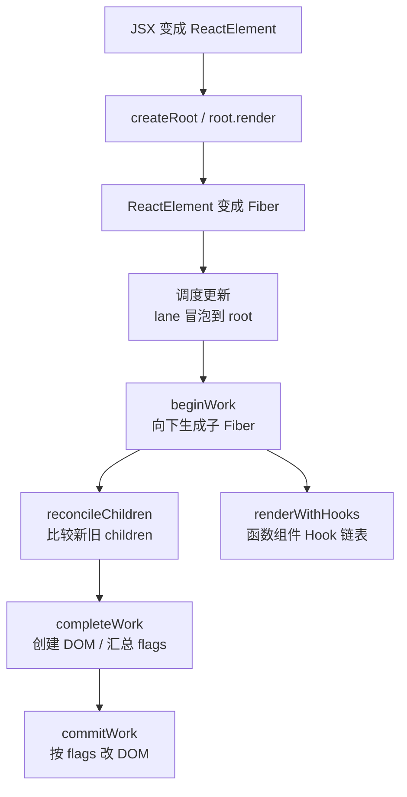
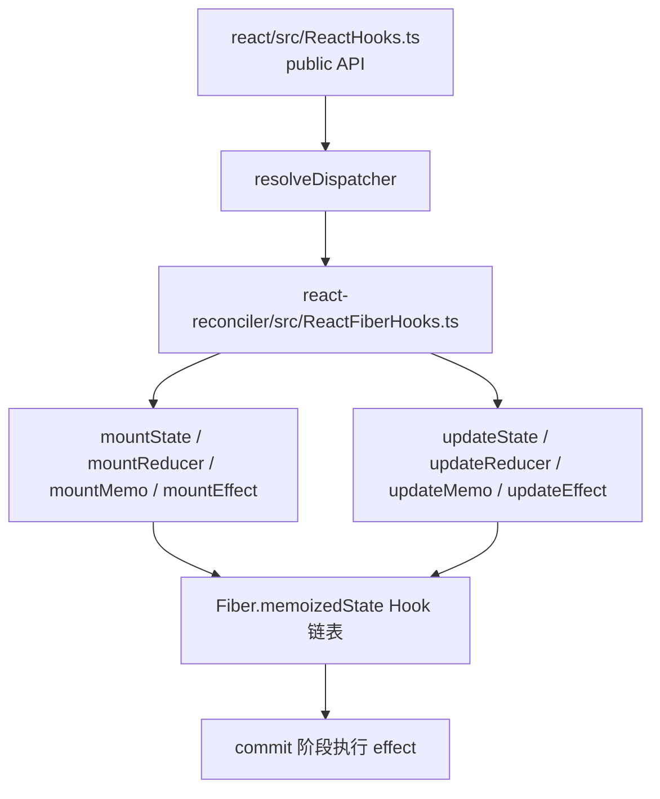
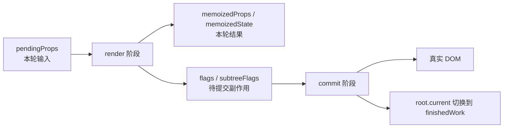
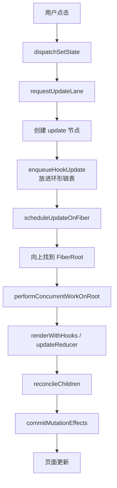

# React 复刻版源码注释阅读地图

这份文档配合 `react-source/packages` 里的 `@beginner` 中文注释一起看。

源码里新增的注释分两类：

- `@beginner-module`：文件头说明，先告诉你这个文件在 React 架构里负责什么。
- `@beginner`：靠近代码的近行解释，解释 import、函数入口、类型、变量、分支、循环、返回值等。

读源码时不要从所有文件一起读，先按主链路走一遍。

## 1. 小白阅读总路线

## 2. 主流程文件对照

| 阶段 | 文件 | 小白先看什么 |
| --- | --- | --- |
| JSX | `packages/react/src/jsx/ReactJSXElement.ts` | `createElement` 怎么收集 `type/key/props/children` |
| Root | `packages/react-dom/src/client/ReactDOMRoot.ts` | `createRoot` 为什么只创建根，不直接渲染 DOM |
| Fiber | `packages/react-reconciler/src/ReactFiber.ts` | `FiberNode` 字段、`createFiberFromElement`、`createWorkInProgress` |
| 调度 | `packages/react-reconciler/src/ReactFiberWorkLoop.ts` | `scheduleUpdateOnFiber`、`renderRootSync`、`commitRoot` |
| 向下 | `packages/react-reconciler/src/ReactFiberBeginWork.ts` | `beginWork` 怎么按 `tag` 分发 |
| Diff | `packages/react-reconciler/src/ReactChildFiber.ts` | `key + type` 如何决定复用、插入、删除 |
| 向上 | `packages/react-reconciler/src/ReactFiberCompleteWork.ts` | DOM 创建和 `subtreeFlags` 汇总 |
| 提交 | `packages/react-reconciler/src/ReactFiberCommitWork.ts` | `Placement/Update/ChildDeletion` 如何变成 DOM 操作 |
| Hooks | `packages/react-reconciler/src/ReactFiberHooks.ts` | Hook 链表、更新队列、deps 比较、effect 登记 |

## 3. 常用 Hooks 源码入口

| Hook | mount 入口 | update 入口 | 核心原理 |
| --- | --- | --- | --- |
| `useState` | `mountState` | `updateState` | 内置 reducer，`setState` 入队后调度下一轮 render |
| `useReducer` | `mountReducer` | `updateReducer` | reducer 重放 update 队列，算出新 state |
| `useRef` | `mountRef` | `updateRef` | 返回稳定对象，改 `.current` 不调度更新 |
| `useMemo` | `mountMemo` | `updateMemo` | 保存 `[value, deps]`，deps 不变直接复用 |
| `useCallback` | `mountCallback` | `updateCallback` | 本质是 `useMemo(() => callback, deps)` |
| `useEffect` | `mountEffect` | `updateEffect` | render 阶段登记 effect，commit 后执行 |
| `useLayoutEffect` | `mountLayoutEffect` | `updateLayoutEffect` | 和 effect 同结构，但标记为 layout |
| `useTransition` | `mountTransition` | `updateTransition` | 复刻版保留 API，完整 React 会分配 transition lane |
| `useDeferredValue` | `mountDeferredValue` | `updateDeferredValue` | 复刻版直接返回值，完整 React 会降低更新优先级 |
| `useId` | `mountId` | `updateId` | 复刻版用本地计数生成 id |

## 4. 读 `@beginner` 注释时的关键概念

- 看到 `pendingProps`：理解成“这次 render 收到的新输入”。
- 看到 `memoizedProps`：理解成“上次已经算完并记住的输入”。
- 看到 `memoizedState`：函数组件里通常是 Hook 链表。
- 看到 `updateQueue`：通常是 setState 队列或 effect 队列。
- 看到 `flags`：render 阶段打的标记，commit 阶段真正执行。
- 看到 `lanes`：更新优先级，决定什么时候处理。
- 看到 `alternate`：双缓存里的另一棵 Fiber 树。

## 5. 一次点击 setState 的完整调用图

## 6. 建议读法

1. 先读文件头的模块说明，知道这个文件属于哪一层。
2. 再沿着 `@beginner` 看函数入口和分支，不要急着理解每个类型细节。
3. 读 Hooks 时只盯住三件事：Hook 链表、update 队列、deps 比较。
4. 读渲染时只盯住三件事：beginWork 生成子 Fiber，completeWork 创建/汇总，commitWork 改 DOM。
5. 类型定义、feature flag、fork 文件可以最后读，它们更多是为了兼容官方 React 结构。
