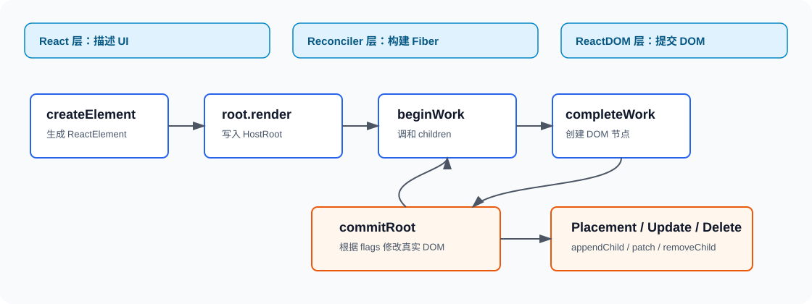
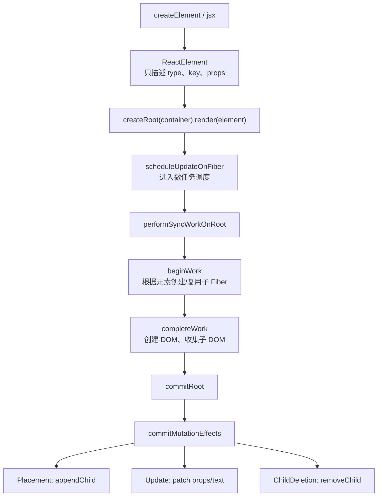
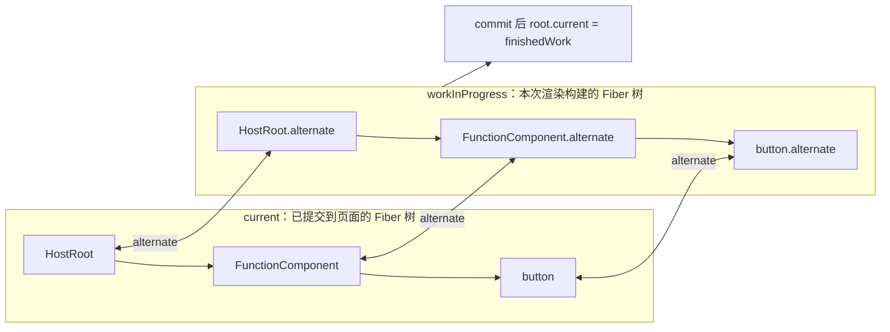
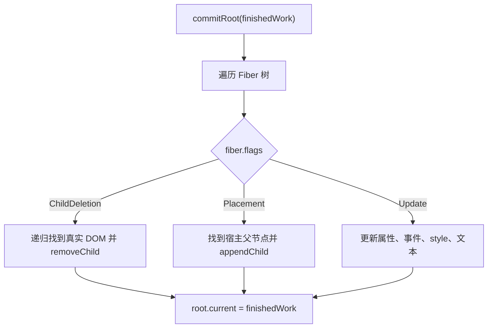
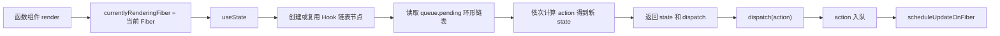

# React TypeScript 源码复刻

源码目录：`/Users/nwyzx/Desktop/project/source/front_basic/react-source`

这份实现参考本地 React 源码目录 `/Users/nwyzx/Desktop/project/source/react` 的核心分层，按官方 `packages/*` 包名和源码文件名组织 TypeScript 版本。根工程包名保留为 `@front/react-source`，子包目录名保持官方一致。



配套精读文档：

- [React 复刻版源码注释阅读地图](./react-source-comment-map.md)
- [React 源码注释逐文件审查表](./react-source-comment-audit.md)
- [React 渲染原理小白图解](./react-render-flow-beginner.md)
- [React Hooks 实现原理小白图解](./react-hooks-deep-dive.md)

| 本实现 | 参考 React 源码文件 | 作用 |
| --- | --- | --- |
| `packages/react/src/jsx/ReactJSXElement.ts` | `packages/react/src/jsx/ReactJSXElement.js` | 创建 ReactElement 描述对象 |
| `packages/react-reconciler/src/ReactFiber.ts` | `packages/react-reconciler/src/ReactFiber.js` | Fiber 节点、双缓存 |
| `packages/react-reconciler/src/ReactFiberRoot.ts` | `packages/react-reconciler/src/ReactFiberRoot.js` | FiberRoot |
| `packages/react-reconciler/src/ReactChildFiber.ts` | `packages/react-reconciler/src/ReactChildFiber.js` | 子节点调和、标记插入/删除/更新 |
| `packages/react-reconciler/src/ReactFiberWorkLoop.ts` | `packages/react-reconciler/src/ReactFiberWorkLoop.js` | render/commit 调度主循环 |
| `packages/react-reconciler/src/ReactFiberBeginWork.ts` | `packages/react-reconciler/src/ReactFiberBeginWork.js` | beginWork |
| `packages/react-reconciler/src/ReactFiberCompleteWork.ts` | `packages/react-reconciler/src/ReactFiberCompleteWork.js` | completeWork |
| `packages/react-reconciler/src/ReactFiberCommitWork.ts` | `packages/react-reconciler/src/ReactFiberCommitWork.js` | commit 阶段 DOM 变更 |
| `packages/react-reconciler/src/ReactFiberHooks.ts` | `packages/react-reconciler/src/ReactFiberHooks.js` | `useState` 与 Hook 更新队列 |
| `packages/scheduler/src/forks/Scheduler.ts` | `packages/scheduler/src/forks/Scheduler.js` | 调度入口 |
| `packages/react-dom-bindings/src/client/ReactDOMComponent.ts` | `packages/react-dom-bindings/src/client/ReactDOMComponent.js` | DOM 属性、事件、样式处理 |

## 任务拆分

1. 建立 `react-source` 独立 TS 工程，并加入根 `pnpm-workspace.yaml`。
2. 在 `react-source/pnpm-workspace.yaml` 中声明内部 `packages/*`。
3. 按官方包名补齐 client/runtime 核心包，排除服务端渲染、DevTools、测试/fixture 包。
4. 按官方源码文件名补齐纳入包的 TS 文件；当前文件名对齐检查为 `MISSING_COUNT=0`。
5. 实现 ReactElement、Dispatcher、Fiber、Lane、Scheduler、DOM bindings、render/commit、`useState` 主链路。
6. 对关键流程补中文注释和流程图，并用 `tsc` 与 smoke 验证。

## 整体流程图



关键点：

- `createElement` 不渲染 DOM，只创建普通对象。
- `render` 会把 element 放到 HostRoot 的 `pendingProps.children`。
- render 阶段只计算 Fiber 树和 flags，不直接改页面。
- commit 阶段一次性把 flags 转换成 DOM 操作。

## Fiber 双缓存



源码里的关键注释在 `src/reconciler/Fiber.ts`：

- `current` 是当前页面对应的 Fiber。
- `alternate` 是正在计算的新 Fiber。
- 提交完成后，`root.current` 指向新树；旧树变成下次更新可复用的 alternate。

这种结构让状态、DOM 节点和 Hook 队列可以被复用，避免每次更新都重新创建完整运行时对象。

## Render 阶段

`performSyncWorkOnRoot` 是 render 阶段入口：

1. 从 `root.current` 创建 workInProgress 根节点。
2. 循环执行 `performUnitOfWork`。
3. 每个 Fiber 先执行 `beginWork`，再在回溯时执行 `completeWork`。
4. render 阶段结束后，把 `root.finishedWork` 指向构建完成的新树。

```mermaid
sequenceDiagram
  participant Root as FiberRoot
  participant Loop as WorkLoop
  participant Begin as beginWork
  participant Complete as completeWork
  participant Commit as commitRoot

  Root->>Loop: performSyncWorkOnRoot(root)
  Loop->>Begin: 处理当前 Fiber
  Begin-->>Loop: 生成 child/sibling
  Loop->>Complete: 子树完成后回溯
  Complete-->>Loop: 创建 DOM / 保存 memoizedProps
  Loop->>Commit: root.finishedWork 准备完成
```

`beginWork` 做“向下展开”：

- HostRoot：读取 `pendingProps.children`。
- FunctionComponent：调用函数组件，并通过 `renderWithHooks` 准备 Hook 环境。
- HostComponent / Fragment：继续调和 children。
- HostText：没有子节点，直接结束。

`completeWork` 做“向上归并”：

- HostComponent：首次渲染时创建真实 DOM，应用初始属性，并收集子 DOM。
- HostText：创建文本节点。
- 其他 Fiber：保存 `memoizedProps`，供下次 diff 使用。

## 调和与 flags

`src/reconciler/ReactChildFiber.ts` 负责把新 children 和旧 Fiber 子链表对比：

- 类型和 key 相同：复用旧 Fiber，标记 `Update`。
- 新 child 存在但旧 Fiber 不可复用：创建新 Fiber，标记 `Placement`。
- 旧 Fiber 多出来或类型不同：放入父 Fiber 的 `deletions`，父 Fiber 标记 `ChildDeletion`。

当前版本采用同层顺序对比，适合讲清主流程。真实 React 会处理更完整的 key diff、移动节点、Lane 优先级、Suspense 等复杂场景。

## Commit 阶段

Commit 阶段集中在 `src/reconciler/ReactFiberCommitWork.ts`：



这里故意把 DOM 操作延迟到 commit，原因是 render 阶段可能被打断或丢弃。真实 React 的并发模式中，只有 commit 阶段才必须同步且不可中断。

## useState 与更新队列

`src/reconciler/ReactFiberHooks.ts` 实现了一个简化 Hook 系统：



Hook 的关键约束：

- Hook 按调用顺序挂在 `fiber.memoizedState` 链表上。
- 更新时从 `alternate.memoizedState` 克隆旧 Hook。
- `setState` 不立刻改 `memoizedState`，而是把 action 放入 queue。
- 下一次 render 时统一消费 queue，这样连续多次 `setState` 可以按顺序合并。

## DOM 属性与事件

`src/react-dom/domOperations.ts` 处理宿主环境细节：

- `onClick`、`onInput` 等事件会转换为 `addEventListener`。
- `style` 对象会按 key diff，多余样式会清空。
- `className` 会映射为 `class`。
- `null`、`undefined`、`false` 会删除属性。
- 文本节点更新走 `nodeValue`。

## 使用方式

```ts
import { createElement, createRoot, useState } from "@front/react-source";

function Counter() {
  const [count, setCount] = useState(0);

  return createElement(
    "button",
    {
      className: "counter",
      onClick: () => setCount((value) => value + 1),
    },
    `count: ${count}`,
  );
}

createRoot(document.getElementById("app")!).render(createElement(Counter, null));
```

如果使用 TSX，可以配置：

```json
{
  "compilerOptions": {
    "jsx": "react-jsx",
    "jsxImportSource": "@front/react-source"
  }
}
```

## 当前边界

这份源码用于理解 React 主干机制，不覆盖完整 React 能力：

- 未实现 class component、context、ref、effect、memo、Suspense。
- 未实现 Lane 优先级和真正可中断时间切片。
- children diff 是顺序对比，未实现完整 key 移动算法。
- DOM hydration、服务端渲染、合成事件系统未覆盖。
