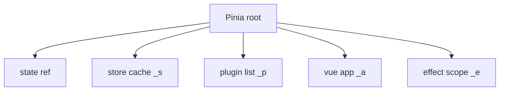
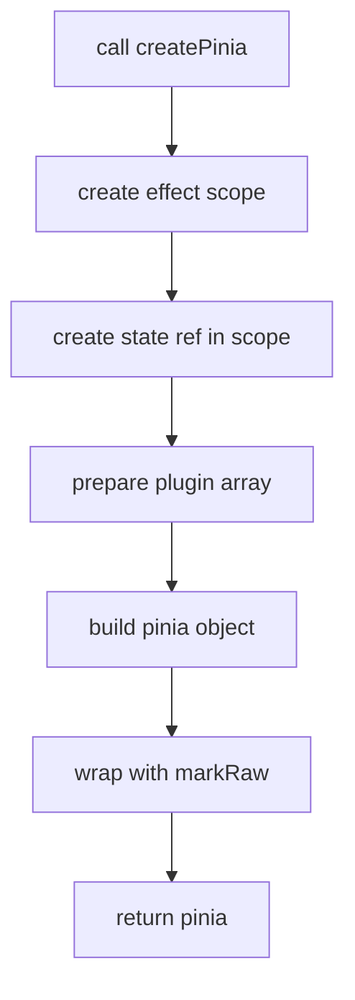
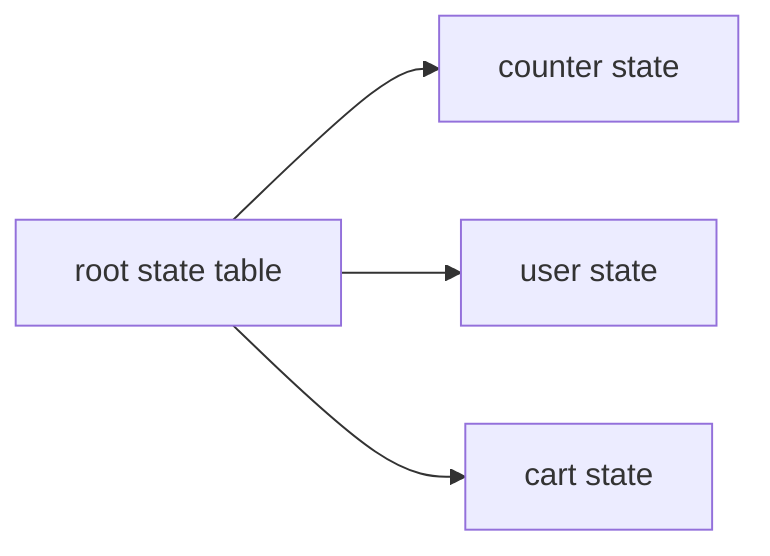
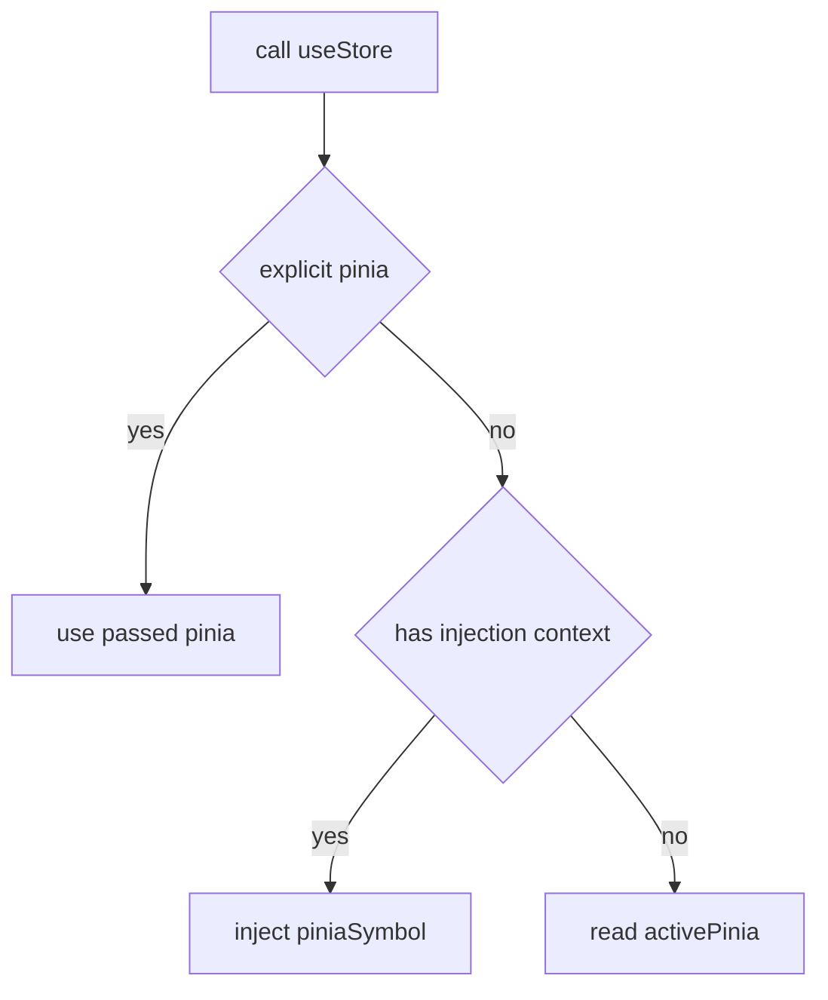
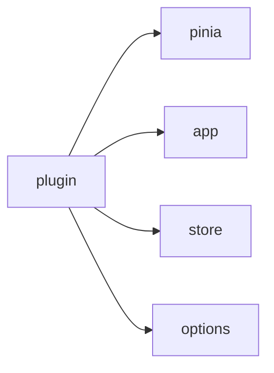
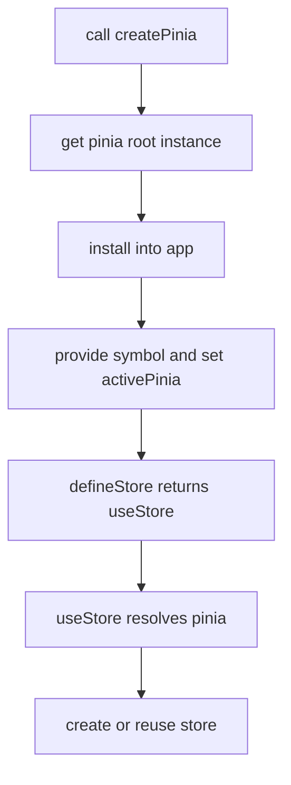

# createPinia 与 rootStore：根实例、注入、activePinia

这一篇对应两个文件：

- `pinia-source/packages/pinia/src/createPinia.ts`
- `pinia-source/packages/pinia/src/rootStore.ts`

它们负责解决三个基础问题：

1. Pinia 根实例怎么创建
2. Pinia 怎么挂到 Vue app 上
3. `useStore()` 不显式传 pinia 时，当前 pinia 从哪里来

---

## 1. 先看结论

Pinia 在这套实现里，本质上就是一个“根容器对象”。

这个根容器里最重要的 4 个字段是：

- `state`
  根状态树，所有 store 的原始 state 都挂这里
- `_s`
  store 实例缓存表，key 是 store id，value 是 store 实例
- `_p`
  插件列表
- `_a`
  当前安装到的 Vue app

可以先把它理解成下面这个结构：

---

## 2. `createPinia()` 做了什么

源码位置：

- `createPinia.ts`

核心流程：

### 2.1 为什么先建 `effectScope`

Pinia 自己也有响应式资源，比如：

- 根状态 `state`
- 后续一些 watcher 或副作用

把它们放进独立 `effectScope` 的好处是，后面可以通过 `disposePinia()` 一次性 stop。

所以这里的思路不是“先有 state 再说”，而是：

先有可管理的响应式作用域，再把 state 放进去。

### 2.2 为什么 `state` 是 `Ref<Record<string, StateTree>>`

因为 Pinia 不是“每个 store 自己管自己的一小块 state”，而是统一挂在：

`pinia.state.value[storeId]`

这意味着：

- 你可以从 Pinia 根上看到所有 store 的原始状态
- store 实例上的 `count`、`name` 这类字段，本质只是对这棵根状态树做代理访问

可以把它理解成：

### 2.3 为什么 `pinia` 要 `markRaw()`

因为 `pinia` 是一个“框架级控制对象”，不是业务状态对象。

如果让它继续被 Vue 代理：

- 会带来额外依赖追踪
- 读取 `_s`、`_p` 这类内部字段没有意义
- 还可能让调试时对象层级更混乱

所以 Pinia 实例本身保持原始对象，真正响应式的是它内部的 `state`。

---

## 3. `install(app)` 做了什么

源码位置：

- `createPinia.ts`

`app.use(pinia)` 时，会调用 `pinia.install(app)`。

这个方法只做了 4 件事：

1. `setActivePinia(pinia)`
2. `pinia._a = app`
3. `app.provide(piniaSymbol, pinia)`
4. `app.config.globalProperties.$pinia = pinia`

### 3.1 `setActivePinia(pinia)`

这是给“组件外部调用 store”提供兜底。

比如某些场景下：

- 在普通模块里调用 `useStore()`
- 在测试环境里直接创建 store

这时未必有组件实例，也未必有 `inject()` 上下文，所以要有一个全局当前 pinia。

### 3.2 `pinia._a = app`

后续 plugin context 里会把 app 暴露给插件。

所以这里记录的是：

“这个 Pinia 当前装在哪个 Vue app 上”

### 3.3 `provide(piniaSymbol, pinia)`

这是组件树内最标准的获取方式：

- 上游 `provide`
- 下游 `inject`

之后组件 `setup()` 里调用 `useStore()`，就能通过 `inject(piniaSymbol)` 找到 pinia。

### 3.4 `globalProperties.$pinia`

这一步主要是为了 Options API。

在组合式 API 里，一般不直接依赖它；但在某些老代码或组件实例方法里，`this.$pinia` 是个常见入口。

---

## 4. `rootStore.ts` 负责什么

这个文件的角色不是“管理 store 数据”，而是“管理 Pinia 的全局访问入口”。

最关键的几个符号是：

- `activePinia`
- `setActivePinia()`
- `getActivePinia()`
- `piniaSymbol`

---

## 5. `activePinia` 的原理

`activePinia` 是一个全局变量。

它解决的问题是：

> 当当前没有组件注入上下文时，`useStore()` 还能不能找到 pinia？

流程如下：

所以 `activePinia` 是兜底，不是唯一来源。

优先级大致是：

1. 显式传入的 pinia
2. `inject(piniaSymbol)`
3. `activePinia`

---

## 6. `getActivePinia()` 为什么还要结合 `inject()`

因为 Pinia 既支持：

- 组件内调用
- 组件外调用

组件内调用时，最稳定的来源是注入上下文；
组件外调用时，最稳定的来源是全局 `activePinia`。

所以 `getActivePinia()` 不是简单返回全局变量，而是：

先尝试 `inject()`，再回退到 `activePinia`。

---

## 7. `piniaSymbol` 是什么

`piniaSymbol` 是注入 key。

它本质上就是：

- `provide` 时的 key
- `inject` 时的 key

为什么不用字符串？

因为 `Symbol` 更安全：

- 不容易和别的 key 冲突
- 内部实现更明确

---

## 8. `PiniaPluginContext` 为什么要有这些字段

当前实现里 plugin context 暴露的是：

- `pinia`
- `app`
- `store`
- `options`

这 4 个字段对应 4 个插件常见诉求：

- 需要访问整个 Pinia 根实例
- 需要访问 Vue app
- 需要往 store 实例上挂扩展字段
- 需要读 store 的定义配置

也就是说，插件执行时的上下文是：

---

## 9. 这两个文件和 `store.ts` 怎么衔接

你可以把它们理解成“store.ts 的前置基础设施”。

- `createPinia.ts`
  先创建根容器
- `rootStore.ts`
  提供全局访问 pinia 的方式
- `store.ts`
  真正创建具体 store 实例，并把实例接到根容器上

关系如下：

---

## 10. 读完这一篇后你应该已经清楚

- Pinia 根实例不是状态本身，而是状态容器
- `pinia.state.value` 才是所有 store 原始数据的总表
- `activePinia` 是组件外调用时的兜底入口
- `provide/inject` 是组件内调用时的主入口
- plugin 不是在 `pinia.use()` 时执行，而是等 store 真正创建后执行

下一篇建议直接看：

- [store.ts：defineStore、state 同步、订阅、插件、hydrate 主线](./pinia-store-source-walkthrough.md)
