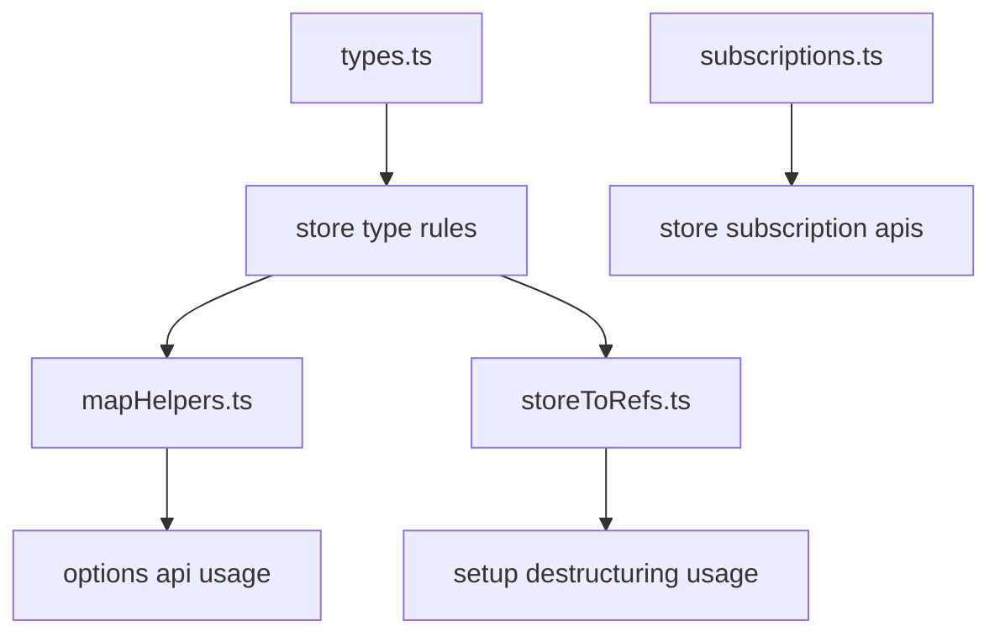
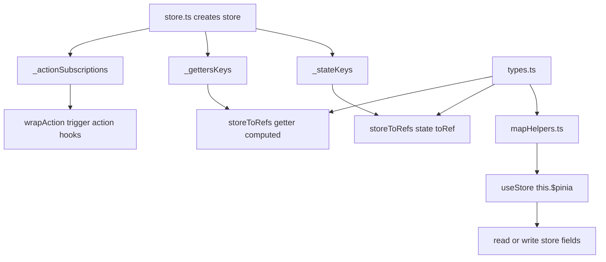
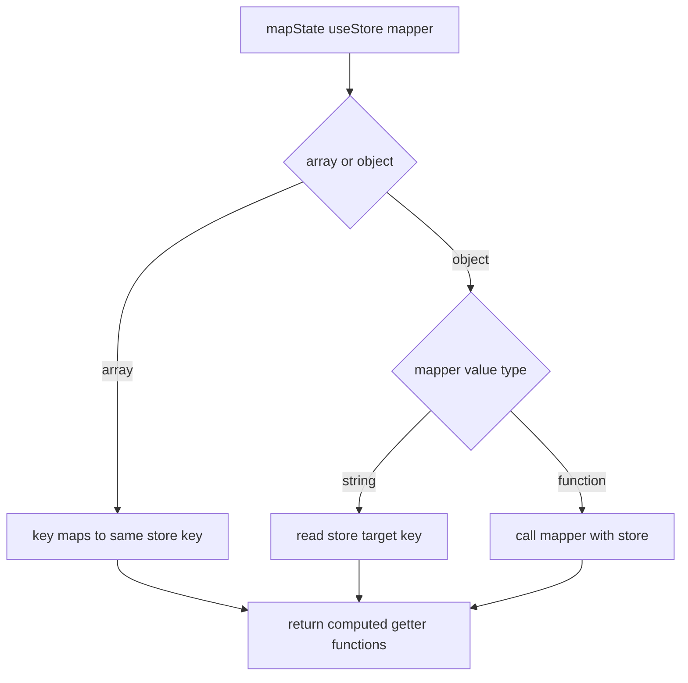
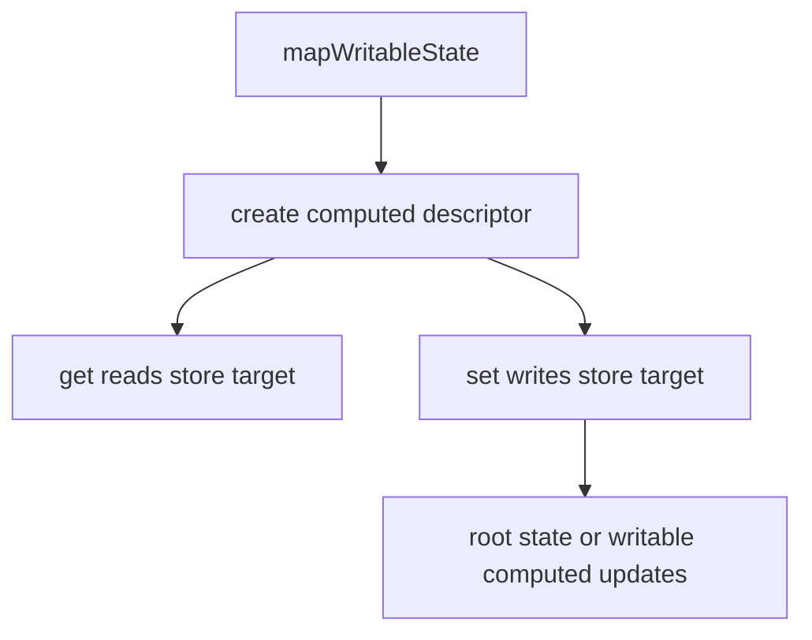
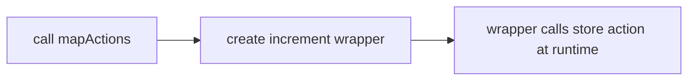
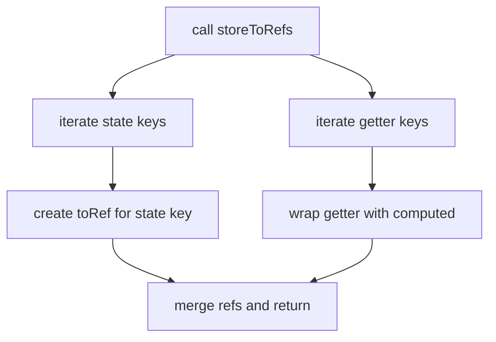
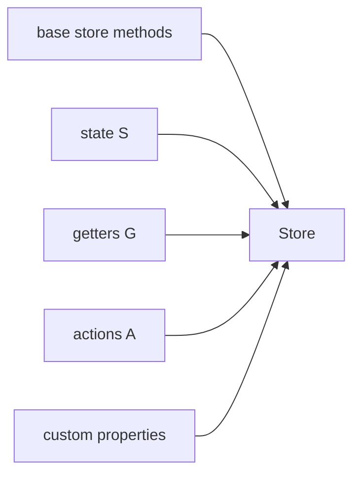

# mapHelpers / storeToRefs / subscriptions / types

这一篇对应 4 个文件：

- `mapHelpers.ts`
- `storeToRefs.ts`
- `subscriptions.ts`
- `types.ts`

它们不是“创建 store 的主线”，而是围绕主线提供：

- Options API 映射辅助
- refs 提取
- 订阅集合管理
- 类型拼装

---

## 1. 四个文件各自负责什么



### 1.1 辅助 API 依赖内部字段的关系图



这张图说明辅助 API 不是独立系统：

- `storeToRefs()` 依赖 `store.ts` 记录的 key。
- `mapHelpers()` 依赖 `this.$pinia` 和 store 字段代理。
- `subscriptions.ts` 被 `$subscribe()` 和 `$onAction()` 共同使用。

---

## 2. `mapHelpers.ts` 的原理

这一层不是在创建 store，而是在做“访问映射”。

也就是把：

- `useStore().count`
- `useStore().increment()`

包装成适合组件 `computed` / `methods` 的形式。

### 2.1 `mapStores()`

输入：

- 多个 `useStore` 函数

输出：

- 一个对象，key 是 `${storeId}${suffix}`
- value 是读取当前 store 实例的函数

流程图：


这里的核心不是复杂逻辑，而是：

它把“如何拿 store”这件事延后到组件运行时，用 `this.$pinia` 再解析一遍。

### 2.2 `mapState()`

支持两种输入：

- 数组：`['count', 'double']`
- 对象：`{ n: 'count', triple: store => store.count * 3 }`

输出：

- 每个 key 对应一个取值函数

所以它本质上是：

把“从 store 上读字段”包装成“组件 computed 可直接展开的 getter 函数对象”。



### 2.3 `mapWritableState()`

它和 `mapState()` 最大差别在于：

返回值不是单个函数，而是：

- `get`
- `set`

也就是：

```ts
{
  count: {
    get() {},
    set(v) {}
  }
}
```

这使它可以用于：

- 普通 state
- setup store 里的 writable computed



### 2.4 `mapActions()`

它做的是方法映射，不是取值映射。

所以返回的不是 computed getter，而是函数本身：



---

## 3. `storeToRefs.ts` 为什么能只提取 state / getters

`storeToRefs()` 的核心思路非常简单：

它不去遍历所有属性做复杂猜测，而是直接依赖 store 内部准备好的两个列表：

- `_stateKeys`
- `_gettersKeys`

也就是说，真正的分类工作其实在 `store.ts` 已经做完了。

这里只是按清单提取。

流程如下：



### 3.1 为什么 state 用 `toRef()`

因为 state 本来就是可写的，直接做：

- 读取代理
- 写入代理

就够了。

### 3.2 为什么 getter 要重新 `computed()`

因为 getter 不是一个裸字段引用，而是一个“通过 store 读取值”的派生结果。

这里重新包一层 `computed`，本质是给调用方一个稳定的 ref 形态。

对于 writable computed，还能保留 set 行为。

---

## 4. `subscriptions.ts` 为什么单独拆文件

这个文件只做两件非常小但高频的事：

- 注册订阅
- 触发订阅

### 4.1 `addSubscription()`

输入：

- `subscriptions`: 一个 `Set`
- `callback`: 要注册的回调
- `onCleanup`: 真正移除时额外执行的清理逻辑

输出：

- 一个 `unsubscribe()` 函数

为什么用 `Set`：

- 去重方便
- 删除方便
- 触发遍历也足够直接

### 4.2 `triggerSubscriptions()`

它只是：

- 遍历 Set
- 用同一组参数逐个调用

这意味着 `subscriptions.ts` 不关心“这是 state 订阅还是 action 订阅”，它只负责：

> 给我一个回调集合和一组参数，我全部调一遍

所以它是一个非常纯的底层工具。

---

## 5. `types.ts` 为什么是整个系统的“骨架”

运行时上，主线在 `store.ts`。

类型系统上，主线在 `types.ts`。

它要解决的是：

- options store 和 setup store 最后怎么被统一成一个 `Store`
- state / getters / actions 怎么从不同定义方式里提取出来
- `storeToRefs()` / `mapHelpers()` 怎么拿到精确返回类型

---

## 6. `Store` 类型的拼装思路

当前 `Store` 不是单一对象类型，而是多个部分拼出来的交叉类型。

大致可以理解成：

```ts
Store =
  基础方法 +
  state +
  getters +
  actions +
  plugin custom properties
```

也就是：



这样最终拿到的 store 才能同时拥有：

- `store.$patch()`
- `store.count`
- `store.double`
- `store.increment()`

---

## 7. options store / setup store 的类型是怎么统一的

### 7.1 options store

options store 本来就分成：

- `state`
- `getters`
- `actions`

所以可以直接塞进 `Store<Id, S, G, A>`。

### 7.2 setup store

setup store 只有一个返回对象。

所以类型系统必须先把这个对象拆开：

- 哪些 key 是 action
- 哪些 key 是 computed getter
- 哪些 key 是 state

这就是这些辅助类型存在的原因：

- `_ExtractActionsFromSetupStore`
- `_ExtractGettersFromSetupStore`
- `_ExtractStateFromSetupStore`

---

## 8. 为什么 getter 还要区分 readonly / writable

因为 setup store 里可能返回：

- `computed(() => ...)`
- `computed({ get, set })`

第一种是只读 getter。
第二种是 writable getter。

所以类型里又细分成：

- `_StoreWithGetters_Readonly`
- `_StoreWithGetters_Writable`

否则：

- `mapWritableState()`
- `storeToRefs()`

都无法知道某个 getter 到底能不能写。

---

## 9. `StoreToRefs<T>` 为什么能推导这么细

因为它不是瞎猜，而是按两个维度拆：

1. state -> `ToRef`
2. getters -> `ComputedRef` 或 `WritableComputedRef`

所以最后推导出来的结构才会是：

- `count: Ref<number>`
- `double: ComputedRef<number>`
- `writableUpper: WritableComputedRef<string>`

---

## 10. `PiniaCustomProperties` / `PiniaCustomStateProperties` 的作用

它们对应插件扩展场景。

也就是：

- 插件往 store 上挂字段
- 插件往 `$state` 上加字段
- 类型系统也要知道这些字段存在

当前这套实现里为了不污染其他普通推导，把它们处理成了“可选增强”。

这意味着：

- runtime 可以正常注入
- type 也能声明增强
- 但在非插件确定存在的上下文里，这些字段倾向于以可选形式出现

---

## 11. 读完这一篇后你应该能回答

- `mapState()` 和 `mapWritableState()` 本质差别是什么
- `storeToRefs()` 为什么依赖 `_stateKeys` / `_gettersKeys`
- 为什么 `subscriptions.ts` 可以这么小却很关键
- 为什么 setup store 需要一整套提取类型
- 为什么 writable computed 必须单独建一层类型

如果后面你还要继续扩文档，最适合往下拆的是：

- 单独一篇 `types.ts` 类型系统走读
- 单独一篇 `$subscribe()` 调度机制
- 单独一篇 `skipHydrate()` / `shouldHydrate()` 与 setup hydration
