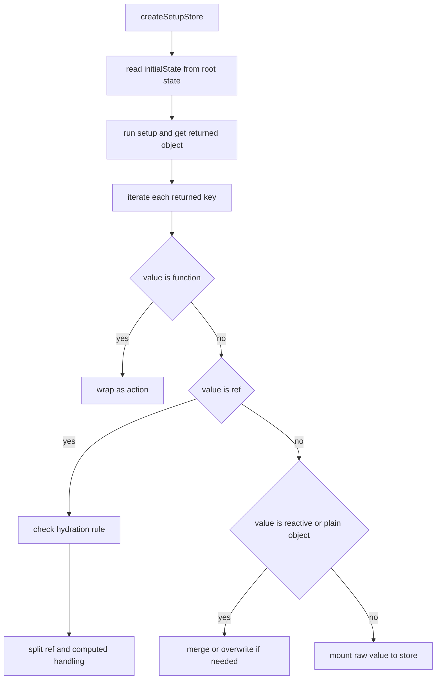
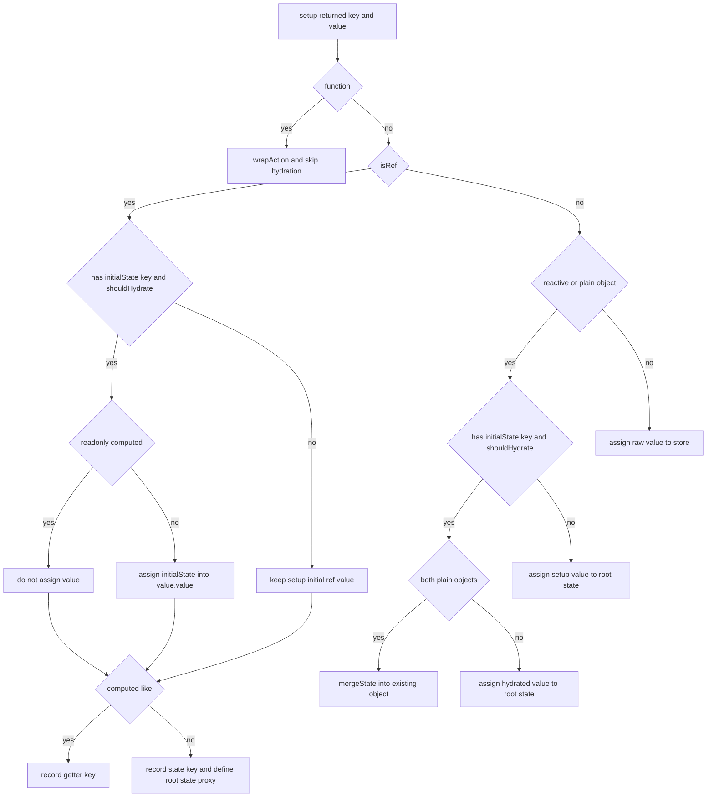
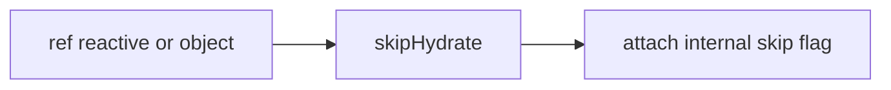
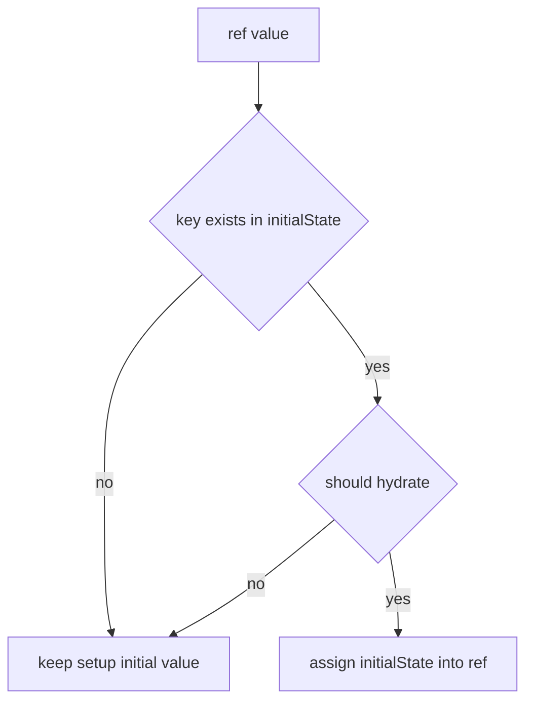
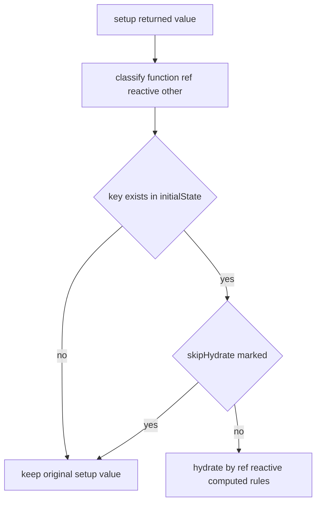

# setup store hydration：skipHydrate / shouldHydrate / 初始 state 回填

这一篇只看 `store.ts` 里 setup store 初始化相关的水合逻辑。

关键问题只有一个：

> 如果 `pinia.state.value[id]` 里已经有旧 state，setup store 创建时怎么把这些值灌回 `ref` / `reactive` / writable computed？

---

## 1. 为什么 setup store 需要专门的 hydration

options store 的 state 是一个普通对象工厂：

```ts
state: () => ({ count: 0 })
```

这类场景天然更接近 plain object。

而 setup store 常见返回值是：

- `ref`
- `computed`
- `reactive`
- 自定义对象

例如：

```ts
defineStore('main', () => {
  const count = ref(0)
  const profile = reactive({ name: 'A' })
  const upper = computed({
    get: () => profile.name.toUpperCase(),
    set: v => {
      profile.name = v
    }
  })
  return { count, profile, upper }
})
```

如果外部已经有：

```ts
pinia.state.value.main = {
  count: 2,
  profile: { name: 'Tom' },
  upper: 'Jerry'
}
```

那 setup store 创建时必须决定：

- 哪些值要回填
- 回填到哪里
- 哪些值不该回填

---

## 2. 整体流程



setup store 的 hydration 本质上就是：

在“分析 setup 返回值分类”的同时，顺带决定“是否从 `initialState` 回填值”。

### 2.1 源码分支细化图



这张图对应 `createSetupStore()` 里的核心判断：

- 函数不参与 hydration，直接变 action。
- `ref` 先判断是否能回填，再判断是 state 还是 getter。
- `reactive` / plain object 会优先保留原对象引用，能深合并就深合并。
- 其他普通值不进入根 state，只挂到 store 实例上。

---

## 3. `initialState` 从哪里来

当前实现里：

```ts
const initialState = pinia.state.value[id]
```

它的来源一般是：

- SSR 预注入
- 手动预填根状态
- 旧 store 被 dispose 后，根状态仍然保留

所以不是每次都有。

如果没有，就直接按 setup 本地初始值创建。

---

## 4. `skipHydrate()` 到底在做什么

`skipHydrate(obj)` 不会改这个对象的行为，只会给它打一个内部标记。

可以把它理解成：



之后 `shouldHydrateStateValue(value)` 看到这个标记，就会返回 `false`。

所以它的本质语义是：

> 这个值虽然在 setup store 里返回了，但不要用 root state 去覆盖它

---

## 5. 为什么要有 `shouldHydrateStateValue()`

因为不是所有 object-like 值都应该 hydrate。

常见不应该 hydrate 的例子：

- router 实例
- 手工管理的自定义 ref
- Map / Set / 某些复杂 reactive 对象

当前实现的判断逻辑是：

- 不是对象 -> 可以 hydrate
- 是对象但没有 skip 标记 -> 可以 hydrate
- 是对象且有 skip 标记 -> 不 hydrate

---

## 6. 普通 `ref` 是怎么 hydrate 的

假设：

```ts
const count = ref(0)
```

如果：

- `initialState.count` 存在
- 且 `count` 没被 skipHydrate

那么会直接做：

```ts
count.value = initialState.count
```

流程图：



---

## 7. 为什么 readonly computed 默认不 hydrate

当前实现对 `ref` 分支有一条额外判断：

- 必须不是只读 computed，或者虽然只读但不是 computed-like

原因很简单：

只读 computed 没有合法 setter。

如果硬往里灌值：

- 要么失败
- 要么语义本身就不成立

因为这类值本来就应该由它依赖的 state 推导出来，而不是直接赋值。

---

## 8. writable computed 怎么 hydrate

对于 writable computed：

```ts
const upper = computed({
  get: () => name.value.toUpperCase(),
  set: (v) => {
    name.value = v
  }
})
```

当前实现会把它当作：

- getter key
- 但因为它可写，也允许通过 setter 回填

所以如果 `initialState.upper` 存在，就会触发：

```ts
upper.value = initialState.upper
```

结果不是“保存 upper 本身”，而是借 setter 把依赖 state 改掉。

这也是为什么你会看到：

- `store.name` 被改了
- `store.upper` 跟着变

---

## 9. `reactive` / plain object 是怎么 hydrate 的

对于：

```ts
const profile = reactive({ name: 'A', age: 1 })
```

如果有同名 `initialState.profile`，当前实现分两种：

### 9.1 两边都是 plain object

就走 `mergeState()` 递归合并。

优点是：

- 保留原 reactive 对象引用
- 只覆盖里面的字段

### 9.2 否则直接覆盖

如果不是 plain object 对 plain object，比如：

- 数组
- 其他对象

当前实现就直接：

```ts
state[key] = hydratedValue
```

---

## 10. 为什么 `state[key]` 和 `store[key]` 还要再做代理

setup store 最后不是简单把 `setupStore` 原样返回，而是：

- 往 `state` 上定义 getter/setter
- 往 `store` 上定义 getter/setter

目的还是统一到 Pinia 根状态流。

也就是说：

- setup 内部原始 ref/reactive 继续存在
- 但对外暴露的 store 字段，依然要保持和 `pinia.state.value[id]` 同步

---

## 11. `skipHydrate()` 适合哪些场景

当前这套实现最典型的使用场景是：

### 11.1 跳过 reactive 数组 hydration

```ts
items: skipHydrate(reactive([]))
```

外部即使有：

```ts
pinia.state.value.main.items = [1, 2, 3]
```

初始化后依然保留本地空数组。

### 11.2 跳过 Map / Set hydration

```ts
items: skipHydrate(reactive(new Map()))
items: skipHydrate(reactive(new Set()))
```

这样不会被普通对象式回填破坏结构。

### 11.3 跳过自定义 ref / 外部实例

例如 router、复杂 service、带内部闭包状态的 ref。

---

## 12. 整个 hydration 过程可以怎么理解

你可以把它理解成两层叠加：

1. setup 返回值分类
2. 有条件地把 `initialState` 回填进去

图示如下：



所以 hydration 不是一个“统一对象替换”动作，而是逐字段的分类处理。

---

## 13. 读完这一篇后你应该能回答

- 为什么 setup store 的 hydration 比 options store 复杂
- `skipHydrate()` 的真实作用是什么
- 为什么只读 computed 不能直接 hydrate
- 为什么 writable computed 可以通过 setter 间接 hydrate
- 为什么 reactive object 更适合 merge 而不是整段替换

下一篇建议看：

- [types.ts 类型系统：Store、StoreDefinition、提取类型](./pinia-types-deep-dive.md)
