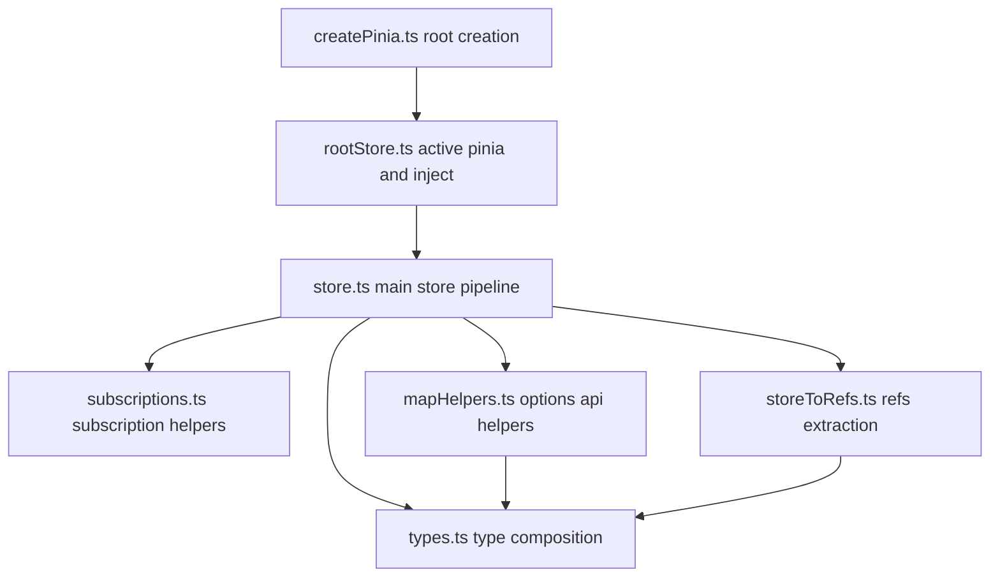
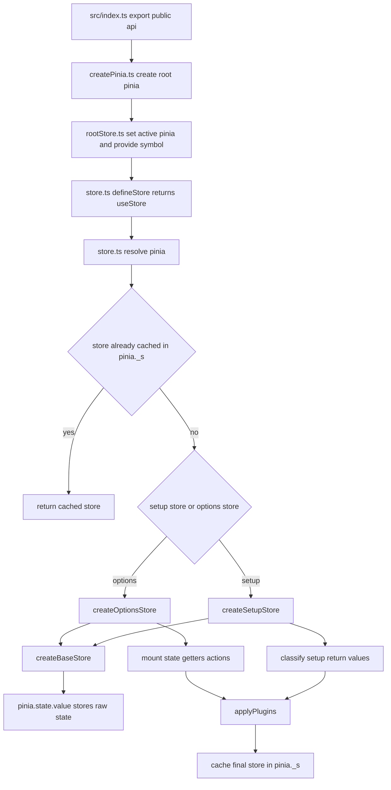

# Pinia 源码阅读地图

这组文档对应的是你当前本地复刻的 Pinia 源码：

`/Users/nwyzx/Desktop/project/source/front_basic/pinia-source/packages/pinia/src`

如果你直接从 `store.ts` 开始看，很容易被下面这些点卡住：

- 不知道 `pinia.state.value` 到底是不是单一数据源
- 不知道 `useStore()` 为什么不传 pinia 也能工作
- 不知道 setup store / options store 在实现上到底有什么差异
- 不知道 `mapState()`、`storeToRefs()` 这些辅助函数依赖了哪些内部字段

所以建议按这张地图来读。

---

## 1. 总体结构

这张图里最核心的是一条主线：

`createPinia -> install/useStore -> createOptionsStore/createSetupStore -> pinia.state.value -> 订阅/插件/辅助 API`

### 1.1 按源码文件串起来的执行图

这张图对应现在源码里的注释粒度：

- `createPinia.ts` 看根容器怎么搭。
- `rootStore.ts` 看当前 pinia 怎么被找到。
- `store.ts` 看 store 怎么被创建、缓存、代理、订阅和扩展。
- `mapHelpers.ts` / `storeToRefs.ts` 看外围 API 怎么依赖 `_stateKeys`、`_gettersKeys`。
- `types.ts` 看运行时对象如何被类型系统拼成最终 `Store`。

---

## 2. 最推荐的阅读顺序

### 第一步：先确认“根容器”是什么

看：

- [createPinia 与 rootStore：根实例、注入、activePinia](./pinia-create-and-rootstore-flow.md)

这一层你要先搞清楚：

- `Pinia` 实例本身是什么对象
- `pinia.state.value` 为什么是根状态树
- `activePinia` 和 `inject(piniaSymbol)` 谁优先
- `app.use(pinia)` 到底做了哪几件事

### 第二步：再看 store 主线

看：

- [store.ts：defineStore、state 同步、订阅、插件、hydrate 主线](./pinia-store-source-walkthrough.md)

这是整个复刻项目最重要的一篇，因为几乎所有核心行为都在这里：

- `defineStore()` 返回什么
- `useStore()` 首次调用做了什么
- options store 和 setup store 各自怎么建
- `$patch()`、`$subscribe()`、`$onAction()` 怎么工作
- plugin 怎么注入到 store 上
- `skipHydrate()` / `shouldHydrate()` 怎么影响 setup store 初始化

### 第三步：最后补辅助层

看：

- [mapHelpers / storeToRefs / subscriptions / types](./pinia-helpers-and-types.md)

这一层解决的是“主线跑通后，外围 API 怎么依赖内部实现”：

- `mapState()` 为什么能直接从 store 上取值
- `mapWritableState()` 为什么能改 state 和 writable computed
- `storeToRefs()` 为什么只提取 state / getters，不提取 action
- 类型系统怎么把 options store / setup store 推导成统一的 `Store`

---

## 3. 推荐带着哪些问题去看

### 看 `createPinia.ts` 时

- 为什么 `Pinia` 实例要 `markRaw()`
- 为什么根状态是 `Ref<Record<string, StateTree>>`
- 为什么插件不在 `pinia.use()` 时执行，而是在 store 创建后执行

### 看 `rootStore.ts` 时

- `activePinia` 为什么要做全局兜底
- `getActivePinia()` 为什么还要结合 `inject()`
- plugin context 里为什么要暴露 `store`、`options`、`app`

### 看 `store.ts` 时

- `useStore()` 为什么会缓存实例
- options store 为什么把每个 state key 重新 `defineProperty`
- setup store 为什么要区分 `ref`、`computed`、`reactive`、普通函数
- `$patch()` 为什么要临时关掉 direct watch 通知
- direct mutation 和 patch mutation 为什么订阅触发策略不一样

### 看 `mapHelpers.ts` / `storeToRefs.ts` 时

- `mapState()` 和 `storeToRefs()` 都是“取值”，为什么返回形式不同
- `mapWritableState()` 为什么只允许 state 和 writable getter
- `storeToRefs()` 为什么依赖 `_stateKeys` 和 `_gettersKeys`

---

## 4. 当前这套复刻实现的边界

这组文档讲的是你现在本地这套 `pinia-source` 实现，不是逐字复刻官方最新版所有细节。

当前重点已经覆盖：

- Pinia 根实例
- options store / setup store
- state / getters / actions
- `$patch`
- `$subscribe`
- `$onAction`
- plugin 扩展
- hydrate / skipHydrate
- `storeToRefs`
- `mapState` / `mapActions` / `mapStores` / `mapWritableState`

还没有完全做到官方等价的地方，阅读时要有预期：

- `pre` / `post` 订阅调度目前是简化版
- plugin 自定义属性类型当前按“可选增强”处理
- setup store 的 hydration 边界没有覆盖官方所有极端情况

---

## 5. 最短路线

如果你时间不多，只想快速打通主线，按这个顺序：

1. [createPinia 与 rootStore：根实例、注入、activePinia](./pinia-create-and-rootstore-flow.md)
2. [store.ts：defineStore、state 同步、订阅、插件、hydrate 主线](./pinia-store-source-walkthrough.md)
3. [mapHelpers / storeToRefs / subscriptions / types](./pinia-helpers-and-types.md)

这样基本就能把当前这套复刻 Pinia 的核心机制串起来。
