# store.ts：defineStore、state 同步、订阅、插件、hydrate 主线

这一篇只看一个文件：

- `pinia-source/packages/pinia/src/store.ts`

这是当前这套 Pinia 复刻实现里最核心的文件。

如果说：

- `createPinia.ts` 负责“搭根容器”
- `rootStore.ts` 负责“把根容器找出来”

那么 `store.ts` 负责的就是：

> 真正把“store 的定义”变成“可工作的 store 实例”

---

## 1. 先看这个文件里最重要的几条函数链

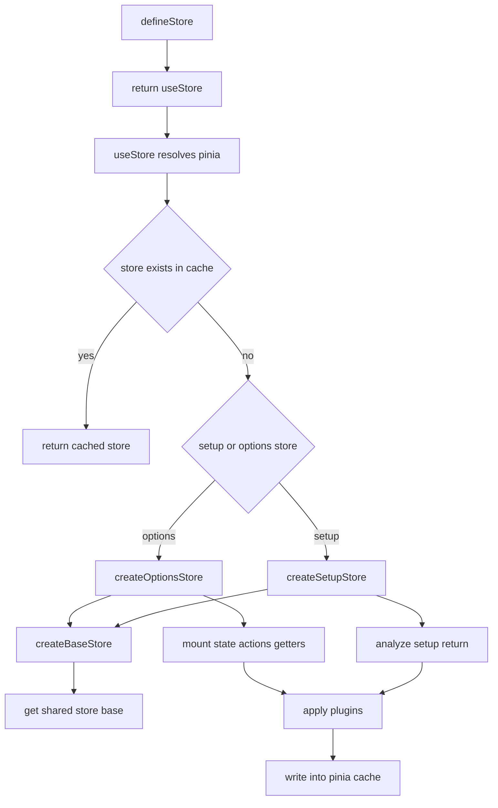

如果你能把上面这条链看顺，整个 `store.ts` 基本就通了。

---

## 2. `defineStore()` 到底返回什么

`defineStore()` 不直接返回 store 实例，而是返回 `useStore()`。

也就是说：

- `defineStore('counter', {...})`
  只是“定义 store”
- `useCounterStore()`
  才是“取 store 实例”

可以理解成两阶段：

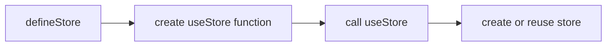

这么设计的好处是：

- store 定义可以先声明
- 真正实例化时再根据当前 app / 当前 pinia / 当前注入上下文做解析

---

## 3. `resolvePinia()` 做什么

`useStore()` 内部第一件事不是建 store，而是先找 pinia。

它会按顺序尝试：

1. 显式传入的 pinia
2. 组件里的 `inject(piniaSymbol)`
3. 全局 `activePinia`
4. `getActivePinia()` 兜底

这一步如果拿不到 pinia，就直接报错。

本质上它解决的是：

> 这个 store 实例到底应该挂到哪个 Pinia 根实例下面？

---

## 4. `createBaseStore()` 是什么

这不是完整 store，只是“公共底座”。

无论 options store 还是 setup store，都先走这里。

它会统一补上：

- `$id`
- `$state`
- `$patch()`
- `$reset()`
- `$dispose()`
- `$subscribe()`
- `$onAction()`
- `_stateKeys`
- `_gettersKeys`
- `_actionSubscriptions`

所以你可以把它理解成：

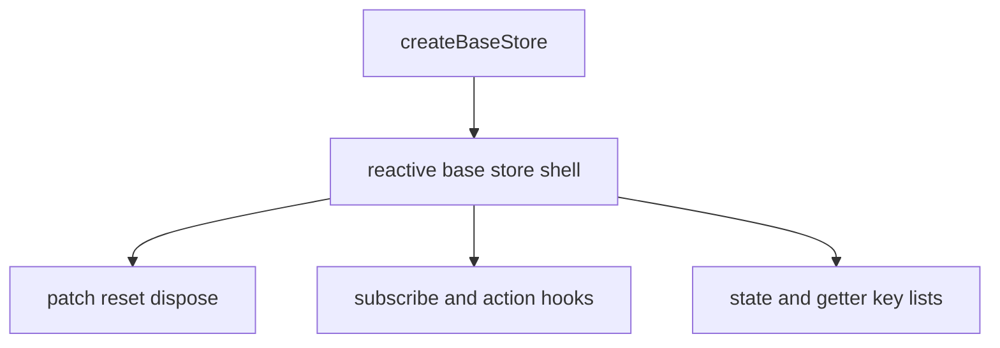

### 4.1 createBaseStore 内部结构图

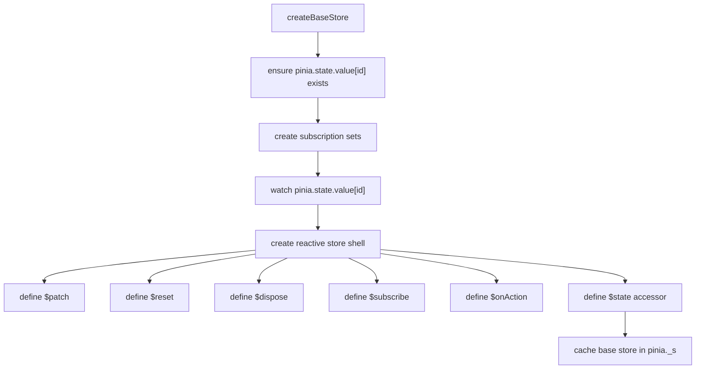

这张图可以直接对照源码注释读：

- watch 负责 direct mutation。
- `$patch` 负责 patch mutation。
- `$subscribe` 写入订阅集合。
- `$onAction` 写入 action 订阅集合。
- `$state` 把 store 和根状态树连接起来。

后面 options / setup 两条分支，只是在这个底座上继续挂各自的 state、getter、action。

---

## 5. `pinia.state.value[id]` 为什么这么关键

这个文件里最重要的状态流转原则只有一句话：

> store 实例上的字段访问，最终都要回到 `pinia.state.value[id]`

也就是：

- `store.count = 2`
  实际是在改 `pinia.state.value[counterId].count`
- `store.$state`
  本质上就是对 `pinia.state.value[id]` 的 getter/setter 包装

这是单一数据源原则。

如果没有这条原则，Pinia 就会出现两份 state：

- 一份挂在 store 实例
- 一份挂在 pinia 根状态

那后续 patch、hydrate、subscribe 都会变得不一致。

---

## 6. `createBaseStore()` 里的订阅数据流

### 6.1 为什么要分 `sync / pre / post`

当前实现里 `$subscribe()` 的订阅集合被拆成了三组：

- `syncSubscriptions`
- `preSubscriptions`
- `postSubscriptions`

因为 direct mutation 和 patch mutation 的调度时机不一样。

### 6.2 direct mutation 的流转

比如：

```ts
store.count++
```

流程是：

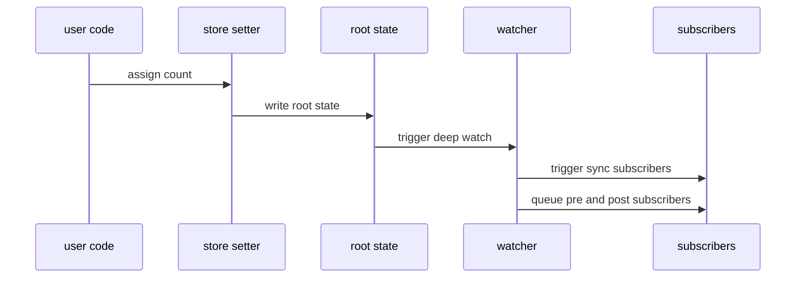

这里的关键点是：

- direct mutation 依赖 watch 感知
- `sync` 立刻触发
- `pre/post` 在异步队列里触发

### 6.3 patch mutation 的流转

比如：

```ts
store.$patch({ count: 3 })
```

流程不同：

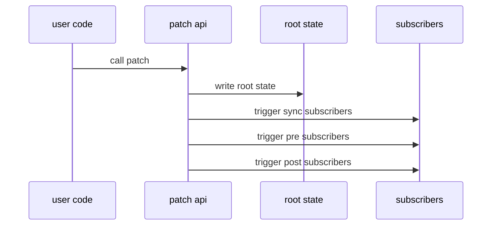

为什么 patch 不等 watch？

因为 patch 本来就是 Pinia 自己控制的入口。
它已经明确知道这次变更的类型和 payload，所以没必要再等 watcher 二次判断。

### 6.4 为什么 `$patch()` 里先把 `isListening = false`

因为 patch 过程中本身也会改 `pinia.state.value[id]`。

如果不临时关闭 direct watch：

- `$patch()` 主动触发一次 patch 订阅
- watch 又感知到 state 变化再触发一次 direct 订阅

这样会重复通知。

所以顺序是：

1. 先关闭 direct watch 通知
2. 执行 patch
3. 手动发出 patch 类型订阅
4. 再恢复 direct watch 通知

---

## 7. `createOptionsStore()` 怎么把 options 变成 store

options store 输入的是：

- `state()`
- `getters`
- `actions`

它的核心工作有 3 步。

### 7.1 先建基础 store

先走 `createBaseStore()`，拿到公共能力。

### 7.2 再把 state key 代理到 store 上

它会遍历 `pinia.state.value[id]`，给每个 key 做 `defineProperty()`：

- 读的时候，从根 state 读
- 写的时候，往根 state 写

所以 `store.count` 只是根 state 的一个代理入口。

### 7.3 最后补 actions 和 getters

- action 会被 `wrapAction()` 包裹
- getter 会被 `computed()` 包裹，再暴露为只读属性

这样 action 能接上 `$onAction()`，getter 能接上缓存和依赖追踪。

---

## 8. `wrapAction()` 是怎么工作的

`wrapAction()` 做的不是“执行 action”这么简单，而是给 action 增加一个埋点外壳。

流程如下：

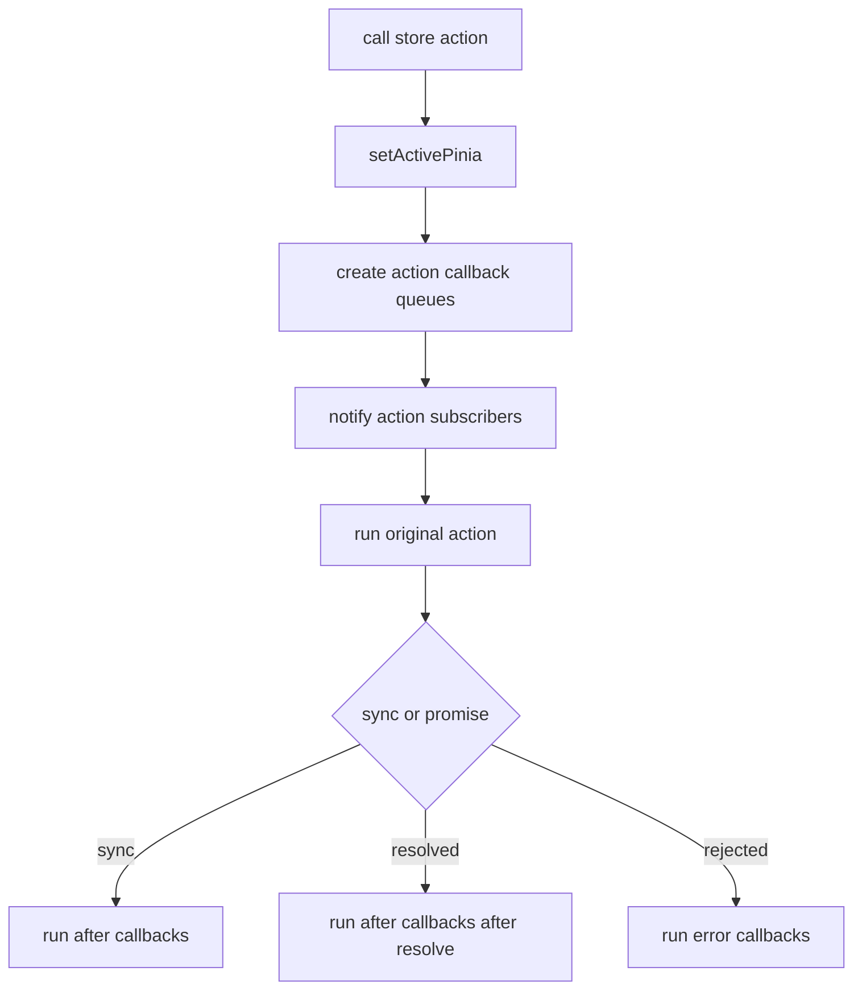

这也是为什么 `$onAction()` 能拿到：

- `name`
- `args`
- `after()`
- `onError()`

因为这些并不是 action 原生自带的，而是 wrapper 在调用前后人为拼出来的上下文。

---

## 9. `createSetupStore()` 怎么分析 setup 返回值

setup store 的输入不是三段 options，而是一个返回对象。

所以实现上要先判断返回对象里每个字段是什么类型。

当前实现分成 4 类：

1. `function`
   当作 action，走 `wrapAction()`
2. `ref`
   可能是普通 state ref，也可能是 computed
3. `reactive` / plain object
   当作 state
4. 其他普通值
   直接原样挂到 store 上

流程图如下：

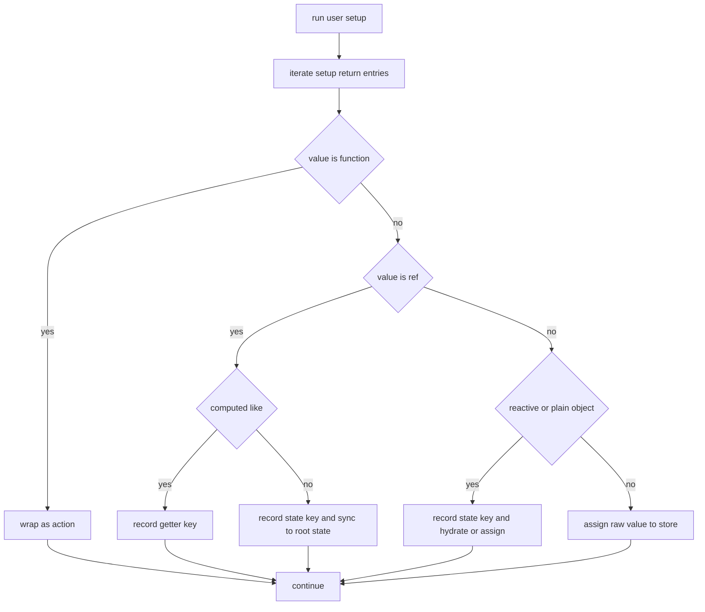

其中最容易漏的是 `ref` 分支：

- 普通 `ref` 是 state，需要同步到 `pinia.state.value[id]`。
- `computed` 也是 ref-like，但它是 getter，需要放入 `_gettersKeys`。
- readonly/computed 不应该作为可写 state 写入根状态树。

### 9.1 为什么 `ref` 还要继续区分 computed

因为 computed 也是 ref-like。

如果不继续区分，就会把 getter 当普通 state 处理。

所以这里会用 `_isComputedLike(value)` 再分一次：

- computed -> 放进 `_gettersKeys`
- writable ref -> 放进 `_stateKeys`

### 9.2 为什么 setup store 需要 hydration

setup store 很多状态并不是直接从 plain object 创建的，而是：

- `ref()`
- `computed()`
- `reactive()`

如果外部已经有 `pinia.state.value[id]`，就要把已有 state 灌进去。

但不是所有值都应该 hydrate。

这就引出了：

- `skipHydrate()`
- `shouldHydrateStateValue()`

---

## 10. `skipHydrate()` / `shouldHydrate()` 在这里怎么生效

当前实现会在 setup store 初始化时检查：

- 这个 key 在不在 `initialState` 里
- 这个值有没有被 `skipHydrate()` 标记

如果没被标记，就把外部状态写回 setup 返回的 ref/reactive 值里。

如果被标记，就跳过。

这适合这种场景：

- 返回的是 router 实例
- 返回的是 Map / Set / 自定义响应式对象
- 这些值在根 state 里有同名字段，但不应该被普通对象式 hydration 覆盖

---

## 11. `applyPlugins()` 在什么时候执行

当前实现里插件执行时机是：

- store 已经创建完成
- state / getters / actions 已经挂到实例上
- 但 store 还没最终暴露给业务代码前

所以 plugin 可以安全地：

- 读取 `store.$id`
- 读取 `store.$state`
- 往 store 实例上挂字段
- 读取定义时的 `options`

流程如下：

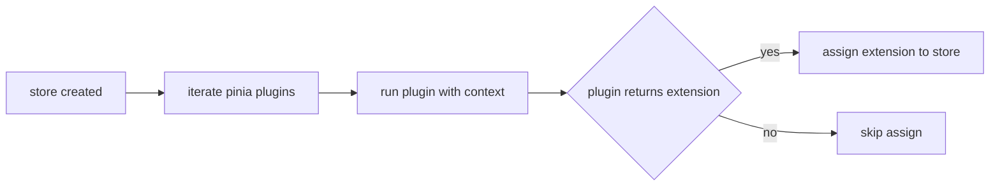

---

## 12. `defineStore()` 的完整主流程

最后把所有 pieces 串回 `defineStore()`：

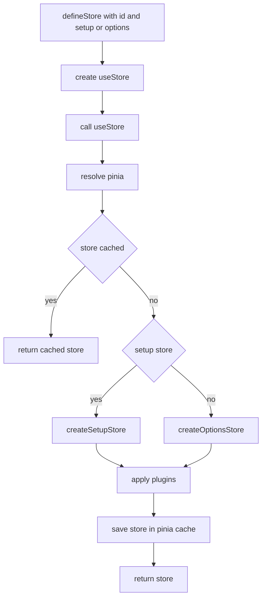

### 12.1 option store 和 setup store 对照图

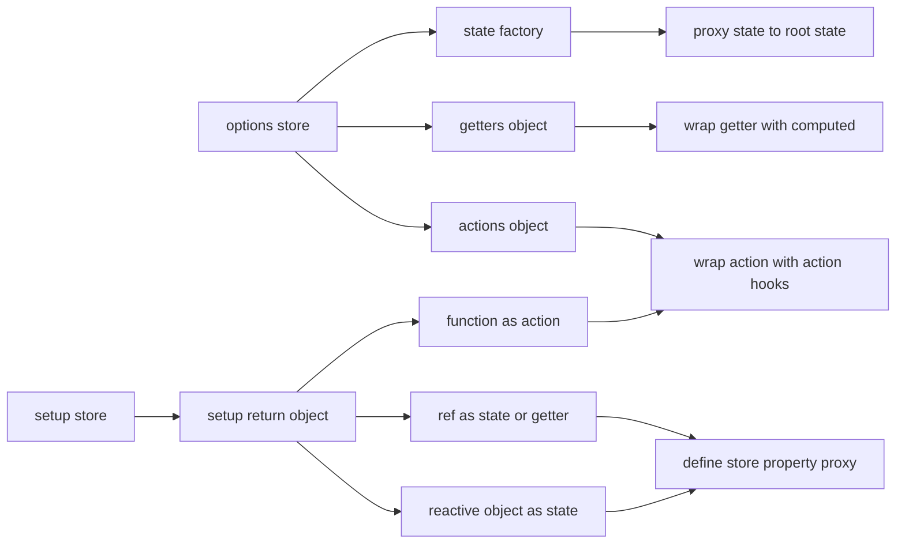

两条分支最终都会得到同样的结果：

- store 上可以直接读写状态。
- action 都支持 `$onAction()`。
- getter 都能被 `storeToRefs()` 提取。
- 插件都能拿到完整 store。

这里有两个特别重要的结论：

- `defineStore()` 不创建实例，只定义创建规则
- `useStore()` 才负责“解析 pinia + 创建/复用实例”

---

## 13. 读完这一篇后你应该能回答

- 为什么 `store.count` 本质上是在代理 `pinia.state.value[id].count`
- 为什么 options store 和 setup store 最终都要先走 `createBaseStore()`
- 为什么 `$patch()` 要自己发订阅，而不能完全依赖 watch
- 为什么 `$onAction()` 能拿到 `after()` 和 `onError()`
- 为什么 plugin 是在 store 创建后执行
- 为什么 hydration 只对 setup store 某些字段生效

下一篇建议接着看：

- [mapHelpers / storeToRefs / subscriptions / types](./pinia-helpers-and-types.md)
