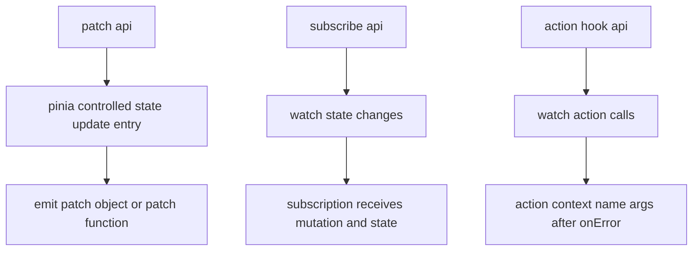
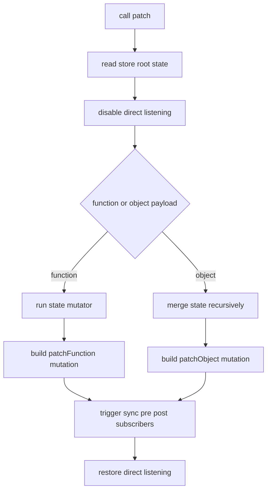
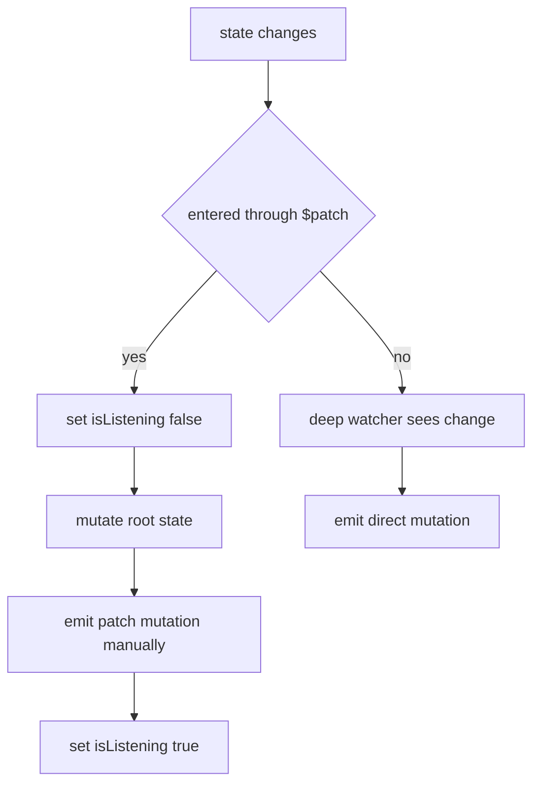
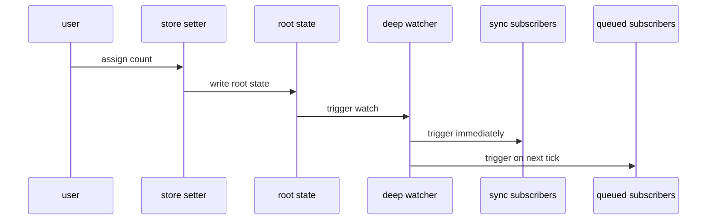
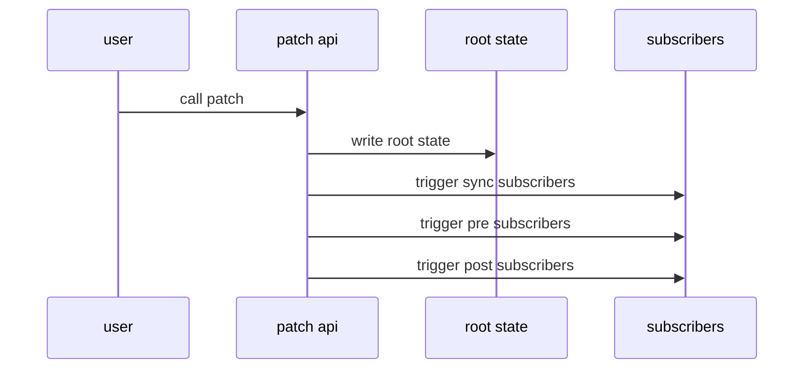
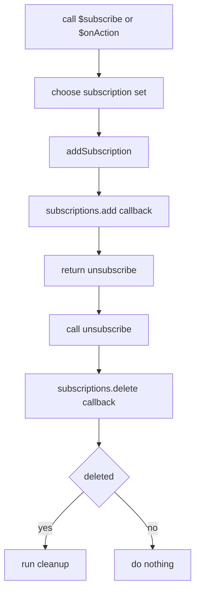
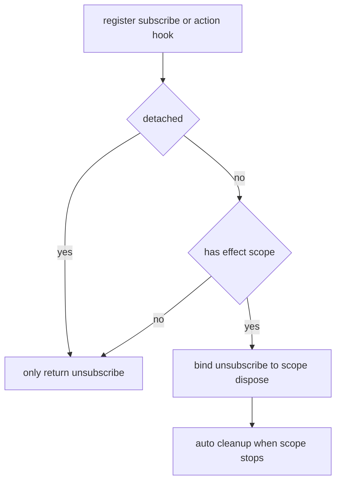
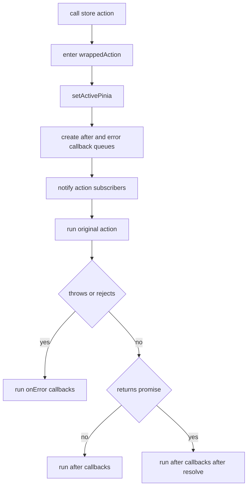
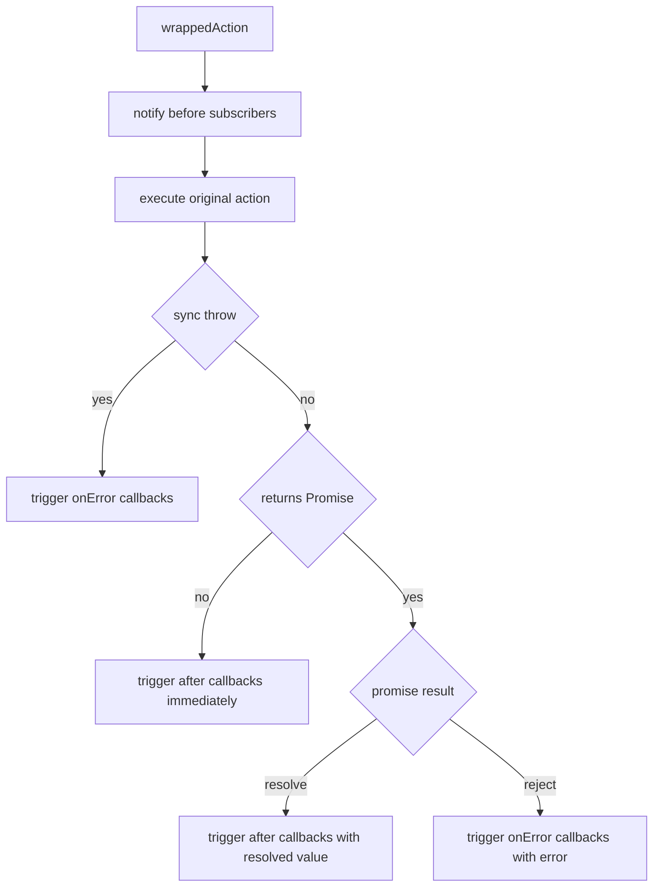

# $patch / $subscribe / $onAction 专题

这一篇专门拆 `store.ts` 里最容易混在一起的 3 条链：

- `$patch()`
- `$subscribe()`
- `$onAction()`

它们都和“副作用通知”有关，但触发时机和数据来源完全不同。

---

## 1. 先看三条链的分工



一句话区分：

- `$patch()` 是“改状态”
- `$subscribe()` 是“看状态”
- `$onAction()` 是“看方法调用”

---

## 2. `$patch()` 为什么不是简单的 `Object.assign`

当前实现支持两种调用形式：

```ts
store.$patch({ count: 1 })
store.$patch((state) => {
  state.count++
})
```

这两种形式背后的意图不同：

- 对象 patch
  适合一次性覆盖多个字段
- 函数 patch
  适合在同一个同步事务里做多次命令式修改

所以 `$patch()` 的真正职责不只是“修改 state”，而是：

1. 修改根 state
2. 标记这次修改的 mutation 类型
3. 避免 direct watch 重复通知
4. 主动触发订阅回调

---

## 3. `$patch()` 的完整流程



最关键的一步是：

`isListening = false`

因为如果不关掉 direct watch，patch 过程中改了 state，watch 也会再次发出一次 `direct` 变更通知。

结果就会变成：

- 一次 patch
- 两次订阅回调

当前实现就是用这个开关来避免重复。

### 3.1 direct mutation 和 patch mutation 的分流图



这就是源码里 `isListening` 的意义：

- patch 入口自己知道 mutation 类型，所以自己派发。
- direct 修改没有显式入口，只能由 watcher 捕获。

---

## 4. `mergeState()` 为什么要递归

对象 patch 不是简单浅拷贝，而是：

- 如果目标值和新值都是 plain object
- 就继续递归合并

这样可以保留嵌套对象已有引用。

例如：

```ts
store.$patch({
  user: {
    profile: {
      name: 'Tom'
    }
  }
})
```

如果不递归，而是整段替换：

- 旧的 `user.profile` 引用会整体丢失
- 某些依赖它的地方会产生额外无意义变化

所以 `mergeState()` 的目标是：

> 在 patch object 场景下，尽量做“结构内复用”的递归更新

---

## 5. `$subscribe()` 为什么要分 `sync / pre / post`

当前实现里，把订阅回调拆成了 3 组集合：

- `syncSubscriptions`
- `preSubscriptions`
- `postSubscriptions`

目的是让 direct mutation 和 patch mutation 的调度时机可控。

### 5.1 direct mutation 的来源

direct mutation 比如：

```ts
store.count = 2
store.$state.count = 2
```

这类修改不是从 Pinia 的显式 API 入口进入的，而是直接改了根 state。

所以只能靠 `watch()` 感知。

### 5.2 patch mutation 的来源

patch mutation 是 Pinia 自己的 API 入口，Pinia 已经知道：

- 这是 `patchObject`
- 还是 `patchFunction`
- payload 是什么

所以它不需要再等 watcher 识别，可以自己同步发通知。

---

## 6. direct mutation 的订阅时序



这就是为什么当前实现里：

- `flush: 'sync'` 会立刻收到 direct mutation
- 默认 `post` 不会同步收到，要等一个 tick

---

## 7. patch mutation 的订阅时序



这样设计的原因是：

patch 已经是 Pinia 接管的更新入口，不需要再多走一层 watcher。

---

## 8. `$subscribe()` 返回的取消函数怎么工作

底层逻辑在 `subscriptions.ts`。

本质是：

1. 把回调塞进 `Set`
2. 返回一个 `unsubscribe()`
3. 调用时从 `Set` 删除

因为使用的是 `Set`：

- 重复删除是安全的
- 删除后不会影响其他订阅

流程图：



`subscriptions.ts` 不知道自己服务的是 state 还是 action，它只维护 Set。

---

## 9. 为什么组件内订阅会自动清理

当前实现接了：

- `getCurrentScope()`
- `onScopeDispose()`

也就是说，如果你在组件 `setup()` 或其他 effect scope 里注册：

```ts
store.$subscribe(fn)
store.$onAction(fn)
```

且没有传 `detached: true`，那么：

- 当前 scope 销毁时
- Pinia 会自动调用 `unsubscribe()`

流程如下：



---

## 10. `detached: true` 是什么作用

它的语义很直接：

> 不要跟当前组件或 effect scope 绑定生命周期

这适合：

- 全局日志订阅
- 调试工具订阅
- 不希望跟随组件销毁的长期监听

所以：

- 普通订阅：scope stop 后自动移除
- detached 订阅：scope stop 后仍然保留

---

## 11. `$onAction()` 为什么要 `wrapAction()`

因为普通函数本身并不知道：

- 谁在监听它
- 调用参数是什么
- 执行成功后要不要回调
- 失败后要不要通知

所以 Pinia 需要在 action 外面包一层 wrapper。

这层 wrapper 做了 5 件事：

1. 设置当前 activePinia
2. 创建 `afterCallbacks`
3. 创建 `onErrorCallbacks`
4. 执行前先通知所有 `$onAction` 订阅者
5. 根据 action 的同步/异步结果再触发 `after` 或 `onError`

---

## 12. `$onAction()` 的完整调用流程



更细一点看同步/异步分支：



所以 `$onAction()` 看到的上下文：

- `name`
- `args`
- `after`
- `onError`

全部来自这个 wrapper 动态拼装。

---

## 13. `after()` 和 `onError()` 为什么要分开

因为 action 可能有 3 种结果：

1. 同步成功返回
2. 同步抛错
3. Promise resolve / reject

如果只给一个统一回调，你在调用方就得自己判断：

- 这是成功值
- 还是错误
- 还是 Promise

分成：

- `after()`
- `onError()`

后，调用方逻辑会干净很多。

---

## 14. 读完这一篇后你应该能回答

- 为什么 `$patch()` 不能只依赖 watch
- 为什么 direct mutation 和 patch mutation 订阅时机不一样
- 为什么 `$subscribe()` 要分 `sync / pre / post`
- 为什么组件里的订阅会自动清理
- 为什么 `detached: true` 还能逃逸自动清理
- 为什么 `$onAction()` 必须通过 wrapper 才能工作

如果你准备继续往下读，下一篇建议看：

- [setup store hydration：skipHydrate / shouldHydrate / 初始 state 回填](./pinia-setup-hydration-flow.md)
