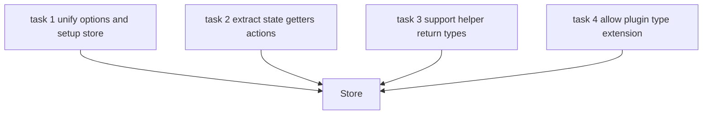
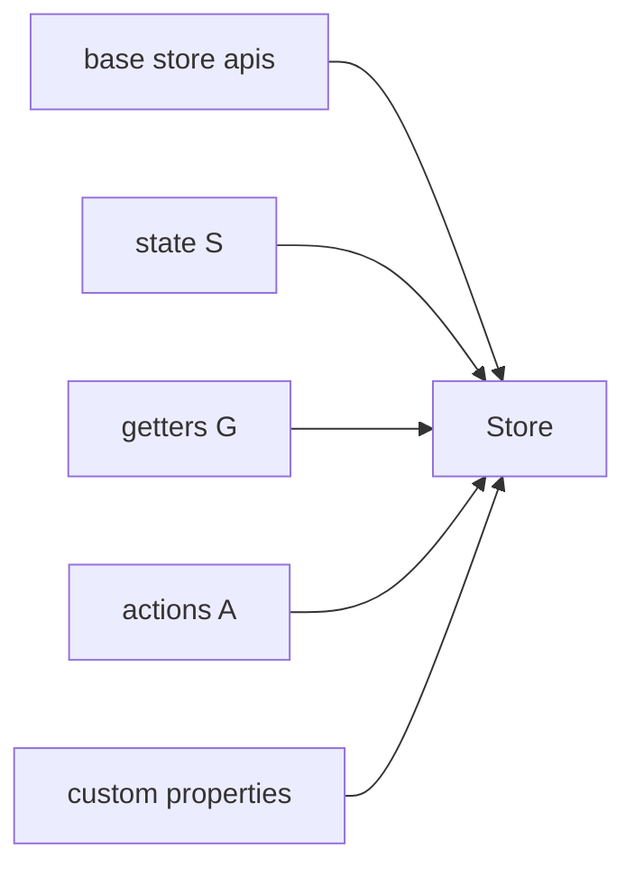
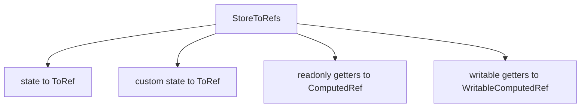

# types.ts 类型系统：Store、StoreDefinition、提取类型

这一篇只看：

- `pinia-source/packages/pinia/src/types.ts`

如果你看运行时已经差不多明白了，但还是卡在这些问题：

- 为什么 `defineStore()` 调用完就能推导出 `store.count` / `store.double` / `store.increment`
- 为什么 setup store 和 options store 最后都能被统一成同一个 `Store`
- 为什么 `storeToRefs()` 能知道某个 getter 是只读还是可写

那核心都在这个文件里。

---

## 1. 先看类型系统要解决的 4 个任务



也就是说，`types.ts` 不是简单写几个 interface，而是在搭一整套“类型归一化管道”。

---

## 2. `Store` 是怎么拼出来的

运行时你看到的 store，表面上像一个对象，但类型系统里它是交叉类型拼装出来的。

当前实现里可以抽象成：

```ts
Store =
  store 基础方法
  & state
  & getters
  & actions
  & plugin custom properties
```

图示：



这就是为什么调用方最终拿到的一个 `store`，同时拥有：

- 方法
- state 字段
- getter 字段
- action 方法

---

## 3. 为什么 getter 还要再做一层 `_StoreWithGetters`

因为原始 `G` 不是最终暴露给外部的类型。

例如 options store 的 getter 写法是：

```ts
getters: {
  double(state) {
    return state.count * 2
  }
}
```

它原始类型是：

```ts
double: (state) => number
```

但 store 上真正暴露给外部的是：

```ts
store.double // number
```

不是函数。

所以要把：

- getter 函数类型

映射成：

- getter 结果值类型

这就是 `_StoreWithGetters_Readonly` 在做的事。

---

## 4. 为什么还要拆 `_StoreWithGetters_Readonly` 和 `_StoreWithGetters_Writable`

因为 setup store 里可能返回：

```ts
const upper = computed(() => ...)
const writableUpper = computed({ get, set })
```

这两者运行时都长得像 getter，但类型能力不同：

- `upper` 只能读
- `writableUpper` 可以读写

所以这里必须拆成：

- 只读 getter 映射
- 可写 getter 映射

否则 `mapWritableState()` 和 `storeToRefs()` 没法精确推导。

---

## 5. setup store 为什么需要“提取类型”

options store 天然已经分好了：

- `state`
- `getters`
- `actions`

setup store 只有一个返回对象：

```ts
return {
  count,
  double,
  increment,
}
```

所以类型系统必须先拆：

- 哪些 key 是 state
- 哪些 key 是 getter
- 哪些 key 是 action

这就是三组提取类型的意义：

- `_ExtractStateFromSetupStore`
- `_ExtractGettersFromSetupStore`
- `_ExtractActionsFromSetupStore`

---

## 6. `_ExtractStateFromSetupStore` 在做什么

它的规则是：

- 如果字段是 function，不算 state
- 如果字段是 computed，不算 state
- 其他字段都算 state
- 如果字段是 `Ref<T>`，再把它解包成 `T`

例如：

```ts
{
  count: Ref<number>
  double: ComputedRef<number>
  increment: () => void
}
```

提取结果会变成：

```ts
{
  count: number
}
```

---

## 7. `_ExtractGettersFromSetupStore` 在做什么

它会把 setup 返回对象里所有 `ComputedRef` 字段挑出来。

注意，这里保留的是“原始 computed 形状”，不是立刻拍平成值。

为什么要保留？

因为后面还要继续区分：

- `ComputedRef`
- `WritableComputedRef`

这一步如果太早拍平，就会把可写信息丢掉。

---

## 8. `_ExtractActionsFromSetupStore` 在做什么

规则最简单：

- 只要是 function，就当 action

例如：

```ts
{
  increment: () => void,
  load: async () => Promise<Data>
}
```

提取出来就是 action 集合。

---

## 9. `StoreDefinition` 为什么不是 store 本身

`StoreDefinition` 对应的是：

```ts
const useCounterStore = defineStore(...)
```

也就是说，它描述的是“工厂函数”：

- 调用前：只是定义
- 调用后：才拿到 store

所以：

- `Store`
  是实例类型
- `StoreDefinition`
  是 `useStore` 函数类型

这也是为什么很多辅助类型会先做：

```ts
ReturnType<TUseStore>
```

因为它真正关心的是 store 实例，而不是 `useStore` 函数本身。

---

## 10. `StoreState<T>` / `StoreGetters<T>` / `StoreActions<T>` 为什么重要

这些类型是后面所有辅助 API 的中转站。

例如：

- `mapState()` 需要知道可映射的 state/getter key
- `mapActions()` 需要知道 action 参数和返回值
- `mapWritableState()` 需要知道哪些 key 是 writable getter
- `storeToRefs()` 需要知道 state 和 getters 分别该转成什么 ref

所以这几个工具类型虽然短，但非常关键。

---

## 11. `StoreToRefs<T>` 为什么能推到这么细

它不是“把所有字段都转 ref”，而是按类别转：



所以最终你才能得到这种效果：

```ts
count.value
double.value
writableUpper.value = 'next'
```

并且类型都能对上。

---

## 12. `PiniaCustomProperties` / `PiniaCustomStateProperties` 为什么存在

它们是给 plugin 类型增强准备的扩展口。

比如插件往 store 上挂：

```ts
store.myState = 1
store.$actions = [...]
```

这类字段如果没有类型扩展口，业务层永远只能看到 `any` 或报错。

当前实现把它们并到了：

- `Store`
- `$state`
- `StoreToRefs`

所以增强后能在这些位置被看见。

---

## 13. 为什么当前实现把插件增强处理成“可选”

因为 plugin 注入是运行时行为。

在纯类型层面，很难保证：

- 所有 store 一定都装了某个插件
- 所有调用点一定发生在插件执行之后

所以当前复刻实现采取的是更稳的策略：

- 允许增强
- 但默认按可选属性看待

这样不会反过来把普通测试和普通 API 推导全部污染掉。

---

## 14. 读完这一篇后你应该能回答

- 为什么 getter 的原始函数类型最终会变成值类型
- 为什么 writable computed 必须单独建一层类型
- 为什么 setup store 需要提取类型三件套
- 为什么 `StoreDefinition` 不是实例而是工厂
- 为什么 `storeToRefs()` 的返回类型能这么细
- 为什么 plugin 扩展类型当前要按可选处理

到这里，这套 `pinia-source/packages/pinia/src` 的运行时主线和类型主线就算基本闭环了。
