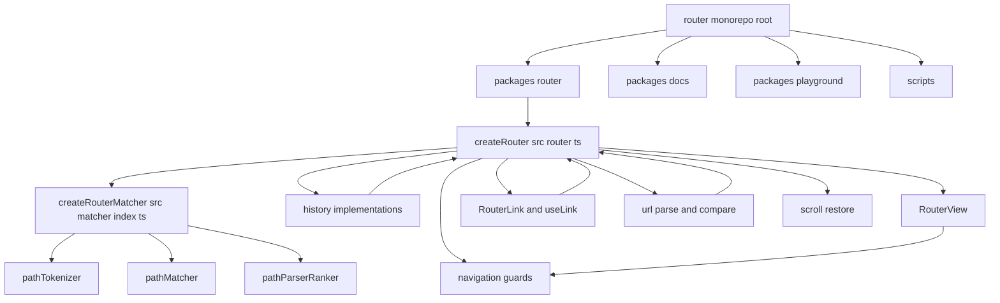

# Vue Router 源码复刻说明

## 目录

- 复刻源码目录：`/Users/nwyzx/Desktop/project/source/front_basic/vue-router-source`
- 文档目录：`/Users/nwyzx/Desktop/project/source/front_basic/docs/vue/router`
- 上游源码来源：`/Users/nwyzx/Desktop/project/source/router`
- 仓库形态：`pnpm workspace / monorepo`
- 核心包位置：`/Users/nwyzx/Desktop/project/source/router/packages/router`
- 核心包版本：`vue-router@5.1.0`

## 复刻范围

本次复刻现在按整个 `/source/router` 仓库根目录做 1:1 镜像，因此 `pnpm-workspace.yaml`、根级 `package.json`、`packages/*`、`scripts/*`、`docs/*` 等都在 `vue-router-source` 下保留。

其中，源码注释重点仍然集中在核心实现包 `packages/router`，主要覆盖：

- `packages/router/src/router.ts`
- `packages/router/src/matcher/index.ts`
- `packages/router/src/history/html5.ts`
- `packages/router/src/navigationGuards.ts`
- `packages/router/src/RouterView.ts`
- `packages/router/src/RouterLink.ts`
- `packages/router/src/location.ts`
- `packages/router/src/scrollBehavior.ts`

## 模块关系图

## 先读顺序

如果你是第一次啃这份源码，建议按这个顺序读：

1. `vue-router-source/pnpm-workspace.yaml`
2. `vue-router-source/package.json`
3. `vue-router-source/packages/router/src/router.ts`
4. `vue-router-source/packages/router/src/matcher/index.ts`
5. `vue-router-source/packages/router/src/location.ts`
6. `vue-router-source/packages/router/src/navigationGuards.ts`
7. `vue-router-source/packages/router/src/history/html5.ts`
8. `vue-router-source/packages/router/src/RouterView.ts`
9. `vue-router-source/packages/router/src/RouterLink.ts`
10. `vue-router-source/packages/router/src/scrollBehavior.ts`

## 核心结论

- `router.ts` 是总调度中心，负责把匹配、守卫、history、滚动恢复串起来。
- `matcher` 决定“这个地址命中谁”。
- `history` 决定“地址栏怎么变、前进后退怎么回流到 router”。
- `navigationGuards` 决定“导航在提交前要经过哪些异步关卡”。
- `RouterView` 决定“命中的 record 最终渲染哪个组件，并把实例回填给守卫系统”。

## 相关文档

- [阅读地图](./reading-guide.md)
- [导航主流程](./navigation-flow.md)
- [Matcher 与 History 机制](./matcher-history.md)
- [Tokenizer 与 Ranker](./matcher-tokenizer-ranker.md)
- [Route Config 到命中流程](./matcher-full-flow.md)
- [组件 API 到 Router 内核](./component-api-flow.md)
- [History 模式对照](./history-modes.md)
- [URL 规范化与编解码](./url-normalization.md)
- [运行时边角机制](./runtime-edge-mechanisms.md)
