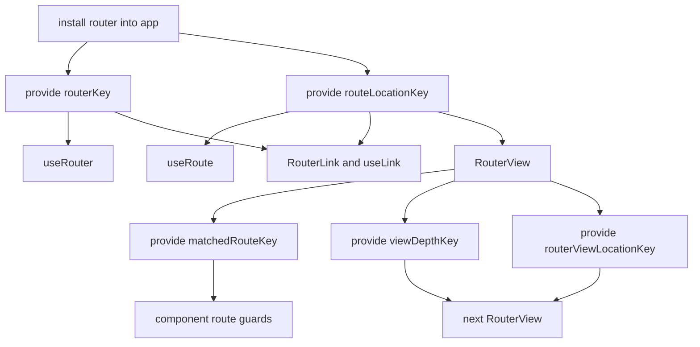
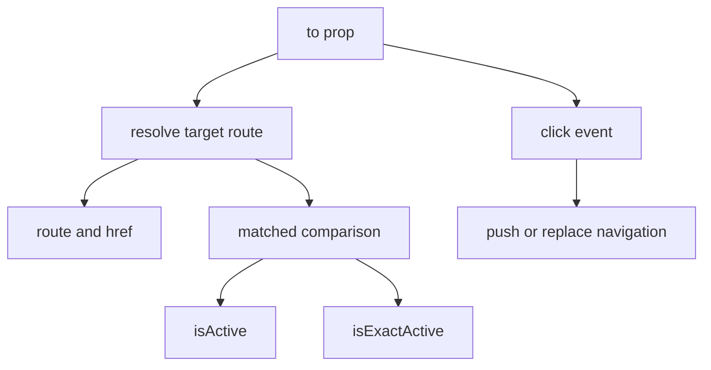
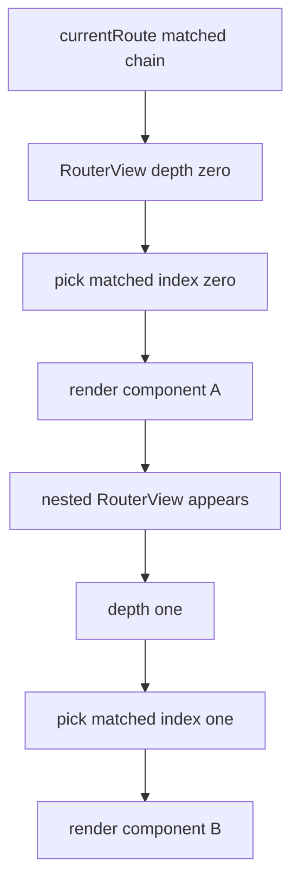
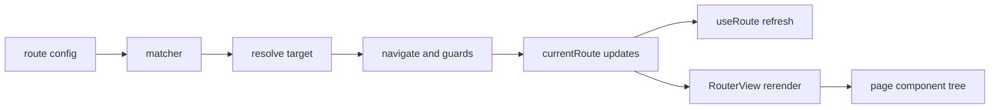

# 组件 API 到 Router 内核

## 总览

这一部分讲的是：

- `useRouter()`
- `useRoute()`
- `RouterLink`
- `RouterView`

它们不是独立系统，而是通过 `provide/inject` 接到 router 内核上的。

## `useRouter()` 和 `useRoute()` 很薄

文件：`vue-router-source/packages/router/src/useApi.ts`

这两个 API 几乎没有业务逻辑：

- `useRouter()`：读取 `routerKey`
- `useRoute()`：读取 `routeLocationKey`

真正重要的是它们背后的值是什么：

- `routerKey` 对应 router 实例
- `routeLocationKey` 对应响应式 `currentRoute`

所以当 `finalizeNavigation()` 更新 `currentRoute` 时，所有依赖 `useRoute()` 的组件都会自动刷新。

## `injectionSymbols.ts` 是连接层协议

文件：`vue-router-source/packages/router/src/injectionSymbols.ts`

这里定义的 symbol 可以看作“组件侧访问路由系统的内部协议”。

最关键的几个：

- `routerKey`
- `routeLocationKey`
- `matchedRouteKey`
- `viewDepthKey`
- `routerViewLocationKey`

## `RouterLink` 如何接上 router

`RouterLink` 本质上分两层：

1. `useLink()`：处理逻辑
2. `RouterLink` 组件：处理渲染

### `useLink()` 做了什么

关键点：

- `href` 不是手写拼接的，是 `router.resolve()` 的结果
- active 判断不是简单比较字符串，而是比较 `matched` 链和 `params`
- 点击时最终还是回到 `router.push()` / `router.replace()`

所以 `RouterLink` 只是 router 导航能力的组件化包装。

## `RouterView` 如何把 matched 链变成组件树

`RouterView` 的作用不是“读 currentRoute 然后直接渲染一个组件”这么简单。

它实际做了三件事：

1. 根据 `matched` 和当前 depth 选出本层要渲染的 record
2. 把组件实例回填到 route record
3. 用 `provide` 把上下文继续传给更深层 `RouterView`

### 渲染递归图

## 为什么 `matchedRouteKey` 很重要

组件级守卫 API：

- `onBeforeRouteLeave()`
- `onBeforeRouteUpdate()`

并不是直接去全局 router 注册，而是通过最近一层 `RouterView` 提供的 `matchedRouteKey`，把守卫挂到当前 route record 上。

这样导航发生时，router 才能精确知道：

- 哪些组件要离开
- 哪些组件会复用
- 哪些组件是新进入的

## 这一层和前面几篇文档怎么连起来

完整链路现在可以串成：

1. matcher 文档解释“地址如何命中 route”
2. navigation 文档解释“命中后如何过守卫”
3. 本文解释“确认后的 currentRoute 如何驱动组件树”

也就是：

