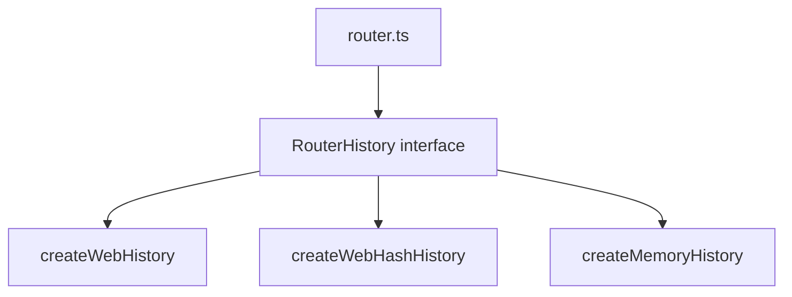
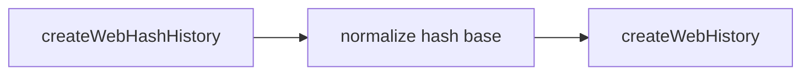
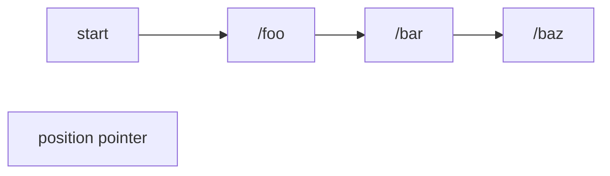
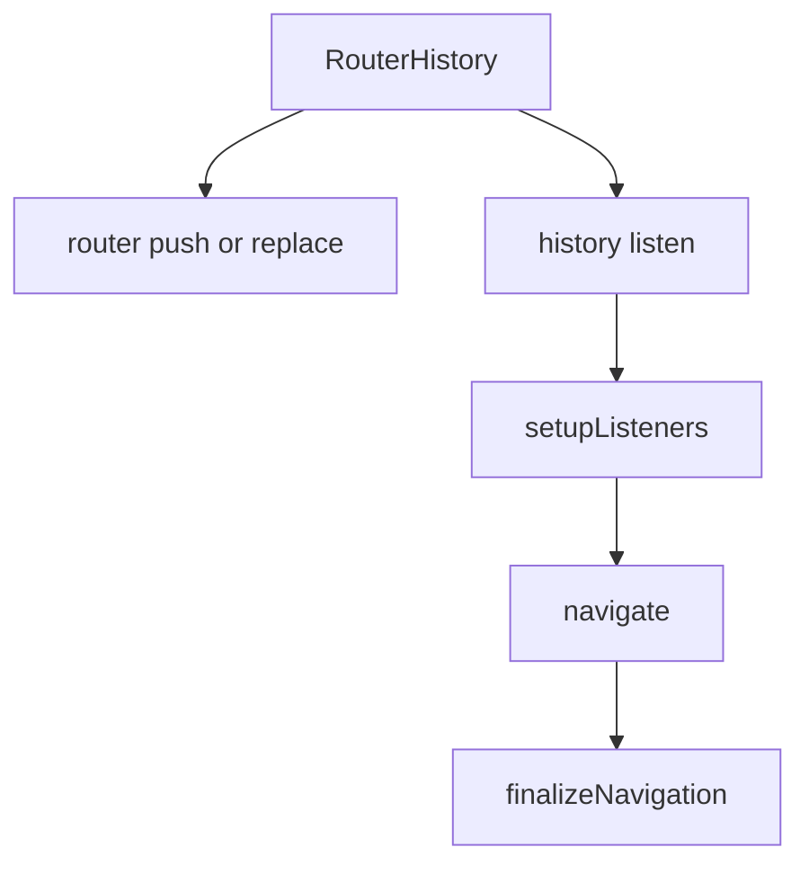

# History 模式对照

## 总览

vue-router 对外暴露了多种 history 创建函数，但 router 内核只认统一接口：`RouterHistory`。

也就是说，`router.ts` 并不关心你用的是：

- HTML5 history
- hash history
- memory history

它只关心这几个能力有没有：

- `location`
- `state`
- `push()`
- `replace()`
- `go()`
- `listen()`
- `createHref()`
- `destroy()`

## 统一抽象图

## 三种模式的核心差异

| 模式 | 地址存放位置 | 依赖浏览器 API | 典型用途 |
|---|---|---|---|
| `createWebHistory()` | `pathname + search + hash` | 是 | 常规 SPA |
| `createWebHashHistory()` | `location.hash` | 是 | 无法配服务器重写的静态部署 |
| `createMemoryHistory()` | 内存队列 | 否 | SSR、测试、非浏览器环境 |

## `common.ts` 负责什么

文件：`vue-router-source/packages/router/src/history/common.ts`

它定义了 history 层的公共协议：

- `RouterHistory`
- `NavigationType`
- `NavigationDirection`
- `HistoryState`
- `normalizeBase()`
- `createHref()`

可以把它理解成“history 子系统的接口层”。

## `createWebHistory()` 的特点

文件：`vue-router-source/packages/router/src/history/html5.ts`

它直接建立在浏览器原生能力之上：

- `history.pushState()`
- `history.replaceState()`
- `popstate`

它还额外维护了 `back/current/forward/position/scroll`，原因是原生 history API 不会直接告诉 router：

- 这次是前进还是后退
- 上一个地址是谁
- 滚动位置是什么

## `createWebHashHistory()` 为什么很薄

文件：`vue-router-source/packages/router/src/history/hash.ts`

它不是一套独立实现，而是：

1. 把 `base` 改造成带 `#` 的形式
2. 直接复用 `createWebHistory()`

所以它和 HTML5 history 的真正区别，不在导航逻辑，而在 URL 承载位置。

### 关系图

## `createMemoryHistory()` 的特点

文件：`vue-router-source/packages/router/src/history/memory.ts`

它完全不接浏览器，而是自己维护：

- `queue`
- `position`
- `listeners`

### 内存队列模型

调用行为：

- `push()`：队尾追加，必要时截断前进分支
- `replace()`：覆盖当前项
- `go()`：移动 `position`

## 三种模式和 router 的连接点

无论哪种 history，最后都会回到 `router.ts` 的这两个入口之一：

- 主动导航：`router.push()` / `router.replace()`
- 被动导航：`history.listen()` 回调

## 怎么选

- 要标准 URL，就用 `createWebHistory()`
- 无法做服务端重写，就用 `createWebHashHistory()`
- 不在浏览器里运行，或者做 SSR/测试，就用 `createMemoryHistory()`
