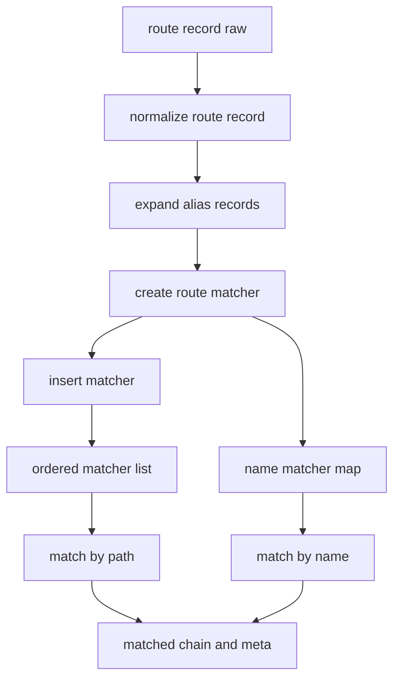
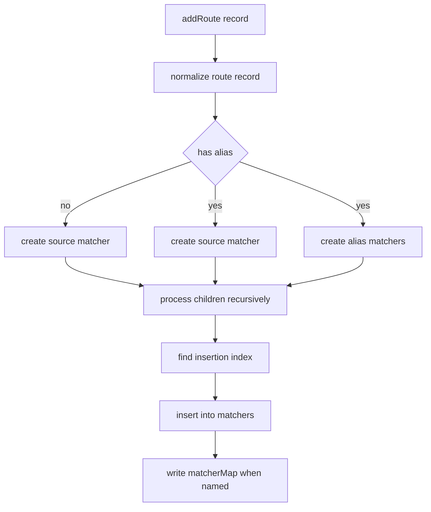
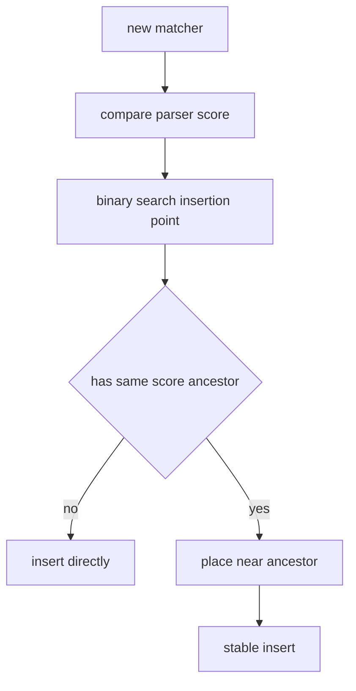

# Route Config 到命中流程

## 总览

前面的文档分别讲了：

- `tokenizePath()` 如何拆路径
- `tokensToParser()` 如何生成 regexp 和 score

这一篇补上后半段：这些 parser 最终是怎么被组织进 matcher，并在导航时参与命中的。

## `createRouterMatcher()` 是总装配层

文件：`vue-router-source/packages/router/src/matcher/index.ts`

它不是直接做路径解析，而是把前面已经编译好的 parser 组织成两个核心索引：

- `matchers`：按优先级排好序的线性表，服务 `path` 命中
- `matcherMap`：按 `name` 建立的索引，服务命名路由

你可以把它理解成：

- `tokensToParser()` 负责造零件
- `createRouterMatcher()` 负责组装整台机器

## `addRoute()` 做了什么

`addRoute()` 是 route config 真正进入 matcher 系统的入口。

### 处理步骤

1. `normalizeRouteRecord()`
2. 展开 alias
3. 用 `createRouteRecordMatcher()` 生成 matcher
4. 递归处理 children
5. 用 `findInsertionIndex()` 插入 `matchers`
6. 如果有 `name`，写入 `matcherMap`

### 结构图

## 为什么 alias 不是运行时重写

vue-router 这里的做法是：alias 在编译阶段直接展开成独立 matcher。

这样做的好处是：

- 命中时不需要额外分支判断
- alias 可以拥有完整的 children 匹配链
- removeRoute 时可以级联清理整组 alias

代价是：

- matcher 数量会增加
- addRoute 逻辑会更复杂

## `findInsertionIndex()` 为什么重要

仅仅有 `score` 还不够，还需要把 matcher 真正插到对的位置。

它分两步：

1. 用二分查找找到“按分数应落在哪”
2. 如果遇到同分，再参考祖先关系做 tie-break

### 插入逻辑图

## `resolve()` 的三种命中方式

### 1. `name` 命中

- 直接从 `matcherMap` 取 matcher
- 筛掉无效 params
- 通过 `matcher.stringify(params)` 反推出 path

这说明命名路由的核心不是“重新扫一遍 path”，而是“锁定规则后反向生成 URL”。

### 2. `path` 命中

- 顺序扫描 `matchers`
- 命中第一个 `re.test(path)` 成功的 matcher
- 调用 `matcher.parse(path)` 拿 params

这里之所以能直接取第一个，是因为 `matchers` 已经提前排好序。

### 3. 相对导航命中

- 复用当前路由的 matcher
- 合并 params
- 再次调用 `stringify()`

## `matched` 链为什么是最终产物

无论按哪种方式命中，最后都会构造一个 `matched` 链：

- 根 record 在前
- 当前叶子 record 在后

这个链直接驱动：

- `RouterView` 的嵌套渲染
- `meta` 合并
- 组件级守卫提取
- `RouterLink` 的 active 判断

所以 `resolve()` 的真正价值不是只得到一个 path，而是得到一整套可渲染、可守卫、可比较的路由上下文。
