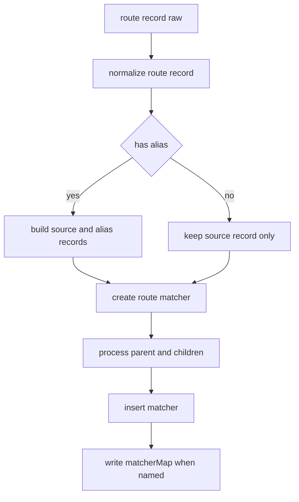
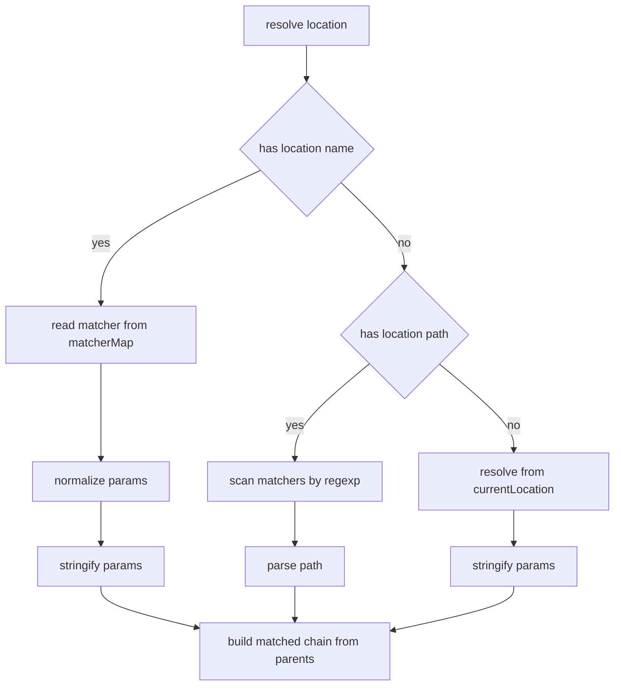
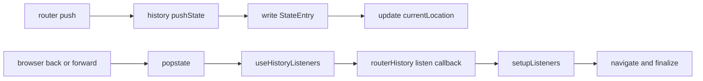

# Matcher 与 History 机制

## Matcher 负责什么

`packages/router/src/matcher/index.ts` 的职责不是“简单找路由”，而是把原始 route config 编译成一套可以高效解析的内部结构。

它主要做三件事：

1. 规范化 route record
2. 处理嵌套路由与 alias
3. 建立按优先级排序的 matcher 列表与按 name 索引的 map

## `addRoute()` 内部结构图

几个关键点：

- 子路由若不是绝对路径，会和父路由 path 拼接
- alias 不只是“名字不同”，它会生成独立 matcher
- 插入 `matchers` 时会按 score 排序，避免动态参数把静态路由盖住

## `resolve()` 的三条分支

`matcher.resolve()` 处理三类输入：

1. 传 `name`
2. 传 `path`
3. 传相对位置信息

## 为什么需要 `matched`

`matched` 是从根 record 到叶子 record 的有序链。它直接决定：

- `<RouterView>` 的嵌套渲染层级
- 组件级守卫的提取范围
- `RouterLink` 的 active / exact-active 判断
- route meta 的合并结果

## HTML5 History 的角色

`packages/router/src/history/html5.ts` 是 router 和浏览器原生 history API 之间的适配层。

它做的不是业务路由逻辑，而是状态运输：

- 把 `pushState/replaceState` 包成统一接口
- 监听 `popstate`
- 记录 `back/current/forward/position/scroll`
- 把浏览器后退事件回调给 router

## History 状态流

## `StateEntry` 为什么重要

浏览器原生 `history.state` 不知道：

- 上一个路由是谁
- 下一个路由是谁
- 这次是前进还是后退
- 当前滚动位置是多少

所以 vue-router 自己定义了 `StateEntry`，把这些信息补齐。这样才能支持：

- `scrollBehavior(savedPosition)`
- `NavigationDirection.forward/back`
- 更稳定的 `replace/push` 状态恢复
