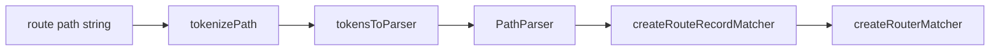
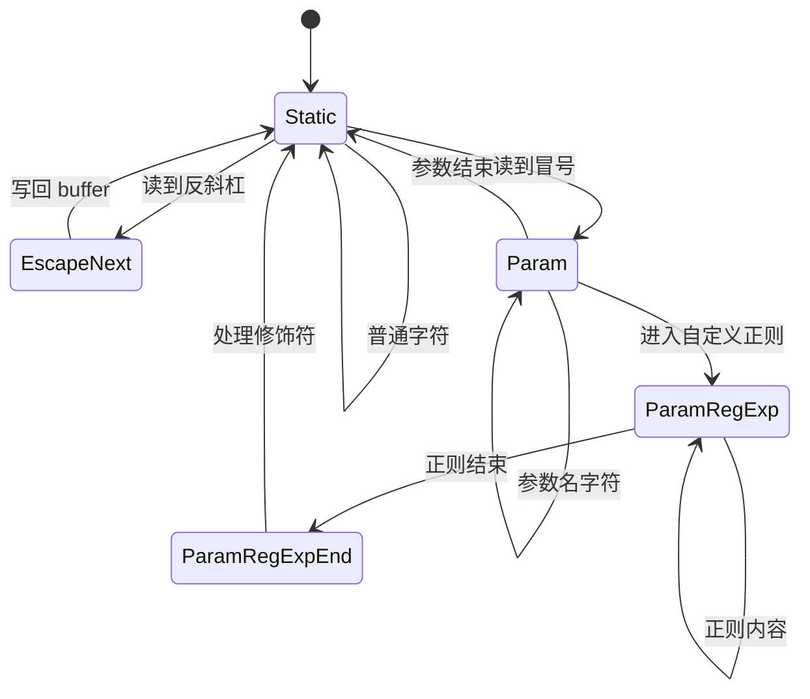
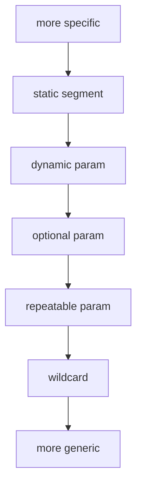

# Tokenizer 与 Ranker

## 这两个文件在整个 matcher 链路里的位置

`packages/router/src/matcher` 里最核心的编译链路是：

可以把它理解成两步：

1. `tokenizePath()` 把路径切成结构化 token
2. `tokensToParser()` 把 token 编译成 regexp、score、parse、stringify

## `tokenizePath()` 做了什么

文件：`vue-router-source/packages/router/src/matcher/pathTokenizer.ts`

它不是简单的 `split('/')`，而是一个小型状态机。

它要识别这些语法：

- 静态片段：`/users`
- 动态参数：`/:id`
- 自定义正则：`/:id(\\d+)`
- 可选参数：`/:id?`
- 可重复参数：`/:ids+`
- 通配参数：`/:pathMatch(.*)*`

### 状态机图

## `tokensToParser()` 产出什么

文件：`vue-router-source/packages/router/src/matcher/pathParserRanker.ts`

它会生成一个 `PathParser`，里面有四样关键东西：

- `re`：真正用来匹配 URL 的正则
- `score`：这条路由的优先级分数
- `parse()`：把路径解析成 params
- `stringify()`：把 params 还原成路径

## 为什么还需要 `score`

因为很多路由的 regexp 都可能同时命中，必须再加一层“谁优先”的规则。

例如：

- `/users/new`
- `/users/:id`

如果只按声明顺序或只看 regexp，动态路由很容易先吞掉静态路由。`score` 的目的就是确保更具体的规则排在前面。

### 优先级直觉

## `parse()` 和 `stringify()` 为什么必须放一起

这两个能力必须共用同一套 token 规则，否则就会出现：

- 能匹配，但不能正确回填 URL
- 能生成 URL，但生成的 URL 不符合匹配规则

所以 vue-router 在同一个 `PathParser` 里同时保留：

- 正向：`parse(path)`
- 反向：`stringify(params)`

这也是命名路由能可靠工作的基础。
