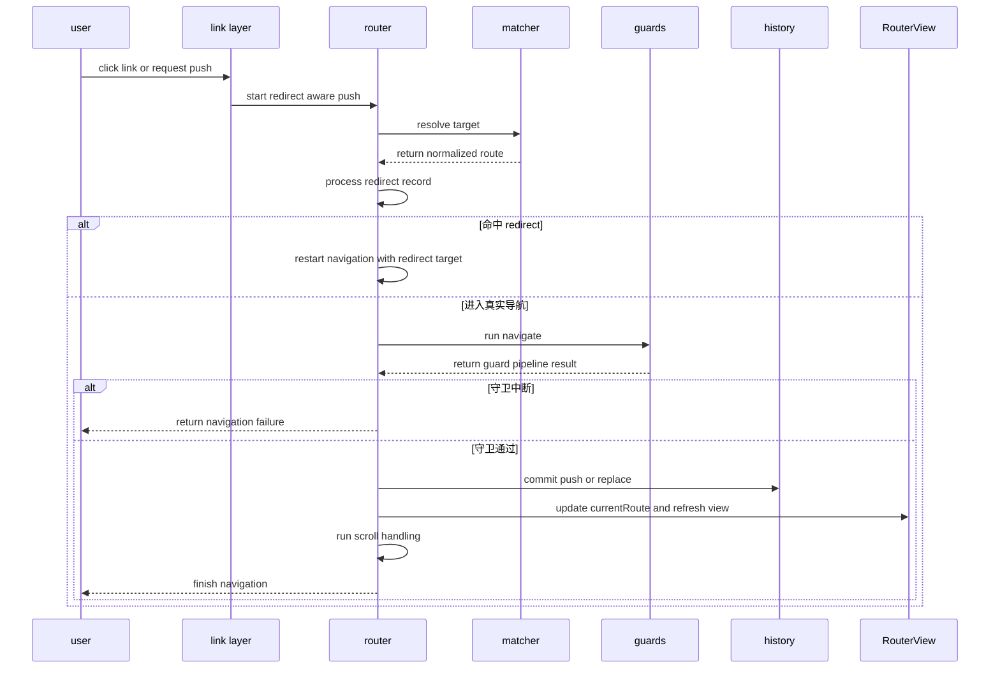
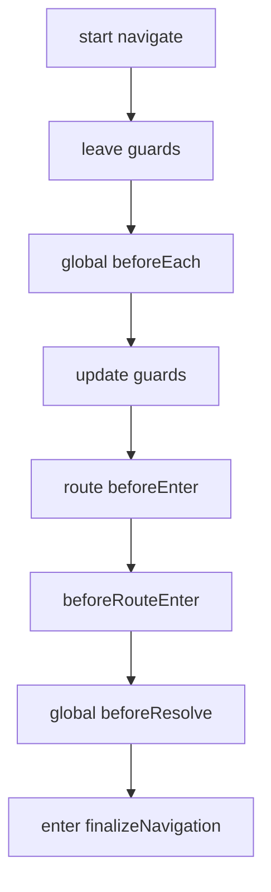

# 导航主流程

## 总览

`router.push()`、浏览器前进后退、`<RouterLink>` 点击，最终都会汇入 `src/router.ts` 的导航主链路。核心入口有两个：

- 主动导航：`pushWithRedirect()`
- 被动导航：`setupListeners()` 中注册的 `routerHistory.listen()`

## 导航时序图

## `pushWithRedirect()` 做了什么

位置：`vue-router-source/packages/router/src/router.ts`

它负责把一次导航整理成以下几个阶段：

1. 调用 `resolve()` 把字符串或对象地址转成标准化的 `RouteLocation`
2. 检查 route record 上是否声明了 `redirect`
3. 判断是否是重复导航
4. 执行 `navigate()` 跑完整套守卫队列
5. 若守卫返回重定向，则递归发起下一轮 `pushWithRedirect()`
6. 守卫通过后调用 `finalizeNavigation()` 真正提交导航

## `navigate()` 的守卫顺序

`navigate()` 是整套“导航准入系统”的核心。它把不同来源的守卫统一转成 Promise 队列后串行执行。

补充说明：

- `beforeRouteLeave` 从里到外执行，所以源码里会先 `reverse()`
- `beforeRouteEnter` 特殊在于它拿不到组件实例，因此回调会先缓存到 `enterCallbacks`
- 任意一步如果出现更新中的新导航，`pendingLocation` 会让旧导航被取消

## `finalizeNavigation()` 做了什么

这个阶段代表“导航已经被确认”。

它的职责很集中：

1. 再次检查这次导航是否已经被后来的导航取消
2. 根据 `push/replace/首次导航` 决定如何写入 history
3. 更新 `currentRoute`
4. 触发 `handleScroll()`
5. 标记 router ready

## 浏览器前进后退为什么也会走同一套流程

`createWebHistory()` 内部会监听 `popstate`，再通过 `routerHistory.listen()` 回到 `setupListeners()`。

也就是说：

- 地址栏变化来自浏览器
- 真正的路由匹配、守卫执行、视图刷新仍然统一走 `router.ts`

这样 `push()` 和浏览器后退不会有两套逻辑。
