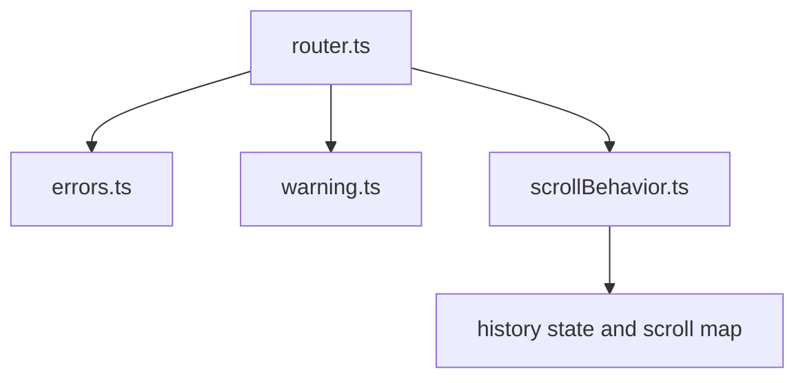
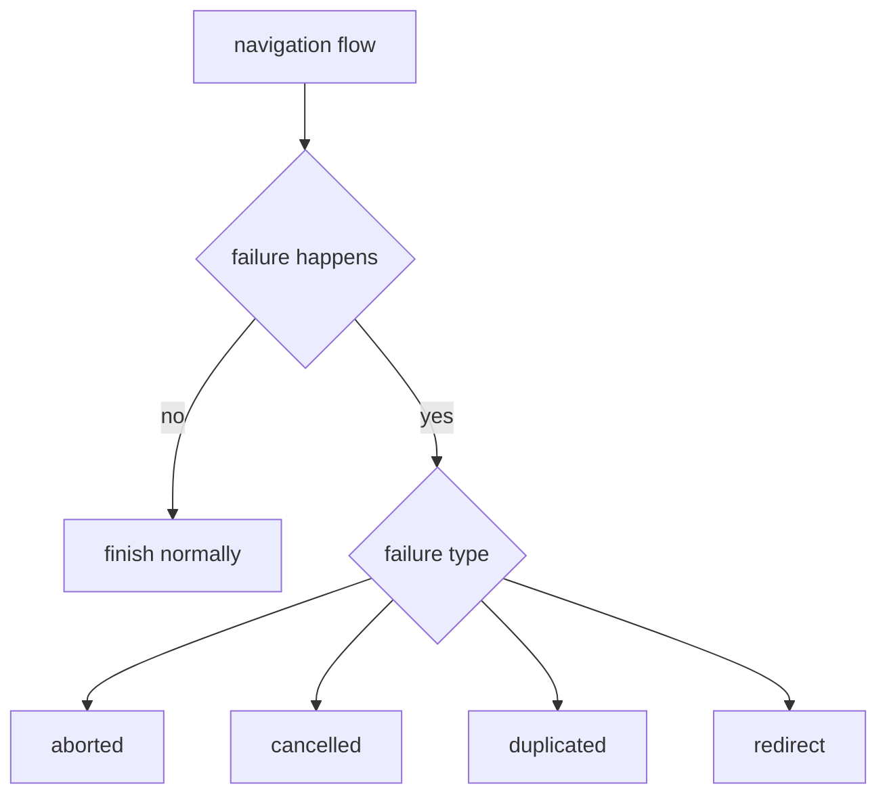
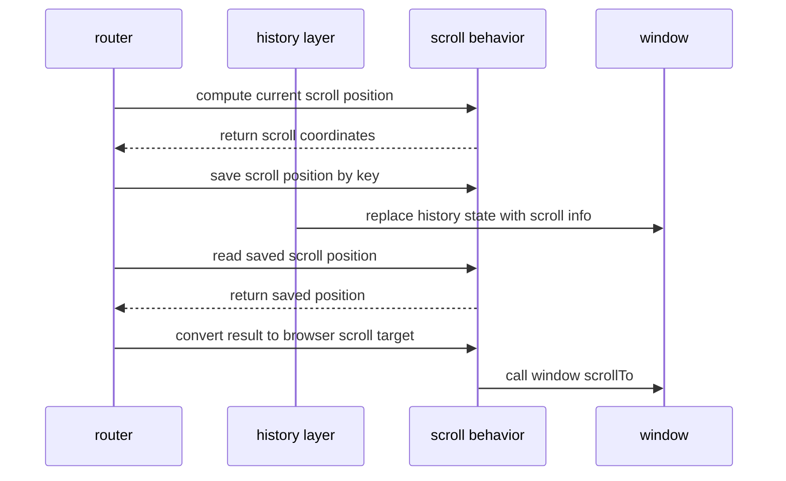
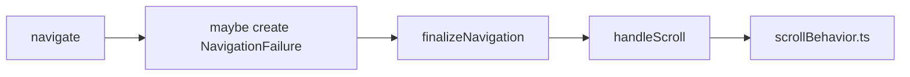

# 运行时边角机制

## 总览

这一组不是 router 主链路中心，但对实际运行非常关键：

- `errors.ts`
- `warning.ts`
- `scrollBehavior.ts`

它们分别处理：

- 导航失败的类型化表达
- 开发期告警输出
- 滚动位置保存与恢复

## `errors.ts` 的核心思想

vue-router 并不把所有失败都当成“程序异常”。

它区分了两类东西：

- 真异常：代码 bug、未知错误
- 导航失败：路由系统可预期的失败结果

### 主要失败类型

- `aborted`
- `cancelled`
- `duplicated`
- 内部还有 `redirect`

### 关系图

## 为什么用位标记

`ErrorTypes` 采用位标记设计，这样可以做组合判断：

- 只判断 `duplicated`
- 或同时判断 `aborted | cancelled`

这也是 `isNavigationFailure()` 可以支持位运算过滤的原因。

## `warning.ts` 很小，但很重要

它只是一个统一的 `warn()` 包装，但价值在于：

- 所有开发期告警带统一前缀
- 降低散落 `console.warn` 的维护成本
- 兼容旧环境的参数处理方式

很多源码里的“源码阅读提示”其实都通过它输出。

## `scrollBehavior.ts` 负责什么

它处理的不是“何时滚动”，而是“怎么表示、保存、恢复滚动位置”。

主要能力有：

- 采集当前位置：`computeScrollPosition()`
- 把目标位置转成浏览器可执行参数：`scrollToPosition()`
- 生成滚动缓存 key：`getScrollKey()`
- 暂存与消费滚动状态：`saveScrollPosition()` / `getSavedScrollPosition()`

## 滚动恢复流程

## 为什么滚动 key 不是只用 path

因为同一路径可能对应多个历史位置。

例如：

1. `/list` 向下滚动
2. 进入详情页
3. 再返回 `/list`

如果只按 path 存滚动值，会把不同历史项混在一起。  
所以这里会结合 `history.state.position` 生成 key。

## `scrollToPosition()` 的两种输入

它既支持：

- 直接坐标 `{ left, top }`
- 元素定位 `{ el, top, left }`

这样 `scrollBehavior()` 可以返回：

- 纯坐标恢复
- 锚点滚动
- 基于元素偏移的滚动

## 这组机制在主流程里的位置

可以把它们理解成“导航确认前后的小型基础设施”：

- `errors.ts`：定义失败语义
- `warning.ts`：定义开发期反馈
- `scrollBehavior.ts`：定义页面滚动恢复

