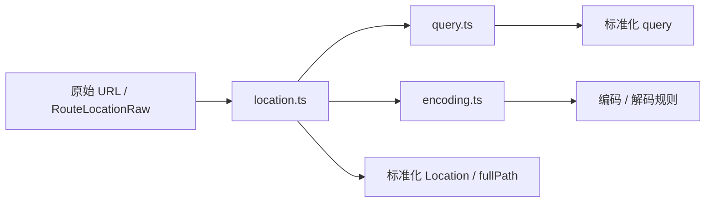
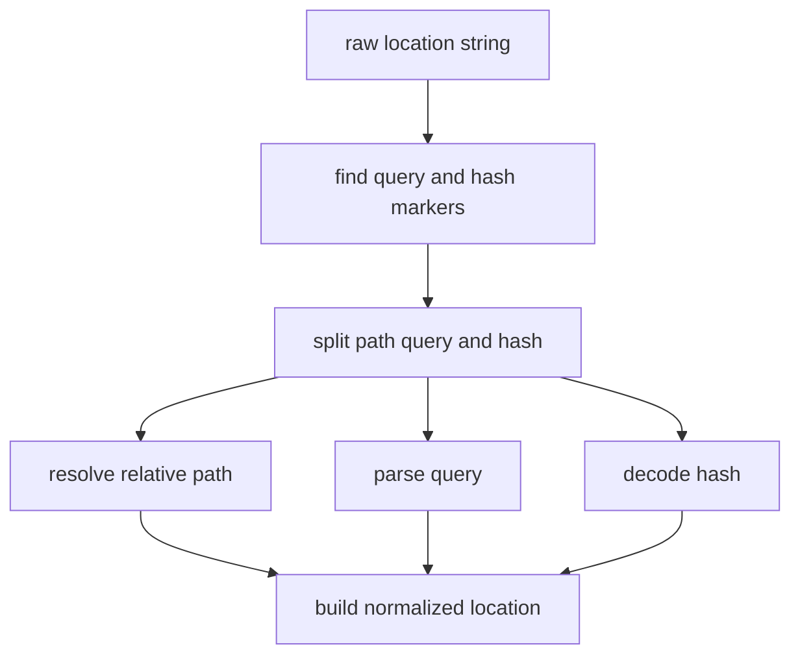
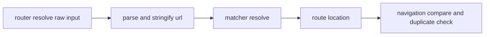

# URL 规范化与编解码

## 总览

这一层解决的是：用户传进来的原始 URL 字符串，怎么被拆开、编码、规范化，再变成 router 能稳定比较和匹配的结构。

核心文件有三份：

- `packages/router/src/encoding.ts`
- `packages/router/src/query.ts`
- `packages/router/src/location.ts`

它们的分工是：

## `encoding.ts` 负责字符级规则

它只关心“某个字符该不该编码”，不关心路由匹配语义。

### 主要函数

- `commonEncode()`
- `encodePath()`
- `encodeParam()`
- `encodeQueryValue()`
- `encodeQueryKey()`
- `encodeHash()`
- `decode()`

### 为什么要区分 `path` 和 `param`

因为：

- `path` 里的 `/` 是合法分隔符
- `param` 里的 `/` 如果不编码，会把一个参数拆成多个 segment

所以 `encodeParam()` 会比 `encodePath()` 多编码一个 `/`。

## `query.ts` 负责键值结构

它只处理 `?` 后面的对象语义。

### `parseQuery()`

- `a=1&b=2` -> `{ a: '1', b: '2' }`
- `a=1&a=2` -> `{ a: ['1', '2'] }`
- `flag` -> `{ flag: null }`

### `stringifyQuery()`

- 只返回 `a=1&b=2`
- 不自动补 `?`

### `normalizeQuery()`

它把宽松输入收敛成内部稳定结构：

- number -> string
- undefined -> 删除
- 数组里的 `undefined` -> `null`

## `location.ts` 负责 URL 结构层

这里处理的是完整 URL 的结构语义：

- path
- query
- hash
- 相对路径
- `fullPath`

### `parseURL()` 流程

## 为什么 `parseURL()` 不直接用原生 `URL`

源码里已经明确做了取舍：

- 原生 `URL` / `URLSearchParams` 更通用
- 但性能更差
- 相对路径控制也不如手写逻辑直接

所以 vue-router 在这里选择了轻量字符串解析。

## `resolveRelativePath()` 负责什么

它只处理 path 级别的相对跳转，比如：

- `./child`
- `../sibling`
- `../../root`

它不处理 query/hash，这两部分会在 `parseURL()` 外层单独拼回。

## `stringifyURL()` 做什么

它和 `parseURL()` 基本互逆：

1. path 直接使用
2. query 交给 `stringifyQuery()`
3. hash 拼回去

最终得到 `fullPath`。

## 这一层和 router 主流程的关系

在 `router.resolve()` 里，这一层主要承担两件事：

- 把字符串地址拆成结构化对象
- 生成可比较的 `fullPath/query/hash`

## 为什么这一层很关键

如果没有这层统一规范化，router 会在很多地方变得不稳定：

- 重复导航判断会失真
- `RouterLink href` 会和真实导航目标不一致
- query/hash 编码会前后不统一
- 动态参数和 path 比较会出现歧义
