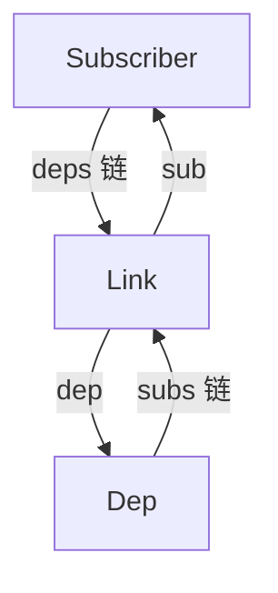
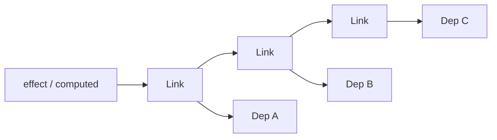
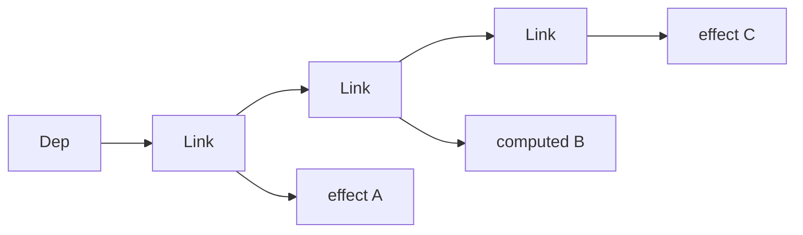
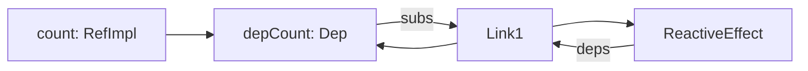
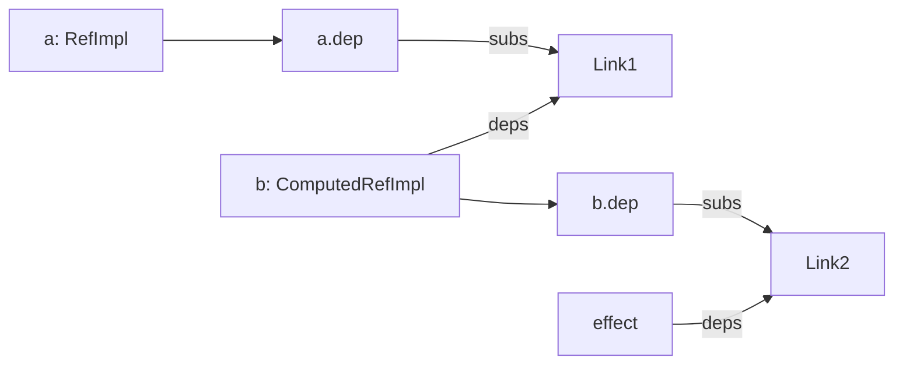
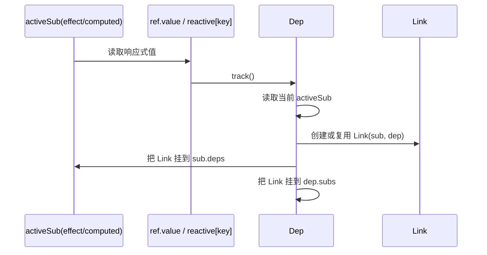
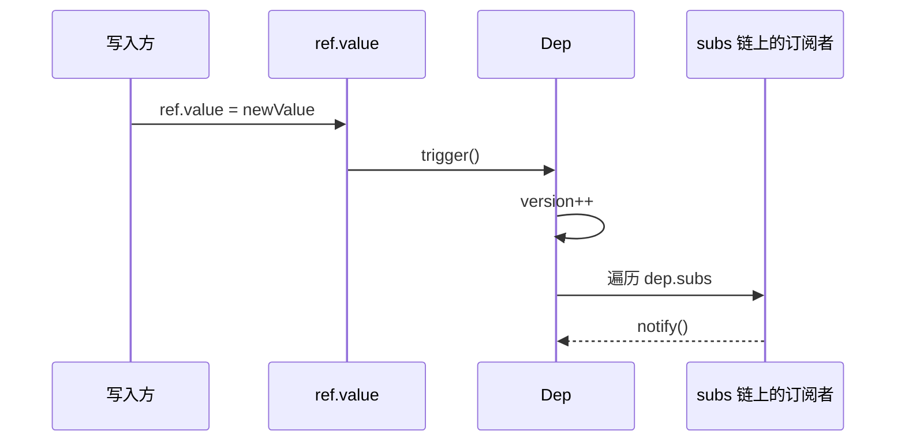
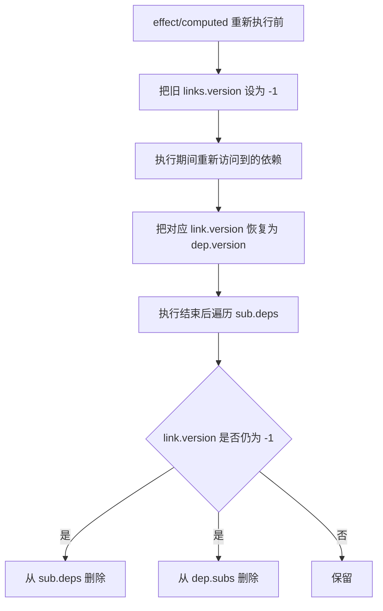
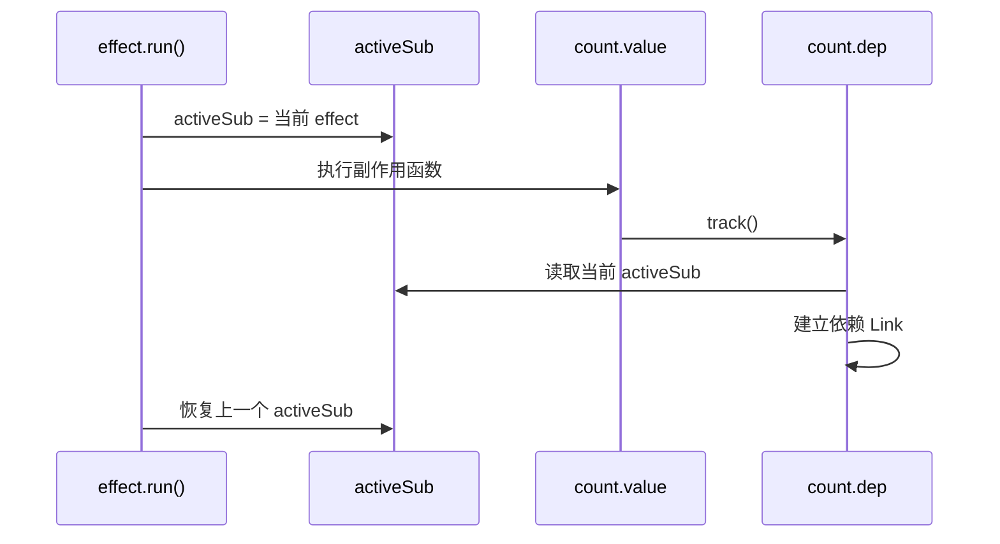
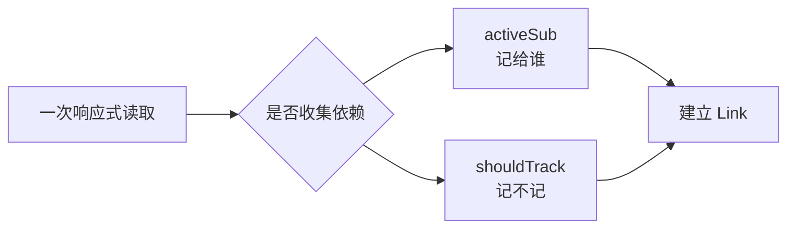

# Vue Reactivity 中 `ref`、`Dep`、`Link`、`effect`、`computed` 的关系

这篇文档聚焦 Vue 3 响应式系统里最容易绕晕的一段实现：

- `ref`
- `Dep`
- `Link`
- `ReactiveEffect`
- `ComputedRefImpl`

核心结论先放前面：

- `Dep` 不是双向链表节点，它更像“某个响应式点的依赖管理器”
- 真正的双向链表节点是 `Link`
- 一个 `Link` 同时挂在两条双向链表里
- `computed` 既是订阅者，也是可被订阅的数据源

## 0. 总览图

先看一张总图，再往下拆：

```mermaid
flowchart LR
    A[ref.value / reactive[key] / computed.value] --> B[Dep]
    B <--> C[Link]
    C <--> D[Subscriber]
    D --> E[ReactiveEffect]
    D --> F[ComputedRefImpl]
```

这里每个角色的职责是：

- `ref/reactive/computed.value`
  表示一个具体的响应式读取点
- `Dep`
  表示这个读取点对应的依赖管理器
- `Link`
  表示一条订阅关系
- `Subscriber`
  表示依赖这个读取点的订阅者，可能是 `effect`，也可能是 `computed`

## 1. 先看角色分工

### `ref`

`ref` 是一个带 `.value` 访问器的包装对象。  
读 `.value` 时收集依赖，写 `.value` 时触发依赖。

源码位置：

- [packages/reactivity/src/ref.ts](/Users/nwyzx/Desktop/project/source/core/packages/reactivity/src/ref.ts:114)

可以先粗暴记成：

```ts
class RefImpl {
  dep = new Dep()

  get value() {
    this.dep.track()
    return this._value
  }

  set value(v) {
    this._value = v
    this.dep.trigger()
  }
}
```

### `Dep`

`Dep` 表示“某个响应式读取点”的依赖集合。

例如：

- 一个 `ref.value`，对应一个 `Dep`
- 一个 `reactiveObj.foo`，对应一个 `Dep`
- 一个 `computed.value`，也对应一个 `Dep`

源码位置：

- [packages/reactivity/src/dep.ts](/Users/nwyzx/Desktop/project/source/core/packages/reactivity/src/dep.ts:59)

### `ReactiveEffect`

`effect(() => {})` 创建出来的订阅者。  
它会记录“我依赖了哪些 dep”。

源码位置：

- [packages/reactivity/src/effect.ts](/Users/nwyzx/Desktop/project/source/core/packages/reactivity/src/effect.ts:73)

### `ComputedRefImpl`

`computed()` 的实现。  
它本身也是一个订阅者，但它自己的 `.value` 又可以被别人依赖。

源码位置：

- [packages/reactivity/src/computed.ts](/Users/nwyzx/Desktop/project/source/core/packages/reactivity/src/computed.ts:42)

### `Link`

`Link` 表示“一条依赖关系”。

比如：

- `effectA` 依赖 `depX`
- `computedB` 依赖 `depY`

每一条这样的关系，都会有一个 `Link` 实例。

源码位置：

- [packages/reactivity/src/dep.ts](/Users/nwyzx/Desktop/project/source/core/packages/reactivity/src/dep.ts:32)

## 2. 它是不是双向链表

是，但要说准确一点：

- 不是“`Dep` 本身是双向链表”
- 而是“`Dep` 和订阅者之间的关系，由 `Link` 组成两套双向链表”

`Link` 上有两组指针：

```ts
nextDep / prevDep
nextSub / prevSub
```

含义分别是：

- `nextDep / prevDep`
  这条 `Link` 在“某个订阅者的 deps 链”里的前后节点
- `nextSub / prevSub`
  这条 `Link` 在“某个 dep 的 subs 链”里的前后节点

所以一个 `Link` 同时属于两条双向链表。

## 3. 依赖关系总图

```text
ref.value / reactive[key] / computed.value
                │
                ▼
              Dep
     (某个响应式点的依赖桶)
                │
                │  通过 Link 连接
                ▼
          +-------------+
          |    Link     |
          | sub <-> dep |
          +-------------+
                │
                ▼
      Subscriber(effect/computed)
```

把链表维度展开后，是这样：

```text
Subscriber 这一侧:

effect.deps
LinkA <-> LinkB <-> LinkC

表示:
这个 effect 依赖了多个 dep


Dep 这一侧:

dep.subs
LinkX <-> LinkA <-> LinkY

表示:
这个 dep 被多个 effect / computed 订阅
```

也可以画成结构图：



如果把双向链表的两条维度分开看：



上面表示：

- 从订阅者出发，可以看到“我依赖了哪些 dep”

另一边：



这表示：

- 从 `Dep` 出发，可以看到“谁依赖了我”

## 4. 为什么要有两条链

因为 Vue 需要同时高效处理两个方向的问题。

### 从 `Dep` 找订阅者

当数据变化时，需要知道：

“谁依赖了我，我该通知谁？”

这就需要：

- `dep.subs`

### 从订阅者找 `Dep`

当 `effect` 或 `computed` 重新执行后，需要知道：

“我这次还依赖之前那些 dep 吗？哪些应该删掉？”

这就需要：

- `sub.deps`

所以它不是简单的 `Set<effect>`，而是双向可追踪的关系结构。

## 5. `ref -> dep -> effect` 的最小模型

先看一个最简单的例子：

```ts
const count = ref(1)

effect(() => {
  console.log(count.value)
})
```

依赖图大致是：

```text
count (RefImpl)
└─ depCount: Dep
   └─ subs 链
      └─ Link1 ----> effect

effect (ReactiveEffect)
└─ deps 链
   └─ Link1 ----> depCount
```

注意：

- 这里只有一个 `Link1`
- 但它同时被挂在两边

也就是说：

- `depCount` 通过 `Link1` 知道 `effect` 订阅了自己
- `effect` 通过 `Link1` 知道自己依赖了 `depCount`

对应图如下：



## 6. `computed` 为什么更绕

看这个例子：

```ts
const a = ref(1)
const b = computed(() => a.value + 1)

effect(() => {
  console.log(b.value)
})
```

这里有两层依赖。

### 第一层

`b` 依赖 `a`

```text
a.dep  <---- Link1 ---->  b(computed)
```

### 第二层

`effect` 依赖 `b.value`

```text
b.dep  <---- Link2 ---->  effect
```

完整图：

```text
a (RefImpl)
└─ depA: Dep
   └─ subs 链
      └─ Link1 ----> b (ComputedRefImpl)

b (ComputedRefImpl)
├─ dep: Dep
├─ deps 链
│  └─ Link1 ----> depA
└─ subs 链
   └─ Link2 ----> effect

effect (ReactiveEffect)
└─ deps 链
   └─ Link2 ----> b.dep
```

这就是为什么说 `computed` 有双重身份：

- 它是订阅者
  因为它依赖 `a`
- 它也是被依赖的数据源
  因为 `effect` 会读取 `b.value`

图上可以拆成两层：



读法是：

- `b` 作为订阅者，依赖 `a.dep`
- `effect` 作为订阅者，依赖 `b.dep`

## 7. 读取时发生了什么

### 场景一：读取 `ref.value`

执行：

```ts
count.value
```

会进入 [ref.ts](/Users/nwyzx/Desktop/project/source/core/packages/reactivity/src/ref.ts:128) 的 getter，内部调用：

```ts
this.dep.track()
```

接着在 [dep.ts](/Users/nwyzx/Desktop/project/source/core/packages/reactivity/src/dep.ts:88)：

1. 找到当前正在运行的订阅者 `activeSub`
2. 如果这次是新的依赖关系，就创建 `new Link(activeSub, this)`
3. 把这条 `Link` 插入订阅者自己的 `deps` 链
4. 再把这条 `Link` 插入当前 `dep` 的 `subs` 链

也就是：

```text
读 value
 -> dep.track()
 -> 创建 Link(sub, dep)
 -> 挂到 sub.deps
 -> 挂到 dep.subs
```

对应流程图：



### 场景二：读取 `computed.value`

`computed.value` 的 getter 在 [computed.ts](/Users/nwyzx/Desktop/project/source/core/packages/reactivity/src/computed.ts:129)。

它做两件事：

1. `this.dep.track()`
   让外部 effect 订阅这个 computed
2. `refreshComputed(this)`
   检查缓存是否失效，必要时重新计算

所以读取 `computed.value` 时，既有“收集谁依赖 computed”，也有“computed 自己是否要重新求值”。

## 8. 写入时发生了什么

### `ref.value = newValue`

写入时会进入 [ref.ts](/Users/nwyzx/Desktop/project/source/core/packages/reactivity/src/ref.ts:141) 的 setter：

```ts
this.dep.trigger()
```

然后在 [dep.ts](/Users/nwyzx/Desktop/project/source/core/packages/reactivity/src/dep.ts:152)：

1. `dep.version++`
2. `globalVersion++`
3. `notify()`

`notify()` 会沿着 `dep.subs` 链，把订阅者找出来逐个通知。

```text
写 value
 -> dep.trigger()
 -> 遍历 dep.subs
 -> 通知 effect / computed
```

对应流程图：



### 如果订阅者是 computed

`ComputedRefImpl.notify()` 在 [computed.ts](/Users/nwyzx/Desktop/project/source/core/packages/reactivity/src/computed.ts:103)：

- 先把自己标记为 `DIRTY`
- 再批量调度

它不会立刻重新执行 getter，而是等下次有人读取 `computed.value` 时再真正计算。

这就是 computed 的“懒求值”。

## 9. 旧依赖是怎么清理的

这是这套设计里最关键的一点。

`effect` 每次重新执行时，依赖可能变。

例如：

```ts
effect(() => {
  if (flag.value) {
    console.log(a.value)
  } else {
    console.log(b.value)
  }
})
```

如果上一次读了 `a.value`，下一次读了 `b.value`，那旧的 `a` 依赖必须删掉。

Vue 的做法不是“全部清空再重建”，而是：

1. 执行前，把旧 links 的 `version` 设成 `-1`
   见 [effect.ts](/Users/nwyzx/Desktop/project/source/core/packages/reactivity/src/effect.ts:312)
2. 本轮执行中，凡是真正又访问到的依赖，会把 `link.version` 同步回 `dep.version`
3. 执行后遍历 `sub.deps`
4. 仍然是 `-1` 的 link，说明这次没用到，删除

清理逻辑在：

- [effect.ts](/Users/nwyzx/Desktop/project/source/core/packages/reactivity/src/effect.ts:324)
- [effect.ts](/Users/nwyzx/Desktop/project/source/core/packages/reactivity/src/effect.ts:432)

这就是为什么双向链表很重要：

- 从 `sub.deps` 能找到自己挂过哪些 dep
- 删的时候又能同时从 `dep.subs` 中摘掉

可以把这段过程看成：



## 10. 一句话总结整个原理

可以把它记成下面这四句话：

1. 每个响应式读取点都有一个 `Dep`
2. 每个 `effect` / `computed` 都是一个订阅者 `Subscriber`
3. `Dep` 和 `Subscriber` 的每条关系都由一个 `Link` 表示
4. `Link` 同时挂在 `dep.subs` 和 `sub.deps` 两条双向链表里

再压缩成一张图：

```text
响应式值(ref/reactive/computed)
        │
        ▼
       Dep
        │
     Link(Link 是关系节点)
        │
        ▼
effect / computed
```

如果要继续往下看源码，建议顺序是：

1. [packages/reactivity/src/ref.ts](/Users/nwyzx/Desktop/project/source/core/packages/reactivity/src/ref.ts:114)
2. [packages/reactivity/src/dep.ts](/Users/nwyzx/Desktop/project/source/core/packages/reactivity/src/dep.ts:32)
3. [packages/reactivity/src/effect.ts](/Users/nwyzx/Desktop/project/source/core/packages/reactivity/src/effect.ts:73)
4. [packages/reactivity/src/computed.ts](/Users/nwyzx/Desktop/project/source/core/packages/reactivity/src/computed.ts:42)

## 11. `active effect` / `activeSub` 应该怎么理解

这也是响应式系统里最关键的一个“运行时上下文”概念。

一句话先记住：

- `active effect` 的意思是“当前这段代码正在替谁收集依赖”

在这版实现里，源码变量名其实叫 `activeSub`，定义在：

- [packages/reactivity/src/effect.ts](/Users/nwyzx/Desktop/project/source/core/packages/reactivity/src/effect.ts:32)

```ts
export let activeSub: Subscriber | undefined
```

它不是某个 `Dep` 上的字段，而是一个模块级的全局运行时变量。

### 为什么需要 `activeSub`

当你读取：

```ts
count.value
```

`count` 自己其实不知道：

- 是谁在读我
- 这次读取要把依赖登记到谁头上

所以 `dep.track()` 必须去看一个“当前上下文”。

这个上下文就是：

- `activeSub`

也就是：

- 如果当前正在执行某个 `effect`
  那依赖就记到这个 `effect`
- 如果当前正在重新计算某个 `computed`
  那依赖就记到这个 `computed`
- 如果当前根本不在响应式副作用执行期间
  那这次读取就不收集依赖

### `effect` 执行时怎么设置它

在 [effect.ts](/Users/nwyzx/Desktop/project/source/core/packages/reactivity/src/effect.ts:140) 左右，`ReactiveEffect.run()` 里有这段核心逻辑：

```ts
const prevEffect = activeSub
const prevShouldTrack = shouldTrack
activeSub = this
shouldTrack = true

try {
  return this.fn()
} finally {
  activeSub = prevEffect
  shouldTrack = prevShouldTrack
}
```

它的含义是：

1. 先保存上一个 `activeSub`
2. 把当前 effect 设为新的 `activeSub`
3. 执行用户传入的副作用函数
4. 执行结束后，再恢复现场

所以在 `this.fn()` 执行期间，任何响应式读取都会知道：

- “当前应该把依赖记到这个 effect 身上”

流程图：

```mermaid
flowchart TD
    A[ReactiveEffect.run / refreshComputed] --> B[保存上一个 activeSub]
    B --> C[activeSub = 当前订阅者]
    C --> D[shouldTrack = true]
    D --> E[执行用户函数]
    E --> F[期间发生响应式读取]
    F --> G[dep.track() 读取 activeSub]
    G --> H[把依赖记到当前订阅者]
    H --> I[执行结束]
    I --> J[恢复 activeSub 和 shouldTrack]
```

### 最小执行流程

```ts
const count = ref(0)

effect(() => {
  console.log(count.value)
})
```

运行时可以理解成：

```text
effect.run()
  -> activeSub = 当前 effect
  -> 执行 fn()
  -> 读取 count.value
  -> count.dep.track()
  -> track() 看到 activeSub 存在
  -> 建立 count.dep <-> effect 的 Link
  -> effect 结束
  -> activeSub 恢复
```

也可以画成时序图：



### `computed` 也会成为 `activeSub`

很多人一开始会误以为只有 `effect` 才是 active effect，其实 `computed` 重新求值时也一样。

在 [effect.ts](/Users/nwyzx/Desktop/project/source/core/packages/reactivity/src/effect.ts:395) 左右的 `refreshComputed()` 里：

```ts
activeSub = computed
shouldTrack = true
```

也就是说：

- `computed(() => a.value + 1)` 在求值时
- 读取 `a.value`
- `a.dep.track()` 会把依赖记到这个 computed 身上

所以 `computed` 才能知道自己依赖了哪些响应式值。

### 为什么要先保存再恢复

因为 effect / computed 可能嵌套执行。

例如：

```ts
effect(() => {
  console.log(a.value)
  console.log(b.value)
})
```

或者更复杂一点：

```ts
effect(() => {
  console.log(c.value)
})
```

而 `c.value` 的计算内部又会访问别的响应式值。

这时就会出现“当前订阅者上下文切换”的问题：

- 外层是 effect
- 内层可能是 computed

所以必须：

1. 进入内层前保存旧的 `activeSub`
2. 把新的订阅者设上去
3. 执行完成后恢复

否则依赖会记错对象。

### `activeSub` 和 `shouldTrack` 的区别

这两个通常会一起出现，但职责不同。

#### `activeSub`

回答的是：

- “现在应该把依赖收集到谁身上”

它表示依赖收集的目标是谁。

#### `shouldTrack`

回答的是：

- “当前允不允许做依赖收集”

它是一个开关，定义在：

- [packages/reactivity/src/effect.ts](/Users/nwyzx/Desktop/project/source/core/packages/reactivity/src/effect.ts:479)

```ts
export let shouldTrack = true
```

在 [dep.ts](/Users/nwyzx/Desktop/project/source/core/packages/reactivity/src/dep.ts:89) 的 `track()` 里，真正的判断是：

```ts
if (!activeSub || !shouldTrack || activeSub === this.computed) {
  return
}
```

意思是三件事必须同时满足，才会真的建立依赖：

1. 当前有订阅者 `activeSub`
2. 当前允许追踪 `shouldTrack === true`
3. 不是 computed 订阅自己

可以这样记：

- `activeSub` 决定“记给谁”
- `shouldTrack` 决定“记不记”

对照图：



更准确一点可以理解成：

```text
只有同时满足：

1. activeSub 存在
2. shouldTrack === true
3. 不是 computed 自己订阅自己

才会真正执行 track
```

### 一个直观类比

可以把依赖收集想成“登记签收单”：

- `activeSub` 是“签收人是谁”
- `shouldTrack` 是“当前窗口是否开放办理”

只有：

- 签收人存在
- 窗口开放

这张依赖关系单子才会真的登记进去。

### 最后压缩成一句话

`active effect` / `activeSub` 的本质就是：

- 当前正在运行、并且应该接收本次依赖收集的那个订阅者

而 `shouldTrack` 是：

- 当前这次读取是否允许进入依赖收集流程的开关
