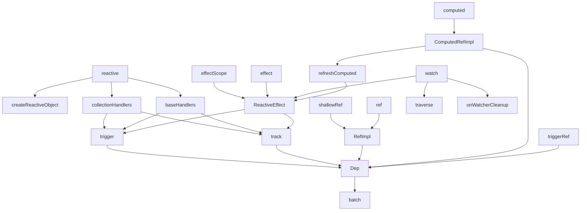
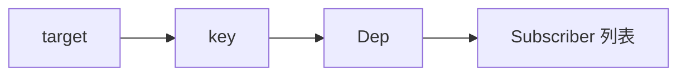

# Reactivity API 依赖关系与原理

这份文档梳理 [vue-source/packages/reactivity/src](/Users/nwyzx/Desktop/project/source/ai/vue-source/packages/reactivity/src) 里核心 API 的依赖关系，以及它们在运行时是如何串起来工作的。

## 总览

可以把这套响应式系统拆成 5 层：

1. 入口 API 层
   `reactive`、`ref`、`computed`、`effect`、`watch`
2. 代理 / 包装层
   `baseHandlers`、`collectionHandlers`、`RefImpl`、`ComputedRefImpl`
3. 依赖收集层
   `track()`、`Dep.track()`
4. 依赖触发层
   `trigger()`、`Dep.trigger()`、`Dep.notify()`
5. 调度与作用域层
   `ReactiveEffect`、`batch()`、`effectScope()`

一句话概括：

`读取时收集依赖，写入时触发依赖，副作用负责重新执行。`

## 对外 API 依赖图



## 1. `reactive()` 这条线

入口在 [reactive.ts](/Users/nwyzx/Desktop/project/source/ai/vue-source/packages/reactivity/src/reactive.ts)。

主依赖关系：

- `reactive()`
  依赖 `createReactiveObject()`
- `createReactiveObject()`
  依赖 `baseHandlers` / `collectionHandlers`
- `baseHandlers` / `collectionHandlers`
  依赖 `track()` 与 `trigger()`

流程：

```mermaid
flowchart TD
    A[reactive(target)] --> B[createReactiveObject]
    B --> C{目标类型}
    C -- Object/Array --> D[baseHandlers]
    C -- Map/Set/... --> E[collectionHandlers]
    D --> F[new Proxy]
    E --> F
    F --> G[读取时 track]
    F --> H[写入时 trigger]
```

关键点：

- `reactiveMap` / `readonlyMap` 等 `WeakMap` 用来缓存“原对象 -> 代理对象”
- 普通对象和集合对象要走不同 handler
- `get` 时收集依赖，`set/delete/clear` 时触发依赖

## 2. `ref()` 这条线

入口在 [ref.ts](/Users/nwyzx/Desktop/project/source/ai/vue-source/packages/reactivity/src/ref.ts)。

主依赖关系：

- `ref()` / `shallowRef()`
  依赖 `createRef()`
- `createRef()`
  依赖 `RefImpl`
- `RefImpl`
  依赖 `Dep`

流程：

```mermaid
flowchart TD
    A[ref(value)] --> B[createRef]
    B --> C[new RefImpl]
    C --> D[get value -> dep.track]
    C --> E[set value -> dep.trigger]
```

关键点：

- `ref` 不是用 `Proxy`，而是用 getter / setter
- `dep.track()` 记录谁读取了 `.value`
- `dep.trigger()` 通知依赖 `.value` 的副作用重新执行

### 普通属性 vs 访问器属性

`ref.value` 之所以能在读取和写入时自动接入响应式系统，本质是因为它不是普通属性，而是访问器属性。

| 对比项 | 普通属性 | 访问器属性 `get/set` |
|---|---|---|
| 本质 | 直接存一个值 | 不直接存值，读写时执行函数 |
| 读取时 | 直接拿到属性值 | 触发 `get()` |
| 写入时 | 直接改属性值 | 触发 `set()` |
| 是否有真实存储值 | 有，通常存在属性本身上 | 通常没有，需要你自己存到别处，比如 `this._value` |
| 定义方式 | `obj.x = 1` | `Object.defineProperty()` 或 class 的 `get/set` |
| 典型用途 | 存普通数据 | 拦截读取/写入、校验、依赖收集、派发更新 |
| Vue 里的用途 | `reactive` 代理后的普通字段最终还是表现成普通属性访问 | `ref.value` 就是访问器属性 |

所以 `ref` 的核心可以直接记成：

- 读 `.value` 时进 `get value()`，里面做 `track()`
- 写 `.value` 时进 `set value()`，里面做 `trigger()`

### `get/set` 和 `Object.defineProperty()` 的补充关系

这里再补一个经常会误解的点：

- class 里的 `get value()` / `set value()`，默认会定义到原型上
- `Object.defineProperty()` 会定义到你传入的那个目标对象上

例如：

```ts
class RefImpl {
  get value() {
    return this._value
  }
}
```

更接近：

```js
Object.defineProperty(RefImpl.prototype, 'value', {
  get() {
    return this._value
  }
})
```

所以它们的关系应该理解成：

- `get/set` 是访问器属性的高级语法
- `Object.defineProperty()` 是更底层的定义方式

区别不在于“一个一定挂原型，一个一定挂实例”，而在于：

- class 里的访问器默认挂到原型
- `defineProperty()` 挂到你明确指定的目标对象

### `ref / reactive / defineProperty / Proxy / Reflect` 的关系

把这几个概念放在一起看，会更容易理解 Vue 为什么要混合使用它们。

#### `Object.defineProperty()`

这是底层属性定义 API，更适合“固定属性”场景。  
它可以定义：

- 数据属性
- 访问器属性（`get/set`）

#### class 的 `get/set`

这是访问器属性的高级语法。  
在 class 中写：

```ts
class RefImpl {
  get value() {
    return this._value
  }
}
```

本质上接近：

```js
Object.defineProperty(RefImpl.prototype, 'value', {
  get() {
    return this._value
  }
})
```

所以 `ref.value` 更像是：

`固定属性 + 访问器逻辑`

#### `Proxy`

`Proxy` 适合对象级拦截。  
它不要求你提前知道属性名，更适合：

- 普通对象任意字段
- 数组索引
- `delete`
- `in`
- `ownKeys`

所以 `reactive()` 用的是 `Proxy`。

#### `Reflect`

`Reflect` 不是拦截器，它是“标准语义执行器”。

Vue 在 handler 里常见这种写法：

```ts
Reflect.get(target, key, receiver)
Reflect.set(target, key, value, receiver)
```

这里的分工是：

- `Proxy` 负责拦截
- `Reflect` 负责把默认行为按标准语义执行下去

尤其在下面这些场景里，`Reflect` 比直接 `target[key]` 更准确：

- 原型链 getter / setter
- `this` 绑定
- `receiver` 透传

#### 组合起来怎么记

| 机制 | 作用层级 | 擅长什么 | Vue 里主要用在哪 |
|---|---|---|---|
| `Object.defineProperty()` | 单个属性 | 精确定义某个属性 | 访问器属性底层能力 |
| `get/set` | 单个属性 | 给固定属性加读写逻辑 | `ref.value` |
| `Proxy` | 整个对象 | 拦截任意属性和对象操作 | `reactive()` |
| `Reflect` | 默认语义执行 | 按标准方式继续执行对象操作 | `baseHandlers` / `collectionHandlers` |

可以直接记一句：

`ref` 更像“访问器属性 + Dep”，`reactive` 更像“Proxy + Reflect + track/trigger”。`

### 为什么 `reactive` 整体替换通常不会触发

这是使用 `reactive` 时最容易误解的一点。

例如：

```ts
let state = reactive({ count: 0 })

effect(() => {
  console.log(state.count)
})

state = reactive({ count: 1 })
```

最后这一句通常不会让前面的 effect 自动重新执行。

原因是：

- `reactive` 跟踪的是对象属性访问
- 它不跟踪局部变量 `state` 这个绑定本身

前面 effect 真正订阅到的是：

```text
旧对象的 count 属性
```

所以把变量重新指向一个新代理对象，并不会自动触发旧对象属性上的依赖。

### 为什么 `ref` 整体替换会触发

而下面这个会触发：

```ts
const state = ref({ count: 0 })

effect(() => {
  console.log(state.value.count)
})

state.value = { count: 1 }
```

因为这里的依赖入口是 `state.value`，而你修改的也正是 `.value`。

可以直接记成：

| 场景 | 更适合 |
|---|---|
| 修改对象内部属性 | `reactive` |
| 整体替换整个对象 | `ref` |

## 3. `computed()` 这条线

入口在 [computed.ts](/Users/nwyzx/Desktop/project/source/ai/vue-source/packages/reactivity/src/computed.ts)。

主依赖关系：

- `computed()`
  依赖 `ComputedRefImpl`
- `ComputedRefImpl.value`
  依赖 `dep.track()` 和 `refreshComputed()`
- `refreshComputed()`
  依赖 `ReactiveEffect` 那套脏检查逻辑

流程：

```mermaid
flowchart TD
    A[computed(getter)] --> B[ComputedRefImpl]
    B --> C[读取 value]
    C --> D[dep.track]
    C --> E[refreshComputed]
    E --> F{是否 dirty}
    F -- 是 --> G[执行 getter]
    F -- 否 --> H[复用缓存]
```

关键点：

- `computed` 既像 `ref`，又像 `effect`
- 它对外暴露 `.value`
- 它对内会订阅 getter 访问到的响应式依赖
- 它通过 `DIRTY` 标记和 `globalVersion` 做缓存优化

## 4. `effect()` 这条线

入口在 [effect.ts](/Users/nwyzx/Desktop/project/source/ai/vue-source/packages/reactivity/src/effect.ts)。

主依赖关系：

- `effect()`
  依赖 `ReactiveEffect`
- `ReactiveEffect.run()`
  依赖 `prepareDeps()`、`cleanupDeps()`
- 运行期间
  依赖 `activeSub`
- 真正收集依赖
  发生在 `track()` / `Dep.track()`

流程：

```mermaid
flowchart TD
    A[effect(fn)] --> B[new ReactiveEffect(fn)]
    B --> C[run()]
    C --> D[activeSub = 当前 effect]
    D --> E[执行 fn]
    E --> F[访问 reactive/ref/computed]
    F --> G[track]
    G --> H[Dep 记录当前 effect]
```

关键点：

- `activeSub` 是“当前正在收集依赖的订阅者”
- 任何 `track()` 都依赖它来知道该把依赖记到谁身上
- `cleanupDeps()` 会清掉本轮没有再次访问到的旧依赖

## 5. `watch()` 这条线

入口在 [watch.ts](/Users/nwyzx/Desktop/project/source/ai/vue-source/packages/reactivity/src/watch.ts)。

主依赖关系：

- `watch()`
  依赖 `ReactiveEffect`
- `watch()` 内部会把 `source` 统一归一化成 `getter`
- `deep watch`
  依赖 `traverse()`
- cleanup 能力
  依赖 `onWatcherCleanup()`

流程：

```mermaid
flowchart TD
    A[watch(source, cb)] --> B[把 source 归一化为 getter]
    B --> C[new ReactiveEffect(getter)]
    C --> D[首次 run]
    D --> E[收集 source 依赖]
    E --> F[source 变化]
    F --> G[job()]
    G --> H[比较新旧值]
    H --> I[执行 cb]
```

关键点：

- `watchEffect` 和 `watch(source, cb)` 是两条分支
- `watch(source, cb)` 会比较新旧值
- `deep` 模式靠 `traverse()` 递归访问内部属性来建立依赖

## 6. `track()` / `trigger()` 是总中枢

这两个函数都在 [dep.ts](/Users/nwyzx/Desktop/project/source/ai/vue-source/packages/reactivity/src/dep.ts)。

### `track()`

负责：

- 找到 `targetMap[target][key]`
- 拿到或创建 `Dep`
- 把当前 `activeSub` 记录进去

### `trigger()`

负责：

- 根据 `target` 和 `key` 找到对应 `Dep`
- 按操作类型决定是否额外触发 `ITERATE_KEY` / `ARRAY_ITERATE_KEY`
- 批量通知订阅者

依赖结构：



## 7. 这些 API 之间怎么相互依赖

可以直接记下面这几条：

- `reactive` 依赖 `Proxy + handler + track/trigger`
- `ref` 依赖 `RefImpl + Dep`
- `computed` 依赖 `RefImpl 风格外壳 + ReactiveEffect 风格内核`
- `watch` 依赖 `ReactiveEffect + traverse + cleanup`
- `effect` 依赖 `ReactiveEffect + activeSub`
- 所有读取收集最终都会落到 `track()`
- 所有写入触发最终都会落到 `trigger()`

## 8. 推荐阅读顺序

如果你是按源码理解，建议顺序：

1. [constants.ts](/Users/nwyzx/Desktop/project/source/ai/vue-source/packages/reactivity/src/constants.ts)
2. [reactive.ts](/Users/nwyzx/Desktop/project/source/ai/vue-source/packages/reactivity/src/reactive.ts)
3. [baseHandlers.ts](/Users/nwyzx/Desktop/project/source/ai/vue-source/packages/reactivity/src/baseHandlers.ts)
4. [dep.ts](/Users/nwyzx/Desktop/project/source/ai/vue-source/packages/reactivity/src/dep.ts)
5. [effect.ts](/Users/nwyzx/Desktop/project/source/ai/vue-source/packages/reactivity/src/effect.ts)
6. [ref.ts](/Users/nwyzx/Desktop/project/source/ai/vue-source/packages/reactivity/src/ref.ts)
7. [computed.ts](/Users/nwyzx/Desktop/project/source/ai/vue-source/packages/reactivity/src/computed.ts)
8. [watch.ts](/Users/nwyzx/Desktop/project/source/ai/vue-source/packages/reactivity/src/watch.ts)

## 9. 一句话总结

这套系统最核心的依赖链就是：

`reactive/ref/computed/watch/effect -> track/trigger -> Dep -> ReactiveEffect`

也就是说：

- API 负责暴露使用方式
- handler / RefImpl / ComputedRefImpl 负责拦截访问
- `track/trigger` 负责连接“读写”和“副作用”
- `ReactiveEffect` 负责真正重跑
