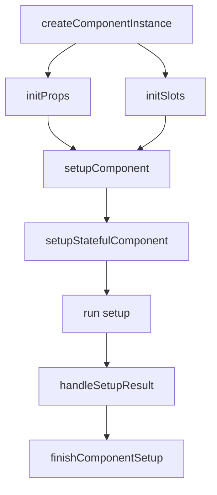

# component.ts 核心步骤

## 这份文件在做什么

`component.ts` 负责把一个组件定义，转成真正可运行的组件实例。

## 主流程

```mermaid
flowchart TD
    A["createComponentInstance"] --> B["initProps"]
    A --> C["initSlots"]
    B --> D["setupComponent"]
    C --> D
    D --> E["setupStatefulComponent"]
    E --> F["run setup"]
    F --> G["handleSetupResult"]
    G --> H["finishComponentSetup"]
```

## 关键点

- 组件实例不是 VNode，本质是一份运行时上下文对象
- `setup()` 的返回值可能是函数，也可能是对象
- 最终组件一定要得到一个可执行的渲染入口
