# Diff 算法与常见面试题

如果你想按“从概念到源码”的顺序读这一组内容，先看 [Diff 阅读地图](./diff-reading-map.md)。

很多人提到 Vue diff，只会说一句：

“Vue 用双端比较 + 最长递增子序列优化。”

这句话方向没错，但如果你只停在这句，面试官大概率会继续追问：

- 为什么不能全量比？
- 比较的是谁和谁？
- 什么情况下会走 key diff？
- 最长递增子序列到底在优化什么？

这篇就是把这条链讲完整。

---

## 1. Diff 在解决什么问题？

先明确一点：

Vue 更新时，并不是在比较真实 DOM。

它比较的是：

- 旧 VNode 树
- 新 VNode 树

原因很简单：

- 新一轮 render 已经告诉 Vue“界面现在应该长什么样”
- Vue 只需要把“旧结构”和“新结构”比较出来，再把最小变更落到 DOM

所以 diff 的目标不是“重新生成页面”，而是：

`尽量复用已有节点，只做必要的插入、删除、移动和属性更新。`

---

## 2. Vue 为什么不做跨层级 diff？

这是非常经典的问题。

Vue 的默认假设是：

`同层节点最可能发生局部变化，跨层级大规模比较成本太高。`

所以 Vue 的策略是：

- 只在同层 children 之间做精细比较
- 一旦节点类型不同，直接替换整棵子树

这样做的好处是：

- 复杂度更可控
- 工程上足够高效
- 可以和模板编译优化配合

所以 Vue diff 不是“理论最优树编辑算法”，而是“前端 UI 场景下的高性价比策略”。

---

## 3. Diff 的入口在哪？

源码实现位于 `vue-source/packages/runtime-core` 包里。

真正的入口在 `vue-source/packages/runtime-core/src/renderer.ts` 的 `patch()`。

可以把它理解成：

`给我旧 vnode 和新 vnode，我来决定接下来应该复用、替换、递归比较还是卸载。`

最上层的分流是：

- 类型一样：尽量复用，进入更细的 patch
- 类型不一样：旧树卸载，新树重新挂载

所以 diff 的第一步不是“比 children”，而是先判断：

`这两个节点是不是同一种东西。`

可以先把主入口链路记成这样：

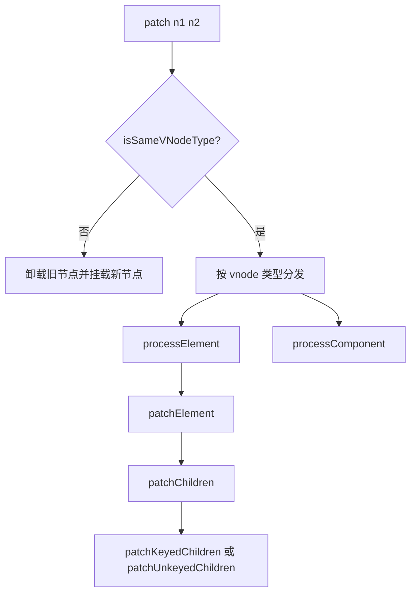

---

## 4. 元素节点 diff 的主线是什么？

当 `patch()` 发现是同类型元素时，通常会进入 `patchElement()`。

这里主要做两件事：

1. 比 props
2. 比 children

### 先比 props

例如：

- `class` 变没变
- `style` 变没变
- 事件变没变

### 再比 children

children 的情况一般有几种：

- 文本 -> 文本
- 数组 -> 文本
- 文本 -> 数组
- 数组 -> 数组

只有“数组 -> 数组”这条线，才会真正进入最复杂的 keyed diff。

源码对应位置：

- `patchChildren()`：`vue-source/packages/runtime-core/src/renderer.ts` 约 `1750` 行
- 关键分流变量：`prevShapeFlag`、`shapeFlag`、`patchFlag`
- 相关判断：`ShapeFlags.TEXT_CHILDREN`、`ShapeFlags.ARRAY_CHILDREN`

先把 `patchChildren()` 的基础分流记成一张总图：

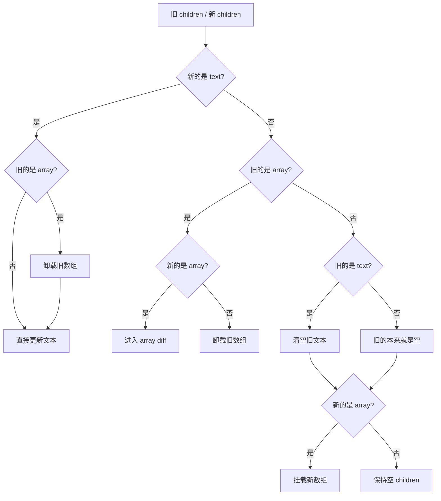

如果你只想先背“源码决策顺序”，可以先记这张速查图：

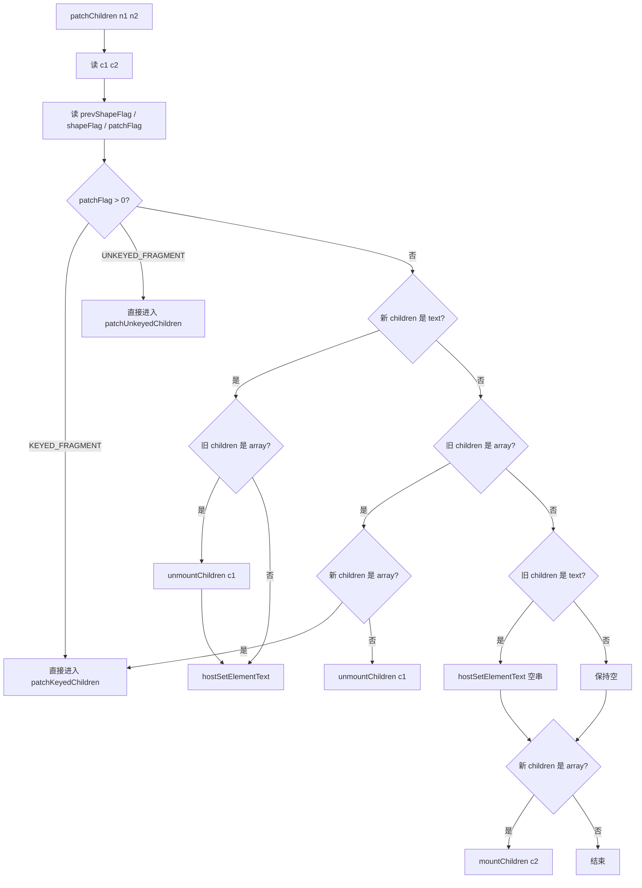

### 4.0 文本、数组、空 children 之间是怎么切换的？

这一层还没进入 keyed diff，属于 `patchChildren()` 最外层的分支判断。

#### text -> text

旧：

```text
"hello"
```

新：

```text
"world"
```

这种情况最简单，直接改文本内容，不涉及子节点遍历。

源码对应位置：

- `patchChildren()` 内 `shapeFlag & ShapeFlags.TEXT_CHILDREN`
- 实际落地调用：`hostSetElementText(container, c2 as string)`

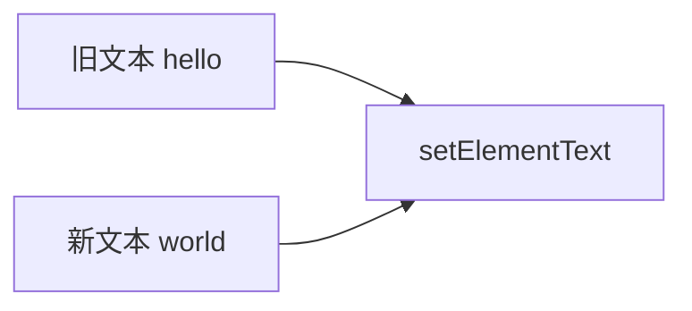

#### text -> array

旧：

```text
"hello"
```

新：

```text
A B C
```

这时会先清空旧文本，再挂载新的 children 数组。

源码对应位置：

- `prevShapeFlag & ShapeFlags.TEXT_CHILDREN`
- 先 `hostSetElementText(container, '')`
- 再 `mountChildren(...)`

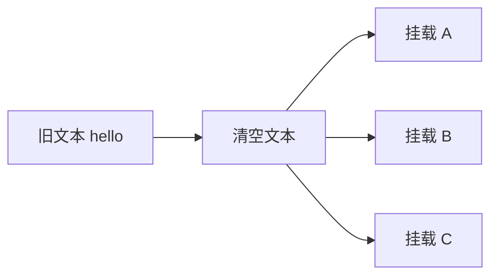

#### array -> text

旧：

```text
A B C
```

新：

```text
"hello"
```

这时会先卸载整组旧 children，再写入新文本。

源码对应位置：

- 先 `unmountChildren(c1 as VNode[], ...)`
- 再 `hostSetElementText(container, c2 as string)`

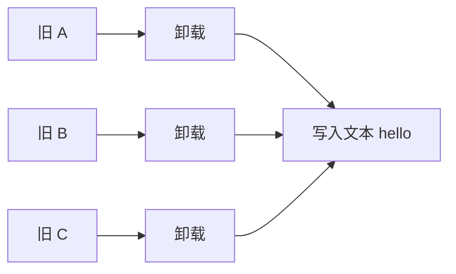

#### null -> array

旧：

```text
空
```

新：

```text
A B
```

旧的没有 children，直接挂载新数组。

源码对应位置：

- 旧侧不是 `TEXT_CHILDREN` 也不是 `ARRAY_CHILDREN`
- 新侧命中 `shapeFlag & ShapeFlags.ARRAY_CHILDREN`
- 直接 `mountChildren(...)`

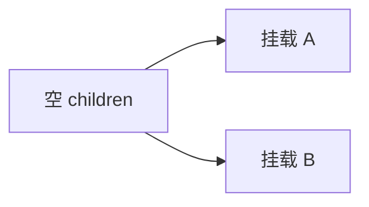

#### array -> null

旧：

```text
A B
```

新：

```text
空
```

新的没有 children，直接卸载旧数组。

源码对应位置：

- 旧侧命中 `prevShapeFlag & ShapeFlags.ARRAY_CHILDREN`
- 新侧未命中 `shapeFlag & ShapeFlags.ARRAY_CHILDREN`
- 直接 `unmountChildren(c1 as VNode[], ...)`

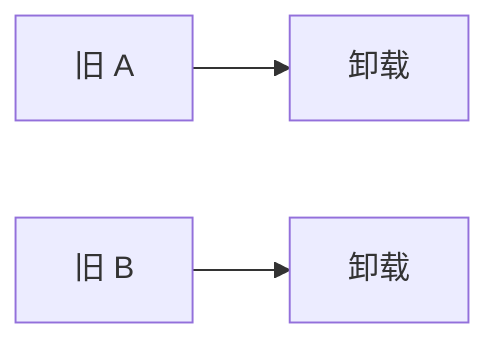

如果把 children 变化按结果来分，最常见的就是这几类：

- 新增子节点
- 删除子节点
- 子节点完全打乱顺序

下面分别看它们在 Vue 里的 diff 示意。

### 4.1 新增子节点是怎么 diff 的？

新增最常见的有两种：

- 尾部新增
- 头部新增

先看尾部新增：

旧：

```text
A B
```

新：

```text
A B C D
```

这时 `patchKeyedChildren()` 会先做前缀同步：

- `A` 对 `A`，复用并 patch
- `B` 对 `B`，复用并 patch

同步完后，旧区间先耗尽，进入“阶段 3: common sequence + mount”，把剩余新节点直接挂载。

源码对应位置：

- 函数：`patchKeyedChildren()`，约 `1944` 行
- 关键变量：`i`、`e1`、`e2`
- 命中分支：`if (i > e1) { ... patch(null, c2[i], ...) }`

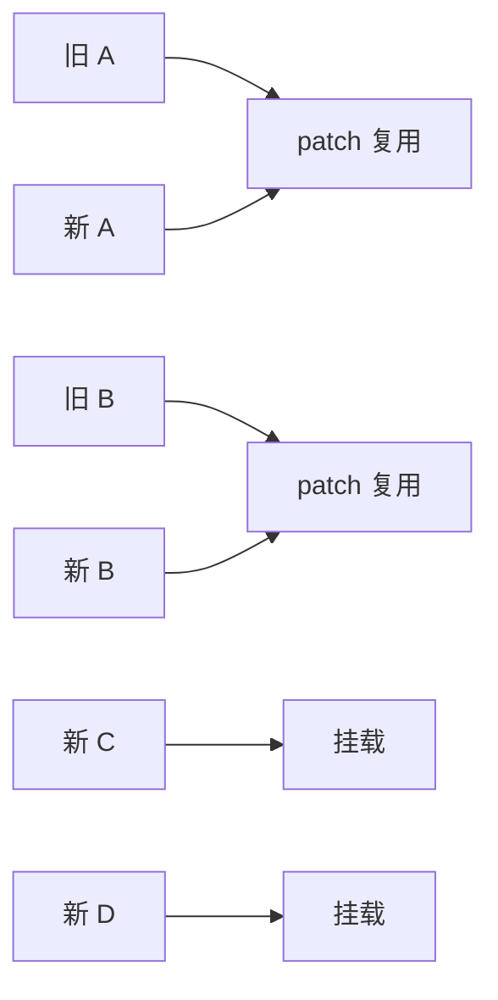

再看头部新增：

旧：

```text
A B
```

新：

```text
C D A B
```

这时前缀同步一开始就失败，但尾部同步会命中：

- `B` 对 `B`
- `A` 对 `A`

然后旧区间耗尽，剩下的 `C D` 会按锚点插到前面。

源码对应位置：

- 仍在 `if (i > e1)` 这条分支
- 关键锚点：`const anchor = nextPos < l2 ? c2[nextPos].el : parentAnchor`

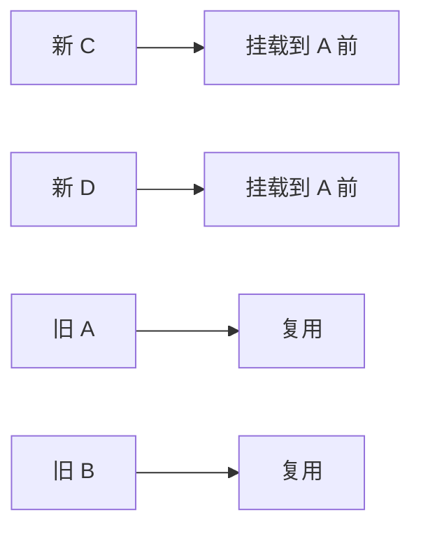

这里的重点不是“重新创建整个列表”，而是：

`能复用的旧节点先复用，只把多出来的新节点挂上去。`

### 4.2 删除子节点是怎么 diff 的？

删除和新增正好相反，本质是：

`新 children 先耗尽，旧 children 剩下的部分全部卸载。`

例如尾部删除：

旧：

```text
A B C D
```

新：

```text
A B
```

前缀同步后：

- `A` 对 `A`
- `B` 对 `B`

然后新区间先耗尽，进入“阶段 4: common sequence + unmount”，把旧的 `C D` 卸载。

源码对应位置：

- `else if (i > e2) { unmount(c1[i], ...) }`
- 本质是“新序列先耗尽，旧序列剩余节点全部删除”


头部删除也是一样，只不过更多是通过尾部同步先缩小区间：

旧：

```text
A B C D
```

新：

```text
C D
```

尾部同步会先命中：

- `D` 对 `D`
- `C` 对 `C`

然后旧区间剩下的 `A B` 被卸载。

源码对应位置：

- 仍然是 `else if (i > e2)` 这条分支
- 只是前面先经过了尾部同步，缩小了真正要删的区间

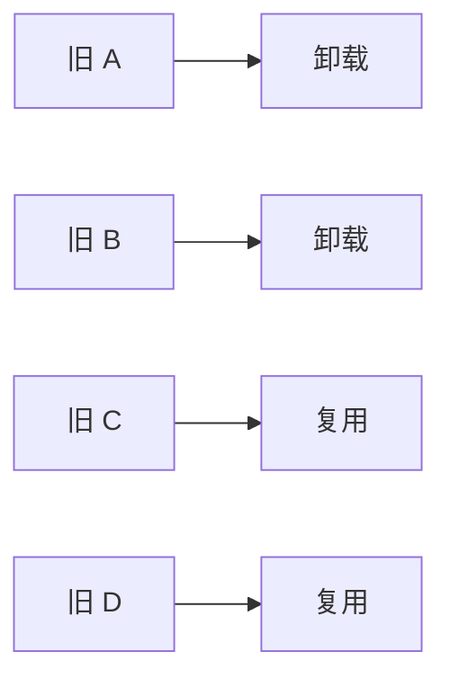

### 4.3 完全打乱子节点是怎么 diff 的？

这才是 keyed diff 最值钱的场景。

例如：

旧：

```text
A B C D
```

新：

```text
D B A C
```

这种情况下，前缀同步和尾部同步通常都很快停住，于是进入中间未知区间。

Vue 会做这几步：

1. 给新 children 建 `key -> newIndex` 映射
2. 扫描旧 children，判断哪些还能复用，哪些要删除
3. 生成 `newIndexToOldIndexMap`
4. 如果检测到乱序，求 LIS
5. 倒序执行“挂载或移动”

源码对应位置：

- 新位置映射：`keyToNewIndexMap`，约 `2072` 行
- 复用记录：`newIndexToOldIndexMap`，约 `2103` 行
- LIS 调用：`getSequence(newIndexToOldIndexMap)`，约 `2162` 行

先看身份映射：

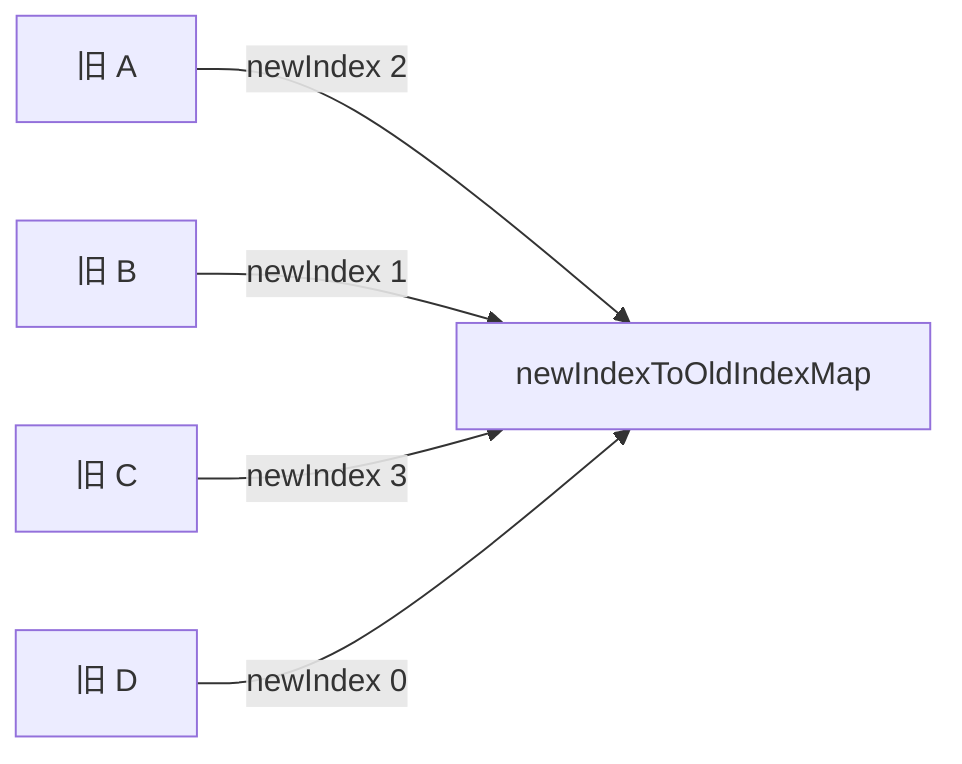

它对应的新位置关系大致是：

```text
新位置:                0  1  2  3
新节点:                D  B  A  C
newIndexToOldIndexMap: 4  2  1  3
```

这里的含义是：

- 新位置 0 的 `D` 复用了旧位置 3，所以记 `4`
- 新位置 1 的 `B` 复用了旧位置 1，所以记 `2`
- 新位置 2 的 `A` 复用了旧位置 0，所以记 `1`
- 新位置 3 的 `C` 复用了旧位置 2，所以记 `3`

接下来 Vue 会在 `[4, 2, 1, 3]` 上找 LIS。

一个可行的 LIS 是：

```text
[1, 3]
```

它对应的是：

- `A`
- `C`

这表示 `A` 和 `C` 这两个节点在新顺序里仍然保持了正确的相对顺序，可以尽量不动；而 `D`、`B` 需要移动到正确位置。

可以把“最大程度复用”的过程理解成这样：

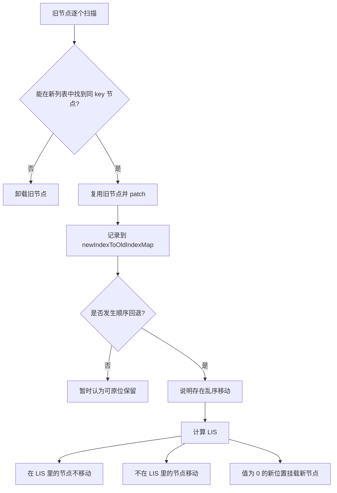

这里要特别注意：

`最大程度复用` 不等于 `所有节点都不动`。

它真正的意思是：

- 能复用身份的旧节点，先不要删
- 能保持相对顺序的旧节点，先不要移
- 只对必须变化的那部分做卸载、挂载和移动

这也是 Vue keyed diff 的核心价值。

### 4.4 无 key 子节点是怎么 diff 的？

如果 children 没有稳定 `key`，或者编译器已经标记它是 `UNKEYED_FRAGMENT`，Vue 会走 `patchUnkeyedChildren()`。

它的策略非常直接：

1. 按索引对齐 patch 公共长度
2. 旧的比新的长，卸载多出来的旧节点
3. 新的比旧的长，挂载多出来的新节点

也就是说，它按“位置”复用，而不是按“身份”复用。

源码对应位置：

- 函数：`patchUnkeyedChildren()`，约 `1868` 行
- 关键变量：`oldLength`、`newLength`、`commonLength`
- 处理方式：先 `for` 循环按索引 `patch`，再 `unmountChildren` 或 `mountChildren`

例如：

旧：

```text
A B C
```

新：

```text
A X C D
```

它会这样处理：

- 位置 0：旧 `A` 对 新 `A`，patch
- 位置 1：旧 `B` 对 新 `X`，patch
- 位置 2：旧 `C` 对 新 `C`，patch
- 新数组更长，多出来的 `D` 挂载

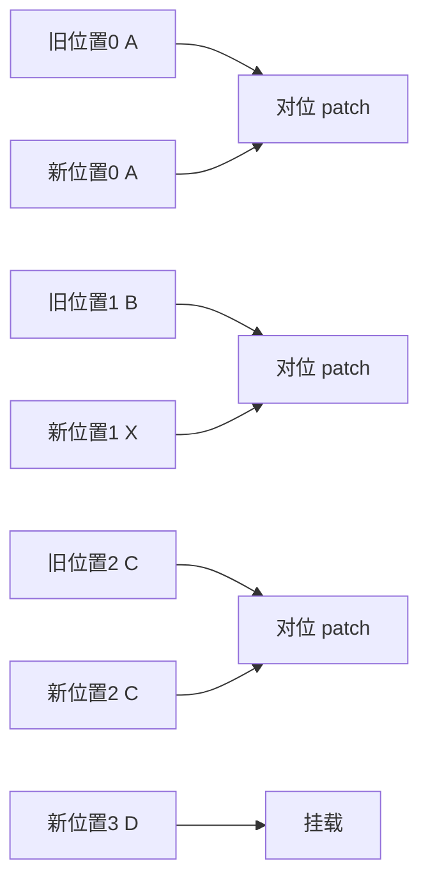

这里要注意：

`patchUnkeyedChildren()` 不会判断“B 是不是挪到别的位置了”。`

因为没有稳定 key，它只能按当前位置去理解更新。所以无 key children 的“复用”能力明显弱于 keyed children。

你可以把它和 keyed diff 对比着记：

- unkeyed：按索引复用
- keyed：按身份复用
- keyed + LIS：在按身份复用的基础上尽量少移动

---

## 5. 为什么 `key` 这么重要？

`key` 的本质作用是：

`帮助 Vue 判断“同层节点里谁是谁”。`

例如下面两个列表：

旧：

```text
A B C D
```

新：

```text
B C A D
```

如果没有 key，Vue 很难可靠判断这是：

- 节点移动
还是
- 节点内容替换

有了 key，Vue 才能建立“旧节点身份”和“新节点身份”的对应关系。

所以：

- `key` 不是为了消除警告
- `key` 是为了让 diff 具备稳定身份判断能力

---

## 6. 双端比较在做什么？

Vue 在处理同层数组 children 时，会先走几轮便宜路径。

典型思路是从两端开始缩小范围：

- 新前 vs 旧前
- 新后 vs 旧后

为什么这样做？

因为在真实 UI 里，列表经常只是：

- 头部新增
- 尾部新增
- 头尾局部变化

这些情况如果一开始就上最复杂算法，成本不划算。

所以 Vue 会先快速跳过那些“明显没问题的前缀和后缀”。

这就是双端比较的意义：

`先用低成本手段缩小真正需要精细比较的中间区间。`

下面这张图可以直接对应 `renderer.ts` 里的 `patchKeyedChildren()` 分阶段处理逻辑：

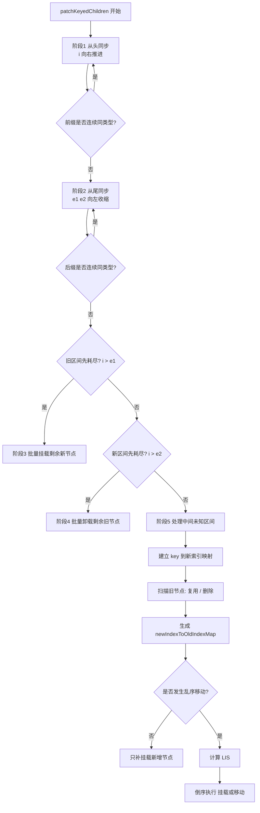

---

## 7. 中间乱序区间为什么要用最长递增子序列？

当前后缀都处理完后，真正难的是：

- 旧数组中间一段节点
- 新数组中间一段节点

这时 Vue 会先建立新 key 到索引的映射，再找出：

- 哪些旧节点在新数组里已经不存在 -> 删除
- 哪些新节点是新增的 -> 插入
- 哪些节点还在，但顺序变了 -> 移动

这里的关键优化是：

`尽量少移动节点。`

最长递增子序列（LIS）的意义，就是找出：

“哪些节点在新顺序里本来就已经是相对递增的，它们可以不用移动。”

换句话说：

- 不在 LIS 里的节点，需要移动
- 在 LIS 里的节点，可以复用当前位置

所以 LIS 不是为了“找公共子串”，而是为了：

`在乱序更新中，把移动次数降到更少。`

### LIS 简易版本

如果你第一次看 `getSequence()`，最容易卡住的点通常不是代码，而是：

`为什么算出一个“最长递增子序列”，就能减少节点移动？`

先不要看源码，先只看结果含义。

在 Vue 的 keyed diff 里，LIS 不是直接对 vnode 求的，而是对这个数组求的：

`newIndexToOldIndexMap`

它表达的是：

`新 children 的每个位置，复用了旧 children 的哪个位置。`

注意这里存的是 `oldIndex + 1`：

- `0` 表示这是新增节点
- 非 `0` 表示复用了旧节点

举个最小例子。

旧区间是：

```text
A B C D
```

新区间是：

```text
B D A E
```

先看“新位置分别复用了旧的谁”：

- 新位置 0 是 `B`，它原来在旧位置 1
- 新位置 1 是 `D`，它原来在旧位置 3
- 新位置 2 是 `A`，它原来在旧位置 0
- 新位置 3 是 `E`，它是新增的

所以 `newIndexToOldIndexMap` 会接近：

```text
[2, 4, 1, 0]
```

这里的 `2、4、1` 分别对应旧下标 `1、3、0` 再加一；`0` 表示新增节点。

现在关键问题来了：

`在 [2, 4, 1] 里面，哪些节点相对顺序本来就是对的？`

答案就是看“递增”。

因为如果一个节点在新数组中的顺序，对应到旧数组下标后仍然是递增的，说明：

`它们在旧数组里的先后关系，和新数组里的先后关系一致。`

这种节点就不需要互相穿插移动。

拿 `[2, 4, 1]` 来看：

- `2 -> 4` 是递增
- `4 -> 1` 断掉了

所以这里一个最长递增子序列是：

```text
[2, 4]
```

它对应的新节点是：

- `B`
- `D`

这说明：

`B` 和 `D` 在新顺序里依然保持了和旧顺序一致的相对关系，因此它们可以不动。

剩下的：

- `A` 不在 LIS 里，需要移动
- `E` 的值是 `0`，说明它需要新挂载

于是最终策略就变成了：

- 保留 `B`、`D`
- 移动 `A`
- 挂载 `E`

这样显然比“把所有乱序节点都移动一遍”成本更低。

### 为什么“递增”就表示可以不动？

因为我们记录的是“新位置对应的旧位置”。

如果某几个新节点对应的旧位置是递增的，比如：

```text
新位置:   0 1 2
旧位置:   1 3 5
```

那它们在旧数组里本来就是按 `1 -> 3 -> 5` 排列的，在新数组里也还是这个先后关系。

这意味着：

`它们彼此之间没有发生相对顺序颠倒。`

既然相对顺序没颠倒，就没有必要为了它们彼此再做 DOM move。

### 可以把它粗暴理解成什么？

可以把 LIS 粗暴理解成一句话：

`在乱序区间里，找出“已经站对队”的那批旧节点，让它们原地不动。`

然后：

- 新增节点挂载
- 没站对队的旧节点移动
- 找不到对应新位置的旧节点卸载

### 再看源码时，只盯住这 3 个点就够了

回到 `renderer.ts` 里的 `getSequence()`，第一次不用试图逐行吃透，先只盯这 3 个结论：

1. 输入是 `newIndexToOldIndexMap`
2. 输出是“最长递增子序列对应的下标集合”
3. 输出里的这些下标，代表对应新位置上的节点可以不移动

只要这三点对上了，再去看：

- 为什么要二分
- 为什么要记录前驱数组 `p`
- 为什么最后还要回溯重建路径

就会容易很多。

如果只看“中间乱序区间”的节点流转，可以把它理解成下面这张图：

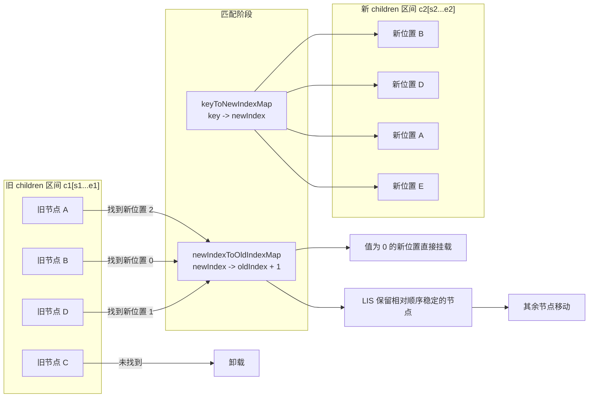

---

## 8. Vue 3 的 diff 为什么比 Vue 2 更强调编译优化？

因为 Vue 3 不只是靠运行时算法，它还会在编译阶段提前告诉运行时：

- 哪些节点是动态的
- 哪些属性可能变化
- 哪些子树可以跳过

这体现在：

- `patchFlag`
- `dynamicChildren`
- block tree

所以 Vue 3 的优化思路不是“单纯把 diff 算法写得更聪明”，而是：

`编译阶段尽量缩小运行时真正需要比较的范围。`

---

## 9. 常见面试题

## 1. Vue diff 为什么不做跨层级比较？

可以这样答：

Vue 默认只做同层比较，不做跨层级 diff，本质上是一个工程取舍。

因为如果要做通用树编辑，算法复杂度会高很多，而且前端界面更新大多数都发生在同层局部区域，比如列表增删、头尾插入、局部重排。Vue 针对这种高频场景做优化，比追求理论上的全局最优更划算。

所以 Vue 的基本策略是：

- 同层节点做精细比较
- 节点类型不同直接替换子树
- 借助编译期信息进一步缩小运行时比较范围

如果面试官继续追问，你可以补一句：

`Vue diff 不是在求“最优树编辑距离”，而是在求“UI 渲染场景下足够快、足够稳的最小必要更新”。`

## 2. `key` 的本质作用是什么？

可以这样答：

`key` 的本质不是为了消除警告，而是为了给同层节点提供稳定身份。

在旧 children 和新 children 比较时，Vue 需要知道“这个新节点是不是原来那个旧节点”。如果没有 `key`，很多时候只能按位置猜；有了 `key`，才能建立“旧节点身份 -> 新位置”的映射关系。

这会直接影响四件事：

- 节点能不能被复用
- 哪些旧节点应该删除
- 哪些新节点应该新增
- 哪些节点只是位置变了，需要移动

面试里最好顺手补一个结论：

- 列表会重排时，`key` 很重要
- 不稳定的 `key`，比如 `Math.random()`，等于主动放弃复用
- 用索引做 `key`，只适合内容稳定、不会重排的简单列表

再追问时可以答：

`key` 解决的是“身份识别”问题，不是“性能开关”本身；身份稳定后，性能优化才有成立基础。`

## 3. 双端比较优化了什么？

可以这样答：

双端比较优化的不是结果正确性，而是处理成本。

Vue 在 `patchKeyedChildren()` 里不会一上来就做最复杂的乱序比较，而是先做两轮廉价处理：

- 从头同步，处理稳定前缀
- 从尾同步，处理稳定后缀

这样做的收益是，很多真实更新场景根本不会进入最重的中间乱序阶段，比如：

- 尾部 append
- 头部 prepend
- 前后缀稳定，只在中间改一点

所以双端比较的核心价值是：

`先缩小未知区间，再把真正复杂的算法只留给中间少量节点。`

如果被问“Vue 3 是不是 React 那种传统双端 diff”，要注意回答：

`这里更准确地说，是 keyed children 在进入未知区间前，先做头尾同步优化，而不是一句话概括成整个 diff 只靠双端比较。`

## 4. 最长递增子序列优化了什么？

可以这样答：

最长递增子序列优化的是“移动次数”，不是比较次数，也不是删除和新增次数。

在中间乱序区间里，Vue 会先找出每个新位置对应的是哪个旧节点，得到 `newIndexToOldIndexMap`。然后它会在这个映射数组上求最长递增子序列。

这个序列表示：

`这些节点虽然整体处于乱序区间里，但它们彼此的相对顺序其实已经是对的，所以不用动。`

于是：

- 在 LIS 里的节点保留原位
- 不在 LIS 里的节点才移动
- 值为 `0` 的位置说明是新增节点，需要挂载

这是 Vue 3 在乱序场景里减少 DOM move 次数的关键优化。

如果面试官追问“为什么不是最长公共子序列”，可以这样说：

`这里目标不是找两个数组最像的公共内容，而是找出在新顺序里哪些旧节点已经天然有序，从而减少真实 DOM 移动。`

## 5. Vue 3 diff 和 Vue 2 最大思路差异是什么？

可以这样答：

Vue 2 和 Vue 3 都会做运行时 diff，但 Vue 3 更强调“编译期辅助运行时”。

Vue 3 的模板编译阶段会把很多信息提前编码给运行时，比如：

- 这个节点是不是动态节点
- 哪些 props 可能变化
- 哪些 children 需要重点比较
- 哪些静态内容可以直接跳过

这对应运行时里的几个关键概念：

- `patchFlag`
- block tree
- `dynamicChildren`

所以 Vue 3 的思路不是单纯把 diff 写得更复杂，而是：

`先在编译期缩小问题，再在运行时对真正有变化的部分做更精准的 patch。`

如果需要一句对比总结，可以说：

- Vue 2 更偏运行时通用 diff
- Vue 3 更偏编译期标记 + 运行时定向更新

## 6. `patchChildren()` 为什么要先区分 text、array、null？

可以这样答：

因为 children 的形态不同，更新策略完全不同，没必要都走同一套复杂逻辑。

`patchChildren()` 先根据 `shapeFlag` 和 `patchFlag` 判断当前 children 是：

- 文本 children
- 数组 children
- 空 children

不同组合会走不同分支：

- 文本 -> 文本：直接更新文本
- 数组 -> 文本：先卸载旧数组，再写文本
- 文本 -> 数组：先清空文本，再挂载新数组
- 数组 -> 数组：再进一步进入 keyed 或 unkeyed diff

这样分流的意义是：

`把简单场景快速处理掉，只有真正需要结构比较时才进入复杂 diff。`

## 7. `patchUnkeyedChildren()` 和 `patchKeyedChildren()` 的区别是什么？

可以这样答：

两者最大的区别在于，是否具备“稳定身份”信息。

`patchUnkeyedChildren()` 的处理方式非常直接：

- 先按索引对齐 patch 公共长度
- 多出来的旧节点卸载
- 多出来的新节点挂载

它不尝试做复杂移动判断，因为没有稳定 key，运行时没法可靠知道“哪个节点只是换了位置”。

而 `patchKeyedChildren()` 会：

- 先做前缀同步
- 再做后缀同步
- 再处理中间未知区间
- 通过 key 建映射
- 必要时用 LIS 减少移动

所以一句话总结就是：

- 无 key：按位置复用
- 有 key：按身份复用

## 8. `newIndexToOldIndexMap` 为什么要存 `oldIndex + 1`，而不是直接存 `oldIndex`？

可以这样答：

因为 `0` 在这里被拿来做特殊标记，表示“这个新位置没有对应的旧节点，是一个需要新挂载的节点”。

如果直接存 `oldIndex`，那旧索引本身就可能是 `0`，会和“没有对应旧节点”的语义冲突。所以 Vue 用 `oldIndex + 1` 来区分：

- `0`：这是新增节点
- `> 0`：说明复用了某个旧节点，真实旧索引要减一

这是一个典型的实现层技巧，目的是减少额外布尔标记，让后面的 LIS 和倒序遍历逻辑更紧凑。

## 9. 为什么最后要倒序处理挂载和移动？

可以这样答：

倒序处理的核心目的是更容易找到稳定锚点 `anchor`。

Vue 在执行插入和移动时，需要知道“当前节点应该插到谁前面”。如果从后往前遍历，那么当前节点右边的目标节点通常已经处于正确位置了，此时直接把它当锚点即可。

这样可以让挂载和移动统一使用：

- 当前节点
- 右侧相邻节点的 `el`
- 或父锚点 `parentAnchor`

所以倒序并不是为了 LIS 本身，而是为了：

`让最终 DOM 插入顺序更容易落地。`

## 10. Vue diff 的复杂度应该怎么回答？

可以这样答：

不要简单回答成“就是 O(n)”或者“就是 O(n log n)”，更准确的说法是分阶段看。

在 keyed diff 里：

- 头部同步和尾部同步，通常是线性推进
- 构建 `key -> index` 映射是线性的
- 扫描旧节点并完成匹配也是线性的
- 如果发生移动，LIS 计算是 `O(n log n)`

所以可以概括为：

`大多数常见路径接近线性；在中间乱序且需要移动时，会引入一次 O(n log n) 的 LIS 计算。`

这样的回答比只背一个复杂度更完整，也更符合源码真实行为。
