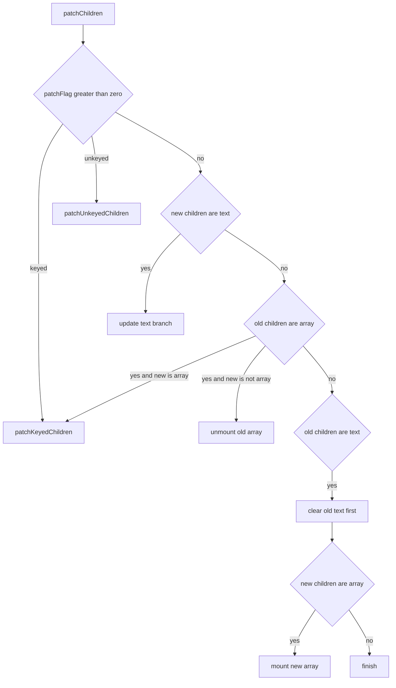

# Diff 算法源码走读

如果你想先确认这组文档的阅读顺序，先看 [Diff 阅读地图](./diff-reading-map.md)。

这篇只做一件事：

`按 renderer.ts 的真实执行顺序，把 diff 相关代码串起来。`

如果你想先建立整体认知，看 [Diff 算法与常见面试题](./diff-algorithm-interview.md)。

如果你现在是准备对着源码逐段读，那更适合先看这篇。

---

## 1. 先看入口链路

diff 真正进入 children 比较，不是直接从 `patchKeyedChildren()` 开始的。

它的上游调用链大致是：

```text
patch()
  -> processElement()
    -> patchElement()
      -> patchChildren()
```

可以先记住这几个职责：

- `patch()`：决定当前 vnode 应该走哪类处理逻辑
- `patchElement()`：同类型元素更新时，分别比较 props 和 children
- `patchChildren()`：真正决定 children 应该按哪种策略处理

对应源码位置：

- `patchChildren()`：`vue-source/packages/runtime-core/src/renderer.ts:1750`
- `patchUnkeyedChildren()`：`vue-source/packages/runtime-core/src/renderer.ts:1868`
- `patchKeyedChildren()`：`vue-source/packages/runtime-core/src/renderer.ts:1944`
- `getSequence()`：`vue-source/packages/runtime-core/src/renderer.ts:2759`

---

## 2. `patchChildren()` 先做总分流

`patchChildren()` 的第一层逻辑，不是立刻 diff 数组，而是先判断：

- 新 children 是文本、数组还是空
- 旧 children 是文本、数组还是空
- 编译器有没有通过 `patchFlag` 提前告诉运行时更快路径

源码里先读的是这几个变量：

```ts
const c1 = n1 && n1.children
const prevShapeFlag = n1 ? n1.shapeFlag : 0
const c2 = n2.children
const { patchFlag, shapeFlag } = n2
```

这几个变量分别对应：

- `c1`：旧 children
- `c2`：新 children
- `prevShapeFlag`：旧 children 的形态信息
- `shapeFlag`：新 children 的形态信息
- `patchFlag`：编译器提供的优化提示

可以把这一层理解成：



这里最重要的不是记细节，而是记顺序：

1. 先看 `patchFlag` 有没有快路径
2. 再看新 children 的形态
3. 最后决定是文本更新、数组更新还是清空/挂载

---

## 3. 为什么 `patchFlag` 要优先？

因为 `patchFlag` 是编译器给运行时的“已知信息”。

比如：

- `PatchFlags.KEYED_FRAGMENT`
- `PatchFlags.UNKEYED_FRAGMENT`

如果编译器已经明确告诉运行时：

`这是一组 keyed children`

那运行时就不用再从别的信息间接推断，直接进 `patchKeyedChildren()` 即可。

这一点很体现 Vue 3 的思路：

`先在编译期缩小问题，再在运行时执行更精准的路径。`

---

## 4. 文本、数组、空 children 的源码分支

### 4.1 新的是文本

源码先看：

```ts
if (shapeFlag & ShapeFlags.TEXT_CHILDREN) {
```

这时有两种情况：

1. 旧的是数组
   先 `unmountChildren(c1, ...)`
2. 新旧文本不同
   再 `hostSetElementText(container, c2 as string)`

也就是说：

`数组 -> 文本` 的重点是先删旧节点，再写新文本。`

`文本 -> 文本` 的重点是直接更新文本内容。`

### 4.2 新的不是文本

如果新 children 不是文本，就继续看旧 children：

```ts
if (prevShapeFlag & ShapeFlags.ARRAY_CHILDREN) {
```

这里再分两层：

1. 旧的是数组，新的是数组
   进入 `patchKeyedChildren()`
2. 旧的是数组，新的是空
   直接 `unmountChildren(...)`

如果旧的不是数组，那就说明旧的是文本或者空：

- 如果旧的是文本，先清空文本
- 如果新的是数组，再 `mountChildren(...)`

所以这一层的判断逻辑其实很规整：

- 文本和数组互转：先清后挂，或者先卸载后写文本
- 数组和数组：进入真正的 children diff

---

## 5. `patchUnkeyedChildren()` 很直接

`patchUnkeyedChildren()` 没有 key 映射，也没有 LIS。

它只做三件事：

1. 计算公共长度 `commonLength`
2. 对公共区间按索引逐个 `patch`
3. 处理多出来的旧节点或新节点

源码主线就是：

```ts
const oldLength = c1.length
const newLength = c2.length
const commonLength = Math.min(oldLength, newLength)

for (i = 0; i < commonLength; i++) {
  patch(c1[i], c2[i], ...)
}

if (oldLength > newLength) {
  unmountChildren(...)
} else {
  mountChildren(...)
}
```

这里的核心认知是：

`unkeyed children 只能按位置复用。`

它并不回答“某个节点是不是挪到别的位置了”，因为没有稳定身份信息。

---

## 6. `patchKeyedChildren()` 才是核心

`patchKeyedChildren()` 不是一上来就全量乱序 diff，而是分 5 个阶段。

### 阶段 1：从头同步

关键变量：

- `i`
- `e1`
- `e2`

源码先做：

```ts
while (i <= e1 && i <= e2) {
  const n1 = c1[i]
  const n2 = c2[i]
  if (isSameVNodeType(n1, n2)) {
    patch(n1, n2, ...)
  } else {
    break
  }
  i++
}
```

意思是：

`只要头部还能一一对上，就一直原地复用并往后推进。`

### 阶段 2：从尾同步

然后从后往前做同样的事：

```ts
while (i <= e1 && i <= e2) {
  const n1 = c1[e1]
  const n2 = c2[e2]
  if (isSameVNodeType(n1, n2)) {
    patch(n1, n2, ...)
  } else {
    break
  }
  e1--
  e2--
}
```

到这里为止，Vue 已经尽量把便宜的前缀和后缀处理完了。

剩下的才是真正的“未知区间”。

### 阶段 3：旧区间先耗尽，新节点直接挂载

如果头尾同步后满足：

```ts
if (i > e1)
```

说明旧区间已经处理完了，但新区间还有剩余。

这时剩下的新节点全是新增节点，直接按锚点挂载：

```ts
patch(null, c2[i], container, anchor, ...)
```

这里的关键不是“比较”，而是：

`旧的已经没了，后面剩下的新节点不需要再找复用对象。`

### 阶段 4：新区间先耗尽，旧节点直接卸载

如果满足：

```ts
else if (i > e2)
```

说明新节点已经处理完了，但旧节点还有剩余。

这时剩下的旧节点都是多余的，直接：

```ts
unmount(c1[i], ...)
```

### 阶段 5：处理中间未知区间

真正复杂的是这一步。

当前后缀都缩掉之后，会得到：

- 旧区间 `c1[s1...e1]`
- 新区间 `c2[s2...e2]`

这部分既可能有新增，也可能有删除，还可能有乱序移动。

所以源码再拆成 3 个小阶段。

---

## 7. 未知区间的 3 个子阶段

### 7.1 建 `keyToNewIndexMap`

第一步先扫一遍新区间：

```ts
const keyToNewIndexMap = new Map()
for (i = s2; i <= e2; i++) {
  const nextChild = c2[i]
  if (nextChild.key != null) {
    keyToNewIndexMap.set(nextChild.key, i)
  }
}
```

目的很直接：

`后面扫旧节点时，可以 O(1) 找到它在新数组里的位置。`

### 7.2 扫旧区间，做复用或删除

第二步是遍历旧区间。

如果旧节点在新区间里找不到：

```ts
if (newIndex === undefined) {
  unmount(prevChild, ...)
}
```

如果能找到：

```ts
newIndexToOldIndexMap[newIndex - s2] = i + 1
patch(prevChild, c2[newIndex], ...)
```

这里顺手做了三件事：

1. 旧节点和新节点完成一次真正复用
2. 把“新位置对应哪个旧位置”记录进 `newIndexToOldIndexMap`
3. 通过 `maxNewIndexSoFar` 判断是否发生了顺序回退

源码里判断乱序的关键就是：

```ts
if (newIndex >= maxNewIndexSoFar) {
  maxNewIndexSoFar = newIndex
} else {
  moved = true
}
```

一旦出现回退，说明至少有节点顺序乱了，后面要考虑 move。

### 7.3 倒序执行挂载和移动

最后才是：

- 为 `0` 的位置挂载新节点
- 不在 LIS 里的节点执行移动

对应源码：

```ts
const increasingNewIndexSequence = moved
  ? getSequence(newIndexToOldIndexMap)
  : EMPTY_ARR

for (i = toBePatched - 1; i >= 0; i--) {
  if (newIndexToOldIndexMap[i] === 0) {
    patch(null, nextChild, ...)
  } else if (moved) {
    if (j < 0 || i !== increasingNewIndexSequence[j]) {
      move(nextChild, container, anchor, MoveType.REORDER)
    } else {
      j--
    }
  }
}
```

这段逻辑如果只看结果，可以理解成：

- `0`：这是新增节点，需要挂载
- 在 LIS 里：相对顺序已经对了，不用动
- 不在 LIS 里：需要移动

---

## 8. `getSequence()` 在这里到底返回什么

`getSequence()` 返回的不是节点本身，也不是旧索引数组。

它返回的是：

`newIndexToOldIndexMap 中，最长递增子序列对应的“下标集合”。`

这很重要。

例如：

```ts
newIndexToOldIndexMap = [4, 2, 1, 3]
```

如果 LIS 对应的是：

```ts
[2, 3]
```

这表示：

- 新区间下标 2 的节点不用移动
- 新区间下标 3 的节点不用移动

所以 `patchKeyedChildren()` 在最后倒序遍历时，比较的是：

```ts
i !== increasingNewIndexSequence[j]
```

它比较的是“当前新位置下标”是否属于 LIS。

这也是为什么 `getSequence()` 返回的是下标集合，而不是值集合。

---

## 9. 为什么最后要倒序遍历

源码里最后一段是从右往左：

```ts
for (i = toBePatched - 1; i >= 0; i--)
```

原因不是为了好看，而是为了锚点更稳定。

每次处理当前节点时，右边那个节点通常已经在正确位置上了，所以可以直接把它的 `el` 当成插入锚点：

```ts
const anchor =
  nextIndex + 1 < l2
    ? anchorVNode.el || resolveAsyncComponentPlaceholder(anchorVNode)
    : parentAnchor
```

这样挂载和移动都能统一用“插到右侧目标节点前面”的策略。

---

## 10. 读这段源码时，最容易混淆的 4 件事

### 1. `patch` 和 `move` 不是一回事

`patch(prevChild, nextChild, ...)` 的意思是复用并更新节点内容。

`move(nextChild, ...)` 的意思是节点身份已经复用了，但它的宿主位置还需要调整。

### 2. `复用` 不等于 `不移动`

一个节点完全可能：

- 先被 `patch`
- 后面又被 `move`

也就是说：

`节点身份被复用了，但它的物理位置还要改。`

### 3. `0` 不是旧下标

在 `newIndexToOldIndexMap` 里：

- `0` 表示新增节点
- `> 0` 才表示复用了旧节点

所以源码才会存 `oldIndex + 1`。

### 4. LIS 不是为了找“最像的内容”

LIS 在这里的任务非常具体：

`找出新顺序里哪些复用节点已经天然有序，从而减少 DOM move 次数。`

---

## 11. 建议怎么配合源码读

最稳的顺序是：

1. 先看 `patchChildren()`
   只搞清楚它怎么把文本、数组、空 children 分流开
2. 再看 `patchUnkeyedChildren()`
   理解“按位置复用”是什么
3. 再看 `patchKeyedChildren()` 的 5 个阶段
   不要一上来就纠结未知区间
4. 最后看 `getSequence()`
   只带着“它返回的是哪些新位置可以不动”这个问题去看

这样读比直接从 `getSequence()` 开始容易很多。
