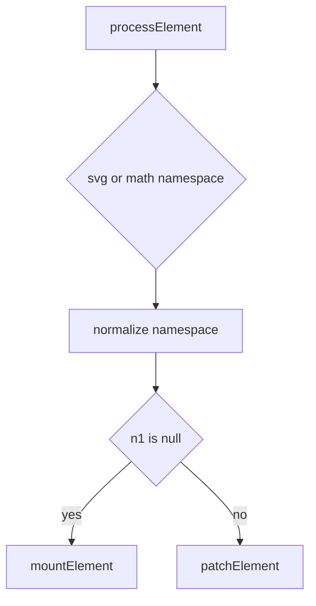
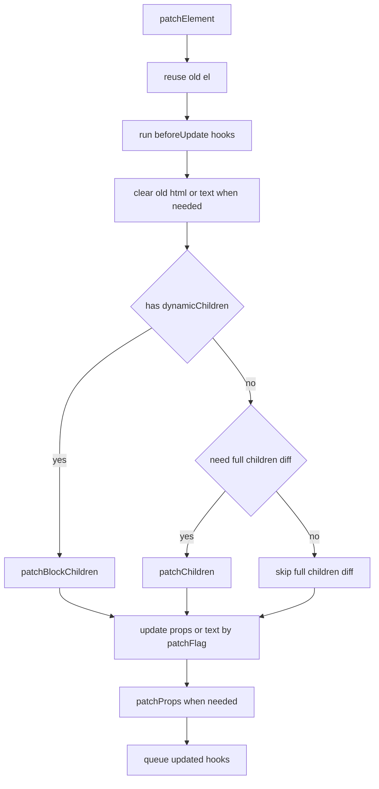

# 元素更新源码走读

如果你想先确认这组更新链文档的阅读顺序，先看 [Renderer 更新链阅读地图](./renderer-update-reading-map.md)。

这篇聚焦 `renderer.ts` 里和普通元素更新最相关的 4 个函数：

- `processElement()`
- `mountElement()`
- `patchElement()`
- `patchProps()`

如果你现在已经看过 diff 主线，最适合把这篇当成：

`patch() 进入普通元素后，具体怎么落到 DOM 更新。`

配套阅读：

- [renderer.ts 核心步骤](./renderer-ts-explained.md)
- [Diff 阅读地图](./diff-reading-map.md)
- [Diff 算法源码走读](./diff-algorithm-source-walkthrough.md)

---

## 1. 这几段代码在链路里的位置

普通元素节点更新的大致链路是：

```text
patch()
  -> processElement()
    -> mountElement()    // 首次挂载
    -> patchElement()    // 更新
         -> patchChildren()
         -> patchProps()
```

源码位置：

- `processElement()`：`renderer.ts:651`
- `mountElement()`：`renderer.ts:705`
- `patchElement()`：`renderer.ts:878`
- `patchProps()`：`renderer.ts:1082` 左右

这里最重要的认知是：

`processElement()` 只负责分流，真正的挂载和更新细节分别在 `mountElement()` 和 `patchElement()`。`

---

## 2. `processElement()` 只做一次总判断

源码主线很短：

```ts
if (n2.type === 'svg') {
  namespace = 'svg'
} else if (n2.type === 'math') {
  namespace = 'mathml'
}

if (n1 == null) {
  mountElement(...)
} else {
  patchElement(...)
}
```

它基本只回答两个问题：

1. 这个元素属于哪种命名空间
2. 这是首次挂载还是更新

可以把它理解成：



所以别把 `processElement()` 看得太重，它更像一个小调度器。

---

## 3. `mountElement()` 在首次挂载时做什么

`mountElement()` 的步骤其实很规整。

### 第一步：创建宿主元素

```ts
el = vnode.el = hostCreateElement(
  vnode.type as string,
  namespace,
  props && props.is,
  props,
)
```

这一步只是“创建壳子”，还没插入到页面。

### 第二步：先处理 children

```ts
if (shapeFlag & ShapeFlags.TEXT_CHILDREN) {
  hostSetElementText(el, vnode.children as string)
} else if (shapeFlag & ShapeFlags.ARRAY_CHILDREN) {
  mountChildren(...)
}
```

注意 Vue 这里是先挂 children，再处理 props。

源码注释已经说明原因：

`有些 props 依赖子内容已经存在，比如 <select value>。`

### 第三步：处理指令、scopeId、props

接下来会依次做：

- `invokeDirectiveHook(..., 'created')`
- `setScopeId(...)`
- 遍历普通 props 调 `hostPatchProp`
- 特殊处理 `value`
- 触发 `onVnodeBeforeMount`

其中 `value` 被单独放到最后，是因为它对某些表单元素有顺序敏感性。

### 第四步：插入真实宿主节点

```ts
hostInsert(el, container, anchor)
```

到这里元素才真正进入宿主树。

### 第五步：延后执行 mounted 相关副作用

最后再通过 `queuePostRenderEffect` 统一处理：

- `onVnodeMounted`
- 过渡 enter
- 指令 `mounted`

所以 `mountElement()` 不是“创建完就结束”，而是：

`同步创建结构，异步收尾生命周期和副作用。`

---

## 4. `patchElement()` 更新时先做什么

更新阶段首先复用旧 DOM：

```ts
const el = (n2.el = n1.el!)
```

这行非常关键，表示：

`新 vnode 和旧 vnode 现在共享同一个宿主元素 el。`

后面所有更新，都是在这同一个 `el` 上做最小修改。

接着它会取这些信息：

```ts
let { patchFlag, dynamicChildren, dirs } = n2
const oldProps = n1.props || EMPTY_OBJ
const newProps = n2.props || EMPTY_OBJ
```

也就是说，`patchElement()` 更新时主要围绕两类信息展开：

- children 怎么更新
- props 怎么更新

---

## 5. 更新前为什么要先跑 beforeUpdate 钩子

源码里更新刚开始就有这段：

```ts
parentComponent && toggleRecurse(parentComponent, false)
if ((vnodeHook = newProps.onVnodeBeforeUpdate)) {
  invokeVNodeHook(vnodeHook, parentComponent, n2, n1)
}
if (dirs) {
  invokeDirectiveHook(n2, n1, parentComponent, 'beforeUpdate')
}
parentComponent && toggleRecurse(parentComponent, true)
```

意思是：

1. 暂时关闭递归触发，避免钩子期间意外自触发
2. 跑 vnode 级别的 `beforeUpdate`
3. 跑指令级别的 `beforeUpdate`
4. 恢复递归

所以真正 patch DOM 之前，Vue 会先把“更新前钩子”这层语义跑完。

---

## 6. 为什么有时先 patch children，有时先 patch props

`patchElement()` 里一个很容易忽略的点是：它不是永远先 props 后 children，或者永远先 children 后 props。

它会先处理一种特殊情况：

```ts
if (
  (oldProps.innerHTML && newProps.innerHTML == null) ||
  (oldProps.textContent && newProps.textContent == null)
) {
  hostSetElementText(el, '')
}
```

这是为了避免旧的 `innerHTML/textContent` 遗留影响后面挂 children。

接下来再分两种大路径。

### 路径 1：有 `dynamicChildren`

```ts
if (dynamicChildren) {
  patchBlockChildren(...)
}
```

这表示 block tree 优化生效，只更新编译器记录下来的动态子节点。

### 路径 2：没有 block 优化信息

```ts
else if (!optimized) {
  patchChildren(...)
}
```

这时才回到完整 children diff。

所以 children 更新优先级很高，因为：

`子树结构变更会直接影响后续很多 DOM 状态。`

---

## 7. `patchFlag` 在 `patchElement()` 里怎么提速

children 处理完后，`patchElement()` 开始更新 props。

如果 `patchFlag > 0`，说明这个 vnode 是编译器生成并标注过的，可以走快路径。

### `FULL_PROPS`

```ts
if (patchFlag & PatchFlags.FULL_PROPS) {
  patchProps(el, oldProps, newProps, parentComponent, namespace)
}
```

表示动态 key 太复杂，直接做完整 props diff。

### `CLASS`

```ts
if (patchFlag & PatchFlags.CLASS) {
  if (oldProps.class !== newProps.class) {
    hostPatchProp(el, 'class', null, newProps.class, namespace)
  }
}
```

只更新 class。

### `STYLE`

```ts
if (patchFlag & PatchFlags.STYLE) {
  hostPatchProp(el, 'style', oldProps.style, newProps.style, namespace)
}
```

只更新 style。

### `PROPS`

```ts
if (patchFlag & PatchFlags.PROPS) {
  const propsToUpdate = n2.dynamicProps!
  for (...) {
    hostPatchProp(...)
  }
}
```

只更新编译器提前记录好的动态 props 列表。

### `TEXT`

```ts
if (patchFlag & PatchFlags.TEXT) {
  if (n1.children !== n2.children) {
    hostSetElementText(el, n2.children as string)
  }
}
```

只更新动态文本。

所以 `patchFlag` 在这一层的意义是：

`把“整轮 props 遍历”缩小成“只 patch 编译器确认会变的那部分”。`

---

## 8. `patchProps()` 在做什么

当不能完全依赖快路径时，会进入 `patchProps()`。

它本质做两轮事。

### 第一轮：删旧 key

```ts
for (const key in oldProps) {
  if (!isReservedProp(key) && !(key in newProps)) {
    hostPatchProp(el, key, oldProps[key], null, ...)
  }
}
```

新 props 里没有的旧 key，要显式 patch 成 `null` 才能触发宿主移除。

### 第二轮：补新值

```ts
for (const key in newProps) {
  if (next !== prev && key !== 'value') {
    hostPatchProp(el, key, prev, next, ...)
  }
}
```

只有真正变化的值才 patch。

### `value` 为什么单独最后处理

```ts
if ('value' in newProps) {
  hostPatchProp(el, 'value', oldProps.value, newProps.value, namespace)
}
```

因为 `value` 对表单元素的宿主状态有特殊语义，而且顺序敏感。

---

## 9. `patchElement()` 的完整心智模型

可以把更新一个普通元素压缩成这张图：



最终它干的事可以总结成：

`先决定子树要不要递归更新，再决定当前元素的属性要不要最小改写，最后补生命周期和指令收尾。`

---

## 10. 读这一段时最容易混淆的 4 件事

### 1. `mountElement()` 和 `patchElement()` 是两条不同路径

- `mountElement()`：首次创建真实节点
- `patchElement()`：复用旧真实节点后做增量更新

### 2. `patchChildren()` 只是 `patchElement()` 的一部分

元素更新不是只有 children diff，还包括 props、文本、指令、过渡、生命周期。

### 3. `dynamicChildren` 和 `patchFlag` 不是一回事

- `dynamicChildren`：block tree 级别，决定 children 要不要整棵递归
- `patchFlag`：节点级别，决定 props / text 能不能走快路径

### 4. `value` 被特殊处理不是偶然

它是为了对齐宿主表单语义，而不是代码风格问题。

---

## 11. 建议怎么配合源码读

最稳的顺序是：

1. 先看 `processElement()`
   只确认它如何分流到 mount 或 patch
2. 再看 `mountElement()`
   搞清楚首次挂载顺序
3. 再看 `patchElement()`
   重点看 children 更新和 props 更新的先后关系
4. 最后看 `patchProps()`
   把属性删除、属性更新、`value` 特殊处理看明白

这样会比直接从 `patchElement()` 中间往下扎容易很多。
