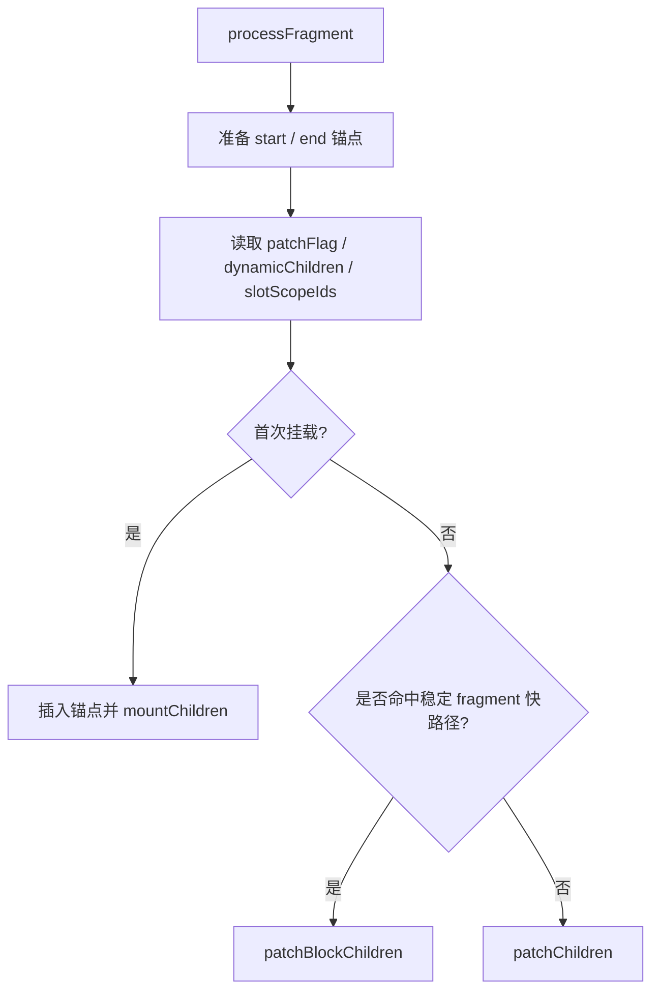

# Fragment / Block 更新源码走读

如果你想先确认这组更新链文档的阅读顺序，先看 [Renderer 更新链阅读地图](./renderer-update-reading-map.md)。

这篇聚焦 `renderer.ts` 里和 Fragment、block 优化最相关的两段：

- `processFragment()`
- `patchBlockChildren()`

如果你已经能看懂普通元素更新，但一看到：

- `Fragment`
- `dynamicChildren`
- `STABLE_FRAGMENT`
- `patchBlockChildren()`

就开始断链，那就看这篇。

配套阅读：

- [renderer.ts 核心步骤](./renderer-ts-explained.md)
- [Diff 阅读地图](./diff-reading-map.md)
- [Diff 算法源码走读](./diff-algorithm-source-walkthrough.md)

---

## 1. 这两段代码在链路里的位置

Fragment 的处理链路大致是：

```text
patch()
  -> processFragment()
       -> mountChildren()         // 首次挂载
       -> patchChildren()         // 普通 fragment 更新
       -> patchBlockChildren()    // 稳定 fragment + block 优化
```

源码位置：

- `patchBlockChildren()`：`renderer.ts:1024`
- `processFragment()`：`renderer.ts:1111`

这两段真正要解决的问题是：

- Fragment 自己没有单个真实元素，更新边界怎么确定
- 编译器已经知道“这组 children 根层稳定”时，运行时怎么跳过整轮 children diff

---

## 2. 为什么 Fragment 需要特殊处理

普通元素有一个明确的宿主节点 `el`。

但 Fragment 没有。

它在宿主层靠的是：

- 起始锚点
- 结束锚点
- 中间一段 children

源码一上来就做了这件事：

```ts
const fragmentStartAnchor = (n2.el = n1 ? n1.el : hostCreateText(''))!
const fragmentEndAnchor = (n2.anchor = n1 ? n1.anchor : hostCreateText(''))!
```

也就是说：

`Fragment 的 el / anchor 不是普通元素节点，而是两端边界锚点。`

这两个锚点决定了整段 children 在宿主树里的范围。

---

## 3. `processFragment()` 的第一层逻辑

可以先把它压缩成这样：



它的核心判断其实只有两层：

1. 首次挂载还是更新
2. 更新时能不能走稳定 fragment 的 block 快路径

---

## 4. 首次挂载时为什么要先插锚点

首次挂载分支里：

```ts
hostInsert(fragmentStartAnchor, container, anchor)
hostInsert(fragmentEndAnchor, container, anchor)
mountChildren(..., fragmentEndAnchor, ...)
```

这里先插入 start/end 锚点，再挂 children。

原因是：

`Fragment 本身没有真实元素，后续 children 必须有一个明确的宿主边界。`

而 `fragmentEndAnchor` 会被当成 children 的锚点，这样挂出来的所有子节点都会落在 start/end 之间。

所以可以把 Fragment 首次挂载理解成：

1. 先在宿主树里立两个边界标记
2. 再把中间 children 填进去

---

## 5. 更新时为什么先看 `STABLE_FRAGMENT`

更新分支里最关键的判断是：

```ts
if (
  patchFlag > 0 &&
  patchFlag & PatchFlags.STABLE_FRAGMENT &&
  dynamicChildren &&
  n1.dynamicChildren &&
  n1.dynamicChildren.length === dynamicChildren.length
) {
  patchBlockChildren(...)
} else {
  patchChildren(...)
}
```

这里的意思是：

`如果编译器已经保证这组 fragment 根层顺序稳定，而且动态孩子集合也对得上，那运行时就没必要再整轮比较 children 顺序。`

这就是 stable fragment 的核心收益：

- 根层结构稳定
- 顺序稳定
- 只需要下钻真正会变的那批动态节点

所以这条快路径并不是“跳过更新”，而是：

`跳过根层大 diff，只更新编译器已经标出来的动态 children。`

---

## 6. `slotScopeIds` 在 Fragment 里为什么要额外处理

源码里还有一段容易被忽略：

```ts
if (fragmentSlotScopeIds) {
  slotScopeIds = slotScopeIds
    ? slotScopeIds.concat(fragmentSlotScopeIds)
    : fragmentSlotScopeIds
}
```

这表示：

`如果这个 Fragment 是插槽相关的，并且携带额外作用域 id，就要把这组 scope id 继续向后代传。`

它不是 diff 本身的核心，但解释了为什么 Fragment 处理经常会比普通元素多一层上下文传递。

---

## 7. `patchBlockChildren()` 其实在做什么

`patchBlockChildren()` 没有复杂的 keyed diff。

它的前提是：

`oldChildren` 和 `newChildren` 是编译器记录出来的动态节点集合。`

所以它做的事非常直接：

1. 遍历新旧动态 children
2. 一一对应 patch
3. 但为每一对 vnode 推断正确的容器 `container`

主线代码就是：

```ts
for (let i = 0; i < newChildren.length; i++) {
  const oldVNode = oldChildren[i]
  const newVNode = newChildren[i]
  const container = ...
  patch(oldVNode, newVNode, container, ...)
}
```

这里最大的难点不是“怎么循环”，而是：

`为什么 container 不能简单等于 fallbackContainer。`

---

## 8. `patchBlockChildren()` 为什么还要推断 container

源码里这段判断非常关键：

```ts
const container =
  oldVNode.el &&
  (oldVNode.type === Fragment ||
    !isSameVNodeType(oldVNode, newVNode) ||
    oldVNode.shapeFlag &
      (ShapeFlags.COMPONENT | ShapeFlags.TELEPORT | ShapeFlags.SUSPENSE))
    ? hostParentNode(oldVNode.el)!
    : fallbackContainer
```

它表达的是：

`block 子节点虽然是一一对应的，但它们真正的宿主父容器不一定都能直接拿 fallbackContainer 代替。`

尤其下面几种情况要重新判断：

- 旧节点本身是 `Fragment`
- 新旧节点类型不同，可能发生替换
- 旧节点是 `Component`
- 旧节点是 `Teleport`
- 旧节点是 `Suspense`

因为这些节点在宿主层不一定直接挂在 block 容器本身上。

所以 `patchBlockChildren()` 的关键价值不是“更复杂”，反而是：

`在保持一一对应 patch 的同时，避免用错真实宿主容器。`

---

## 9. 为什么 stable fragment 还能需要 `traverseStaticChildren`

在 `processFragment()` 的稳定分支里，`patchBlockChildren()` 后面还有：

```ts
if (__DEV__) {
  traverseStaticChildren(n1, n2)
} else if (
  n2.key != null ||
  (parentComponent && n2 === parentComponent.subTree)
) {
  traverseStaticChildren(n1, n2, true)
}
```

这段的意义可以粗暴记成：

`虽然这次走的是动态 children 快路径，但某些场景下，根层静态 vnode 的 el 继承关系仍然要同步。`

尤其：

- dev / HMR
- 有 key 的 `<template v-for>`
- 组件根 fragment 可能整体被移动

这些场景下，如果不补这一步，后面移动或调试时 vnode 上的 `el` 指向可能不完整。

---

## 10. `processFragment()` 和 `patchChildren()` 的关系

很多人会误以为 Fragment 更新完全独立于 children diff。

其实不是。

`processFragment()` 只是先决定：

- 走 stable fragment 快路径
- 还是走普通 children diff

如果没命中快路径，它最终还是会落回：

```ts
patchChildren(...)
```

所以它更像是 `patchChildren()` 的上游调度层，而不是另一套平行系统。

---

## 11. 可以把这两段代码压缩成什么心智模型

可以压成一句话：

`Fragment 用前后锚点代表一整段子树；如果编译器已经保证这段根层稳定，运行时就直接一一 patch 动态 children，否则回到普通 children diff。`

---

## 12. 读这一段最容易混淆的 4 件事

### 1. Fragment 不是没有 `el`

它有 `el`，但这个 `el` 是起始锚点，不是普通元素。

### 2. `dynamicChildren` 不是全部 children

它是编译器筛出来的“需要重点 patch 的动态节点集合”。

### 3. `patchBlockChildren()` 不是 keyed diff

它不负责未知区间乱序分析，它是在“一一对应已知动态节点”的前提下做快速 patch。

### 4. stable fragment 不是完全不更新

它只是跳过根层顺序 diff，不代表 children 不更新。

---

## 13. 建议怎么配合源码读

最稳的顺序是：

1. 先看 `processFragment()` 开头的锚点初始化
2. 再看 stable fragment 的判断条件
3. 接着看 `patchBlockChildren()` 的 container 推断
4. 最后回过头对照 `patchChildren()`，确认两条路径何时分流

这样会更容易把 Fragment、block tree、dynamicChildren 三件事连起来。
