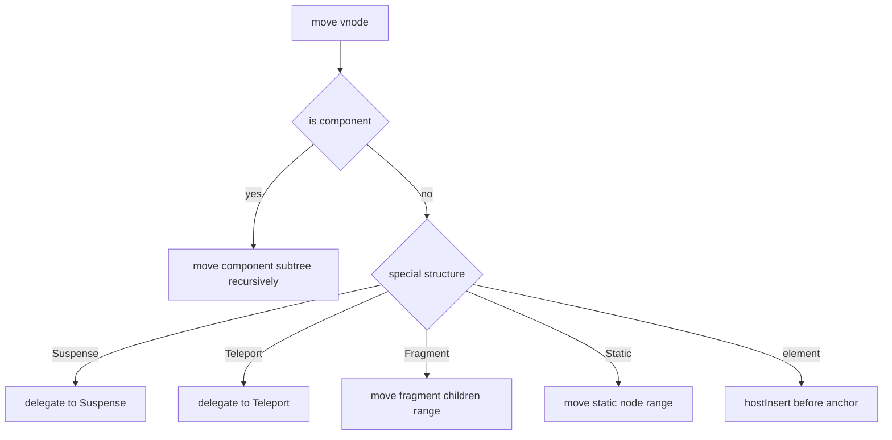

# `move()` 源码走读

如果你想先确认这组更新链文档的阅读顺序，先看 [Renderer 更新链阅读地图](./renderer-update-reading-map.md)。

这篇只看 `renderer.ts` 里的 `move()`。

它解决的问题不是“节点要不要复用”，而是：

`一个 vnode 在已经确定要保留后，怎么把对应宿主节点移动到正确位置。`

配套阅读：

- [renderer.ts 核心步骤](./renderer-ts-explained.md)
- [Diff 阅读地图](./diff-reading-map.md)
- [Diff 算法源码走读](./diff-algorithm-source-walkthrough.md)

---

## 1. `move()` 在哪条链路里出现

很多人第一次看 diff，容易把 `patch()` 和 `move()` 混成一件事。

其实它们解决的是两层不同问题：

- `patch()`：当前新旧 vnode 能不能复用，以及要不要更新内容
- `move()`：如果节点身份能复用，但位置不对，怎么移动宿主节点

在 keyed diff 里，`move()` 主要出现在这里：

```ts
if (j < 0 || i !== increasingNewIndexSequence[j]) {
  move(nextChild, container, anchor, MoveType.REORDER)
}
```

也就是说，只有当：

- 节点已经复用成功
- 但它不在 LIS 里

才会进入 `move()`。

源码位置：

- `move()`：`vue-source/packages/runtime-core/src/renderer.ts:2206`

---

## 2. 为什么单独需要 `move()`

因为“复用”和“位置正确”不是一回事。

一个节点完全可能：

1. 在 `patchKeyedChildren()` 里被成功复用
2. 又因为顺序打乱，需要重新插入到别的位置

例如旧顺序：

```text
A B C D
```

新顺序：

```text
D B A C
```

这里的 `A`、`B`、`C`、`D` 可能都被复用，但不代表它们都已经在正确 DOM 位置。

所以 Vue 把“内容更新”和“位置移动”拆成两层处理。

---

## 3. `move()` 的主分流是什么

源码开头：

```ts
const { el, type, transition, children, shapeFlag } = vnode
if (shapeFlag & ShapeFlags.COMPONENT) {
  move(vnode.component!.subTree, container, anchor, moveType)
  return
}
```

第一层先判断：

`这个 vnode 本身是不是组件。`

如果是组件，移动的不是组件对象壳子，而是它渲染出来的根子树。

这是理解 `move()` 的第一个关键点：

`Vue 移动的永远是宿主层可见的那棵子树。`

---

## 4. 组件为什么要递归移动 `subTree`

组件 vnode 本身不是宿主节点。

真正对应 DOM 的，是它 render 后产出的 `subTree`。

所以源码直接：

```ts
move(vnode.component!.subTree, container, anchor, moveType)
```

意思是：

`如果你想移动一个组件，本质上是在移动它渲染出来的根 vnode。`

这也说明 `move()` 的思路很统一：

- 普通元素：移动元素本身
- 组件：递归移动它的渲染子树

---

## 5. `Suspense`、`Teleport`、`Fragment` 为什么也要特殊处理

`move()` 后面会继续按 `shapeFlag` 和 `type` 分流。

核心原因都一样：

`这些 vnode 不是“单个普通元素”，它们对应的是一段更复杂的宿主结构。`

可以粗暴记成：

- `Component`：移动 `subTree`
- `Suspense`：交给 `Suspense` 自己的移动逻辑
- `Teleport`：交给 `Teleport` 自己决定真实目标容器
- `Fragment`：移动前后锚点之间的整段 children
- `Static`：移动整段静态内容
- `Element`：直接移动自身宿主元素

也就是说，`move()` 不是“统一调一次 `insert` 就结束”，而是：

`先判断当前 vnode 在宿主层到底对应什么结构，再选择正确的移动方式。`

---

## 6. 普通元素的移动是怎么落地的

对普通元素来说，核心动作还是宿主层的插入：

```ts
hostInsert(el!, container, anchor)
```

注意这里不是“先 remove 再 insert”的心智模型。

对 DOM 来说，把一个已存在节点再次 `insertBefore` 到新位置，本身就会完成移动。

所以可以把普通元素移动理解成：

`把这个已有宿主节点重新插入到目标锚点前。`

这里最关键的信息是：

- `el`：当前 vnode 对应的宿主节点
- `container`：要放进哪个父容器
- `anchor`：插到哪个节点前面

---

## 7. 为什么 `anchor` 这么重要

移动不是说“放到某个索引”。

宿主层真正能执行的是：

`插到某个父容器里的某个锚点前。`

所以 Vue 在 keyed diff 最后倒序遍历时，才会努力把右侧相邻节点当成稳定锚点：

```ts
const anchor =
  nextIndex + 1 < l2
    ? anchorVNode.el || resolveAsyncComponentPlaceholder(anchorVNode)
    : parentAnchor
```

这样 `move()` 拿到的就是一个已经算好的目标位置。

所以：

- `patchKeyedChildren()` 负责算“应该移到哪里”
- `move()` 负责真正把节点送过去

---

## 8. `Fragment` 为什么移动起来更麻烦

`Fragment` 本身没有单个真实元素。

它靠的是：

- 起始锚点
- 结束锚点
- 中间的一组 children

所以移动 `Fragment` 时，不能只动一个 `el`，而是要把整段内容都搬过去。

你可以把它理解成：

`普通元素移动一个点，Fragment 移动一整段区间。`

这也是为什么渲染器里很多地方都需要 `el + anchor` 这对信息。

---

## 9. `moveType` 是干什么的

`move()` 的参数里有一个：

```ts
moveType
```

它不是多余参数，它用来区分这次移动的语义。

不同语义下，过渡逻辑的处理会不一样，比如：

- 纯重排
- 进入
- 离开相关处理

也就是说，`move()` 不只是搬节点，还要给过渡系统保留上下文。

第一次读源码时，不必先深挖所有枚举值，先记住这件事就够了：

`同样是“插入”，重排和过渡阶段的移动语义并不完全一样。`

---

## 10. `move()` 的完整心智模型

可以把它压缩成一张图：



最终它解决的问题其实很具体：

`当前 vnode 已经确定要保留，现在把它对应的宿主结构移动到新顺序要求的位置。`

---

## 11. 最容易混淆的 4 件事

### 1. `patch` 不等于 `move`

- `patch`：更新内容和复用关系
- `move`：调整宿主位置

### 2. 组件移动不是移动组件对象

组件本身没有可直接操作的 DOM，真正移动的是它的 `subTree`。

### 3. `anchor` 不是可选装饰信息

没有锚点，宿主层就不知道“插到哪里前面”。

### 4. `move()` 不只处理普通元素

它还要处理：

- `Component`
- `Fragment`
- `Teleport`
- `Suspense`
- `Static`

---

## 12. 建议怎么配合源码读

最稳的顺序是：

1. 先回到 `patchKeyedChildren()` 最后一段
   看看什么情况下会调用 `move()`
2. 再看 `move()` 开头的按类型分流
3. 最后再看普通元素、组件、Fragment 的不同移动方式

这样你会更容易理解：

`为什么 Vue 先做“谁该留、谁该删、谁该 patch”，最后才做“谁该移动”。`
