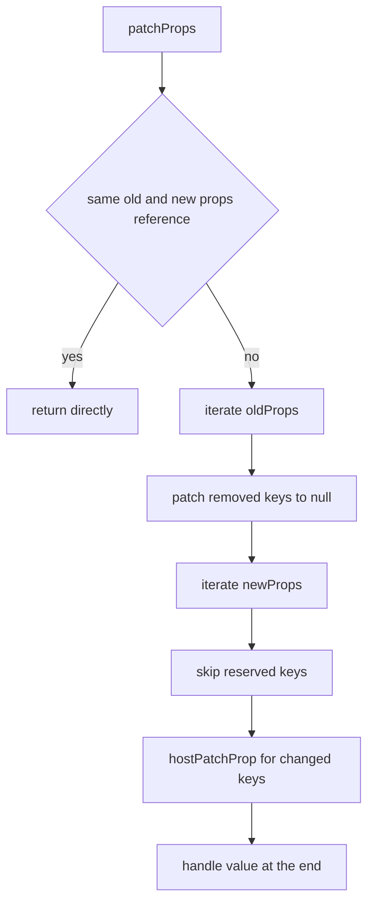

# `patchProps()` 源码走读

如果你想先确认这组更新链文档的阅读顺序，先看 [Renderer 更新链阅读地图](./renderer-update-reading-map.md)。

这篇只看 `renderer.ts` 里的 `patchProps()`。

它解决的问题不是 children diff，而是：

`当一个元素已经确定要复用后，它的 props 该怎么做最小更新。`

配套阅读：

- [renderer.ts 核心步骤](./renderer-ts-explained.md)
- [元素更新源码走读](./element-update-source-walkthrough.md)
- [Diff 阅读地图](./diff-reading-map.md)

---

## 1. `patchProps()` 在哪条链路里出现

元素更新的相关链路大致是：

```text
patch()
  -> processElement()
    -> patchElement()
         -> patchChildren()
         -> patchProps()
```

也就是说，`patchProps()` 不是单独入口，它是 `patchElement()` 的一部分。

源码位置：

`vue-source/packages/runtime-core/src/renderer.ts:1070`

它通常会在两类场景下出现：

1. `patchFlag & PatchFlags.FULL_PROPS`
   需要完整 props diff
2. `!optimized && dynamicChildren == null`
   没有可用优化信息，回到完整 props diff

所以它可以理解成：

`元素属性更新的通用兜底路径。`

---

## 2. 先看源码主线

源码整体其实很短：

```ts
const patchProps = (
  el,
  oldProps,
  newProps,
  parentComponent,
  namespace,
) => {
  if (oldProps !== newProps) {
    if (oldProps !== EMPTY_OBJ) {
      for (const key in oldProps) {
        if (!isReservedProp(key) && !(key in newProps)) {
          hostPatchProp(el, key, oldProps[key], null, namespace, parentComponent)
        }
      }
    }
    for (const key in newProps) {
      if (isReservedProp(key)) continue
      const next = newProps[key]
      const prev = oldProps[key]
      if (next !== prev && key !== 'value') {
        hostPatchProp(el, key, prev, next, namespace, parentComponent)
      }
    }
    if ('value' in newProps) {
      hostPatchProp(el, 'value', oldProps.value, newProps.value, namespace)
    }
  }
}
```

可以先把它压缩成两轮：

1. 先删旧的
2. 再补新的

最后单独收尾 `value`

---

## 3. 第一层判断为什么是 `oldProps !== newProps`

```ts
if (oldProps !== newProps) {
```

这是一个很便宜的短路判断。

如果新旧 props 引用本身就是同一个对象，那就没有必要进入后续遍历。

它不是深比较，只是一个很实用的：

`如果连 props 对象引用都没变，就直接跳过。`

---

## 4. 为什么第一轮是“删旧 key”

源码先遍历的是旧 props：

```ts
for (const key in oldProps) {
  if (!isReservedProp(key) && !(key in newProps)) {
    hostPatchProp(el, key, oldProps[key], null, namespace, parentComponent)
  }
}
```

这里的意思是：

`如果旧 props 有一个 key，新 props 里已经没有了，那必须显式通知宿主把它移除。`

为什么不能靠后面“补新值”顺便解决？

因为“属性消失”不是“属性变成别的值”，而是一个单独的语义。

例如：

- 旧的有 `class`
- 新的没有 `class`

如果不显式 patch 成 `null`，宿主层可能会保留旧状态。

所以第一轮不是优化，而是语义正确性要求。

---

## 5. 什么叫 `isReservedProp(key)`

源码里删旧 key 和补新 key 时都会先跳过：

```ts
if (isReservedProp(key)) continue
```

这类 key 不属于需要直接 patch 到宿主元素的普通属性，比如一些内部保留字段、vnode 层语义字段。

你可以先把它粗暴理解成：

`这些不是给宿主层直接打补丁的 props。`

所以 `patchProps()` 的目标并不是“处理所有 props 字段”，而是：

`处理那些需要真正落到宿主元素上的普通属性。`

---

## 6. 第二轮为什么是“补新值”

删完旧 key 后，再遍历新 props：

```ts
for (const key in newProps) {
  if (isReservedProp(key)) continue
  const next = newProps[key]
  const prev = oldProps[key]
  if (next !== prev && key !== 'value') {
    hostPatchProp(el, key, prev, next, namespace, parentComponent)
  }
}
```

这轮只处理“新值和旧值不同”的字段。

也就是说，Vue 在这里的策略非常直接：

- 没变的不动
- 变了的才 patch

这也是宿主层最小更新的基本原则。

---

## 7. 为什么 `value` 要单独最后处理

源码把 `value` 排除在通用循环外：

```ts
if (next !== prev && key !== 'value') {
```

然后最后再单独处理：

```ts
if ('value' in newProps) {
  hostPatchProp(el, 'value', oldProps.value, newProps.value, namespace)
}
```

这不是风格问题，而是宿主语义问题。

对表单元素来说，`value` 往往有两个特点：

1. 顺序敏感
   它可能需要在某些别的属性之后设置
2. 宿主状态可能和表面 props 不完全同步
   比如用户输入已经改过真实 DOM 值

所以 Vue 把它放到最后走特殊路径，避免和通用属性处理混在一起。

---

## 8. `patchProps()` 和 `patchFlag` 是什么关系

很多人会把 `patchProps()` 理解成“每次元素更新都会完整遍历 props”。

其实不是。

在 `patchElement()` 里，优先走的是基于 `patchFlag` 的快路径：

- 只更新 `class`
- 只更新 `style`
- 只更新编译器记录的 `dynamicProps`
- 只更新动态文本

只有当这些快路径不够用时，才会落到：

```ts
patchProps(...)
```

所以更准确地说：

`patchProps()` 是通用完整属性 diff；patchFlag 是优先尝试的编译期定向优化。`

---

## 9. 可以把 `patchProps()` 压缩成什么心智模型

可以压成这张图：



它其实非常朴素：

`删掉不该存在的旧属性，补上已经变化的新属性，最后特殊处理 value。`

---

## 10. `hostPatchProp` 为什么是核心

`patchProps()` 自己并不关心：

- 这个 key 是 DOM property 还是 attribute
- 事件该怎么绑定
- style 要怎么合并
- class 要怎么规范化

它只负责：

`算出旧值和新值，然后把“怎么真正写到宿主层”交给 hostPatchProp。`

这体现了 `renderer.ts` 一贯的设计：

- runtime-core 负责通用调度和 diff 策略
- 具体宿主写入交给平台实现

所以 `patchProps()` 是“平台无关”的。

---

## 11. 最容易混淆的 4 件事

### 1. `patchProps()` 不是每次都执行

很多时候编译期快路径已经把属性更新缩小到更小范围了。

### 2. 删除旧 key 和更新新值是两轮不同语义

- 旧 key 消失：要显式移除
- 新值变化：要显式更新

### 3. `value` 单独处理不是特例堆砌

它是为了对齐宿主表单行为。

### 4. `patchProps()` 不负责决定宿主写入细节

真正怎么 patch 到宿主节点，是 `hostPatchProp` 的职责。

---

## 12. 建议怎么配合源码读

最稳的顺序是：

1. 先在 `patchElement()` 里找到什么情况下会调用 `patchProps()`
2. 再看 `patchProps()` 的两轮遍历
3. 最后回头看 `hostPatchProp` 的调用参数，理解 runtime-core 给宿主层提供了什么上下文

这样你会更容易把：

- 编译期快路径
- 运行时完整 props diff
- 宿主层真正属性写入

这三层分开看清楚。
