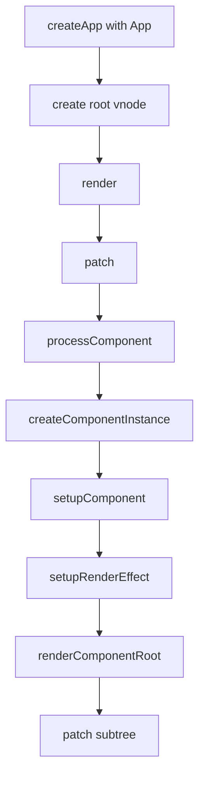
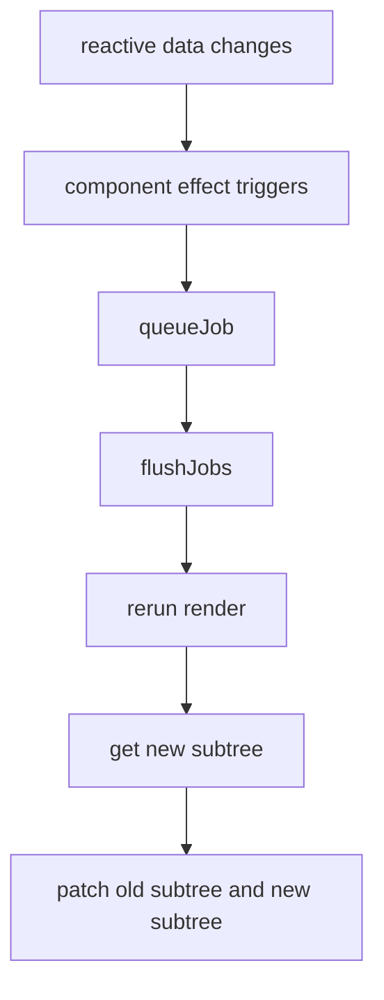

# runtime-core 总览与渲染主流程

对应目录：`vue-source/packages/runtime-core/src`

这篇文档不直接从源码函数开始，而是先回答一个更重要的问题：

`runtime-core` 到底在解决什么问题？

如果这个问题没有先想清楚，后面看到 `createComponentInstance`、`setupRenderEffect`、`patchChildren` 这些函数名时，很容易只记住“步骤很多”，但完全不知道它们为什么要存在。

---

## 1. 先建立一个总认知

你可以把 Vue 运行时先粗暴分成两层：

- `runtime-core`
  负责“怎么更新”
- `runtime-dom`
  负责“更新到哪里、用什么 DOM API 更新”

所以：

- `runtime-core` 不关心 `document.createElement`
- `runtime-core` 关心的是：
  - 这是组件还是元素？
  - 是首次挂载还是更新？
  - 组件什么时候该重新执行 render？
  - 新旧两棵 VNode 树怎么比较？

一句话概括：

`runtime-core` 是 Vue 的“调度中心 + 渲染算法层 + 组件运行时层”。`

---

## 2. 用户写的代码，进入 runtime-core 之前是什么样？

先看一个最常见的组件：

```ts
const App = {
  setup() {
    const count = ref(0)
    return { count }
  },
  render() {
    return h('div', this.count)
  }
}
```

在 `runtime-core` 眼里，这段代码最后会被拆成三类东西：

1. 组件定义对象
   例如 `App`
2. 组件实例
   运行时创建出来的一份上下文对象，保存 props、slots、state、effect、subTree 等
3. VNode 树
   `render()` 执行后的结果，不是真 DOM，而是“接下来应该长成什么样”的描述

所以 Vue 运行时真正要做的事其实是：

1. 把组件定义变成组件实例
2. 执行组件 render，拿到 VNode 树
3. 把新 VNode 树和旧 VNode 树做比较
4. 只更新必要的部分

---

## 3. 为什么一定要有 VNode？

很多人第一次看源码时会卡在这里：

“为什么不能数据一变就直接改 DOM？”

原因是：组件更新时，Vue 需要先知道“最新 UI 应该长什么样”，然后才能决定“真实 DOM 应该改哪里”。

直接改 DOM 有两个大问题：

1. 你很难在组件级别表达“整个界面现在应该是什么结果”
2. 你很难在更新前后做统一比较

所以 Vue 先让 `render()` 产出一棵 VNode 树：

- 旧树：上一次界面长什么样
- 新树：这一次界面应该长什么样

然后再由 `patch()` 比较两棵树。

也就是说：

`VNode 不是为了替代 DOM，而是为了给 diff 提供一个可比较的中间表示。`

---

## 4. runtime-core 到底维护了哪些“核心对象”？

理解源码，最重要的是先搞清楚运行时手里有哪些对象。

### 4.1 组件定义

这是你写出来的对象，例如：

```ts
const App = {
  props: ['msg'],
  setup() {},
  render() {}
}
```

它只是“组件说明书”，本身不能直接运行。

### 4.2 组件实例 `ComponentInternalInstance`

这是 `component.ts` 创建出来的运行时对象。

你可以把它理解成：

“某个组件节点当前活着时的全部运行状态”

它里面会保存：

- 当前 vnode
- 组件类型
- 父组件
- appContext
- props
- attrs
- slots
- setupState
- data
- render
- subTree
- effect
- update

注意：

组件实例不是组件定义。

组件定义是模板，组件实例是运行时实体。

一个组件定义可以创建出很多个实例。

### 4.3 VNode

VNode 是描述 UI 结构的对象。

比如：

```ts
h('div', { id: 'a' }, 'hello')
```

最后会变成一个 VNode，大致包含：

- `type`
- `props`
- `children`
- `shapeFlag`
- `el`
- `component`

### 4.4 渲染副作用 `ReactiveEffect`

组件之所以能“数据变了自动更新”，不是因为组件本身神奇，而是因为组件 render 会被包进一个响应式副作用里。

当 render 里访问了响应式数据：

- 读取时收集依赖
- 数据变化时触发 effect
- effect 被调度器加入更新队列
- 队列刷新时重新 render

所以组件更新本质上是：

`响应式 effect 的重新执行。`

---

## 5. 整个首屏挂载，到底发生了什么？

下面用最常见的应用启动链路，从头串一遍。



下面按“前因后果”讲。

### 第一步：`createApp(App)`

这里还没有开始渲染，它只是创建应用对象和应用上下文。

应用上下文里会放：

- 全局组件
- 全局指令
- `provide`
- 插件
- 配置项

这一步的产物是：

- 一个 app
- 一个 root component 定义

### 第二步：`createVNode(rootComponent)`

Vue 会先把根组件包装成一个 VNode。

为什么？

因为在渲染器看来，不管是元素、组件、Fragment、Teleport，最后都要统一先表示成 VNode，才能走同一套 `patch()`。

### 第三步：`render(vnode, container)`

`render` 做的事情非常简单：

- 如果传入的是新 vnode，就去 patch
- 如果传入的是 `null`，就卸载

它真正的重要意义在于：

`render` 是从“应用层”进入“渲染器内部”的入口。

### 第四步：`patch(oldVNode, newVNode, container, ...)`

这是整个运行时最关键的入口。

你可以把它理解成：

“给我旧树和新树，我来决定接下来到底要挂载、更新、替换还是卸载。”

`patch` 首先会看当前 VNode 是什么类型：

- 普通元素
- 组件
- 文本
- 注释
- Fragment
- Teleport
- Suspense

不同类型进入不同分支。

### 第五步：`processComponent`

根节点是组件，所以会进入组件分支。

这里又会继续区分：

- 这是首次挂载？
- 还是已有旧组件实例，正在更新？

首次挂载会走 `mountComponent`
更新会走 `updateComponent`

### 第六步：`createComponentInstance`

这一步真正把“组件定义”变成“组件实例”。

为什么一定要创建实例？

因为组件运行时需要一块地方存很多信息：

- 当前 props
- 当前 slots
- 父子关系
- 当前 render
- setupState
- 当前 subTree
- effect

没有实例，这些状态无处安放。

### 第七步：`setupComponent`

这一步做组件初始化。

主要是两件事：

1. 初始化 props
2. 初始化 slots

如果是有状态组件，还会继续进入 `setupStatefulComponent`

### 第八步：执行 `setup()`

`setup()` 是 Composition API 的核心入口。

它的返回值有两种主要情况：

- 返回对象
  这些字段会挂到 `setupState`
- 返回函数
  这个函数会直接被当成 render

所以 `handleSetupResult()` 的作用，就是把这两种情况收口成统一结果。

### 第九步：`finishComponentSetup`

走到这里，Vue 要确保一件事：

`这个组件最终必须拥有可执行的 render。`

它的来源可能是：

- 用户自己写的 `render`
- `setup()` 返回的函数
- 运行时编译模板得到的 render

### 第十步：`setupRenderEffect`

这是组件能自动更新的关键。

这一步会把组件渲染过程包进响应式 effect：

- effect 第一次执行：完成首屏挂载
- effect 后续再次执行：完成组件更新

所以你会看到：

- 初次执行时，会先 `renderComponentRoot()`
- 得到组件的 `subTree`
- 再递归 `patch(null, subTree, ...)`

根组件本身不是 DOM，它 render 出来的那棵 `subTree` 才是最终要继续 patch 的内容。

---

## 6. 组件为什么能自动更新？

再看更新链路：



这条链是理解 Vue 更新机制的核心。

### 6.1 render 里读取响应式数据

例如：

```ts
render() {
  return h('div', this.count)
}
```

这里读取了 `count`。

因为 render 正在 effect 里执行，所以这次读取会把“当前组件更新函数”收集为依赖。

### 6.2 `count` 改变

一旦 `count.value++`：

- 响应式系统触发依赖
- 组件对应的 effect 不会立刻同步重跑
- 而是交给调度器

### 6.3 调度器 `queueJob`

调度器会做三件事：

1. 去重
2. 排序
3. 推迟到微任务统一刷新

这就是为什么多次同步修改状态，通常只会触发一次组件更新。

### 6.4 再次执行 render

刷新队列时，组件 effect 会重新执行：

- 重新跑 `renderComponentRoot`
- 得到新的 `subTree`

### 6.5 `patch(oldSubTree, newSubTree)`

这一步才是真正的“界面更新”。

它会比较：

- 哪些节点类型变了
- 哪些 props 变了
- 哪些 children 变了
- 哪些节点可以复用

所以组件更新不是“重新创建整棵 DOM”，而是“重新生成一棵 VNode 树，再精确比较差异”。

---

## 7. 为什么 runtime-core 要拆成这么多文件？

第一次看源码经常会觉得：

“这不就是渲染吗，为什么要拆成 `component.ts`、`vnode.ts`、`scheduler.ts`、`componentProps.ts`、`componentSlots.ts` 这么多份？”

因为它们解决的是不同层级的问题。

### `vnode.ts`

负责“描述结构”

也就是：

- 节点是什么
- children 怎么归一化
- VNode 怎么创建和克隆

### `component.ts`

负责“让组件活起来”

也就是：

- 组件实例怎么创建
- `setup()` 怎么执行
- render 怎么确定

### `renderer.ts`

负责“怎么把结构真正 patch 下去”

也就是：

- 元素怎么处理
- 组件怎么处理
- children 怎么比较
- 节点怎么移动、卸载

### `scheduler.ts`

负责“什么时候更新”

也就是：

- effect 被触发后是同步跑，还是进队列
- 父子更新顺序怎么保证
- `nextTick` 为什么能拿到更新后的结果

### `componentProps.ts`

负责“props 怎么初始化和更新”

### `componentSlots.ts`

负责“slots 怎么标准化，更新时怎么处理”

换句话说，这种拆分并不是“为了好看”，而是因为 Vue 运行时其实同时在解决四个不同问题：

1. 描述 UI 结构
2. 创建组件实例
3. 比较前后结构
4. 安排更新时机

---

## 8. 初学 runtime-core 时，最容易混淆的几组概念

### 8.1 组件定义 vs 组件实例

- 组件定义：你写出来的对象
- 组件实例：运行时创建的上下文对象

### 8.2 VNode vs 真实 DOM

- VNode：结构描述
- DOM：真正渲染结果

### 8.3 render vs patch

- render：生成“这次应该长什么样”
- patch：比较“上次长什么样”和“这次应该长什么样”

### 8.4 effect 触发 vs DOM 更新

- effect 触发：说明组件该更新了
- DOM 更新：说明 diff 已经执行并把结果落到宿主环境了

---

## 9. 建议的阅读顺序

如果你现在还是容易乱，建议不要横着扫目录，而是按一条主链读：

1. [component.ts 核心步骤](./component-ts-explained.md)
   先看组件怎么被创建出来
2. [vnode.ts 核心步骤](./vnode-ts-explained.md)
   再看 render 结果长什么样
3. [renderer.ts 核心步骤](./renderer-ts-explained.md)
   再看 VNode 怎么进入 patch
4. [scheduler.ts 核心步骤](./scheduler-ts-explained.md)
   最后看更新为什么不是同步立即执行

如果按这条线读，你会把整套机制串成一句话：

`组件实例 -> 执行 render -> 生成 VNode -> patch -> 响应式触发 -> 调度 -> 再次 render -> 再次 patch`

这就是 `runtime-core` 最核心的前因后果。
