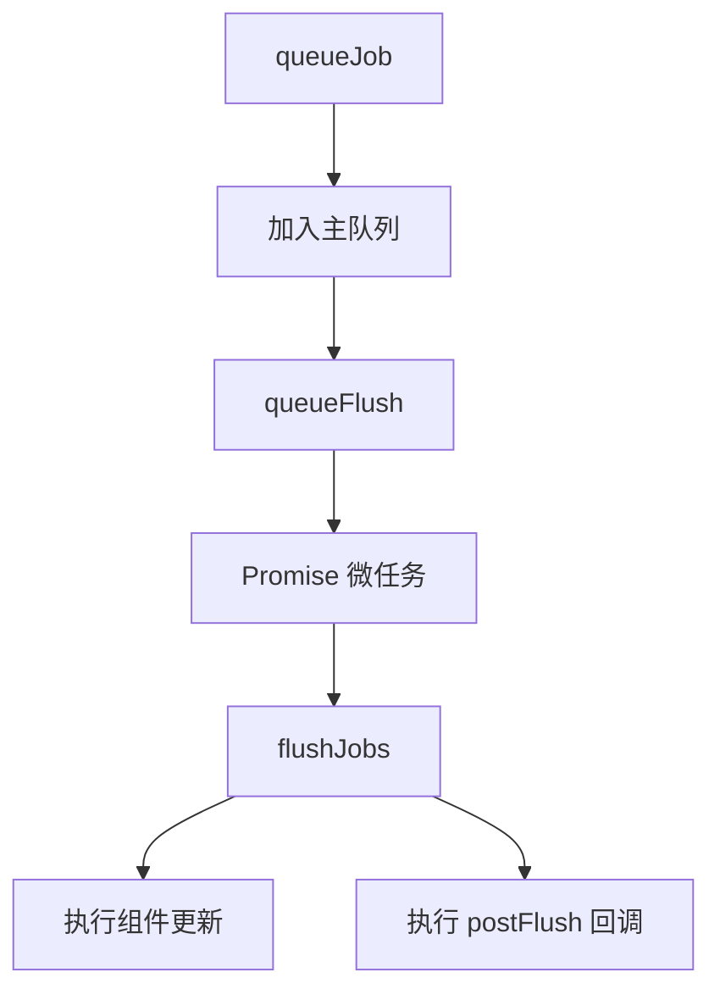

# scheduler.ts 核心步骤

## 这份文件在做什么

`scheduler.ts` 负责把多次响应式触发合并成一次批量刷新，避免重复 render。

## 主流程

```mermaid
flowchart TD
    A[queueJob] --> B[加入主队列]
    B --> C[queueFlush]
    C --> D[Promise 微任务]
    D --> E[flushJobs]
    E --> F[执行组件更新]
    E --> G[执行 postFlush 回调]
```

## 最重要的点

- 同一个 job 默认会去重
- 父组件更新优先于子组件
- watcher 和生命周期回调也会进入同一套调度体系
