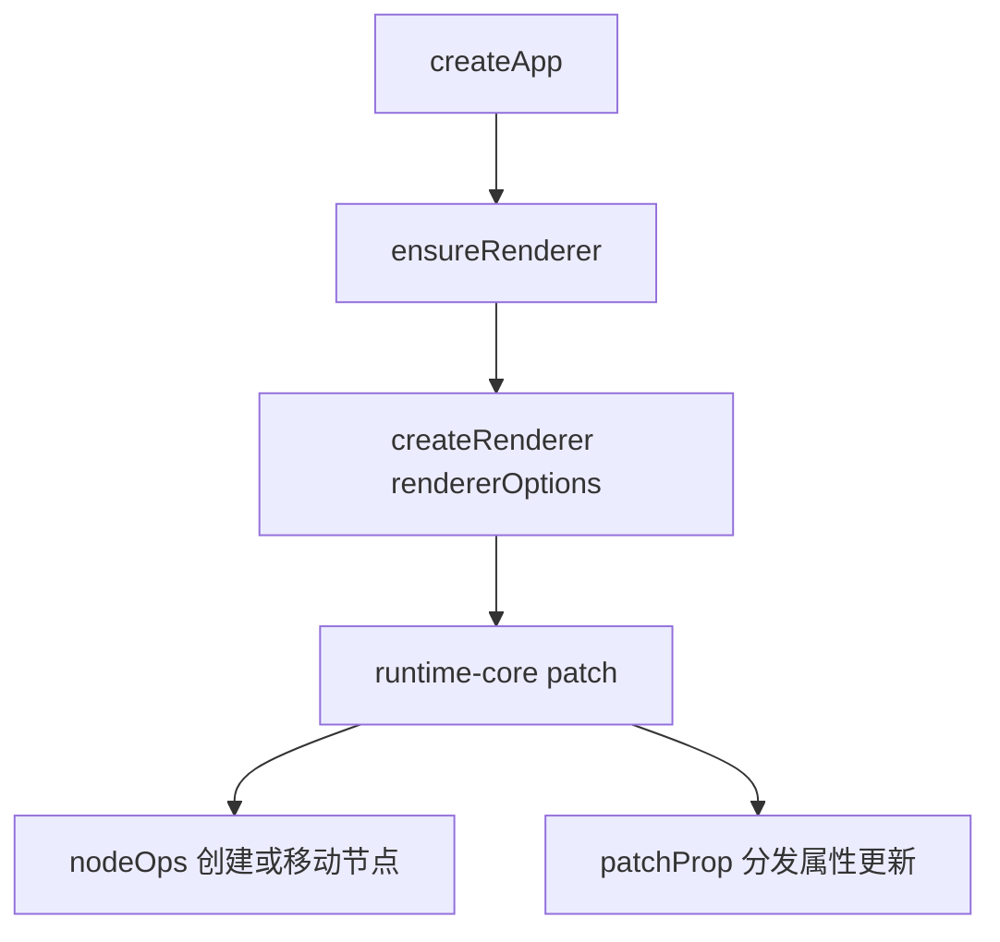

# runtime-dom 总览与 DOM 渲染流程

对应目录：`vue-source/packages/runtime-dom/src`

如果说 `runtime-core` 解决的是：

“现在应该更新什么？”

那么 `runtime-dom` 解决的就是：

“这些更新，在浏览器里到底要怎么落到真实 DOM 上？”

很多人第一次看 Vue 运行时，会把 `runtime-core` 和 `runtime-dom` 混在一起。其实这两层职责非常不同：

- `runtime-core`
  负责算法、调度、组件实例、VNode diff
- `runtime-dom`
  负责浏览器平台的具体实现

所以这篇文档的目标不是讲 DOM API 本身，而是讲：

`为什么 Vue 明明已经有 patch 了，还要再单独搞一层 runtime-dom？`

---

## 1. 先建立心智模型

Vue 运行时可以先粗暴理解成下面这样：

```text
响应式数据变化
  -> 组件重新 render
  -> 生成新 VNode
  -> runtime-core 决定哪些节点该更新
  -> runtime-dom 决定具体怎么改 DOM
```

所以：

- `runtime-core` 更像“大脑”
- `runtime-dom` 更像“手脚”

大脑负责判断：

- 是元素还是组件？
- 应该挂载还是更新？
- props 变没变？
- children 应该怎么比较？

手脚负责执行：

- `createElement`
- `insertBefore`
- `removeChild`
- `setAttribute`
- `el.className = ...`
- `addEventListener`

---

## 2. 为什么不能让 runtime-core 直接操作 DOM？

这是最关键的问题。

如果 `runtime-core` 直接写死浏览器 API，比如：

```ts
document.createElement(...)
el.setAttribute(...)
parent.insertBefore(...)
```

那就意味着 Vue 的渲染器永远只能跑在浏览器 DOM 上。

但 Vue 还需要支持：

- SSR hydration
- 自定义渲染器
- 非 DOM 宿主环境
- 测试环境中的 mock renderer

所以 Vue 采用的办法是：

`把“渲染算法”和“宿主操作”分开。`

也就是：

- `runtime-core` 只定义“需要哪些宿主能力”
- `runtime-dom` 提供“浏览器版实现”

这就是 `createRenderer(rendererOptions)` 的意义。

---

## 3. runtime-dom 给 runtime-core 提供了什么？

核心是两块：

### 3.1 `nodeOps`

它提供一组最底层的 DOM 操作能力，例如：

- 创建元素
- 创建文本
- 插入节点
- 删除节点
- 设置文本
- 找父节点
- 找兄弟节点

你可以把它理解成：

“如果 runtime-core 已经决定某个节点该被挂载或移动，那么真正执行动作的人就是 nodeOps。”

### 3.2 `patchProp`

它负责属性更新分发。

因为浏览器里的“属性更新”并不是一回事：

- `class` 的更新方式和 `style` 不同
- 普通 attribute 和 DOM property 不同
- 事件不是简单赋值
- 表单相关 key 还有很多特例

所以 `patchProp` 的作用是：

`把一个统一的 props 更新请求，分发到正确的 DOM 写入策略。`

---

## 4. 整个 DOM 渲染链路怎么串起来？

先看总图：



下面按前因后果拆开讲。

### 第一步：`createApp`

在 `runtime-dom/src/index.ts` 里，`createApp` 并不是从零实现的，而是对 `runtime-core` 产出的 app 再包一层。

为什么还要包？

因为浏览器场景多了很多平台特有问题，例如：

- 容器可能是选择器字符串
- 根节点可能要从容器 `innerHTML` 兜底拿模板
- 需要清空根容器旧内容
- 挂载后要加 `data-v-app`
- 还要处理 `v-cloak`

这些都不是 `runtime-core` 该关心的事。

### 第二步：`ensureRenderer`

这里会懒创建 renderer。

为什么懒创建？

因为 Vue 有些使用场景只会用到响应式能力，不一定真的去渲染 DOM。

懒创建的意思是：

- 你不真正调用渲染相关 API
- DOM renderer 就先不初始化

### 第三步：`createRenderer(rendererOptions)`

这里把两类能力交给 `runtime-core`：

- `nodeOps`
- `patchProp`

也就是：

- 节点层面怎么增删改查
- 属性层面怎么写入 DOM

从这一刻开始，`runtime-core` 拿到了一整套“浏览器宿主能力”，之后它的 `patch()` 算法就可以真正落地执行了。

### 第四步：进入 `runtime-core patch`

注意，这一层仍然不是 `runtime-dom` 自己做 diff。

真正做 diff 的，仍然是 `runtime-core/renderer.ts` 里的 `patch()`。

区别只在于：

当 `patch()` 判断出“这里要创建元素”时，
它不会直接写 `document.createElement`，
而是调用传进来的 `hostCreateElement`。

在 DOM 场景下，这个 `hostCreateElement` 最终就是 `nodeOps.createElement`。

### 第五步：`nodeOps` 执行节点层操作

一旦 `runtime-core` 决定：

- 要挂载一个元素
- 要插入一个文本节点
- 要删除一个节点
- 要移动一个节点

这些实际动作最终都落到 `nodeOps`。

所以 `nodeOps` 的职责很纯粹：

`只负责做，不负责判断。`

### 第六步：`patchProp` 执行属性层操作

当 `runtime-core` 判断：

- 这个元素的 props 有变更
- 新旧属性需要比较

它就会调用 `patchProp`。

`patchProp` 再继续判断：

- 这是 `class`？
- 这是 `style`？
- 这是事件？
- 这是原生 DOM property？
- 还是普通 attribute？

然后把它交给更细的模块去做。

---

## 5. `patchProp` 为什么这么重要？

第一次看时很容易觉得：

“不就是 setAttribute 吗，为什么要专门搞一个文件？”

其实浏览器属性写入远没有这么简单。

例如下面这些情况，处理方式都不同：

### 5.1 `class`

通常直接走 `className` 会更高效。

### 5.2 `style`

可能是：

- 字符串
- 对象
- 数组

而且还涉及旧样式清理。

### 5.3 事件

事件不是简单地：

```ts
el.onclick = fn
```

Vue 还要处理：

- 旧回调替换
- 事件缓存 invoker
- 多个回调组合
- 时间戳边界问题

### 5.4 DOM property vs attribute

很多 key 写 property 才对，例如：

- `value`
- `checked`
- `selected`

但也有很多情况必须写 attribute 才安全或语义正确。

例如：

- `spellcheck`
- `form`
- 某些 SVG 属性

也就是说：

`patchProp` 的价值不在于“帮你赋值”，而在于“帮你决定该用哪种赋值语义”。`

---

## 6. `nodeOps` 为什么也要单独抽出来？

这是因为“节点操作”和“属性操作”是两种完全不同的问题。

### `nodeOps` 负责结构动作

例如：

- 创建节点
- 插入节点
- 删除节点
- 移动节点

### `patchProp` 负责节点内容更新

例如：

- 改 class
- 改 style
- 绑事件
- 写 attribute

这样拆开以后，渲染器的职责边界就非常清楚：

- `renderer.ts` 决定“做什么”
- `nodeOps` 决定“怎么动节点”
- `patchProp` 决定“怎么改属性”

---

## 7. 为什么还要继续拆成 `modules/*`？

因为浏览器属性更新本身也太复杂了。

所以 `patchProp` 继续做了二次分发：

- `modules/class.ts`
- `modules/style.ts`
- `modules/attrs.ts`
- `modules/props.ts`
- `modules/events.ts`

这其实体现了 Vue 运行时的一贯设计：

`上层负责分流，下层负责具体执行。`

这样做的好处是：

- 主流程文件更清晰
- 每类浏览器差异都能单独处理
- 后续维护特例时，不会把所有逻辑堆进一个巨型函数

---

## 8. 从一个简单模板出发，看 runtime-dom 在做什么

看这个模板：

```html
<input
  class="ipt"
  :value="name"
  @input="onInput"
  :disabled="disabled"
/>
```

在 `runtime-core` 看来，这只是一个元素 VNode，带着几组 props。

但在 `runtime-dom` 里，这几组 props 会分流成不同处理：

- `class`
  -> `patchClass`
- `value`
  -> 大概率走 DOM property
- `onInput`
  -> `patchEvent`
- `disabled`
  -> 可能走 property，也可能受元素类型影响

所以你看到的是“一组 props”，Vue 看到的是“多种不同浏览器写入语义”。

---

## 9. 为什么 `runtime-dom` 的入口 `index.ts` 也很重要？

因为很多人会把注意力全放到 `patchProp.ts` 和 `nodeOps.ts`，忽略 `index.ts`。

但 `index.ts` 很关键，因为它负责三件大事：

1. 组装 `rendererOptions`
2. 输出浏览器版 `render / hydrate / createApp`
3. 处理浏览器平台的应用挂载细节

也就是说：

- `nodeOps` 是底层动作库
- `patchProp` 是属性分发器
- `index.ts` 是把这两者真正接到 `runtime-core` 上的桥

---

## 10. 初学 runtime-dom 时最容易混淆的点

### 10.1 `runtime-dom` 不负责 diff

diff 主算法还是在 `runtime-core`。

`runtime-dom` 负责的是：

`当 diff 已经决定要改这里时，浏览器里该怎么改。`

### 10.2 `patchProp` 不等于 `setAttribute`

它真正做的是：

`根据 key 的语义，选最合适的浏览器写入方式。`

### 10.3 `nodeOps` 不做决策

它只执行动作，不判断逻辑。

---

## 11. 建议阅读顺序

如果你现在觉得还是绕，建议按下面顺序读：

1. [runtime-dom 总览与 DOM 渲染流程](./runtime-dom-overview.md)
   先搞清楚这一层存在的意义
2. [index.ts 核心步骤](./index-ts-explained.md)
   先看浏览器入口如何接到 runtime-core
3. [nodeOps.ts 核心步骤](./node-ops-explained.md)
   再看节点级操作
4. [patchProp.ts 核心步骤](./patch-prop-explained.md)
   最后看属性更新分发

这样会更容易形成一句完整的话：

`runtime-core 负责决定更新方案，runtime-dom 负责把方案翻译成浏览器可执行的 DOM 操作。`
