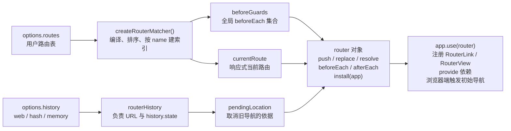
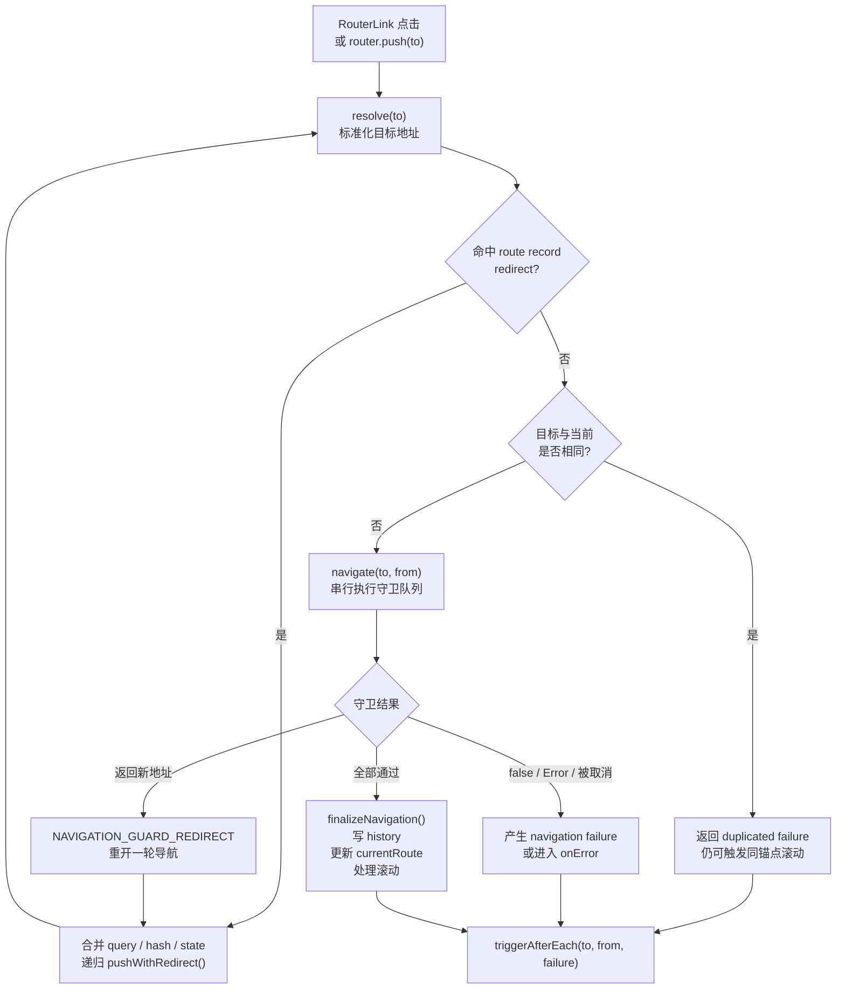
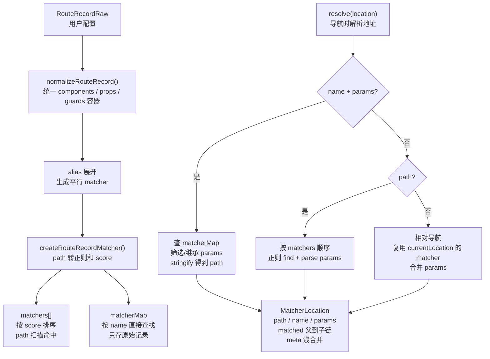
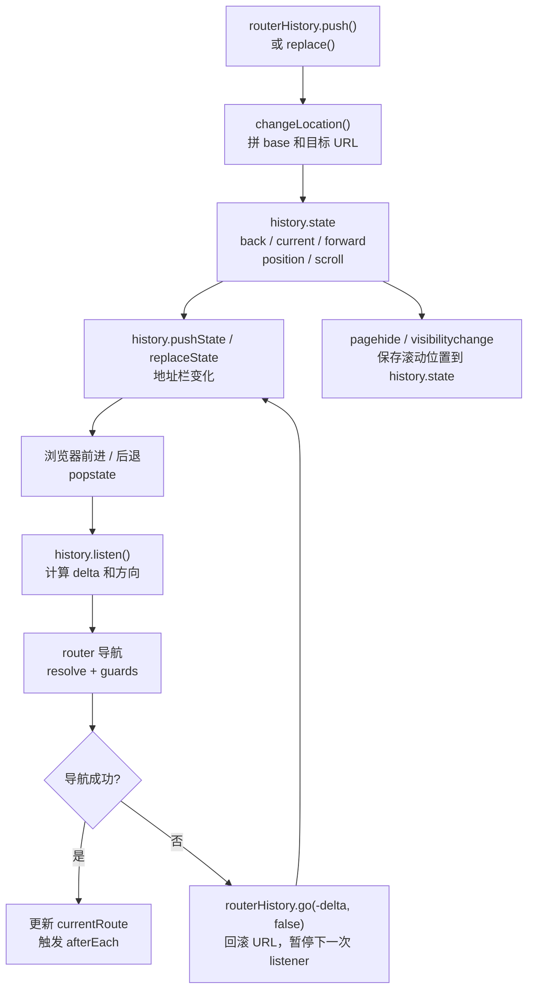

# 源码关键流程图

这一页用于配合源码阅读，关注 Vue Router 内部几个最核心的执行链路。图中的函数名都可以在 `packages/router/src` 下找到。

## 路由器初始化

`createRouter()` 会把用户传入的路由表、history 实现、全局守卫集合和当前路由状态组织到同一个 router 实例中。应用调用 `app.use(router)` 后，router 才会注册组件、注入依赖，并在浏览器端触发首轮导航。



相关源码：

- `packages/router/src/router.ts`
- `packages/router/src/matcher/index.ts`
- `packages/router/src/history/html5.ts`
- `packages/router/src/history/memory.ts`

## 一次 `router.push()` 导航

编程式导航和 `<RouterLink>` 点击最终都会收敛到 `pushWithRedirect()`。它先标准化目标地址，再处理 route record 上的 `redirect`，随后串行执行导航守卫。只有守卫全部通过后，才会进入 `finalizeNavigation()` 更新 URL、`currentRoute` 和滚动位置。



相关源码：

- `packages/router/src/router.ts`
- `packages/router/src/location.ts`
- `packages/router/src/errors.ts`

## 导航守卫队列

导航守卫不是一起执行的，而是按固定阶段串行执行。每个阶段之间都会插入取消检查，用来发现当前导航是否已经被新的导航打断。

```mermaid
flowchart LR
  leave["beforeRouteLeave<br/>离开组件，反向"] --> c1["取消检查"]
  c1 --> beforeEach["全局 beforeEach"]
  beforeEach --> c2["取消检查"]
  c2 --> update["beforeRouteUpdate<br/>复用组件"]
  update --> c3["取消检查"]
  c3 --> beforeEnter["beforeEnter<br/>路由独享"]
  beforeEnter --> c4["取消检查"]
  c4 --> enter["beforeRouteEnter<br/>新组件，含异步加载"]
  enter --> c5["取消检查"]
  c5 --> beforeResolve["全局 beforeResolve<br/>确认前最后关口"]
  beforeResolve --> c6["取消检查"]
  c6 --> done["守卫通过<br/>进入 finalizeNavigation()"]
```



相关源码：

- `packages/router/src/router.ts`
- `packages/router/src/navigationGuards.ts`

## Matcher 编译与解析

matcher 的核心职责是把用户写的 `RouteRecordRaw` 编译成内部 matcher，并在导航时把 `path`、`name + params` 或相对地址解析成 `matched` 渲染链。



相关源码：

- `packages/router/src/matcher/index.ts`
- `packages/router/src/matcher/pathMatcher.ts`
- `packages/router/src/matcher/pathParserRanker.ts`
- `packages/router/src/matcher/pathTokenizer.ts`

## History 与浏览器地址同步

HTML5 history 模式负责把 router 的导航提交写入浏览器地址栏，也负责把浏览器前进、后退产生的 `popstate` 事件反向交给 router。导航失败时，router 会通过 `go(-delta, false)` 回滚 URL，并暂停这一次回滚事件的监听。



相关源码：

- `packages/router/src/history/html5.ts`
- `packages/router/src/history/common.ts`
- `packages/router/src/scrollBehavior.ts`

## RouterLink 与 RouterView

`RouterLink` 主要负责把 `to` 解析成 `href`、判断 active 状态，并在点击时触发导航。`RouterView` 则根据当前 route 的 `matched` 链和嵌套深度找到要渲染的组件，同时维护组件实例与组件级守卫回调。

```mermaid
flowchart TD
  link["RouterLink<br/>接收 to / replace"] --> useLink["useLink()<br/>inject router / route"]
  useLink --> resolveLink["router.resolve(to)<br/>生成 href 和 route"]
  useLink --> active["active 计算<br/>matched record + params"]
  resolveLink --> click["点击事件"]
  active --> click
  click --> guardEvent{"guardEvent 通过?"}
  guardEvent -- 否 --> native["保留原生链接行为<br/>新标签页 / 右键 / 组合键"]
  guardEvent -- 是 --> push["router.push()<br/>或 replace()"]

  current["currentRoute"] --> view["RouterView<br/>inject route / depth"]
  view --> depth["计算 depth<br/>跳过无组件 record"]
  depth --> matched["matchedRoute<br/>按 name 取组件"]
  matched --> render["渲染组件<br/>props + attrs + slot"]
  matched --> instance["实例回填<br/>instances / enterCallbacks"]
  instance --> guards["组件级守卫<br/>leave / update / enter callback"]
```

相关源码：

- `packages/router/src/RouterLink.ts`
- `packages/router/src/RouterView.ts`
- `packages/router/src/injectionSymbols.ts`
- `packages/router/src/navigationGuards.ts`
