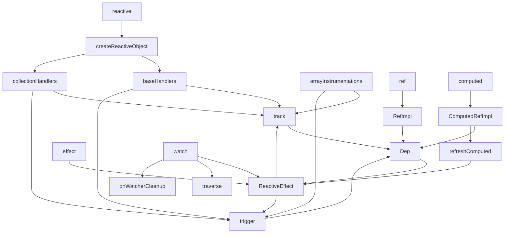

# Reactivity 源码阅读指南

包名：`@vue-source/reactivity`

简介：

- 实现 Vue 3 风格的响应式核心能力
- 提供 `reactive`、`ref`、`computed`、`watch`、`effect` 等 API
- 依赖 `@vue-source/shared` 提供的通用工具函数与类型工具

这份文档不是讲 Vue 响应式“概念上是什么”，而是讲：

`packages/reactivity/src` 这几个文件在运行时到底是怎么串起来的。

如果你现在的感受是：

- 每个文件单独看都能看懂一点
- 但一旦连起来就不知道谁先调用谁
- `reactive / ref / computed / effect / watch` 看起来都有关联，但主线不清楚

那你应该按这份文档的顺序读。

---

## 先记住一条总主线

整个响应式系统只做两件事：

1. `读取时记录“谁依赖了我”`
2. `修改时通知“依赖我的人重新执行”`

把它翻译成源码里的函数，就是：

- 读取阶段：`track()`
- 修改阶段：`trigger()`

所以阅读时一定不要把注意力平均分配给所有文件。  
真正的中枢其实只有 3 块：

1. 谁负责“读写拦截”
2. 谁负责“存依赖”
3. 谁负责“重新执行”

对应到源码就是：

- 读写拦截：`baseHandlers.ts`、`collectionHandlers.ts`、`ref.ts`
- 存依赖：`dep.ts`
- 重新执行：`effect.ts`

`computed.ts` 和 `watch.ts` 本质上都是建立在这三块之上的上层能力。

---

## 目录怎么分工

先不要急着逐行看代码，先明确每个文件的职责。

### 1. 入口与类型层

- [src/index.ts](./src/index.ts)
  只是对外导出，不负责具体逻辑。
- [src/constants.ts](./src/constants.ts)
  放各种操作类型、内部标记位。

### 2. 响应式对象层

- [src/reactive.ts](./src/reactive.ts)
  负责创建 `reactive` / `readonly` / `shallowReactive` / `shallowReadonly`。
- [src/baseHandlers.ts](./src/baseHandlers.ts)
  负责普通对象、数组的 `Proxy` 拦截。
- [src/collectionHandlers.ts](./src/collectionHandlers.ts)
  负责 `Map`、`Set`、`WeakMap`、`WeakSet` 的拦截。
- [src/arrayInstrumentations.ts](./src/arrayInstrumentations.ts)
  负责修正数组方法在响应式下的行为。

### 3. 单值响应式层

- [src/ref.ts](./src/ref.ts)
  负责 `ref`、`shallowRef`、`toRef`、`toRefs`、`proxyRefs`。

### 4. 依赖系统层

- [src/dep.ts](./src/dep.ts)
  负责依赖表、`Dep`、`Link`、`track()`、`trigger()`。
- [src/effect.ts](./src/effect.ts)
  负责 `ReactiveEffect`、副作用运行、脏检查、批处理。
- [src/effectScope.ts](./src/effectScope.ts)
  负责把多个 effect 组织进同一个作用域。

### 5. 上层派生能力

- [src/computed.ts](./src/computed.ts)
  负责缓存型派生值。
- [src/watch.ts](./src/watch.ts)
  负责侦听与清理逻辑。

---

## 先建立一张调用关系图

如果你不先有这张图，后面很容易迷路。



这张图里，最重要的不是“箭头很多”，而是你要看出一个事实：

- `reactive` 最终会走到 `track/trigger`
- `ref` 最终也会走到 `track/trigger`
- `computed` 最终还是基于 `effect + dep`
- `watch` 最终也是包了一层 `ReactiveEffect`

也就是说，功能看起来很多，但底层骨架其实是一套。

---

## 第一条主线：`reactive()` 到底怎么工作

入口在 [src/reactive.ts](./src/reactive.ts)。

### 第一步：创建代理

你调用：

```ts
const state = reactive({ count: 0 })
```

真正会进入：

```ts
reactive(target)
  -> createReactiveObject(...)
  -> new Proxy(target, handlers)
```

这一步最关键的不是 `Proxy` 本身，而是：

- 普通对象/数组用 `baseHandlers`
- 集合对象用 `collectionHandlers`

因为它们的访问方式根本不同：

- 普通对象是 `obj.foo`
- 集合对象是 `map.get(key)`、`set.add(value)`

所以这里分成两套 handler，不是“代码组织问题”，而是运行时行为本来就不一样。

### 第二步：读取属性时发生什么

比如：

```ts
effect(() => {
  console.log(state.count)
})
```

当 `state.count` 被读取时，会走到 [src/baseHandlers.ts](./src/baseHandlers.ts) 里的 `get`：

```ts
get(target, key, receiver)
```

核心逻辑只有 3 步：

1. 通过 `Reflect.get()` 取真实值
2. 调用 `track(target, GET, key)`
3. 返回值

也就是说：

`reactive` 本身不会记依赖，真正记依赖的是 `track()`

`Proxy.get` 只是把“发生了一次读取”这件事转发给 `track()`。

### 为什么这里会用 `Reflect.get()`

在 [src/baseHandlers.ts](./src/baseHandlers.ts) 里，真正取值时不是直接写：

```ts
const res = target[key]
```

而是写成：

```ts
const res = Reflect.get(target, key, receiver)
```

这里不只是因为 `Reflect` 和 `Proxy` 经常一起出现，更重要的是：

- `Proxy`
  负责拦截这次 `get`
- `Reflect.get`
  负责在拦截之后，按 JavaScript 标准语义把这次读取真正执行下去

如果只写 `target[key]`，很多场景语义会不完整，尤其是：

1. getter 的 `this` 绑定
2. 原型链上的属性访问
3. `receiver` 透传

例如对象属性其实定义在原型上，或者这个属性本身是一个 getter 时：

- `Reflect.get(target, key, receiver)`
  会按标准规则处理 `this` 和原型链
- `target[key]`
  更像是一次粗暴的直接读取

所以 Vue 在 `Proxy` 的 `get` trap 里先调用 `Reflect.get()`，本质上是为了：

- 保持对象读取行为和原生 JavaScript 一致
- 再在这个基础上追加 `track()`、`ref` 解包、嵌套对象懒代理等响应式逻辑

可以把它记成一句话：

**`Proxy` 负责拦截，`Reflect.get()` 负责按标准语义继续完成读取。**

### 第三步：写入属性时发生什么

比如：

```ts
state.count++
```

会进入 `baseHandlers.ts` 里的 `set`。

它会做这些事：

1. 拿到旧值
2. 执行真实赋值
3. 判断这是新增还是修改
4. 判断值是不是真的变了
5. 调用 `trigger(target, type, key, newValue, oldValue)`

所以你可以把 `set` 理解成：

- 前半段负责判断“这次修改属于什么类型”
- 后半段负责把修改事件交给 `trigger()`

---

## 第二条主线：`track()` 到底把依赖记到哪里

入口在 [src/dep.ts](./src/dep.ts)。

很多人第一次看这里会晕，是因为同时看到了：

- `targetMap`
- `Dep`
- `Link`
- `activeSub`

其实可以先只看一层：

### 1. 最外层：`targetMap`

它的结构是：

```ts
WeakMap<object, Map<key, Dep>>
```

意思是：

```text
目标对象 target
  -> 某个属性 key
    -> 对应一个 Dep
```

你可以把它理解成：

`targetMap` 负责从“对象 + 属性”定位到“这个属性的依赖桶”。

### 2. 中间层：`Dep`

`Dep` 表示“某一个具体属性”的依赖集合。

比如：

```ts
state.count
```

这里的 `count` 就会有一个自己的 `Dep`。

它负责：

- 在 `track()` 时把当前订阅者收进去
- 在 `trigger()` 时把订阅者通知出去

### 3. 连接层：`Link`

`Link` 很重要，但容易在第一次阅读时把人劝退。

你可以先把它简单理解成：

`Link` 就是一条“谁依赖了谁”的连接记录

例如：

```text
ReactiveEffect A 依赖了 state.count 的 Dep
```

那么中间就会有一个 `Link` 把它们连起来。

它存在的意义不是为了“概念更复杂”，而是为了双向清理：

- effect 需要知道自己依赖了哪些 dep
- dep 也需要知道自己被哪些 effect 订阅

这样 effect 重新运行时，才能把旧依赖清掉。

---

## 第三条主线：谁是“当前正在收集依赖的人”

这个角色在 [src/effect.ts](./src/effect.ts) 里，名字叫：

```ts
activeSub
```

这是理解整个系统的关键。

`track()` 并不会凭空知道：

“这次读取应该记录给谁？”

它必须依赖一个全局上下文：

`当前是谁在运行`

这个“当前正在运行的订阅者”，就是 `activeSub`。

### `effect()` 做的本质工作

你写：

```ts
effect(() => {
  console.log(state.count)
})
```

真正发生的是：

1. 创建 `ReactiveEffect`
2. 执行它的 `run()`
3. `run()` 内部把 `activeSub = 当前 effect`
4. 开始执行用户函数
5. 用户函数里读取 `state.count`
6. `track()` 发现当前 `activeSub` 存在
7. 就把这个 effect 记到 `count` 对应的 `Dep` 里

这就是“自动收集依赖”的本质。

不是 Vue 会猜，而是：

`effect.run()` 提前把“当前是谁”放进了全局上下文里。

---

## 第四条主线：依赖变化后 effect 为什么会重新跑

当你执行：

```ts
state.count++
```

最终会走到：

```ts
trigger(target, type, key)
```

然后：

1. 从 `targetMap` 找到 `count` 对应的 `Dep`
2. 调用 `dep.trigger()`
3. `dep.trigger()` 再调用 `dep.notify()`
4. 遍历这个 dep 下订阅的所有 `Subscriber`
5. 通知它们重新调度

对于普通 `effect` 来说，后面会走到：

```ts
ReactiveEffect.trigger()
  -> runIfDirty()
  -> run()
```

所以“修改数据后 effect 重跑”并不神秘，本质上只是：

`set -> trigger -> dep.notify -> effect.run`

---

## 第五条主线：`ref()` 和 `reactive()` 的区别到底在哪

入口在 [src/ref.ts](./src/ref.ts)。

很多人会误以为：

- `reactive` 是一套系统
- `ref` 是另一套系统

其实不是。

它们底层用的是同一个依赖模型，只是“拦截读取/写入”的方式不同。

### `reactive`

依赖 `Proxy`：

- 读属性时走 `get`
- 写属性时走 `set`

### `ref`

依赖 getter / setter：

- 读 `.value` 时走 `get value()`
- 写 `.value` 时走 `set value()`

### `ref` 的本质

`RefImpl` 内部也有一个 `dep`：

```ts
dep: Dep = new Dep()
```

所以：

- 读 `.value` 时 `dep.track()`
- 写 `.value` 时 `dep.trigger()`

这说明：

`ref` 只是把“一个值”伪装成“一个有依赖能力的对象属性”

区别只是：

- `reactive` 是 `target[key]`
- `ref` 是固定的 `.value`

---

## 第六条主线：`computed()` 为什么既像 `ref` 又像 `effect`

入口在 [src/computed.ts](./src/computed.ts)。

`computed` 难看懂，是因为它同时具有两层身份：

### 对外看

它像 `ref`

因为你也是这样用：

```ts
const plusOne = computed(() => count.value + 1)
console.log(plusOne.value)
```

也就是说，它对外暴露的接口是：

```ts
get value()
```

### 普通属性 vs 访问器属性

`ref` 这里之所以能在 `.value` 上做依赖收集，本质原因就是：

`.value` 不是普通属性，而是访问器属性。`

对比表如下：

| 对比项 | 普通属性 | 访问器属性 `get/set` |
|---|---|---|
| 本质 | 直接存一个值 | 不直接存值，读写时执行函数 |
| 读取时 | 直接拿到属性值 | 触发 `get()` |
| 写入时 | 直接改属性值 | 触发 `set()` |
| 是否有真实存储值 | 有，通常存在属性本身上 | 通常没有，需要你自己存到别处，比如 `this._value` |
| 定义方式 | `obj.x = 1` | `Object.defineProperty()` 或 class 的 `get/set` |
| 典型用途 | 存普通数据 | 拦截读取/写入、校验、依赖收集、派发更新 |
| Vue 里的用途 | `reactive` 代理后的普通字段最终还是表现成普通属性访问 | `ref.value` 就是访问器属性 |

你可以直接把 `ref` 的实现理解成：

- 读 `ref.value` 时自动进入 `get value()`
- 写 `ref.value = xxx` 时自动进入 `set value(xxx)`

所以它天然适合做：

- 读取时 `track()`
- 写入时 `trigger()`

### `get` 和 `Object.defineProperty()` 的关系

还可以再补一条非常容易混淆的点：

- 在 class 里写 `get value()` / `set value()` 时，这个访问器通常会被定义到原型上
- 使用 `Object.defineProperty()` 时，属性会被定义到你传入的那个目标对象上

比如 class 写法：

```ts
class RefImpl {
  get value() {
    return this._value
  }
}
```

更接近下面这种效果：

```js
Object.defineProperty(RefImpl.prototype, 'value', {
  get() {
    return this._value
  }
})
```

注意这里的关键不是“`get` 和 `defineProperty` 完全不同”，而是：

`get/set` 本质上还是访问器属性语法糖，只不过 class 语法默认把它挂在原型上。`

而 `Object.defineProperty()` 则更底层、更直接：

- 你传 `obj`，它就定义在 `obj` 自身上
- 你传 `Ctor.prototype`，它就定义在原型上

所以更准确的说法不是：

`get` 一定在原型上，`defineProperty` 一定在实例上`

而是：

`class 里的 get/set 默认定义到原型；defineProperty 定义到你指定的目标对象。`

### `ref / reactive / defineProperty / Proxy / Reflect` 一起看

如果把这几个概念拆开来看，容易觉得它们是平行的；  
其实不是。它们分别处在不同层级。

#### 1. `Object.defineProperty()`

它是“定义属性”的底层 API。

它可以定义两类属性：

- 数据属性：`value`、`writable`
- 访问器属性：`get`、`set`

例如：

```js
Object.defineProperty(obj, 'x', {
  get() {
    return this._x
  },
  set(v) {
    this._x = v
  }
})
```

它的特点是：

- 作用在“某一个具体属性”上
- 你得提前知道属性名
- 更适合拦截固定字段

#### 2. class 里的 `get/set`

它不是另一套机制，本质上还是访问器属性语法糖。

例如：

```ts
class RefImpl {
  get value() {
    return this._value
  }
}
```

本质上接近：

```js
Object.defineProperty(RefImpl.prototype, 'value', {
  get() {
    return this._value
  }
})
```

所以：

- `get/set` 适合表达“某个固定属性的读写逻辑”
- 它和 `defineProperty` 的关系，是高级语法和底层 API 的关系

#### 3. `Proxy`

`Proxy` 不是定义某一个属性，而是“拦截整个对象的一类操作”。

例如：

```js
const p = new Proxy(target, {
  get(target, key, receiver) {
    return Reflect.get(target, key, receiver)
  },
  set(target, key, value, receiver) {
    return Reflect.set(target, key, value, receiver)
  }
})
```

它的特点是：

- 不需要提前知道属性名
- 可以统一拦截 `get/set/delete/has/ownKeys`
- 更适合对象级、集合级的响应式代理

这也是为什么：

- `reactive()` 用 `Proxy`
- `ref()` 不用 `Proxy`

因为 `reactive` 要处理任意属性：

```ts
state.a
state.b
state.c
```

它不可能事先把每个字段都 `defineProperty` 一遍。  
但 `ref` 只有一个固定入口 `.value`，所以访问器属性就够了。

#### 4. `Reflect`

`Reflect` 不是用来“定义拦截”的，而是用来“把默认行为安全地执行回去”的。

最常见的是：

```js
Reflect.get(target, key, receiver)
Reflect.set(target, key, value, receiver)
Reflect.deleteProperty(target, key)
```

你可以把它理解成：

`Proxy` 负责拦截，`Reflect` 负责把原本那次操作按标准语义执行下去。`

也就是说：

- `Proxy` 决定“我要不要插手”
- `Reflect` 决定“插手完以后，默认行为怎么继续执行”

#### 5. 为什么 Vue 在这里同时用了 `Proxy` 和 `Reflect`

看 [src/baseHandlers.ts](./src/baseHandlers.ts)：

```ts
const res = Reflect.get(target, key, receiver)
const result = Reflect.set(target, key, value, receiver)
```

这里如果直接写：

```ts
target[key]
target[key] = value
```

很多场景会不准确，尤其是：

- 原型链上的 getter / setter
- `this` 绑定
- `receiver` 透传

`Reflect.get/set` 可以更准确地复现 JS 原生对象访问语义。

你可以把 Vue 这里的模式记成：

```text
Proxy 负责拦截
Reflect 负责执行默认语义
track/trigger 负责接入响应式系统
```

#### 6. 最后用一张表压缩记忆

| 机制 | 作用层级 | 擅长什么 | Vue 里主要用在哪 |
|---|---|---|---|
| `Object.defineProperty()` | 单个属性 | 精确定义某个属性 | 访问器属性底层能力 |
| `get/set` | 单个属性 | 给固定属性加读写逻辑 | `ref.value` |
| `Proxy` | 整个对象 | 拦截任意属性和对象操作 | `reactive()` |
| `Reflect` | 默认语义执行 | 按标准方式继续执行对象操作 | `baseHandlers` / `collectionHandlers` |

所以可以直接记一句：

`ref` 更像“访问器属性 + Dep”，`reactive` 更像“Proxy + Reflect + track/trigger”。`

### 为什么 `reactive` 不适合“整体替换”

这是使用上非常容易误判的一点。

先看这段：

```ts
let state = reactive({ count: 0 })

effect(() => {
  console.log(state.count)
})

state = reactive({ count: 1 })
```

很多人会以为最后一行会触发上面的 effect，实际上通常不会。

原因不是 Vue “没监听到变量变化”，而是：

`reactive` 追踪的是“对象属性访问”，不是“局部变量绑定”。`

上面这段 effect 真正收集到的依赖是：

```ts
旧 state 对象的 count 属性
```

也就是更接近：

```text
oldTarget -> 'count' -> dep
```

而不是：

```text
变量 state 本身
```

所以你把：

```ts
state = reactive({ count: 1 })
```

改掉的只是当前变量指向，不是旧对象的 `count` 属性。  
旧依赖仍然挂在旧对象上，因此不会自动触发。

### 为什么 `ref` 整体替换可以触发

再看这段：

```ts
const state = ref({ count: 0 })

effect(() => {
  console.log(state.value.count)
})

state.value = { count: 1 }
```

这段会触发。

因为这里依赖收集的入口是：

```ts
state.value
```

而你修改的正是：

```ts
state.value = 新对象
```

也就是说：

- `reactive` 更适合改对象内部属性
- `ref` 更适合整体替换一个值，包括整个对象

所以在工程里可以直接记住这条规则：

| 场景 | 更适合 |
|---|---|
| 频繁修改对象内部字段 | `reactive` |
| 需要整体替换整个对象 | `ref` |

### 对内看

它像 `effect`

因为它内部也会：

- 读取响应式数据
- 收集依赖
- 在依赖变更后重新计算

所以你可以把 `computed` 理解成：

`外面是 ref 壳，里面是 effect 核`

### `computed` 的关键不是“会算”，而是“会缓存”

它和普通函数最大区别在于：

- 普通函数每次调用都重新算
- `computed` 只有依赖变了才重新算

这里靠两样东西实现：

1. `DIRTY` 标记
2. `globalVersion`

读取 `.value` 时会走：

```ts
dep.track()
refreshComputed(this)
return this._value
```

所以主线是：

1. 先让外部 effect 能订阅这个 computed
2. 再检查自己是不是脏了
3. 如果脏了才执行 getter
4. 否则复用缓存

---

## 第七条主线：`watch()` 不是另一套响应式，它只是“包了一层 effect”

入口在 [src/watch.ts](./src/watch.ts)。

`watch` 最容易让人误判成“单独的一套机制”，但其实它底层仍然靠 `ReactiveEffect`。

### `watch` 真正做了什么

它比 `effect` 多做的事主要有 4 个：

1. 把不同形态的 `source` 统一成 `getter`
2. 保存旧值
3. 比较新旧值
4. 处理 cleanup

也就是说：

`watch = effect + 新旧值比较 + cleanup + deep 遍历`

### 为什么要有 `traverse()`

当你这样写：

```ts
watch(state, cb, { deep: true })
```

如果只是简单返回 `state`，那 effect 只会订阅到对象本身，不会递归读到内部属性。

所以 `watch` 要额外调用：

```ts
traverse(value)
```

它会递归访问所有可达属性，从而强行触发这些属性的 `get`，让依赖被建立起来。

这就是 deep watch 的本质：

`通过递归读取，把深层属性都“摸一遍”`

---

## 第八条主线：数组和集合为什么要单独处理

这一点一定要单独理解，不然会觉得代码“为什么这么散”。

### 数组为什么有 `arrayInstrumentations.ts`

因为数组有很多方法不是简单的属性读取，比如：

- `includes`
- `indexOf`
- `push`
- `splice`
- `forEach`
- `map`

这些方法在响应式下会出现两个问题：

1. 依赖应该收集到哪里
2. 查找时代理值和原始值怎么对齐

所以数组方法不能完全交给默认 `Proxy.get`，必须做增强包装。

### 集合为什么有 `collectionHandlers.ts`

因为对 `Map/Set` 来说，关键操作根本不是属性访问，而是：

- `map.get()`
- `map.set()`
- `set.add()`
- `set.delete()`
- 迭代器和 `forEach`

这些行为如果沿用普通对象逻辑，会丢依赖，或者触发时机不对。

所以集合也必须有一套专门 handler。

---

## 真正建议的阅读顺序

如果你是第一次把这套代码串起来，建议不要按文件名顺序读，而是按执行顺序读：

### 第一轮：先抓骨架

1. [src/index.ts](./src/index.ts)
2. [src/reactive.ts](./src/reactive.ts)
3. [src/baseHandlers.ts](./src/baseHandlers.ts)
4. [src/dep.ts](./src/dep.ts)
5. [src/effect.ts](./src/effect.ts)

这一轮只回答一个问题：

`reactive + effect 为什么能联动`

### 第二轮：补单值模型

1. [src/ref.ts](./src/ref.ts)
2. [src/computed.ts](./src/computed.ts)

这一轮回答：

- `ref` 为什么不需要 Proxy
- `computed` 为什么能缓存

### 第三轮：补复杂边界

1. [src/watch.ts](./src/watch.ts)
2. [src/arrayInstrumentations.ts](./src/arrayInstrumentations.ts)
3. [src/collectionHandlers.ts](./src/collectionHandlers.ts)
4. [src/effectScope.ts](./src/effectScope.ts)

这一轮回答：

- deep watch 为什么成立
- 数组/集合为什么不能复用普通对象逻辑
- effect scope 解决什么问题

---

## 最后用一句话把整套系统串起来

你可以把这套源码强行压缩成下面这段：

```text
reactive/ref 负责在“读取”和“写入”时接入系统，
track/trigger 负责连接“数据”和“订阅者”，
effect 负责把用户函数变成可重复执行的订阅者，
computed/watch 则是在 effect 之上再包出缓存、比较和清理能力。
```

如果你后面要继续深入，我建议下一步不要再泛泛读 README，而是直接挑这 3 条主线逐行跟：

1. `effect(() => state.count)` 的完整调用链
2. `const n = ref(1); n.value++` 的完整调用链
3. `const c = computed(() => n.value + 1)` 的完整调用链

这三条一旦跟通，`reactivity/src` 这套代码就基本真正吃透了。
