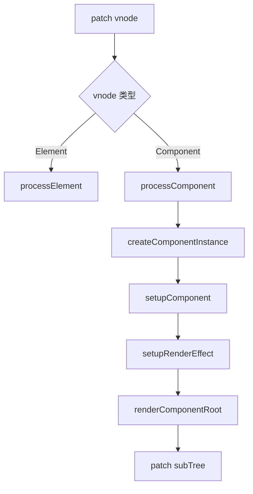
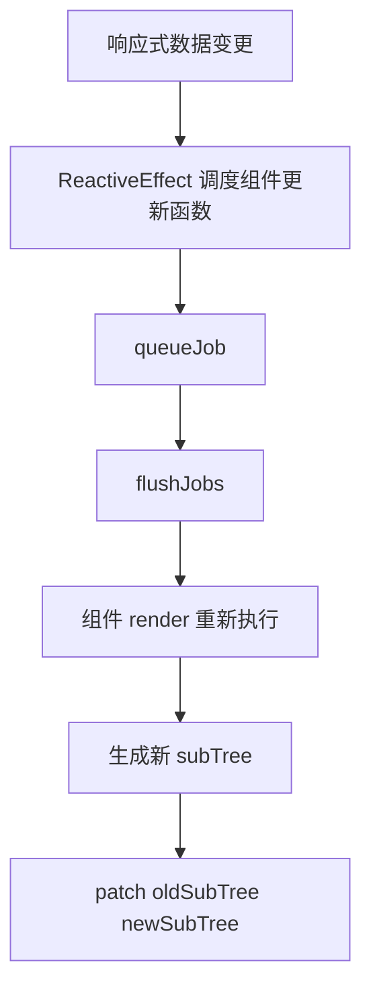

# @vue-source/runtime-core

`runtime-core` 是 Vue 运行时的中枢层。

它不直接操作浏览器 DOM，而是负责把“响应式状态变化”转换成“组件更新、VNode 计算、渲染器调度”。`runtime-dom` 只是给它提供了一套面向浏览器的宿主能力。

## 包职责

- 提供组件实例创建、初始化、更新、卸载
- 提供 VNode 创建、归一化、克隆
- 提供平台无关的渲染器 `createRenderer`
- 提供调度器、生命周期、依赖注入、异步组件等运行时能力
- 连接 `reactivity` 与具体渲染流程

## 核心模块

- `src/renderer.ts`
  渲染器主流程，负责 `patch / mount / update / unmount`
- `src/component.ts`
  组件实例创建、`setup()` 执行、渲染函数安装
- `src/vnode.ts`
  VNode 的创建、克隆、children 归一化
- `src/scheduler.ts`
  任务队列、批量更新、前后置回调刷新
- `src/componentProps.ts`
  props 初始化、更新、归一化
- `src/componentSlots.ts`
  slots 规范化与更新
- `src/componentRenderUtils.ts`
  组件根节点渲染、attrs fallthrough、错误兜底
- `src/apiCreateApp.ts`
  `createApp()`、应用上下文、插件与全局注册能力

## 主流程

### 1. 应用启动

```mermaid
flowchart TD
    A[createApp(rootComponent)] --> B[createAppContext]
    B --> C[app.mount(container)]
    C --> D[createVNode(rootComponent)]
    D --> E[renderer.render]
    E --> F[patch]
```

### 2. 首次挂载



### 3. 响应式更新



## 关键数据结构

- `ComponentInternalInstance`
  组件在运行时的完整实例，里面保存 props、slots、setupState、effect、subTree 等信息。
- `VNode`
  虚拟节点，是渲染器 diff 的基本输入。
- `SchedulerJob`
  调度器中的任务单元，通常是组件更新任务或 watcher 回调。
- `AppContext`
  应用级上下文，包含全局组件、全局指令、provide、mixin、配置项等。

## 阅读顺序

建议按下面顺序阅读：

1. `src/vnode.ts`
2. `src/component.ts`
3. `src/scheduler.ts`
4. `src/renderer.ts`
5. `src/componentProps.ts`
6. `src/componentSlots.ts`
7. `src/componentRenderUtils.ts`
8. `src/apiCreateApp.ts`

## 核心认知

可以把 `runtime-core` 理解成一条固定链路：

`响应式变更 -> 调度更新 -> 重新执行 render -> 生成新 VNode 树 -> patch`

这个包真正解决的问题，不是“怎么操作 DOM”，而是“组件应该何时更新、更新成什么结构、怎样尽量少地更新”。
