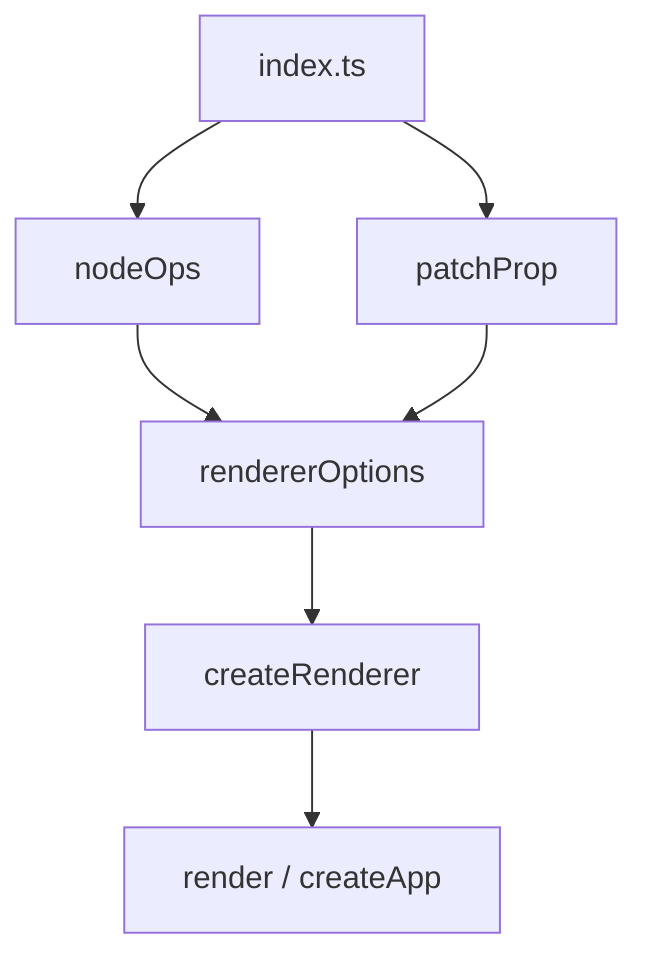
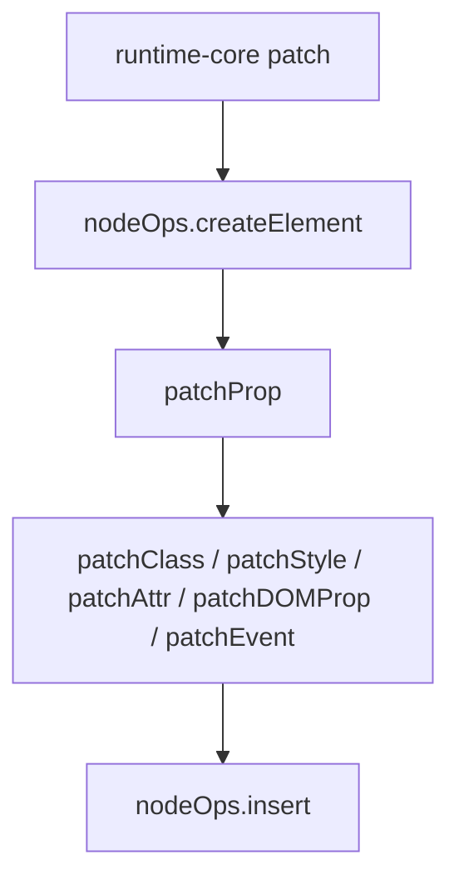
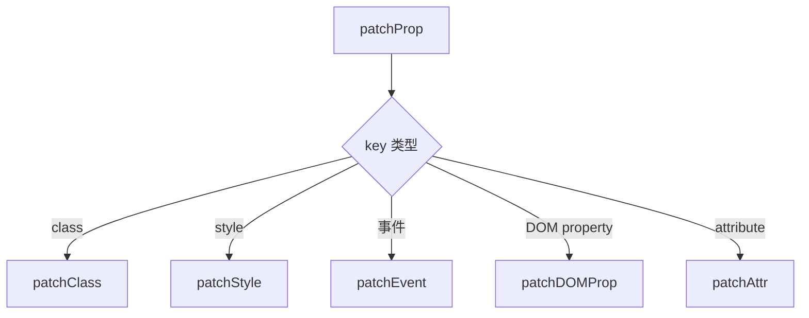

# @vue-source/runtime-dom

`runtime-dom` 是 Vue 在浏览器环境下的宿主实现层。

它建立在 `runtime-core` 之上，把平台无关的渲染流程，落到浏览器里的真实 DOM 操作、属性更新、事件绑定、样式处理和指令行为上。

## 包职责

- 为 `runtime-core` 提供 DOM 宿主能力
- 提供 `render`、`hydrate`、`createApp`、`createSSRApp`
- 提供 DOM 节点操作集 `nodeOps`
- 提供属性分发入口 `patchProp`
- 实现浏览器相关内置指令和组件

## 核心模块

- `src/index.ts`
  DOM 版运行时入口，组装 renderer 并暴露应用级 API
- `src/nodeOps.ts`
  DOM 基础增删改查能力
- `src/patchProp.ts`
  属性更新总分发器
- `src/modules/*`
  class/style/attrs/props/events 五类 DOM 更新模块
- `src/directives/*`
  `vModel`、`vOn`、`vShow`
- `src/components/*`
  `Transition`、`TransitionGroup`

## 主流程

### 1. DOM 渲染器创建

### 2. DOM 节点挂载

### 3. 属性更新分发

## 关键认知

- `runtime-core` 决定“该更新什么”
- `runtime-dom` 决定“在浏览器里怎么更新”

也就是说：

`runtime-core` 负责算法和时机，`runtime-dom` 负责浏览器细节和宿主差异。

## 阅读顺序

1. `src/nodeOps.ts`
2. `src/patchProp.ts`
3. `src/modules/*`
4. `src/index.ts`
5. `src/directives/*`
6. `src/components/*`

## 面向浏览器的补充能力

- Trusted Types 处理
- SVG / MathML 命名空间处理
- 表单元素属性与 attribute 差异处理
- 自定义元素和异步自定义元素属性处理
- 过渡相关 DOM 钩子处理
